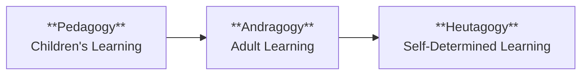
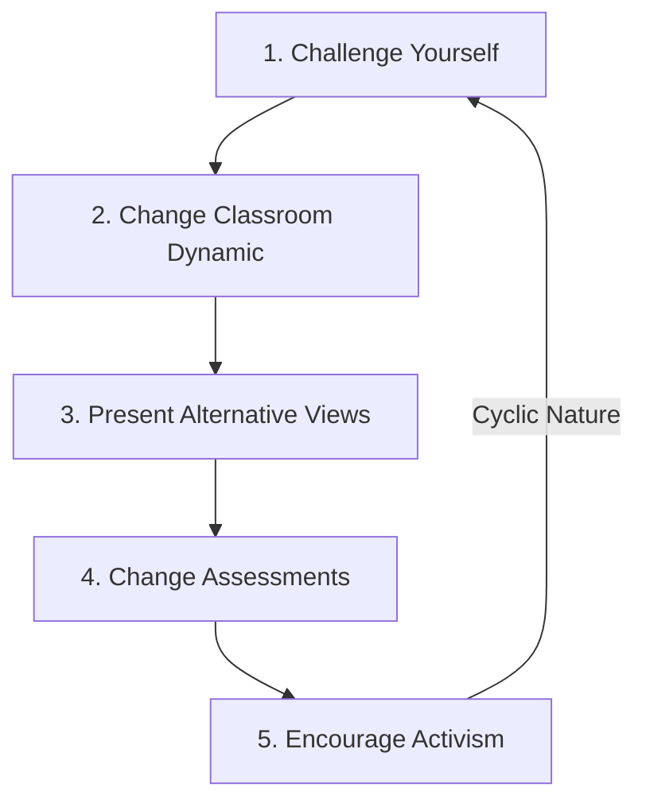
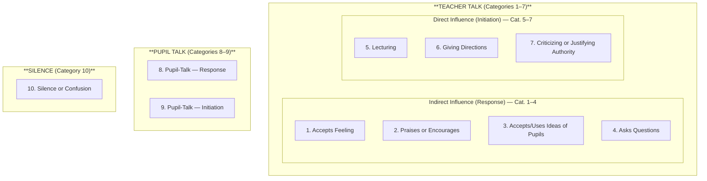

# 1. PEDAGOGICAL ANALYSIS (Part 1)
## Topics: 1.1 - 1.3

---

## 1.1 Paradigm Shift from Pedagogy to Andragogy to Heutagogy — Concept and Stages

### Meaning of Paradigm

- **Paradigm** means a model, pattern, or example.
- Here, the paradigm is about **Education**.

!!! note "Definition: Paradigm Shift"
    A **paradigm shift** is *"an important change that happens when the usual way of thinking about something or doing something is replaced by a new and different way."*

### Historical Evolution

1. As society grew, **language** developed — first spoken, then written (alphabets).
2. Parents wanted to teach their children → the **Gurukula system** started → later it grew into schools → children were taught → this was called **Pedagogy**.
3. As society grew bigger, adults who missed education in childhood wanted to learn → this is called **Andragogy**.
4. To meet the needs of the modern world, **self-determined learning (Heutagogy)** grew and spread in society.

### Definitions

| Term | Definition |
|------|-----------|
| **Pedagogy** | The method of how teachers teach children, in theory and practice. |
| **Andragogy** | The method and practice of teaching adult learners. It is mostly based on classroom teaching and the teacher-student relationship. |
| **Heutagogy** | Also known as **self-determined learning**. It is a student-centered teaching approach. It focuses on building learning independence, ability, and skill. |

### Comparative Table: Pedagogy vs Andragogy vs Heutagogy

| Aspect | Pedagogy | Andragogy | Heutagogy (Self-Directed Learning) |
|--------|----------|-----------|-------------------------------------|
| **Methods / Nature** | Children's learning | Adults' learning | Self-directed learning |
| **Dependence** | The learner depends on the teacher. The teacher decides what, how, and when to learn. | Adults are independent. They want independence and self-direction in learning. | Learners are interdependent. They find chances to learn from new experiences. They can manage their own learning. |
| **Resources for Learning** | The learner has few resources. The teacher passes on knowledge. | Adults use their own and others' experience. | The teacher gives some resources. The learner decides what to use. |
| **Reasons for Learning** | Students learn to move to the next level. | Adults learn when they need to do something better. Adult learning focuses on tasks or problems. | Learning comes from finding chances to learn in new situations. Learners go beyond problem solving. They are proactive. They use their own and others' experiences. |
| **Focus of Learning** | Learning is subject-based, following the set curriculum. | *(Task/problem centered — see above)* | *(New situation-based — see above)* |
| **Motivation** | Motivation comes from parents, teachers, and competition (external). | Motivation comes from within — self-respect, confidence, and recognition. | Self-confidence, knowing how to learn, creativity, using these skills in all situations, and working with others. |
| **Role of Teacher** | Plans the learning process; teacher knows best. | Helper or guide; creates a climate of teamwork, respect, and openness. | Builds the learners' ability and skill. |
| **Learner Outcome** | *(Dependent learner)* | *(Independent learner)* | Capable people who: know how to learn, are creative, have high self-confidence, use skills in new and known situations, and work well with others. |

!!! tip "Exam Tip"
    Remember the progression: **Dependent → Independent → Interdependent** (Pedagogy → Andragogy → Heutagogy). This is a frequently asked comparison.

---

## 1.2 Critical Pedagogy

### 1.2.1 Meaning

!!! note "Definition: Critical Pedagogy"
    **Critical pedagogy** is a teaching approach that asks teachers to help students **question structures of power and unfairness**. It is based on **critical theory**. This means becoming aware of and questioning how society works.

- In critical pedagogy, a teacher uses their own **awareness** to help students **question and challenge unfairness** in families, schools, and society.

### 1.2.2 Fosters Independent Thinking

- Some people see this teaching approach as **progressive** or even **radical**. This is because it questions structures that people usually accept without thinking.

**Five Steps to Implement Critical Pedagogy in the Classroom:**

| Step | Action | Description |
|------|--------|-------------|
| **1** | **Challenge yourself** | If you are not thinking critically, you cannot help students do so. Use materials that question common social stories. For example, read about why some "successes" were not really successful when seen from a different angle. **Critical theory is about challenging the main social structures.** The more we learn, the better we can help our students become aware. |
| **2** | **Change the classroom dynamic** | Critical pedagogy is about challenging power structures. One of the most common power relationships in a student's life is the **teacher-student relationship**. |
| **3** | **Present alternative views and discuss all** | Show different viewpoints and encourage open discussion of all views. |
| **4** | **Change our assessments** | Traditional tests, like traditional power structures, can be limiting. Make sure assessments are **not about finding the right answer**. Instead, focus on **critical thinking skills**. |
| **5** | **Encourage activism** | Critical pedagogy has a **cyclic nature** (it repeats). After learning yourself, encourage students to think critically. Then help families and communities become aware too. |

!!! important "Conclusion"
    Critical pedagogy will look **different in different subjects**. What works for one class may not work for another. Often, you will need to find **common links between subjects**. The critical approach is not limited to one area of education and culture.

### 1.2.3 Critical Pedagogy — Need and its Implication in the Classroom

#### Need for Critical Pedagogy

- One of the most important goals of teaching is to **build students' critical thinking ability**. This helps create **good citizens for a fair society**.
- Classroom teaching must also **build values of justice and equality** in students' minds.
- Critical pedagogy is an important teaching strategy. It helps **make learners more aware of justice and social equality**. It also improves their knowledge.
- Often, teaching becomes **test-focused rather than knowledge-focused**.
- Teachers should use critical pedagogy to help students gain **critical thinking skills** and to help build a **fair society**.

#### Implications in the Classroom

!!! note "Key Point"
    Critical pedagogy is **not a new strategy**. From **Socrates** to many of today's top educators, teachers have used student-centered classroom methods. These methods help students learn actively and create knowledge.

**Key implications for classroom practice:**

1. **Use critical pedagogy for knowledge creation** — To help students create knowledge with deep understanding, teachers need to use critical pedagogy in the classroom.

2. **Build critical awareness** — Building students' critical awareness is a goal of education. Teachers are the most important adults to guide students. They can make students excited about **learning for life**.

3. **Design lesson plans using the dialogical method** — A teacher who knows the students well should plan lessons that use the **dialogical method** (learning through dialogue). The plan should show how students will use **dialogue to find solutions** to problems.

4. **Connect lessons with real-life situations** — Linking lessons to real life helps students use a **reason-seeking approach**. Teachers must remember that **learning is part of life**. So, lesson plans should connect content to real-life situations.

5. **Use diverse resources** — Knowledge is not found only in textbooks. Teachers can use many other resources like **stories, drama, and students' cultural presentations**. These resources help students become **creative and think carefully**.

!!! tip "Exam Tip"
    Key themes of Critical Pedagogy: **Question power structures → Foster critical thinking → Connect to real life → Use dialogical method → Create just society**

---

## 1.3 Flanders Interaction Analysis Categories (FIAC)

### Introduction

- **Ned Flanders** created the original system of interaction analysis.
- The system is often called the **Flanders System of Interaction Analysis (FIA)**.
- It was a new tool that helped people better understand and improve **classroom teaching**.

!!! note "Definition: FIAC"
    **Flanders' Interaction Analysis System** is a tool used to **classify the spoken behaviour** of teachers and students in the classroom. It was made to observe only **spoken communication**. It does **not** include body language or gestures.

**Key Assumptions:**

- It focuses on **spoken behaviour only**. This is because spoken behaviour can be observed more reliably than body language.
- The assumption is that a person's **spoken behaviour is a good sample of their total behaviour**.

### The Ten Categories of FIAC

Flanders Interaction Analysis Categories (FIAC) is a **Ten Category system**. These ten categories cover **all possible types of communication**:

- **7 categories** — when the **teacher** is talking (Teacher Talk)
- **2 categories** — when the **student** is talking (Pupil Talk)
- **1 category** — **Silence or Confusion**

#### Complete FIAC Category Table

| Cat. No. | Category Name | Type | Description |
|----------|--------------|------|-------------|
| **1** | **Accepts Feeling** | Teacher Talk — Indirect Influence (Response) | The teacher accepts and clarifies a student's feelings in a **safe, non-threatening way**. Feelings can be positive or negative. Predicting and recalling feelings are included. |
| **2** | **Praises or Encourages** | Teacher Talk — Indirect Influence (Response) | The teacher praises or encourages student actions. Jokes that reduce tension are included, but **not jokes that hurt others**. Nodding or saying "go on" counts here. |
| **3** | **Accepts or Uses Ideas of Pupils** | Teacher Talk — Indirect Influence (Response) | The teacher clarifies, builds on, or develops a student's ideas. If the teacher adds more of their own ideas, **shift to category 5**. |
| **4** | **Asks Questions** | Teacher Talk — Indirect Influence (Response) | The teacher asks a question about **content or steps to follow**. The question is based on the teacher's ideas, and the student is expected to answer. |
| **5** | **Lecturing** | Teacher Talk — Direct Influence (Initiation) | The teacher gives facts or opinions about content or steps. The teacher shares their own ideas, gives explanations, or **refers to an expert other than a student**. |
| **6** | **Giving Directions** | Teacher Talk — Direct Influence (Initiation) | The teacher gives directions, commands, or orders. The student is **expected to follow** them. |
| **7** | **Criticizing or Justifying Authority** | Teacher Talk — Direct Influence (Initiation) | The teacher tries to change student behaviour from **wrong to right**. This includes scolding, explaining why the teacher is doing something, or strong self-references. |
| **8** | **Pupil-Talk — Response** | Pupil Talk (Response) | Students talk **in response to the teacher**. The teacher starts the contact or asks for a response. The student's freedom to share their own ideas is **limited**. |
| **9** | **Pupil-Talk — Initiation** | Pupil Talk (Initiation) | Students talk on **their own**. They share their own ideas, start a new topic, develop opinions, ask thoughtful questions, or **go beyond what was discussed**. |
| **10** | **Silence or Confusion** | Silence | Pauses, short silences, or confusion where the observer **cannot understand the communication**. |

#### Structure Diagram

!!! important "Key Classification"
    All teacher statements are either **indirect** or **direct**. This classification focuses on **how much freedom the teacher gives the student**. A teacher can choose to be **direct** (giving the student less freedom to respond) or **indirect** (giving more freedom). This choice depends on how the teacher sees the situation and the goals of that lesson.

### The Coding System

!!! note "What is the Coding System?"
    Flanders Interaction Analysis is a system for **coding spoken communication as it happens**. You can observe the interaction in a **live classroom** or from a **tape recording**.

**Steps for Coding:**

1. We use the coding system to **study and improve** the teacher-student interaction pattern.
2. Every **3 seconds**, the observer writes down the **category number** of the interaction they see.
3. They record these numbers **one after another in a column**.
4. They will write about **20 numbers per minute**.
5. At the end, they will have **several long columns of numbers**.

**Guidelines for the Observer:**

- The observer should spend **5 to 10 minutes** getting used to the classroom before starting to code. This helps them understand the overall atmosphere.
- The observer **stops coding** when the classroom activity changes. For example, when children work on workbooks or do silent reading.
- The observer usually **draws a line** under the recorded numbers, notes the new activity, and **starts coding again** when class discussion continues.
- The observer always notes the **type of class activity** they are watching.

### The Interaction Matrix

- We plot the information on a **matrix** for easy study.
- We enter the **number sequences** into a **10-row by 10-column table**.
- This matrix makes it easy to see the overall pattern of teacher-student interaction.
- We record **pairs of numbers** in the **10 × 10** matrix.

#### Sample Interaction Matrix

|  | **1** | **2** | **3** | **4** | **5** | **6** | **7** | **8** | **9** | **10** |
|--|-------|-------|-------|-------|-------|-------|-------|-------|-------|--------|
| **1. Accepts Feeling** |  |  |  |  |  |  |  |  |  |  |
| **2. Praises or Encourages** |  |  |  |  |  |  |  |  |  |  |
| **3. Accepts or Uses Ideas of Pupils** |  |  |  |  |  |  |  |  |  |  |
| **4. Asks Questions** |  |  |  |  |  |  |  |  |  |  |
| **5. Lecturing** |  |  |  |  |  |  |  |  |  |  |
| **6. Giving Directions** |  |  |  |  |  |  |  |  |  |  |
| **7. Criticizing or Justifying Authority** |  |  |  |  |  |  |  |  |  |  |
| **8. Pupil-Talk — Response** |  |  |  |  |  |  |  |  |  |  |
| **9. Pupil-Talk — Initiation** |  |  |  |  |  |  |  |  |  |  |
| **10. Silence or Confusion** |  |  |  |  |  |  |  |  |  |  |

### Measures for Analysing Patterns of Interaction

| Measure | Symbol | Formula |
|---------|--------|---------|
| **Teacher Talk (TT)** | TT | 100 / total tallies × Σ(cat. 1+2+3+4+5+6+7) |
| **Pupil Talk (PT)** | PT | 100 / total tallies × Σ(cat. 8+9) |
| **Silence (SC)** | SC | 100 / total tallies × Σ(cat. 10) |
| **Indirect-Direct Ratio (ID Ratio)** | ID Ratio | Σ(cat. 1+2+3+4) / Σ(cat. 5+6+7) |
| **Positive Reinforcement Ratio** | — | Cat. 1+2+3 × 100 / Σ(cat. 1+2+3+6+7) |
| **Pupil Initiation Ratio (PIR)** | PIR | Cat. 9 × 100 / Σ(cat. 8+9) |

### Interpreting the Matrix

!!! note "Key Principle"
    Everyone agrees that **no classroom interaction can ever be repeated exactly**. The purpose of interaction analysis is to **save selected parts of the interaction** by observing, coding, counting, and then reading the results.

#### 1. Proportion of Teacher Talk, Pupil Talk, and Silence or Confusion

- The tallies in **columns 1–7** (Teacher Talk), **columns 8–9** (Pupil Talk), and **column 10** (Silence/Confusion) show how much each group talks. We compare these to the total tallies.
- After many years of observation, researchers found an average of:
    - **68% Teacher Talk**
    - **20% Pupil Talk**
    - **11–12% Silence or Confusion**

#### 2. Ratio Between Indirect Influence and Direct Influence

- Divide the sum of **columns 1, 2, 3, 4** by the sum of **columns 5, 6, 7**.
- If the ratio is **more than 1**, the teacher is **indirect** in their teaching.
- This ratio shows whether a teacher is **more direct or indirect**.

#### 3. Ratio Between Positive Reinforcement and Negative Reinforcement

- Divide the sum of **columns 1, 2, 3** by the sum of **columns 6, 7**.
- If the ratio is **more than 1**, the teacher is said to be **good**.

#### 4. Student's Participation Ratio

- Divide the sum of **columns 8 and 9** by the **total sum**.
- The result shows **how much the students took part** in the teaching-learning process.

!!! tip "Note on Category 10"
    In most classrooms, the **10th category (Silence or Confusion)** usually appears at the **beginning and/or end** of the lesson. The rule in this system is to **add 10 to the beginning and end** of the number series.

### Advantages of FIAC

1. The **matrix analysis is so reliable** that even someone who was not present during the observation can make **correct conclusions** about the spoken communication. They can get a **clear picture** of the classroom interaction.
2. You can make **different matrices** to **compare teacher behaviour** across different age groups, genders, subjects, etc.
3. This analysis gives **useful feedback** to the teacher or trainee teacher about their **planned and actual behaviour** in the classroom.
4. **Supervisors and inspectors** can also easily use this system.
5. It is a **useful tool to measure the social-emotional climate** in the classroom.

### Precautions in the Use of Flanders Interaction Analysis

1. The coding work should be done by an **observer who knows the entire process** and understands its limits.
2. It is a **tool for exploring** — so **do not judge teaching as good or bad**. This tool is **not for evaluating** classroom teaching.
3. Questions about classroom teaching can **only be answered by looking at the matrix table**. The observer cannot answer questions about teacher behaviour directly.
4. The accuracy depends on the **reliability of the observer**. Do the classroom recording only after **checking the observer's reliability**.
5. **At least two observers** should code the classroom interaction when studying teaching behaviour.
6. Check reliability using **behaviour ratios, interaction variables, and percentage of frequencies** in each category.

### Limitations of Flanders Interaction Analysis

1. The system **does not capture everything** in the classroom. Some behaviour is always missed. But we cannot say the missed parts are more important than what was recorded.
2. **Comparing two matrices** shows frequency, but **we cannot make value judgments** from it.
3. People often see descriptions of teaching as **judgments about the teacher**. But we can only evaluate **after adding extra value assumptions** to the data.
4. The system is **content-free**. It mainly looks at **social skills of classroom management** shown through spoken communication.
5. It is **expensive and difficult to use**. It needs some form of **automation** to collect and study the raw data. It is **not a complete research tool**.
6. Much of the system's power comes from recording data as **pairs of numbers in a 10 × 10 matrix**. This takes **a lot of time**.
7. Even after solving the cost of counting (using computers), the problem of **training reliable observers and keeping them reliable** will remain.
8. Its full potential as a **research tool for many uses** has not yet been explored.

!!! tip "Exam Summary: FIAC at a Glance"
    - **Developer:** Ned Flanders
    - **Purpose:** Classify verbal behaviour of teachers and pupils
    - **Categories:** 10 (7 Teacher Talk + 2 Pupil Talk + 1 Silence)
    - **Coding:** Every 3 seconds, ~20 numbers/minute
    - **Matrix:** 10 × 10 table of paired sequences
    - **Key Ratios:** TT%, PT%, SC%, ID Ratio, PIR
    - **Average Split:** 68% Teacher Talk, 20% Pupil Talk, 12% Silence
    - **Limitation:** Verbal only, content-free, time-consuming

---
