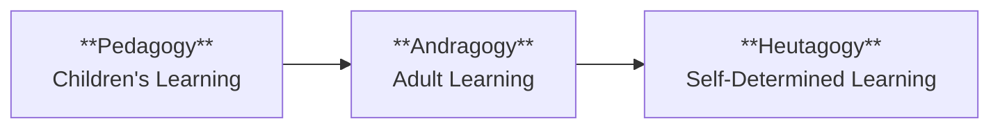
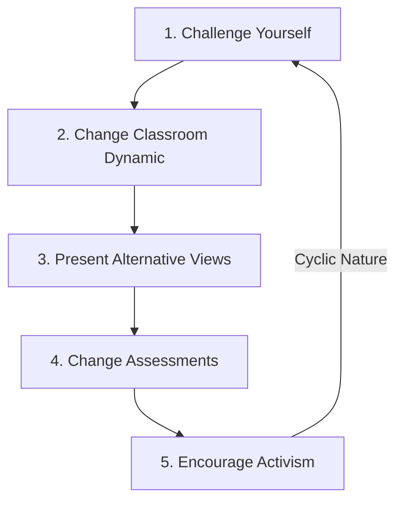
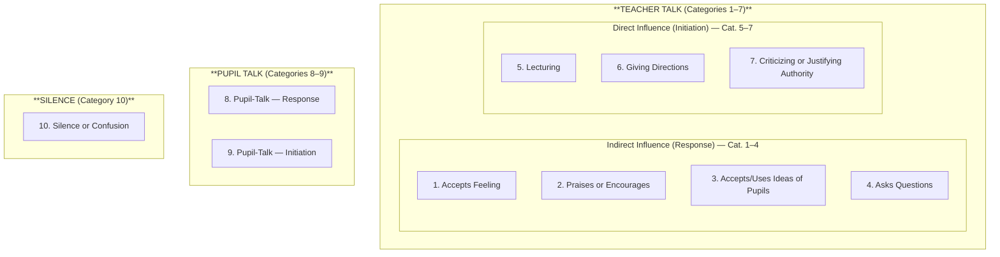

# 1. PEDAGOGICAL ANALYSIS (Part 1)
## Topics: 1.1 - 1.3

---

## 1.1 Paradigm Shift from Pedagogy to Andragogy to Heutagogy — Concept and Stages

### Meaning of Paradigm

- **Paradigm** means model, pattern, example, ideal, criterion, etc.
- Here, the paradigm relates to **Education**.

!!! note "Definition: Paradigm Shift"
    A **paradigm shift** is defined as *"an important change that happens when the usual way of thinking about something or doing something is replaced by a new and different way."*

### Historical Evolution

1. When society developed from individual life, **language** was developed — first oral, then written (alphabets).
2. Parents wanted to educate their children → **Gurukula system** developed → later improved into institutions and schools → children were taught → this was called **Pedagogy**.
3. When society enlarged, elders who did not have education in younger days wanted to learn in their adult stage → this is called **Andragogy**.
4. Based on the needs of the modern world, **self-determined learning (Heutagogy)** was developed and fostered in society.

### Definitions

| Term | Definition |
|------|-----------|
| **Pedagogy** | A term that refers to the method of how teachers teach children, in theory and practice. |
| **Andragogy** | The method and practice of teaching adult learners in adult education. It is mostly based on classroom teaching and the relationship between teachers and students. |
| **Heutagogy** | Otherwise known as **self-determined learning**. It is a student-centered instructional strategy that emphasises the development of learning autonomy, capacity and capability. |

### Comparative Table: Pedagogy vs Andragogy vs Heutagogy

| Aspect | Pedagogy | Andragogy | Heutagogy (Self-Directed Learning) |
|--------|----------|-----------|-------------------------------------|
| **Methods / Nature** | Children's learning | Adults' learning | Self-directed learning |
| **Dependence** | The learner is dependent on the teacher. Teacher determines what, how, and when of anything is learned. | Adults are independent. They strive for autonomy and self-direction in learning. | Learners are interdependent. They identify the potential to learn from novel experiences. They are able to manage their own learning. |
| **Resources for Learning** | The learner has few resources — the teacher transmits knowledge to learners. | Adults use their own and others' experience. | Teacher provides some resources. The learner decides. |
| **Reasons for Learning** | Learn in order to advance to the next stage. | Adults learn when they experience a need to perform more effectively. Adult learning is task or problem centered. | Learning is based on the identification of the potential to learn in novel situations. Learners can go beyond problem solving by enabling pro-activity. Learners use their own and others' experiences. |
| **Focus of Learning** | Learning is subject centered, focused on the prescribed curriculum. | *(Task/problem centered — see above)* | *(Novel situation-based — see above)* |
| **Motivation** | Motivation comes from parents, teachers, and a sense of competition (external). | Motivation stems from internal sources — self-esteem, confidence and recognition. | Self-efficacy, knowing how to learn, creativity, ability to use these qualities in all situations, and working with others. |
| **Role of Teacher** | Designs the learning process; teacher knows best. | Enabler or facilitator; climate of collaboration, respect and openness. | Develop the learners' capability. |
| **Learner Outcome** | *(Dependent learner)* | *(Independent learner)* | Capable people who: know how to learn, are creative, have a high degree of self-efficacy, apply competencies in novel and familiar situations, and can work well with others. |

!!! tip "Exam Tip"
    Remember the progression: **Dependent → Independent → Interdependent** (Pedagogy → Andragogy → Heutagogy). This is a frequently asked comparison.

---

## 1.2 Critical Pedagogy

### 1.2.1 Meaning

!!! note "Definition: Critical Pedagogy"
    **Critical pedagogy** is a teaching philosophy that invites educators to encourage students to **critique structures of power and oppression**. It is rooted in **critical theory**, which involves becoming aware of and questioning the societal status quo.

- In critical pedagogy, a teacher uses his or her own **enlightenment** to encourage students to **question and challenge inequalities** that exist in families, schools and societies.

### 1.2.2 Fosters Independent Thinking

- This educational philosophy is considered **progressive** and even **radical** by some because of the way it critiques structures that are often taken for granted.

**Five Steps to Implement Critical Pedagogy in the Classroom:**

| Step | Action | Description |
|------|--------|-------------|
| **1** | **Challenge yourself** | If you are not thinking critically and challenging social structures, you cannot help students do so. Educate using materials that question the common social narrative. For example, read about why certain "successes" were not really all that successful when considered in a different light. **Critical theory is all about challenging the dominant social structures.** The more we learn, the better equipped we will be to help enlighten our students. |
| **2** | **Change the classroom dynamic** | Critical pedagogy is all about challenging power structures. One of the most common power dynamics in a student's life is that of the **teacher-student relationship**. |
| **3** | **Present alternative views and discuss all** | Present alternative perspectives and encourage open discussion of all viewpoints. |
| **4** | **Change our assessments** | Traditional assessment structures, like traditional power structures, can be confining. Make sure that assessments are **not about finding the right answer**, but are instead about **critical thinking skills**. |
| **5** | **Encourage activism** | There is a somewhat **cyclic nature** to critical pedagogy. After educating yourself, encourage students to think critically, and enlighten families and communities. |

!!! important "Conclusion"
    Implementing critical pedagogy will look **different in different subjects**, and what works for one class may not work for another. Often, this will involve finding **common bonds between subjects** as the critical approach is not confined to only one area of education and culture.

### 1.2.3 Critical Pedagogy — Need and its Implication in the Classroom

#### Need for Critical Pedagogy

- One of the most significant goals of teaching is to **promote the critical thinking capability** of students and thus, create **good citizens for a just society**.
- Classroom teaching must also **awaken the values of justice and equality** in student minds.
- Critical pedagogy is a vital teaching strategy, one designed to **strengthen the awareness of learners about justice and social equality**, while improving their knowledge.
- As a result, teaching is most often **test-oriented rather than knowledge centered**.
- Teachers should employ critical pedagogy in the classroom to prepare students to gain **critical thinking skills** and to help create a **just society**.

#### Implications in the Classroom

!!! note "Key Point"
    Critical pedagogy is **not a new strategy** in teaching and learning. Figures from **Socrates** to many of today's most prominent educators have been using different student-centered classroom approaches to help students by engaging them in learning and creating knowledge.

**Key implications for classroom practice:**

1. **Employ critical pedagogy for knowledge creation** — To help students create knowledge with keen understanding, teachers need to employ critical pedagogy in the classroom.

2. **Enhance critical awareness** — Enhancing students' critical awareness is a goal of education, and teachers are the most crucial adults to guide students and can make them enthusiastic about **learning for life**.

3. **Design lesson plans using the dialogical method** — A classroom teacher who knows the students well should design a lesson plan that helps to engage students in learning activities using the **dialogical method**. The design should include the classroom strategy on how the students will be engaged in **dialogue to find out the solution** of the given problem.

4. **Connect lessons with real-life situations** — Connecting the lesson with a real-life situation is essential to enhance the ability of students to use a **reason-seeking approach**. The teachers must keep in mind that **learning is not out of life**. Thus, the teacher's planning should include a strategy that can connect the content with a real-life situation.

5. **Use diverse resources** — The teacher should not consider that knowledge is hidden only in the content of the curriculum. The teacher can use many other resources like **story, drama and students' cultural presentations**. These kinds of resources are supportive for the students, enabling them to be **creative and think consciously**.

!!! tip "Exam Tip"
    Key themes of Critical Pedagogy: **Question power structures → Foster critical thinking → Connect to real life → Use dialogical method → Create just society**

---

## 1.3 Flanders Interaction Analysis Categories (FIAC)

### Introduction

- The development of the original system of interaction analysis was primarily the work of **Ned Flanders**.
- The system is often referred to as the **Flanders System of Interaction Analysis (FIA)**.
- It is an innovation which made possible significant insights into the **analysis and improvement of instruction**.

!!! note "Definition: FIAC"
    **Flanders' Interaction Analysis System** is an observational tool used to **classify the verbal behaviour** of teachers and pupils as they interact in the classroom. It was designed for observing only the **verbal communication** in the classroom — non-verbal gestures are **not** taken into account.

**Key Assumptions:**

- It is concerned with **verbal behaviour only**, primarily because it can be observed with higher reliability than non-verbal behaviour.
- The assumption is made that the **verbal behaviour of an individual is an adequate sample of his total behaviour**.

### The Ten Categories of FIAC

Flanders Interaction Analysis Categories (FIAC) is a **Ten Category system** of communication which are said to be **inclusive of all communication possibilities**:

- **7 categories** — when the **teacher** is talking (Teacher Talk)
- **2 categories** — when the **pupil** is talking (Pupil Talk)
- **1 category** — **Silence or Confusion**

#### Complete FIAC Category Table

| Cat. No. | Category Name | Type | Description |
|----------|--------------|------|-------------|
| **1** | **Accepts Feeling** | Teacher Talk — Indirect Influence (Response) | Accepts and clarifies an attitude or feeling tone of a pupil in a **non-threatening manner**. Feeling may be positive or negative. Predicting and recalling feelings are included. |
| **2** | **Praises or Encourages** | Teacher Talk — Indirect Influence (Response) | Praises or encourages student action or behaviour. Jokes that release tension, but **not at the expense of another individual**; nodding head, saying "um hmm" or "go on" are included. |
| **3** | **Accepts or Uses Ideas of Pupils** | Teacher Talk — Indirect Influence (Response) | Clarifying, building or developing ideas suggested by a pupil. Teachers' extensions of pupil ideas are included, but as teacher brings more of his own ideas into play, **shift to category 5**. |
| **4** | **Asks Questions** | Teacher Talk — Indirect Influence (Response) | Asking a question about **content or procedures**; based on teacher ideas, with the intent that the pupil will answer. |
| **5** | **Lecturing** | Teacher Talk — Direct Influence (Initiation) | Giving facts or opinions about content or procedures; expressing his own ideas, giving his own explanation or **citing an authority other than a pupil**. |
| **6** | **Giving Directions** | Teacher Talk — Direct Influence (Initiation) | Directions, commands or orders to which a student is **expected to comply**. |
| **7** | **Criticizing or Justifying Authority** | Teacher Talk — Direct Influence (Initiation) | Statements intended to change pupil behaviour from **non-acceptable to acceptable pattern**; bawling someone out; stating why the teacher is doing what he is doing; extreme self-references. |
| **8** | **Pupil-Talk — Response** | Pupil Talk (Response) | Talk by pupils **in response to teacher**. Teacher initiates the contact or solicits pupil statement or structures the situation. Freedom to express own ideas is **limited**. |
| **9** | **Pupil-Talk — Initiation** | Pupil Talk (Initiation) | Talk by pupils that **they initiate**. Expressing own ideas; initiating a new topic; freedom to develop opinions and a line of thought; asking thoughtful questions; **going beyond the existing structure**. |
| **10** | **Silence or Confusion** | Silence | Pauses, short periods of silence and periods of confusion in which **communication cannot be understood** by the observer. |

#### Structure Diagram

!!! important "Key Classification"
    All teachers' statements are either **indirect** or **direct**. This classification gives central attention to the **amount of freedom the teacher grants to the student**. A teacher has a choice — he can be **direct** (minimizing the freedom of the student to respond) or **indirect**. His choice, consciously or unconsciously, depends upon his perceptions of the situation and the goals of the particular learning situation.

### The Coding System

!!! note "What is the Coding System?"
    Flanders Interaction Analysis is a system for **coding spontaneous verbal communication**. Interaction could either be observed in a **live classroom** or in a **tape recording**.

**Steps for Coding:**

1. The coding system is applied to **analyse and improve** the teacher-student interaction pattern.
2. For every **3 seconds**, the observer writes down the **category number** of the interaction he has observed.
3. He records these numbers **in sequence in a column**.
4. He will write approximately **20 numbers per minute**.
5. At the end of a period of time, he will have **several long columns of numbers**.

**Guidelines for the Observer:**

- It is essential for the observer to spend **5 to 10 minutes** getting used to the situation before he/she actually begins to categorize. This enables him to have a feeling for the total atmosphere in which the teacher and pupils are working.
- The observer **stops classifying** whenever the classroom activity is changed to avoid inappropriate coding. For example, when children are working on workbooks or doing silent reading.
- He will usually **draw a line** under the recorded numbers, make a note of the new activity, and **resume categorizing** when the total class discussion continues.
- At all times, the observer notes the **kind of class activity** he is observing.

### The Interaction Matrix

- Information is plotted on a **matrix** for easy analysis and interpretation.
- The method of recording consists of entering the **sequences of numbers** into a **10-row by 10-column table**.
- The generalized sequence of the teacher-pupil interaction can be examined readily in this matrix.
- Tabulations are made in the matrix of **10 × 10** to represent **pairs of numbers**.

#### Sample Interaction Matrix

|  | **1** | **2** | **3** | **4** | **5** | **6** | **7** | **8** | **9** | **10** |
|--|-------|-------|-------|-------|-------|-------|-------|-------|-------|--------|
| **1. Accepts Feeling** |  |  |  |  |  |  |  |  |  |  |
| **2. Praises or Encourages** |  |  |  |  |  |  |  |  |  |  |
| **3. Accepts or Uses Ideas of Pupils** |  |  |  |  |  |  |  |  |  |  |
| **4. Asks Questions** |  |  |  |  |  |  |  |  |  |  |
| **5. Lecturing** |  |  |  |  |  |  |  |  |  |  |
| **6. Giving Directions** |  |  |  |  |  |  |  |  |  |  |
| **7. Criticizing or Justifying Authority** |  |  |  |  |  |  |  |  |  |  |
| **8. Pupil-Talk — Response** |  |  |  |  |  |  |  |  |  |  |
| **9. Pupil-Talk — Initiation** |  |  |  |  |  |  |  |  |  |  |
| **10. Silence or Confusion** |  |  |  |  |  |  |  |  |  |  |

### Measures for Analysing Patterns of Interaction

| Measure | Symbol | Formula |
|---------|--------|---------|
| **Teacher Talk (TT)** | TT | 100 / total tallies × Σ(cat. 1+2+3+4+5+6+7) |
| **Pupil Talk (PT)** | PT | 100 / total tallies × Σ(cat. 8+9) |
| **Silence (SC)** | SC | 100 / total tallies × Σ(cat. 10) |
| **Indirect-Direct Ratio (ID Ratio)** | ID Ratio | Σ(cat. 1+2+3+4) / Σ(cat. 5+6+7) |
| **Positive Reinforcement Ratio** | — | Cat. 1+2+3 × 100 / Σ(cat. 1+2+3+6+7) |
| **Pupil Initiation Ratio (PIR)** | PIR | Cat. 9 × 100 / Σ(cat. 8+9) |

### Interpreting the Matrix

!!! note "Key Principle"
    It is generally agreed that **no classroom interaction can be ever recreated**. The purpose of interaction analysis is to **preserve selected aspects of interaction** through observation, encoding, tabulating and then decoding.

#### 1. Proportion of Teacher Talk, Pupil Talk, and Silence or Confusion

- The proportion of tallies in **columns 1, 2, 3, 4, 5, 6 and 7** (Teacher Talk); **columns 8, 9** (Pupil Talk); and **column 10** (Silence/Confusion) to the total tallies indicates how much the teacher talks, the student talks, and the time spent in silence or confusion.
- After several years of observing, researchers anticipate an average of:
    - **68% Teacher Talk**
    - **20% Pupil Talk**
    - **11–12% Silence or Confusion**

#### 2. Ratio Between Indirect Influence and Direct Influence

- The sum of **columns 1, 2, 3, 4** divided by the sum of **columns 5, 6, 7** gives this ratio.
- If the ratio is **more than 1**, the teacher is said to be **indirect** in his teaching.
- This ratio shows whether a teacher is **more direct or indirect** in his teaching.

#### 3. Ratio Between Positive Reinforcement and Negative Reinforcement

- The sum of **columns 1, 2, 3** is to be divided by the sum of **columns 6, 7**.
- If the ratio is **more than 1**, then the teacher is said to be **good**.

#### 4. Student's Participation Ratio

- The sum of **columns 8 and 9** is to be divided by the **total sum**.
- The answer will reveal **how much the students have participated** in the teaching-learning process.

!!! tip "Note on Category 10"
    In most typical classroom behaviour, the **10th category (Silence or Confusion)** is usually observed at the **beginning and/or at the end** of the learning process. However, the convention in this system is to **add 10 to the beginning and end** of the series of numbers as observed.

### Advantages of FIAC

1. The **analysis of the matrix is so dependable** that even a person not present when observations were made could make **accurate inferences** about the verbal communication and get a **mental picture** of the classroom interaction.
2. **Different matrices** can be made and used to **compare the behaviour of teachers** at different age levels, sex, subject-matter, etc.
3. This analysis would serve as a **vital feedback** to the teacher or teacher trainee about his/her **intentions and actual behaviour** in the classroom.
4. The **supervising or inspecting staff** can also easily follow this system.
5. It is an **effective tool to measure the social-emotional climate** in the classroom.

### Precautions in the Use of Flanders Interaction Analysis

1. The classroom encoding work should be done by an **observer who is familiar with the entire process** and knows its limitations.
2. It is an **exploratory device** — therefore, **value judgments about good and bad teaching behaviours are to be avoided**. This technique is **not an evaluator device** of classroom teaching.
3. The questions regarding classroom teaching can **only be answered by inspecting the matrix table**. The observer cannot answer the question relating to teacher behaviour.
4. The accuracy of the observation depends upon the **reliability of the observer**. The classroom recording should be done after **estimating the reliability of observers**.
5. **At least two observers** should code the classroom interaction for analyzing teaching and teacher behaviour.
6. Reliability should be assessed in terms of **behaviour ratios, interaction variables, and percentage of frequencies** in each category.

### Limitations of Flanders Interaction Analysis

1. The system **does not describe the totality** of the classroom activity. Some behaviour is always overlooked — but who is to say that the unrecorded aspects of the teaching act are more important than those recorded.
2. **A comparison between two matrices** calls for frequency but **value judgment is not possible**.
3. Efforts to describe teaching are often interpreted as **evaluation of the teaching act and of the teacher**. While description may be used as a basis of evaluation, evaluation can be made **only after additional value assumptions are identified and applied** to data.
4. The system of interaction analysis is **content-free**. It is concerned primarily with **social skills of classroom management** as expressed through verbal communication.
5. It is **costly and cumbersome** and requires some form of **automation** in collecting and analyzing the raw data. It is **not a finished research tool**.
6. Much of the inferential power of this system comes from tabulating the data as **sequence of pairs in a 10 × 10 matrix**. This is a **time-consuming process**.
7. Once the high cost of tedious tabulation (electric computers) is under control, the problem of **training reliable observers and maintaining their reliability** will still remain.
8. Its potential as a **research tool for wide application** to problems is yet to be explored.

!!! tip "Exam Summary: FIAC at a Glance"
    - **Developer:** Ned Flanders
    - **Purpose:** Classify verbal behaviour of teachers and pupils
    - **Categories:** 10 (7 Teacher Talk + 2 Pupil Talk + 1 Silence)
    - **Coding:** Every 3 seconds, ~20 numbers/minute
    - **Matrix:** 10 × 10 table of paired sequences
    - **Key Ratios:** TT%, PT%, SC%, ID Ratio, PIR
    - **Average Split:** 68% Teacher Talk, 20% Pupil Talk, 12% Silence
    - **Limitation:** Verbal only, content-free, time-consuming

---
