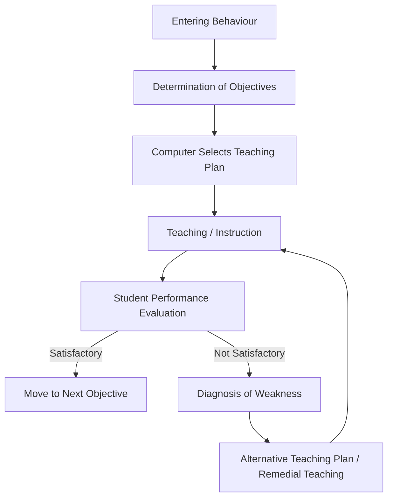
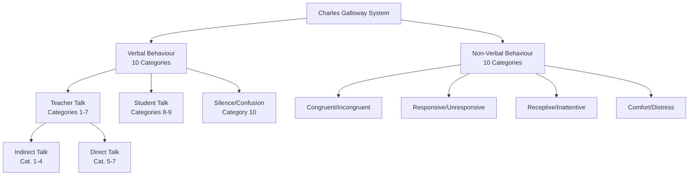
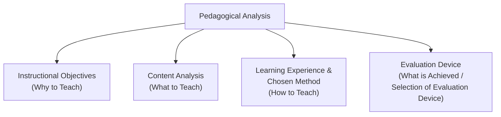
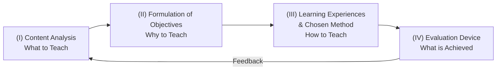
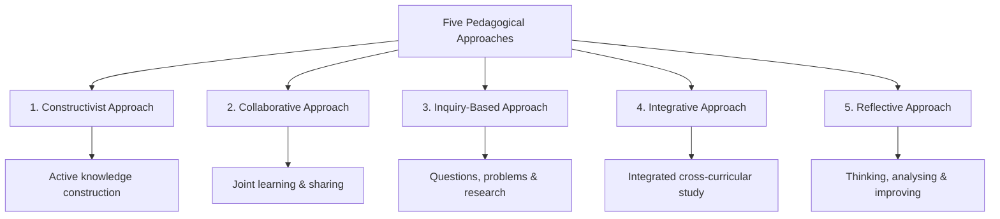

# 1. PEDAGOGICAL ANALYSIS (Part 2)
## Topics: 1.4 - 1.7

---

## 1.4 Computer Based Teaching Model (Daniel Davis)

!!! note "Context"
    The **Computer-Based Teaching Module (CBTM)** has recently gained prominence in medical education. It is a teaching format in which a **multimedia program** serves as a **single source for knowledge acquisition** rather than playing an adjunctive role as it does in Computer-Assisted Learning (CAL).

### Key Features of CBTM

- It is the **most complicated model** of teaching.
- It has the following **fundamental elements**:
    1. **Entering behaviour** (pre-existing knowledge of the student)
    2. **Determination of objectives**
    3. **Teaching aspects**
- In this model, a **computer teaching plan** is selected according to the **entering behaviour** and **instructional objectives**.
- The **performances of the student are evaluated**.
- Accordingly, an **alternative teaching plan** is presented if needed.
- **Diagnosis and teaching go side by side** — remedial teaching is provided on the basis of diagnosis.
- **Individual differences** are also given importance.

### Historical Background

- **Computer-Based Instruction (CBI)**, also commonly referred to as **Computer Assisted Instruction (CAI)**, was introduced during the **1950s**.
- The pioneers of the movement were a team of researchers at **IBM**, including **Gordon Pask** and **O. M. Moore**.

!!! important "Key Points for Exams"
    - CBTM is the **most complicated** teaching model.
    - It integrates **diagnosis + teaching** simultaneously.
    - **Remedial teaching** is based on diagnosis.
    - **Individual differences** are considered.
    - Introduced in the **1950s** by researchers at **IBM** (Gordon Pask & O. M. Moore).

### Role of Teacher in Teaching

- The process of **modifying the behaviour** of a student can be a **conscious and deliberate effort** by the teacher through **communication and knowledge**.
- **Modification of behaviour** is done through **interactions** in the teaching-learning process.
- **Teacher is the pivotal point** and the heart of the matter.
- Education takes place through the **interaction between the teacher and the taught**.
- Teacher is the **maker of man** — he trains the mind, cultivates the manners, and shapes the morals of members of the community.

!!! tip "Nature of Teaching"
    - Teaching is a **complex / many-sided activity** consisting of a number of **verbal and non-verbal acts** like questioning, explaining, drawing, rewarding, smiling, nodding, movements, etc.
    - The complex task of teaching has been **analyzed into limited but well-defined components** called **teaching skills**.
    - The **systematic observation** of teacher behaviour and interaction in the classroom can be studied through various **feedback devices** and **interaction analysis techniques**.

---

## 1.5 The Charles Galloway System of Interaction Analysis

### Introduction

- In a **category system**, teacher behaviour is first divided into **various units**.
- A **behaviour unit** is then classified into **categories**.
- At **regular intervals** of the observation period, the category is observed.
- The **Charles Galloway System of Interaction Analysis** represents a good example of the **category interaction analysis**.

!!! note "Developer"
    This system was developed by **Charles Galloway** in the form of a **teachers' training technique**. It is basically a **category type system** involving **categorization of all sets of possible verbal and non-verbal behaviour** of a teacher in the classroom while interacting with students.

### Importance of the System

- The **teacher is the important figure** in his pedagogical analysis since his behaviour is one of the **most important factors** in producing **communication and subsequent interactions**.
- This system provides a **unique approach** to a more **complete analysis of interaction** in the classroom.
- It combines both **verbal and non-verbal dimensions** of teacher behaviour.

### Categories of Behaviour

In total there are:

- **10 categories of verbal behaviour**
- **10 categories of non-verbal behaviour**

These are divided into **three major sections**:

1. **(a) Teacher Talk**
2. **(b) Student Talk**
3. **(c) Silence or Confusion**

### Category-wise Verbal and Non-Verbal Behaviour

| Category No. | Verbal Behaviour | Non-Verbal Behaviour |
|:---:|---|---|
| **1** | Accepts students' feelings | Congruent — Incongruent |
| **2** | Praises or Encourages | Congruent — Incongruent |
| **3** | Uses students' ideas | Implement — Perfunctory |
| **4** | Asks questions | Personal — Impersonal |
| **5** | Lectures — gives information | Responsive — Unresponsive |
| **6** | Gives directions | Involve — Dismiss |
| **7** | Criticizes or justifies authority | Involve — Dismiss |
| **8** | Student Talk (Response) | Receptive — Inattentive |
| **9** | Student Talk (Initiated) | Receptive — Inattentive |
| **10** | Silence or Confusion | Comfort — Distress |

### Classification of Categories

| Category Numbers | Classification |
|:---:|---|
| **1–4** | Indirect Teacher Talk |
| **5–7** | Direct Teacher Talk |
| **8–9** | Student Talk |
| **10** | Silence or Confusion |

!!! important "Non-Verbal Cues"
    In this system, relevance to the **non-verbal cues** is given along with the verbal behaviour, as teachers convey information to students through non-verbal cues. These cues can be either **spontaneous or managed** and facilitate any effort to **understand others and to be understood**.

### Assumptions of Charles Galloway System

The assumptions of the Charles Galloway System are as follows:

1. **Non-verbal communication** of a teacher has a **significant role** in classroom interaction.
2. As one **cannot see when he/she behaves**, a **feedback is necessary** for the behaviour.
3. The **non-verbal cues are important**, as they can **reinforce and motivate** a student.
4. **Non-verbal communication** can be **more effective** during interaction in the classroom.
5. Becoming **aware of non-verbal events** occurring around us, one can achieve a **better understanding of himself**.
6. **Training of teachers** enhances the aspect of **non-verbal communication** in teachers.
7. The system is based upon the **theory of modification of the teacher's behaviour**.

---

### Communication Skill

!!! note "Definition"
    The term **communication** has been derived from the Latin word **"Communis"** meaning **"Common"**.

> **"Communication is a process of sharing or exchanging experiences, information, ideas, opinions, sentiments, thoughts and feelings etc. between the source of communication and the receiver through some mutually agreeable or known media (verbal or non-verbal)."**

> **Communication Skill** could be defined as — *"We all use language to communicate, to express ourselves, to get our ideas across and to connect with the person to whom we are speaking. When a relationship is working, the act of communicating seems to flow relatively effortlessly. When a relationship is deteriorating, the act of communicating can be as frustrating as climbing a hill of sand."* — **Chip Rose**, Attorney and Mediator

### Classification of Communication

Communication can be broadly classified into **two categories**:

| Type | Description |
|---|---|
| **Verbal Communication** | Communication strategies in which both **oral and written form** of language is used |
| **Non-Verbal Communication** | Communication of feelings and thoughts through **non-verbal means** with or without making use of any verbal or written language |

---

#### (i) Verbal Communication Strategy

- **Language** is the **key and base** of any verbal communication.
- The use of language can take one of **three forms**:

| Form | Description |
|:---:|---|
| **Oral** | Spoken language |
| **Written** | Written language |
| **Oral + Written** | Combined use of both |

- In classroom communication, a teacher writes on the **blackboard** and also makes use of language for **explanation and exposition** of the written contents.
- Oral form combined with written form of communication **always proves more effective** than any of these forms used separately.

---

#### (ii) Non-Verbal Communication Strategy

!!! note "Definition"
    **Non-Verbal Communication** refers to *"all external stimuli other than spoken or written words and including body motion, characteristics of appearance, characteristics of voice and use of space and distancing."* All these non-verbal cues taken together are known as **body language**.

- Communication process can also be carried out **without the use of any verbal means** (written or spoken language).
- In normal situations, non-verbal media is generally used for **lending strength and effectiveness** to the verbal communication.

### Important Modes of Non-Verbal Communication

#### 1. Facial Expressions

- Face and facial expressions may be said to be a **true index of one's emotional and thinking behaviour**.
- When one is **perturbed**, his face gives the identity of the level of his **anxiety and stress**.
- When one is in **happy mood or joyful**, his/her facial expression conveys the same to others.
- Facial expressions are one of the **most important modes** of non-verbal communication.

#### 2. Language of Eye

- Eyes, in a very **forceful way**, may convey all what is intended to be communicated.
- **Eye to eye contact** forms the very basis of **effective communication**.
- In the classroom, the necessary **interaction links** between teacher and pupils are mostly maintained through **eye language**.
- The eye contact of a teacher with pupil may **encourage or discourage** giving response.

#### 3. Body Language (Gestures, Postures, Movements)

- Our body has an impressive capacity for **communicating our feelings, thoughts and actions**.
- It includes various **gestures, postures and movements** of body parts.
- It could be effectively used by teachers and pupils in the classroom for **healthy interaction** in all types of teaching-learning situations.

#### 4. Sound Symbols

- Many of the **sound symbols and vocal cues** also prove an effective medium for the desired communication.
- For example, when a teacher narrates or explains something and the student responds simply by uttering the sound **"hunch-hunch"**, it may work well for **maintaining communication**.

#### 5. Symbolic Code Language

- Special **code language** prepared with the help of various **gestures, postures and body movements**.
- Can be used for **communicating with deaf and dumb**.

!!! tip "Sub-skills of Communication"
    Communication is a **specialised skill** consisting of sub-skills:

    1. **Active Listening**
    2. **Speaking**
    3. **Reading**
    4. **Writing**

| Mode of Non-Verbal Communication | Key Feature |
|---|---|
| **Facial Expressions** | True index of emotional and thinking behaviour |
| **Language of Eye** | Basis of effective communication; eye contact |
| **Body Language** | Gestures, postures, movements of body parts |
| **Sound Symbols** | Vocal cues like "hunch-hunch" |
| **Symbolic Code Language** | Gestures/postures for communicating with deaf and dumb |

---

## 1.6 Steps in Pedagogical Analysis

### Meaning of Pedagogical Analysis

!!! note "Definition"
    Generally, the term **pedagogy** means the **art as well as science of teaching method**. The **science** deals with **effectiveness of teaching** and **art** relates to **artistry**. Similarly, the knowledge of teaching is achieved by **practice and experience** in the classroom.

> **Pedagogical Analysis** is the **scientific and analytical study of teaching a topic**. The sole objective of pedagogical analysis is to make the teaching-learning process more **scientific, effective and impressive**.

### Nature of Teaching

- Teaching is a **complex phenomenon** as its nature is **artistic and scientific**.
- Individuals can teach in their own way.
- **Imagination indicates** and one can adopt **analytic explanation**.
- It involves **bifurcating a topic into units and sub-units** and other smaller units.

### Components of Pedagogical Analysis

Pedagogical Analysis is based on **four essential pillars** along with their **relationships and interdependence**, considered essential in the **effective teaching-learning process**.

### Four-Fold Activities of Pedagogical Analysis

!!! important
    To make the teaching-learning process more **effective, systematic, scientific and impressive**, we have to carry out these different activities of pedagogical analysis.

---

### (I) Unit Analysis / Content Analysis

- **Unit** means a topic and **analysis** means dividing it into parts.
- Content analysis is **not an easy task**.
- In doing content analysis, a teacher should have **sound knowledge** of:
    - **Content**
    - **Techniques**
    - **Teaching maxims**
    - **Nature of the subject matter**
- Before teaching, a teacher has to **divide the topic into smaller parts/units**.
- During the time of dividing units into smaller and simpler sub-units, the teacher has to **identify and write down teaching points**.
- At the time of selecting teaching points, a teacher has to be:
    - **Vigilant**
    - **Careful**
    - **Skilful**
    - **Intelligent**
    - **Systematic in approach**

---

### (II) Formulation of Objectives

- Pedagogical Analysis is the **systematic and scientific analysis** of the teaching and the content.
- A teacher has to formulate the **instructional objectives in behavioural terms** because the instructional objectives are the **learning outcomes**.
- It is the **end product** of the teaching-learning process.
- **Learning is change in behaviour** — in **Cognitive, Affective or Psychomotor domains**.

!!! tip "Teachers Should Know"
    - **Bloom's Taxonomy** of teaching-learning objectives
    - **Robert Mager's approach**
    - **Robert Millar's approach**
    - **RCEM approach**
    - Good knowledge of **psychological and educational principles** of teaching-learning process

---

### (III) Learning Experiences and Chosen Method

- After confirming **what to teach** (subject matter) and **why to teach** (instructional objectives), the teacher has to choose the **best methods, maxims, techniques, tactics, strategies and approaches** to teach the particular subject matter.
- The teacher should have **clear knowledge** about pedagogy and the knowledge of using **audio-visual aids** effectively.
- For example, an English teacher has to select suitable methods:
    - **Direct Method**
    - **Bilingual Method**
    - **Translation Method**
    - And the **best approach** for properly achieving learning outcomes.

---

### (IV) Evaluation Device

- **Evaluation** is the measurement of **desired changes in the behaviour** of the students.
- The total **behavioural outcomes** are measured with the help of **evaluation devices**.
- **Right evaluation is a tedious job** — it requires a lot of **skills and knowledge** on the part of the teacher.
- After having taught the lesson, the teacher attempts to know **how effective his teaching was**.

**Evaluation at the end of the lesson includes two aspects:**

| Aspect | Description |
|---|---|
| **(i) Recapitulation** | The teacher asks certain questions on the basis of the lesson just taught. Questions may be asked from the whole class and evaluated. |
| **(ii) Home Work** | Assignments given after the lesson for reinforcement and practice. |

!!! important "Summary Table: Four-Fold Activities"

| Activity | Key Question | Focus |
|---|---|---|
| **(I) Unit/Content Analysis** | What to teach? | Dividing topic into units, sub-units, teaching points |
| **(II) Formulation of Objectives** | Why to teach? | Behavioural objectives — Cognitive, Affective, Psychomotor |
| **(III) Learning Experiences & Method** | How to teach? | Methods, maxims, techniques, audio-visual aids |
| **(IV) Evaluation Device** | What is achieved? | Recapitulation, homework, measuring behavioural outcomes |

---

## 1.7 Five Pedagogical Approaches

!!! note "Introduction"
    **Pedagogy** or teaching students is the very basic function of teachers. It is their primary concern. They use tools like **books, visuals** and several types of **teaching materials and instruments**. Teaching has, of late, become a **technology** and not just any other work. For effective teaching, teachers must adopt **5 pedagogical approaches** to enable students to learn better.

### Overview of Five Pedagogical Approaches

| No. | Approach | Core Idea |
|:---:|---|---|
| 1 | **Constructivist Approach** | Learning by active knowledge construction |
| 2 | **Collaborative Approach** | Learning together by sharing skills and knowledge |
| 3 | **Inquiry-Based Approach** | Learning by asking questions and research |
| 4 | **Integrative Approach** | Connected, cross-curricular learning |
| 5 | **Reflective Approach** | Teaching by thinking, analysing and improving methods |

---

### 1. Constructivist Approach

- This is based on **constructivist learning theory**.
- It is based on the theory that **learning occurs only when learners are actively involved** in the process of **knowledge construction**.
- As opposed to **passively receiving information**, learners are **makers of meaning and knowledge** with the guidance of the teacher.
- **Examples:**
    - **Project work**
    - **Playway method**
    - **Exploration**
    - **Montessori approach** — which uses **didactic materials** in constructive / developing knowledge

!!! tip "Key Idea"
    Learners **actively construct** their own knowledge rather than passively receiving it from the teacher.

---

### 2. Collaborative Approach

- In collaborative approach, **2 or more students join together** and learn something together.
- In this, they **share the skills and abilities** of co-learners by **asking questions** on the topic studied.
- Collaborative learning enables to develop **joint learning**, sharing each other's **varied experiences and knowledge** by **actively interacting** with each other.
- The knowledge and experience of individuals are **varied and different**.
- Thus, they **share all such varied knowledge** from one another.

!!! tip "Key Idea"
    Students learn **from each other** by sharing diverse knowledge and experiences through active interaction.

---

### 3. Inquiry-Based Approach

- This starts by **asking questions, problems and learning**.
- It is **not merely passive presenting** of established and known knowledge.
- This could be **improved** by the role of **facilitator**, guiding whenever doubts arise.
- **Inquiry** is the basic approach — mostly it would be **problem-based**.
- Knowledge is **developed by research and analysis** — new learning is created.
- In order to find solutions, there could be **small-scale investigations and projects**.
- This enables to develop **thinking skills and analytical approaches**.

!!! tip "Key Idea"
    Learning through **questioning, investigation and research** rather than passive reception of established knowledge.

---

### 4. Integrative Approach

- If education takes place in **independent bits of learning**, it will **not be practical and useful**.
- This approach ensures **integrated, connected knowledge across curricula**.
- It is different at **different levels** — primary, secondary levels.
- Traditionally, subjects are taught as **independent, disconnected subjects**, but this will **not bring out the interrelation** among the subjects based on life experience.
- **Research studies have proved** that subjects studied in an integrated manner are **far better than independent study** of subjects.
- **Life is not compartmentalised** — it is **integrated**, and so when we study using an integrated approach, it enables students to **understand life experiences**.
- **Example:** When reading and writing language studies are **integrated with science** or other subjects, it makes understanding **better and clear**.

!!! tip "Key Idea"
    Subjects should be taught in a **connected, cross-curricular manner** reflecting the integrated nature of real life.

---

### 5. Reflective Approach

- In reflective teaching, the teacher is **not approaching it as usual practice**.
- Instead, the teacher will **plan different, improved, useful ways and means** of teaching.
- In this approach, teachers **think and analyse** how the present teaching is done and how it could be **improved and made more effective**.
- By such **thinking and analysis**, teachers could develop **new approaches and methods** based on their own **research in practice**.
- It also enables to introduce:
    - **Small group teaching**
    - **Co-operative learning methods**
    - **Identifying problem students** — what are their problems and how they could be removed

!!! tip "Key Idea"
    Teachers **reflect on their own practice**, analyse effectiveness, and continuously **improve their teaching methods**.

---

### Conclusion on Pedagogical Approaches

> By understanding all such approaches, a teacher can **adopt one or more approaches** of teaching in order to make teaching **more effective, meaningful and varied**. This will **kindle the interest and attention** of students to learn.

!!! important "Comparison Table: Five Pedagogical Approaches"

| Approach | Focus | Role of Teacher | Role of Student | Example |
|---|---|---|---|---|
| **Constructivist** | Active knowledge building | Guide / Facilitator | Active constructor of knowledge | Project work, Montessori |
| **Collaborative** | Joint learning | Organiser | Co-learner, shares knowledge | Group discussions, peer learning |
| **Inquiry-Based** | Questioning & research | Facilitator | Investigator, problem-solver | Research projects, investigations |
| **Integrative** | Cross-curricular connections | Integrator | Connects knowledge across subjects | Language + Science integration |
| **Reflective** | Continuous improvement | Reflective practitioner | Beneficiary of improved methods | Action research, self-evaluation |

---

!!! note "Quick Revision: Topics 1.4 – 1.7"
    - **1.4** — Computer-Based Teaching Model (Daniel Davis): Most complicated model; diagnosis + teaching side by side; introduced in 1950s at IBM.
    - **1.5** — Charles Galloway System: 10 verbal + 10 non-verbal categories; combines both dimensions; 7 assumptions; Communication Skill (verbal + non-verbal strategies).
    - **1.6** — Steps in Pedagogical Analysis: Scientific study of teaching; 4 pillars — Content Analysis, Objectives, Methods, Evaluation.
    - **1.7** — Five Pedagogical Approaches: Constructivist, Collaborative, Inquiry-based, Integrative, Reflective.
