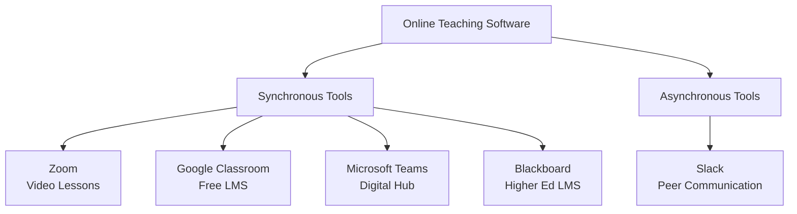
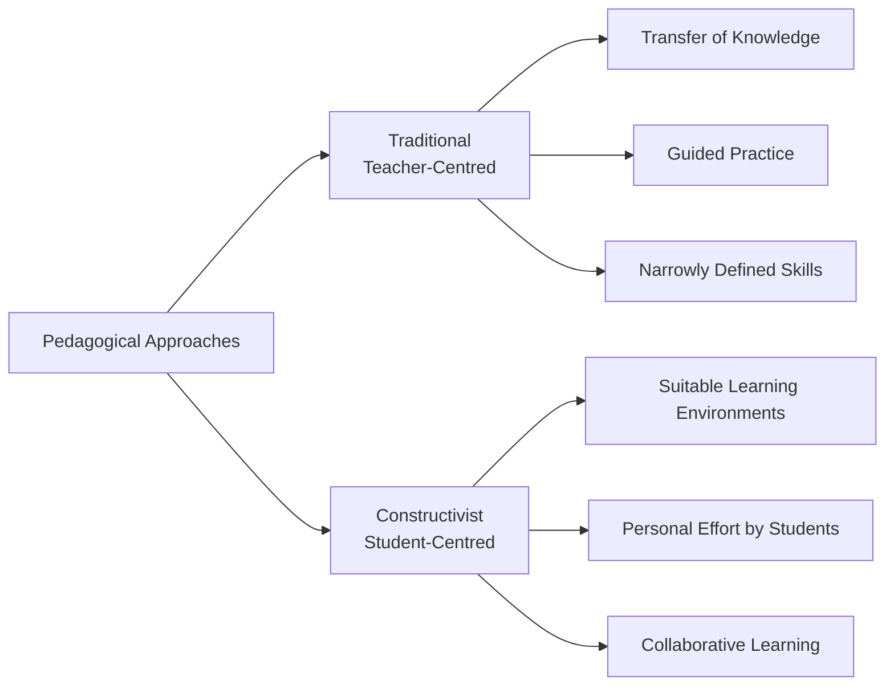
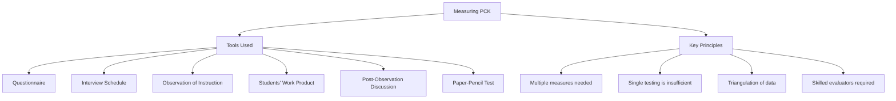

# 1. PEDAGOGICAL ANALYSIS (Part 3)
## Topics: 1.8 - 1.11

---

## 1.8 Software Pedagogy

### Online Teaching Software: The Basic Tools You Should Know About

The present-day circumstances are forcing hundreds of colleges, universities, schools, training centres and tutors to move tuition to **virtual settings** — many, for the first time. While many institutions and public learning spaces are now reopening, **hybrid forms of teaching** are likely to continue for a while yet. The success of this model entirely depends on the **technology chosen** for the job and how educators **adapt** to them.

---

### What to Look for in Online Teaching Software

Your virtual teaching toolkit will largely depend on:

- The **size** of your student base and organization
- Your particular **role and subject**
- Any **additional learning needs**
- **Budget** is also a factor

!!! important "Key Considerations When Choosing Software"
    - **Software performance** and **user-friendliness** — try to reduce the anxiety surrounding new technology
    - Consider the **individual needs of students**, particularly those with special needs
    - Your virtual teaching tools should **not just help you craft a great online lesson** — they should support you in everything
    - Look for tools that **bring structure to your day** and make it easy to stay **connected, visible and in control**

---

### Essential Online Teaching Software

There are virtual teaching tools out there for every different teaching approach imaginable, catered to a range of different ages, needs and abilities. They cover everything from:

- Colleague **communication** and **video classrooms**
- Managing your **schedule**
- Sticking to your **work hours**

Options are available for **individuals** as well as **institutions**.

---

#### Synchronous Virtual Classrooms

##### 1. Zoom — for Synchronous Video Lessons

!!! note "Zoom — Key Features"
    - Useful tool for **no-frills virtual classrooms** and department meetings
    - Free version allows hosting **up to 100 participants** at once (far outstrips Google Hangouts and Skype)
    - Create several **breakout rooms** for smaller group work
    - **Share screens** during lessons
    - Use **group chat** for smaller discussions during a lesson
    - Easily **record calls** — useful for:
        - **Self-critique** as you iterate your online teaching methods
        - **Sharing meetings** with colleagues who couldn't attend

---

##### 2. Google Classroom — for a Free LMS

!!! note "Google Classroom — Key Features"
    **Learning Management System (LMS)** software provides a single space for all your organization's:

    - Admin documentation
    - Reporting and training needs
    - Tools to plan teaching
    - Host virtual lessons
    - Create assignments

    Google Classroom brings together all its standard **G Suite tools** — like **Docs, Sheets and Hangouts** — to help you seamlessly manage and deliver virtual teaching. It is a **free platform** offered by Google.

---

##### 3. Microsoft Teams — for a Connected Digital Learning Hub

!!! note "Microsoft Teams — Key Features"
    - While stopping short of calling itself an LMS, Microsoft Teams offers a **similar suite of virtual teaching tools** as Google Classroom
    - Also **free** to use
    - Allows **conversations, content and collaboration** to happen in one unified digital space
    - Great for:
        - Creating **secure virtual classrooms**
        - Sharing **assignments and feedback**
        - Streamlining **staff communication**

---

##### 4. Blackboard — for Top-of-the-Range Higher Education LMS

!!! note "Blackboard — Key Features"
    - A **purpose-built higher education LMS** with a modern and intuitive feel
    - Facilitates **fluid, user-friendly digital learning environments** with specialist solutions
    - Features include:
        - **Blackboard Analytics for Learning** — helps identify barriers to student success
        - Tools to **keep students on track** and optimize institutional performance
    - A great platform for delivering **engaging online teaching experiences** and ensuring everyone gets the right support

---

#### Asynchronous Support and Communication

##### 5. Slack — for Peer and Organization Communication

!!! note "Slack — Key Features"
    - **Transparent asynchronous communication** is the bedrock of all remote collaboration
    - **Democratizes communication** — allowing everyone to access department-wide conversations and talk when it actually suits their schedule
    - Many remote teams have realized that **email is not the optimal space** for day-to-day communication
    - Slack effectively breaks all team communication into **thematic groups called threads**
    - Allows staff to **dip in and out** of conversations that concern them
    - Great tool for building an **online peer community**:
        - Share **best practices**
        - Exchange **ideas**
        - Share **global updates**
        - Just **check-in** on each other

---

### Summary: Essential Online Teaching Software

| Software | Type | Best For | Cost |
|---|---|---|---|
| **Zoom** | Synchronous Virtual Classroom | Video lessons, breakout rooms, screen sharing | Free (up to 100 participants) |
| **Google Classroom** | Free LMS | Admin, assignments, virtual lessons (G Suite integration) | Free |
| **Microsoft Teams** | Digital Learning Hub | Secure classrooms, assignments, staff communication | Free |
| **Blackboard** | Higher Education LMS | Advanced analytics, student tracking, institutional use | Paid |
| **Slack** | Asynchronous Communication | Peer community, threaded discussions, team updates | Free / Paid |

---

## 1.9 Pedagogical Beliefs and Attitudes of Computer Science Teachers

### Introduction

**Pedagogical beliefs and attitudes** significantly determine the **professional skills and practice** of teachers. Many professional development programs for teachers aim to elaborate pedagogical knowledge in order to **improve teaching quality**.

!!! important "Key Finding"
    Research data reveal that computer science teachers usually hold **mixed traditional and constructivist theories** which are relevant to either **demographic factors** or their **pre-service training**.

---

### Relationship Between Beliefs and Practice

The relationship between the **beliefs and behaviour of teachers** and their **students' achievements** is important. The study of teachers' pedagogical beliefs and attitudes, and the **planning and decision-making procedures** they apply, is significant *(Fang, 1996)*.

---

### Definition of Beliefs

!!! tip "Definition: Beliefs"
    **"Beliefs"** are **cognitive structures** which help teachers **interpret their experiences** and **specify their teaching practices** *(Nespor, 1987; Pajares, 1992)*.

Subject teachers' beliefs are formed by several factors:

- The **culture of their subject discipline**
- The **quality of their experiences** in the subject as students
- The **opportunities for reflection** *(Fang, 1996)*

---

### Definition of Attitude

!!! tip "Definition: Attitude"
    **"Attitude"** concerns the **general appreciation** or the feeling of **favourable or unfavourable disposition** of a person towards another person or an object.

According to the **Theory of Reasoned Action** *(Ajzen & Fischbein, 1980)*:

- **Beliefs and attitudes determine human behaviour**
- Consequently, they determine **teachers' practices** to a significant extent *(Kagan, 1992)*
- The exploration of teachers' beliefs and attitudes about pedagogical approaches can **inform the process of designing teachers' training and support**

---

### Importance of Studying Pedagogical Beliefs

- The study of teachers' pedagogical beliefs is **critical to education**
- Research studies have shown that teachers with **traditional pedagogical beliefs** are more likely to employ **didactic instructional practices**
- **Applefield** proposes the involvement of **pre-service teachers** in processes that enable them to **examine and change their traditional beliefs**
- The aim is to encourage them to adopt **constructivist instructional approaches** when they become teachers

!!! important "ICT Integration"
    This concern also applies to any attempt to **integrate ICT in education**, because the real exploitation of ICT requires **constructivist learning approaches**.

---

### Traditional vs Constructivist Approaches

The relationship between teachers' pedagogical beliefs and their use of **ICT for teaching and learning** is important. **Becker's analysis** of the distinction between the traditional and the constructivist approach is based on **four dimensions**:

| Dimension | Traditional Approach | Constructivist Approach |
|---|---|---|
| **Curriculum** | Narrowly defined cognitive field or skill set | Broad, connected learning environments |
| **Teaching Approach** | Teacher-centred; emphasis on **transfer of knowledge and skills** from teacher to students | Student-centred; creation of **suitable learning environments** by the teacher |
| **Student's Work** | Guided practice; understanding emerges from carefully planned immediate teaching | Students make **personal efforts** for development of their own understanding |
| **Assessment** | Standardized examinations; memorization | Collaborative, meaning-making and communicative activities |

---

#### Traditional Teacher-Centred Approach

According to **Becker**, the traditional teacher-centred practice is characterized by:

- Emphasis on the **transfer of knowledge and skills** from teachers to students
- A theory of learning whereby **understanding emerges from carefully planned immediate teaching** within a narrowly defined cognitive field or skill set
- Learning from **guided practice**

---

#### Constructivist Approach

In contrast, the **constructivist consideration** claims that:

- Understanding is **neither transferred, nor a result from mere skill practice**
- Efficient constructivist teaching includes the **creation of suitable learning environments** by the teacher
- Within those environments, students make **personal efforts** for the development of their own understanding
- Students are given the **opportunity to learn when and how to do it**
- Learning happens with the **collaborative support of fellow students** in the framework of **meaning-making and communicative activities** with personal significance for each one of them

---

### Constructivist Model — Expected Outcomes

With the constructivist model, students should develop abilities of:

- **Deep understanding** of a subject
- Realizing **relationships between different ideas and concepts**
- Knowing both **when and how to apply** their knowledge in specific cases
- Ability to **communicate their meanings** to others

---

### Consolidation of Constructivist Pedagogy

!!! note "Key Points"
    - The consolidation of **constructivist pedagogy** is usually what teachers' pedagogical training targets
    - However, the **conventional organisation of the educational system** (predetermined syllabus, limited time, extended material, demand of memorization for standardized examinations) is **not compatible** with the student-centred pedagogical approach
    - Therefore, a **degree of divergence** is expected between teachers' beliefs and practice

---

### Change in Beliefs Over Time

- Teachers' pedagogical beliefs and attitudes **change along with the years of service**
- Teachers seem to have **strong beliefs at the beginning** of their career (either traditional or constructivist)
- These beliefs **weaken after some years of experience**
- Teachers' beliefs and attitudes seem to be **generally unrelated** to their prior studies in education and/or participation in professional development programs

---

## 1.10 Measuring Computer Science Pedagogical Content Knowledge

### Introduction

!!! tip "Definition: Pedagogical Content Knowledge (PCK)"
    **Pedagogical Content Knowledge (PCK)** is the **intersection** of a teacher's knowledge of:

    - **Content** (subject matter)
    - **Pedagogy** (teaching methods)
    - **Context** of the learning situation, including her students

PCK is more accurately measured by **triangulating data** gathered through:

1. **Observation** of instructional events
2. **Teacher interviews**
3. **Assessments** of content knowledge

---

### What is Pedagogical Content Knowledge?

**Shulman** described PCK as:

> *"That special amalgam of content and pedagogy that is uniquely the province of teachers, their own special form of professional understanding."*

!!! important "Shulman's Key Points on PCK"
    - PCK is the **single characteristic** that separates someone with content knowledge from a teacher who can **represent ideas**
    - It enables the unknowing to **come to know**, those without understanding to **comprehend and discern**, and the unskilled to **become adept**

---

### PCK Explained with an Example

**Pedagogical Content Knowledge** is the difference in how a **laboratory chemist** and a **chemistry teacher** would plan and teach a chemistry lesson:

| Aspect | Laboratory Chemist | Chemistry Teacher (with PCK) |
|---|---|---|
| **Knowledge** | Can tell students about the topic | Plans lesson based on the **nature of her students** |
| **Planning** | Limited pedagogical planning | Considers **what students need to learn** and **how they will best learn it** |
| **During Teaching** | Delivers content | **Continually evaluates learning** and uses a variety of pedagogical techniques |
| **Techniques** | Limited | Can **alter explanations**, create **demonstrations**, and provide **analogies** |
| **Goal** | Transfer information | **Support students' understanding** effectively |

!!! tip "Foundation of PCK"
    Being able to **convey knowledge effectively to students** is the foundation of PCK.

---

### Measuring Pedagogical Content Knowledge

Given evidence to support the link between **PCK, effective instruction, and student achievement**, researchers have sought to **measure PCK** and to develop **tools and approaches** that will aid in teacher evaluation.

---

#### Challenges in Measuring PCK

**PCK is a complex construct** and has proved difficult to measure. Some researchers have included different types of tools:

| Tool / Method | Description |
|---|---|
| **Questionnaire** | Written survey instruments |
| **Interview Schedule** | Structured or semi-structured interviews |
| **Observation of Instruction** | Watching teachers teach in real-time |
| **Students' Work Product** | Analysing student outputs |
| **Observation of Teacher** | Observing teacher behaviour and decisions |
| **Discussion on Student Learning** | Post-lesson discussions about student progress |

Some researchers used **one or two tools**, while others used **many tools** together.

---

#### Tools and Methods for Measuring PCK

##### 1. Paper-Pencil Test

- Used with **other approaches**
- Possible to administer to **large groups**, allowing **broad application**
- **Deficiency**: More useful for evaluating **content knowledge** rather than **pedagogical knowledge**

##### 2. Item Design

- **Item design is important** for effective measurement
- Types of items used:
    - **Closed-ended questions** — useful in enabling participants to select the correct answer
    - **Open-ended questions** — if properly answered, could be useful
    - **Concept mapping**
    - **Comments / video taped** sessions — used for creative items for testing

##### 3. Observation of Instruction

- Provides **great insight** into a teacher's ability to perform PCK
- **Requires skilled, trained observers**

##### 4. Post-Observation Discussion

- Can provide insight into **teachers' pedagogical reasoning**
- Particularly useful **after an observation of instruction**
- To make the observation productive, the **facilitators should be more skilled**
- The time required for skilled evaluators may require **more finance** and could be a constraint

---

#### Shulman's Views on Measuring PCK

!!! important "Shulman's Expert Opinion"
    **Shulman**, expert psychologist, stated that:

    - **Single testing may not provide effective evaluation**
    - **Multiple measures and tests** should be used for evaluation of teachers' pedagogical skills
    - Only one separate evaluation will **not yield correct result** — so it is **insufficient**

---

#### Key Conclusions on Measuring PCK

- **Measuring PCK** is a **common approach** used in educational research for evaluating teacher pedagogy
- There is **no single established approach** for measuring PCK
- **Multiple data analysis only** could provide better results
- **Researchers and administrators** use PCK for analysis of **teacher's effectiveness**
- A **complex approach** to measure PCK is required for a thorough evaluation of teacher pedagogy

---

## 1.11 Test Items for Self Assessment

### I. Choose the Correct Answer

**1. A paradigm shift is**

- (a) New change in thinking and doing
- (b) Shifting equipment
- (c) Removing tools
- (d) None-of-these

---

**2. Flanders Interaction Analysis involves**

- (a) 3 categories
- (b) 5 categories
- (c) Teaching
- (d) 10 categories

---

**3. Critical pedagogy fosters**

- (a) Role memory
- (b) Discussion

---

!!! note "Note"
    The self-assessment questions continue beyond the available source material. Refer to the textbook for the complete set of questions.

---

## Summary of Key Concepts (1.8 – 1.10)

| Topic | Key Takeaway |
|---|---|
| **1.8 Software Pedagogy** | Online teaching requires the right tools — Zoom, Google Classroom, MS Teams, Blackboard, and Slack cover synchronous and asynchronous needs |
| **1.9 Beliefs & Attitudes** | Teachers hold mixed traditional and constructivist beliefs; these significantly affect teaching practice and ICT integration |
| **1.10 Measuring PCK** | PCK is the intersection of content, pedagogy, and context; it requires multiple tools and triangulation to measure effectively |

---
