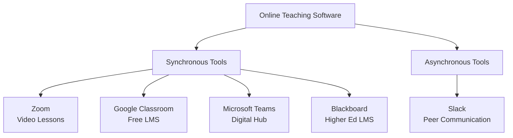
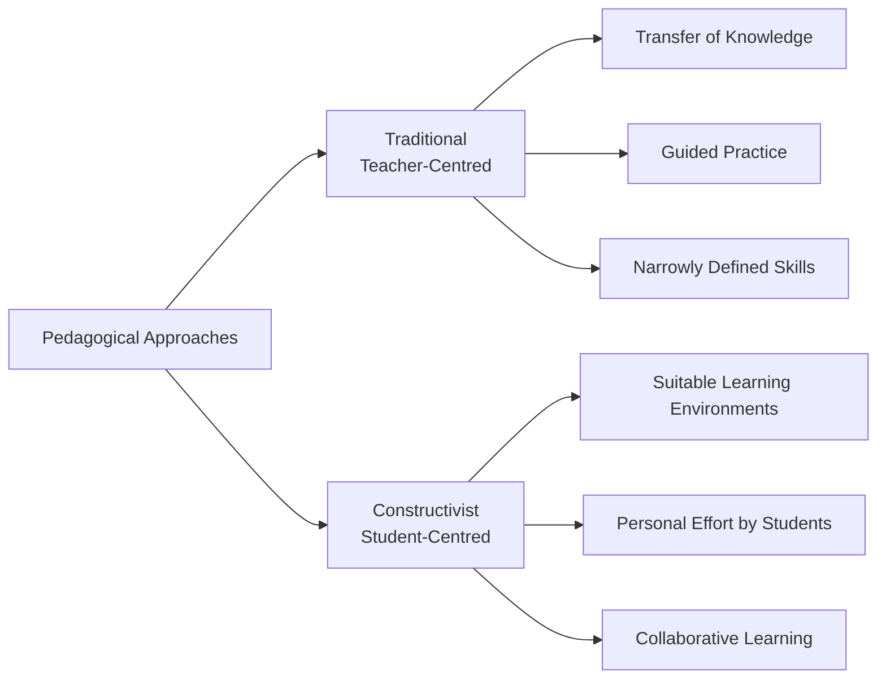
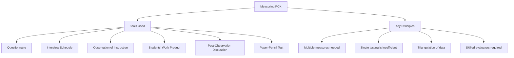

# 1. PEDAGOGICAL ANALYSIS (Part 3)
## Topics: 1.8 - 1.11

---

## 1.8 Software Pedagogy

### Online Teaching Software: The Basic Tools You Should Know About

Today, many colleges, universities, schools, and training centres have moved their teaching **online**. For many, this was the first time. Even as classrooms reopen, **hybrid teaching** (a mix of online and in-person) will continue. The success of online teaching depends on the **technology you choose** and how well teachers **learn to use it**.

---

### What to Look for in Online Teaching Software

The tools you need will depend on:

- The **size** of your class or school
- Your **role and subject**
- Any **special learning needs** of students
- Your **budget**

!!! important "Key Considerations When Choosing Software"
    - The software should be **easy to use**. This helps reduce stress about new technology.
    - Think about **each student's needs**, especially students with disabilities.
    - Good tools should **not only help you teach online**. They should help you with all your daily work.
    - Choose tools that **organize your day** and help you stay **connected and in control**.

---

### Essential Online Teaching Software

Many online teaching tools exist for different teaching styles. They work for different ages, needs, and abilities. These tools help with:

- **Communication** with colleagues and **video classrooms**
- Managing your **schedule**
- Keeping to your **work hours**

These tools are available for **individual teachers** and for **whole schools**.

---

#### Synchronous Virtual Classrooms

##### 1. Zoom — for Synchronous Video Lessons

!!! note "Zoom — Key Features"
    - A simple tool for **online classrooms** and meetings
    - The free version lets you host **up to 100 people** at once (more than Google Hangouts or Skype)
    - You can create **breakout rooms** for small group work
    - You can **share your screen** during lessons
    - Use **group chat** for side discussions during a lesson
    - You can easily **record calls**. This is useful for:
        - **Reviewing your own teaching** to improve it
        - **Sharing meetings** with colleagues who could not attend

---

##### 2. Google Classroom — for a Free LMS

!!! note "Google Classroom — Key Features"
    A **Learning Management System (LMS)** gives you one place for all your school's needs:

    - Admin documents
    - Reports and training
    - Lesson planning tools
    - Online lessons
    - Assignments

    Google Classroom uses **G Suite tools** like **Docs, Sheets, and Hangouts**. It helps you manage and deliver online teaching easily. It is a **free platform** from Google.

---

##### 3. Microsoft Teams — for a Connected Digital Learning Hub

!!! note "Microsoft Teams — Key Features"
    - Microsoft Teams is not called an LMS. But it offers **similar teaching tools** as Google Classroom.
    - It is also **free** to use.
    - It puts **conversations, content, and teamwork** in one place.
    - It is great for:
        - Creating **safe online classrooms**
        - Sharing **assignments and feedback**
        - Making **staff communication** easier

---

##### 4. Blackboard — for Top-of-the-Range Higher Education LMS

!!! note "Blackboard — Key Features"
    - An LMS **built for higher education**. It has a modern and easy-to-use design.
    - It creates **smooth, user-friendly online learning spaces** with special tools.
    - Features include:
        - **Blackboard Analytics for Learning** — helps find problems that stop students from succeeding
        - Tools to **keep students on track** and improve school performance
    - A great platform for **engaging online teaching**. It makes sure everyone gets the right support.

---

#### Asynchronous Support and Communication

##### 5. Slack — for Peer and Organization Communication

!!! note "Slack — Key Features"
    - **Clear, non-real-time communication** is the base of all remote teamwork.
    - Slack **gives everyone equal access** to conversations. People can reply when it suits their schedule.
    - Many remote teams have found that **email is not the best tool** for daily communication.
    - Slack organizes all team messages into **topic-based groups called threads**.
    - Staff can **join or leave** conversations that matter to them.
    - It is a great tool for building an **online community**:
        - Share **best practices**
        - Exchange **ideas**
        - Share **news and updates**
        - Simply **check in** on each other

---

### Summary: Essential Online Teaching Software

| Software | Type | Best For | Cost |
|---|---|---|---|
| **Zoom** | Live Virtual Classroom | Video lessons, breakout rooms, screen sharing | Free (up to 100 people) |
| **Google Classroom** | Free LMS | Admin, assignments, online lessons (G Suite tools) | Free |
| **Microsoft Teams** | Digital Learning Hub | Safe classrooms, assignments, staff communication | Free |
| **Blackboard** | Higher Education LMS | Learning analytics, student tracking, university use | Paid |
| **Slack** | Non-Real-Time Communication | Team community, topic threads, team updates | Free / Paid |

---

## 1.9 Pedagogical Beliefs and Attitudes of Computer Science Teachers

### Introduction

A teacher's **pedagogical beliefs and attitudes** strongly shape their **professional skills and teaching practice**. Many teacher training programs try to build pedagogical knowledge to **improve teaching quality**.

!!! important "Key Finding"
    Research shows that computer science teachers usually hold a **mix of traditional and constructivist beliefs**. These beliefs are linked to **personal background factors** or their **teacher training**.

---

### Relationship Between Beliefs and Practice

There is an important link between **what teachers believe**, **how they teach**, and **how well students learn**. Studying teachers' beliefs, attitudes, and **how they plan and make decisions** is very important *(Fang, 1996)*.

---

### Definition of Beliefs

!!! tip "Definition: Beliefs"
    **"Beliefs"** are **mental frameworks** that help teachers **understand their experiences** and **guide their teaching practices** *(Nespor, 1987; Pajares, 1992)*.

A teacher's beliefs are shaped by several things:

- The **culture of their subject area**
- Their **own experiences** as students in that subject
- Their **chances to reflect** on their teaching *(Fang, 1996)*

---

### Definition of Attitude

!!! tip "Definition: Attitude"
    **"Attitude"** is a person's **general feeling** — either **positive or negative** — towards another person or thing.

According to the **Theory of Reasoned Action** *(Ajzen & Fischbein, 1980)*:

- **Beliefs and attitudes shape how people behave**
- So, they strongly affect **how teachers teach** *(Kagan, 1992)*
- Studying teachers' beliefs and attitudes can **help us design better teacher training programs**

---

### Importance of Studying Pedagogical Beliefs

- Studying teachers' pedagogical beliefs is **very important for education**
- Research shows that teachers with **traditional beliefs** tend to use **lecture-based teaching methods**
- **Applefield** says we should help **trainee teachers** look at and **change their traditional beliefs**
- The goal is to help them use **constructivist teaching methods** when they start teaching

!!! important "ICT Integration"
    This also matters when we try to **use ICT in education**. Using ICT well requires **constructivist learning methods**.

---

### Traditional vs Constructivist Approaches

The link between teachers' beliefs and their use of **ICT for teaching** is important. **Becker** compared the traditional and constructivist approaches using **four areas**:

| Dimension | Traditional Approach | Constructivist Approach |
|---|---|---|
| **Curriculum** | Narrow focus on specific skills | Broad, connected learning spaces |
| **Teaching Approach** | Teacher-centred; teacher **gives knowledge** to students | Student-centred; teacher **creates good learning spaces** |
| **Student's Work** | Guided practice; students learn from direct teaching | Students **work on their own** to build understanding |
| **Assessment** | Standard exams; memorization | Group activities; meaningful communication tasks |

---

#### Traditional Teacher-Centred Approach

According to **Becker**, the traditional teacher-centred approach has these features:

- The teacher **gives knowledge and skills** to students
- Students learn through **carefully planned direct teaching** in a narrow subject area
- Students learn from **guided practice**

---

#### Constructivist Approach

The **constructivist approach** says something different:

- Understanding is **not simply given to students**. It does not come from just practising skills.
- Good constructivist teaching means the teacher **creates the right learning spaces**.
- In these spaces, students **work hard on their own** to build understanding.
- Students get the **chance to learn when and how to do things**.
- Students learn by **working together** in **meaningful activities** that matter to each of them.

---

### Constructivist Model — Expected Outcomes

With the constructivist model, students should learn to:

- **Deeply understand** a subject
- See **connections between different ideas and concepts**
- Know **when and how to use** their knowledge in real situations
- **Explain their ideas clearly** to others

---

### Consolidation of Constructivist Pedagogy

!!! note "Key Points"
    - Strengthening **constructivist pedagogy** is usually the goal of teacher training.
    - But the **current education system** (fixed syllabus, limited time, too much content, memorization for exams) **does not fit well** with student-centred teaching.
    - So, there is often a **gap** between what teachers believe and what they actually do.

---

### Change in Beliefs Over Time

- Teachers' beliefs and attitudes **change over the years** as they gain experience.
- New teachers tend to have **strong beliefs** (either traditional or constructivist).
- These beliefs **become weaker after a few years** of teaching.
- Teachers' beliefs seem to be **mostly unrelated** to their education studies or training programs.

---

## 1.10 Measuring Computer Science Pedagogical Content Knowledge

### Introduction

!!! tip "Definition: Pedagogical Content Knowledge (PCK)"
    **Pedagogical Content Knowledge (PCK)** is where three types of knowledge meet:

    - **Content** (the subject itself)
    - **Pedagogy** (how to teach)
    - **Context** (the learning situation and the students)

We can measure PCK best by **combining data from multiple sources**:

1. **Watching** teachers teach
2. **Interviewing** teachers
3. **Testing** their subject knowledge

---

### What is Pedagogical Content Knowledge?

**Shulman** described PCK as:

> *"That special amalgam of content and pedagogy that is uniquely the province of teachers, their own special form of professional understanding."*

!!! important "Shulman's Key Points on PCK"
    - PCK is the **one thing** that makes a teacher different from someone who just knows the subject. A teacher can **explain ideas** in ways students understand.
    - PCK helps people who don't know something **learn it**. It helps people who don't understand **gain understanding**. It helps beginners **become skilled**.

---

### PCK Explained with an Example

**Pedagogical Content Knowledge** is the difference between how a **lab chemist** and a **chemistry teacher** would teach a chemistry lesson:

| Aspect | Laboratory Chemist | Chemistry Teacher (with PCK) |
|---|---|---|
| **Knowledge** | Can tell students about the topic | Plans the lesson based on **who the students are** |
| **Planning** | Little teaching planning | Thinks about **what students need to learn** and **the best way to teach it** |
| **During Teaching** | Just delivers content | **Keeps checking if students are learning** and uses many teaching methods |
| **Techniques** | Few methods | Can **change explanations**, create **demos**, and give **examples students relate to** |
| **Goal** | Give information | **Help students truly understand** |

!!! tip "Foundation of PCK"
    The foundation of PCK is being able to **share knowledge with students in a way they understand**.

---

### Measuring Pedagogical Content Knowledge

Research shows a clear link between **PCK, good teaching, and student success**. So researchers have tried to **measure PCK**. They want to create **tools and methods** that help evaluate teachers.

---

#### Challenges in Measuring PCK

**PCK is complex** and hard to measure. Researchers have used different types of tools:

| Tool / Method | Description |
|---|---|
| **Questionnaire** | Written surveys |
| **Interview Schedule** | Planned interviews (structured or flexible) |
| **Observation of Instruction** | Watching teachers teach in real time |
| **Students' Work Product** | Looking at what students produce |
| **Observation of Teacher** | Watching teacher behaviour and choices |
| **Discussion on Student Learning** | Talking about student progress after a lesson |

Some researchers used **one or two tools**. Others used **many tools** together.

---

#### Tools and Methods for Measuring PCK

##### 1. Paper-Pencil Test

- Used along with **other methods**
- Can be given to **large groups**, so it is **widely useful**
- **Weakness**: It is better for testing **subject knowledge** than **teaching knowledge**

##### 2. Item Design

- **How you design test items matters** for good measurement
- Types of items used:
    - **Closed-ended questions** — students pick the correct answer from choices
    - **Open-ended questions** — can be useful if answered well
    - **Concept mapping**
    - **Comments / video recorded** sessions — creative ways to test understanding

##### 3. Observation of Instruction

- Gives **very useful information** about a teacher's PCK skills
- **Needs skilled, trained observers**

##### 4. Post-Observation Discussion

- Helps us understand **why teachers made certain teaching choices**
- Works best **after watching a teacher teach**
- The **discussion leaders need to be skilled** for good results
- Hiring skilled evaluators **costs more money**, which can be a problem

---

#### Shulman's Views on Measuring PCK

!!! important "Shulman's Expert Opinion"
    **Shulman**, an expert psychologist, said that:

    - **One single test cannot give a good evaluation**
    - We should use **many different tests and methods** to evaluate teachers' teaching skills
    - Just one evaluation **will not give the right answer**. It is **not enough**.

---

#### Key Conclusions on Measuring PCK

- **Measuring PCK** is a **common method** in educational research to evaluate teaching
- There is **no single best way** to measure PCK
- **Using many types of data together** gives better results
- **Researchers and school leaders** use PCK to study **how effective a teacher is**
- We need a **detailed approach** to measure PCK well

---

## 1.11 Test Items for Self Assessment

### I. Choose the Correct Answer

**1. A paradigm shift is**

- (a) New change in thinking and doing
- (b) Shifting equipment
- (c) Removing tools
- (d) None-of-these

---

**2. Flanders Interaction Analysis involves**

- (a) 3 categories
- (b) 5 categories
- (c) Teaching
- (d) 10 categories

---

**3. Critical pedagogy fosters**

- (a) Role memory
- (b) Discussion

---

!!! note "Note"
    The self-assessment questions continue beyond the available source material. Refer to the textbook for the complete set of questions.

---

## Summary of Key Concepts (1.8 – 1.10)

| Topic | Key Takeaway |
|---|---|
| **1.8 Software Pedagogy** | Online teaching needs the right tools. Zoom, Google Classroom, MS Teams, Blackboard, and Slack cover both live and non-live needs. |
| **1.9 Beliefs & Attitudes** | Teachers hold a mix of traditional and constructivist beliefs. These strongly affect how they teach and use ICT. |
| **1.10 Measuring PCK** | PCK is where content, teaching, and context meet. You need many tools and data sources to measure it well. |

---
