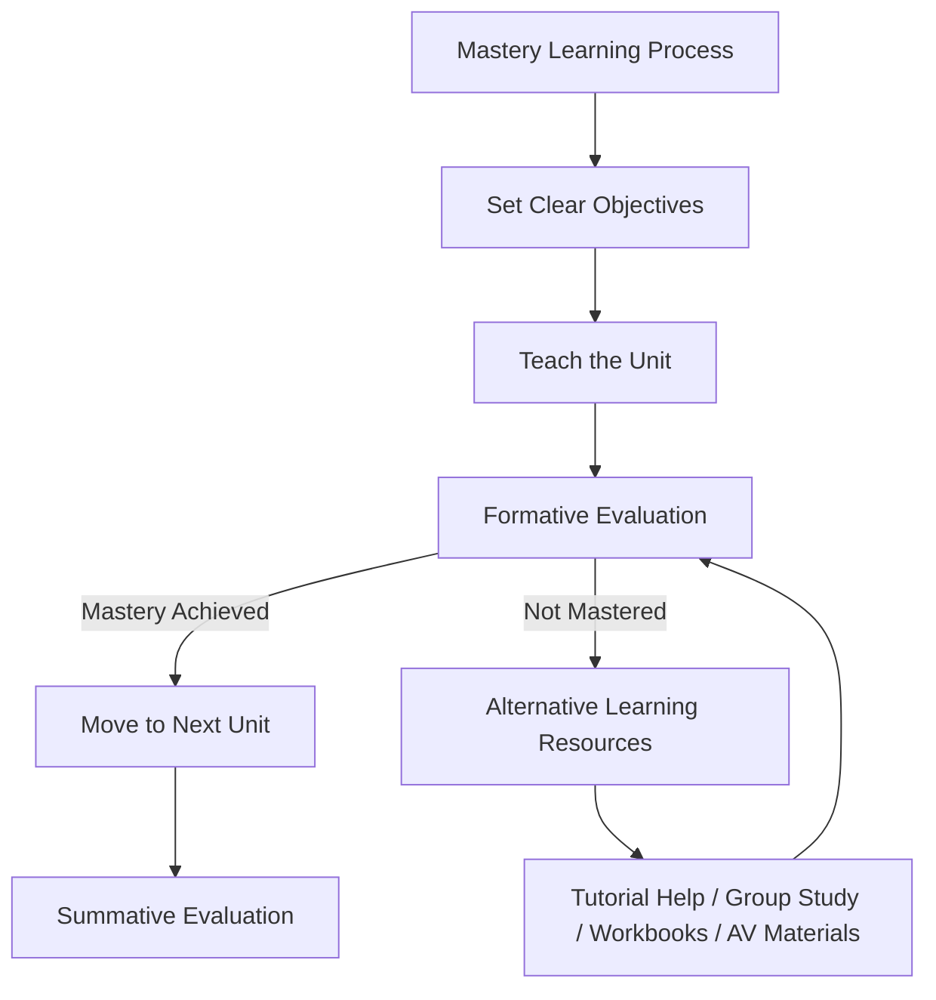
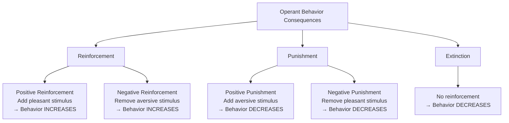
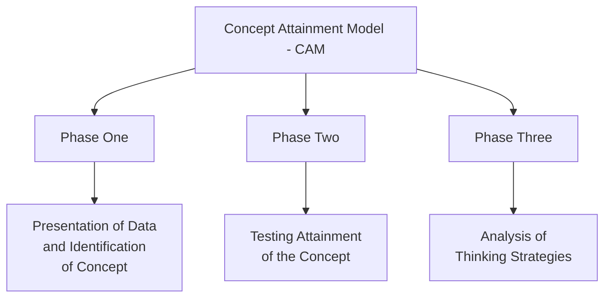
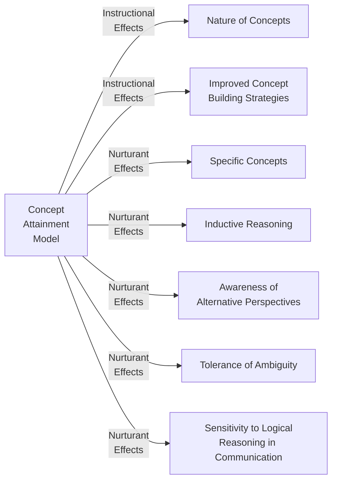
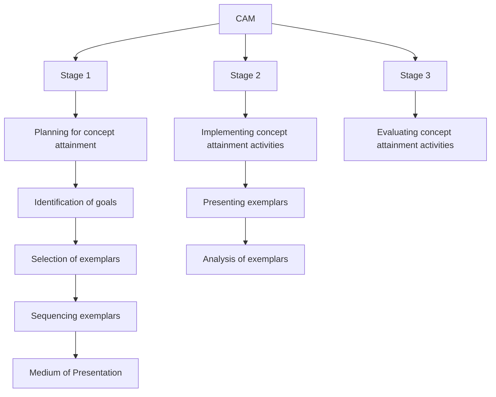

# 2. TEACHING MODELS (Part 1)
## Topics: 2.1 - 2.3

---

## 2.1 Bloom's Mastery Learning Model

### Introduction

**Mastery learning** (first called **"learning for mastery"**, also known as **"mastery-based learning"**) is a teaching method and idea about education. **Benjamin Bloom** first proposed it **in 1968**.

The main idea is simple: **students must reach a high level of understanding** (for example, 90% on a test) in one topic **before they move on** to the next topic.

- If a student does **not** pass the test, they get **extra help** to learn and review the material. Then they **take the test again**.
- This cycle repeats until the student reaches mastery. Only then can they **move to the next topic**.

!!! important "Key Idea"
    Mastery learning says that the **focus should be on how much time** each student needs to learn the same material. This is different from traditional teaching. Traditional teaching focuses on **differences in student ability**. It gives all students the same amount of time to learn.

In mastery learning, **responsibility shifts**. If a student fails, the problem is more about the teaching, not the student's ability. The challenge is to **give enough time and use the right teaching methods** so that all students can reach the same level.

---

### Definition

!!! note "Definition: Mastery Learning"
    Mastery learning is a set of **group-based, individualized teaching and learning methods**. It is based on the idea that students will reach a **high level of understanding** in any subject if they are given **enough time**.

---

### Motivation

Mastery learning was created to **reduce the gap** between high-performing and low-performing students in regular classrooms.

In the 1960s, **John B. Carroll** and **Benjamin S. Bloom** made these observations:

- If students have **different levels of natural ability** for a subject
- And if they all receive the **same teaching** (same quality and same time)
- Then their **results will also vary widely** — some will do well, others will not

**Mastery Learning says something different:**

> If each student gets **the best possible teaching** and **as much time as they need**, then **most students** can be expected to **reach mastery**.

---

### Mastery Learning Includes the Following Aspects

| No. | Aspect |
|-----|--------|
| 1 | **Baseline or diagnostic testing** — find out what students already know |
| 2 | **Clear learning goals**, with units arranged from easy to hard |
| 3 | **Active learning tasks** — e.g., practice, calculations, reading, data work. All tasks aim to meet the goals |
| 4 | A **minimum passing score** for each unit |
| 5 | **Formative testing** (small tests during learning) to check if students meet the passing score |
| 6 | **Moving to the next unit** only after reaching the mastery score |
| 7 | **More practice or study** on a unit until the student reaches the mastery score |

!!! tip "Bloom's Criticism of Normal Curve Grading"
    Many teachers use the **normal curve to give grades**. Bloom was against this. He said it makes teachers expect that some students will pass and others will fail. Bloom argued that if teaching is good, **results should not follow the normal curve**. Most students should do well.

Bloom created Mastery Learning to solve this problem. He believed that with his method, **more than 90 percent of students** would learn well. He also believed Mastery Learning would create **more interest and a better attitude** towards the subject, compared to regular classroom methods.

---

### Related Terms

#### Individualized Instruction

**Individualized instruction** shares some ideas with mastery learning. But it removes group activities. Instead, it lets **faster or more motivated students move ahead**. The teacher spends more time with students who need the most help.

#### Bloom's 2 Sigma

!!! note "Bloom's 2 Sigma Performance"
    **Bloom's 2 Sigma** is an important finding in education. It shows that a student who gets **one-to-one tutoring** (using mastery learning methods) performs **two standard deviations better** than students who learn in a regular classroom.

#### Competency-Based Learning

**Competency-based learning** is a way to test learning based on **skills decided in advance**. It takes ideas from mastery learning.

---

### Mastery Learning Strategies — LFM and PSI

The two main mastery learning methods are:

1. **Bloom's Learning For Mastery (LFM)**
2. **Keller's Personalized System of Instruction (PSI)**

- Bloom's method was designed for **schools**
- Keller's method was designed for **colleges and universities**
- Both work well in many settings. They are **strong methods for improving student results** in many subjects
- They share similar goals, but they are based on **different ideas from psychology**

---

### Learning For Mastery (LFM)

#### Variables of LFM

In 1968, Bloom believed that **most students can reach a high level of learning** if these conditions are met:

- Teaching is done **carefully and step by step**
- Students get help **when and where they struggle**
- Students get **enough time to reach mastery**
- There is a **clear standard** for what counts as mastery

!!! important "Key Point"
    Many different factors affect how well students learn and what results they get.

---

#### 1. Aptitude

**Aptitude** is measured by standard tests. In this context, it means:

> **"How much time a student needs to master a learning task."**

- Studies show that **most students can reach mastery**. But they need **different amounts of time**
- Bloom says that **1 to 5 percent** of students have a **special talent** for a subject (especially music and languages)
- About **5 percent** of students have a **special difficulty** with a subject
- For the **other 90% of students**, aptitude simply shows **how fast they learn**

!!! tip
    Bloom also says that aptitude **is not fixed**. It can be **changed by the environment** or by learning experiences at school or home.

---

#### 2. Quality of Instruction

**The quality of instruction** means how well the teacher **presents, explains, and organizes** the material for each student.

- Bloom says we must judge teaching quality by **its effect on each student**, not on the whole group
- In regular classrooms, students with high aptitude in math usually get high grades in algebra. But with **one-to-one tutoring at home**, this link is **almost zero**
- A good tutor finds the **best way to teach each student**. So most students can **master a subject** if they have a good tutor

---

#### 3. Ability to Understand Instruction

Bloom says the **ability to understand instruction** depends on the **type of task** and the **steps the student must follow**.

- **Verbal ability** and **reading comprehension** are closely linked to how well students do in school
- Since students **differ a lot** in their ability to understand, Bloom says teachers should **change their teaching style** and provide different tools to fit each student's needs

**Teaching tools that can help different students:**

- Alternative Textbooks
- Group Studies and Peer Tutoring
- Workbooks
- Programmed Instruction Units
- Audiovisual Methods
- Academic Games

These students get **helpful feedback** on their work. They are encouraged to **revise and redo** their work until they master the goal.

---

#### 4. Perseverance

**Perseverance** means how much time a student is **willing to spend** on learning. When teaching is good and easy to understand, students are more willing to keep trying.

---

#### 5. Time Allowed

**Time allowed** means the actual time a student has to learn. Bloom says that if students get the time they need, most of them can reach mastery.

---

### Preconditions

There are some things that must be in place **before** mastery learning can work:

1. The **goals and content** of teaching must be **clearly stated** for both students and the teacher
2. **Summative evaluation** (final test) standards should be set. Both teacher and student must **know what they need to achieve**
3. Bloom says using **fixed standards** instead of **comparing students to each other** helps students work together and reach mastery

---

### Operating Procedures

The operating procedures are the **methods used to give feedback and extra help** so that students can reach mastery.

The two main methods are:

1. **Formative Evaluation**
2. **Alternative Learning Resources**

---

#### Formative Evaluation

!!! note "Formative Evaluation = Small Tests for Each Lesson"
    Formative Evaluation in mastery learning is a **short progress test**. It checks whether the student has mastered the unit or not.

- Each unit covers a learning goal that takes about **one or two weeks** to teach
- Teachers give these small tests after each unit
- Bloom says the test results must be **followed by a plan to help** the student improve
- It is better to give results as **pass/not yet** instead of letter grades. Using grades on progress tests makes students accept less than mastery

---

#### Alternative Learning Resources

After the progress tests, students should get **clear feedback and specific tips** to help them work on their weak areas.

**Some helpful learning resources are:**

- **Small groups of students** (two or three) study and work together
- **Tutorial help**
- **Reviewing the lesson material again**
- **Reading different textbooks**
- **Using workbooks or programmed texts**
- **Using audio and video materials**

---

### Outcomes

The results of mastery learning fall into two groups:

1. **Cognitive Outcomes**
2. **Affective Outcomes**

#### Cognitive Outcomes

Cognitive outcomes are about **better knowledge and skills** in a subject.

- One study found that mastery learning **raised the number of students getting an A from 20% to 80%** (about two standard deviations better)
- By using test records for **quality control**, the teacher improved the methods. The next year, **90% of students got an A**

#### Affective Outcomes

Affective outcomes are about **feelings, confidence, and motivation**.

- Bloom says that when society (through education) recognizes a student's mastery, **big changes** happen in how the student **sees themselves and the world**
- The student starts to believe they can **handle problems well**
- They feel **more motivated** to learn the subject at a deeper level
- They have a **better mental state** because they feel less frustrated
- In today's world, where lifelong learning is needed, mastery learning can build a **lifelong love of learning**

---

---

## 2.2 Skinner's Operant Training

### Definition

!!! note "Definition: Operant Conditioning"
    **Operant conditioning or training** (also called **instrumental conditioning**) is a type of learning. In this process, a behavior becomes **stronger or weaker** based on **reinforcement or punishment**. It is also the method used to make this learning happen.

---

### Operant Conditioning vs Classical Conditioning

Both operant and classical conditioning involve behaviors shaped by things in the environment. But they are **different in important ways**.

| Feature | Operant Conditioning | Classical Conditioning |
|---------|---------------------|----------------------|
| **Type of behavior** | **Voluntary** (chosen actions) | **Involuntary** (automatic reflexes) |
| **Control** | Behavior is controlled by **what happens after it** (consequences) | Behavior is based on **linking two stimuli** together |
| **Response** | The person or animal **controls** the response | The response is **automatic** — triggered by a stimulus |
| **Choice** | The person or animal can **choose** (e.g., open a box or pet a puppy) | No choice — it is automatic (e.g., mouth waters at the sight of sweets) |
| **Reinforcement** | Behavior is shaped by **consequences** | Consequences do **not** shape the behavior |
| **Example** | A child learns to open a box to get sweets; the box is a "signal stimulus" | Seeing sweets makes the mouth water; a door slam signals an angry parent and causes shaking |
| **Complexity** | Better explains **complex human behavior** — looks at causes and effects of chosen actions | Too **simple** to explain complex human behavior (according to Skinner) |

!!! tip
    Both types of learning can change behavior. For example, a picture of sweets on a box (classical conditioning) can make a child want to open the box (operant conditioning). Research shows this **helps** when operant behavior has errors.

- In the 20th century, scientists studied animal learning mainly through these **two types of learning**
- They are still central to **behavior analysis**
- They have also been used in **social psychology** to explain things like the **false consensus effect**

---

### B.F. Skinner (1904–1990)

**B.F. Skinner** is called the **"Father of Operant Conditioning"**. His work is widely used in this field.

**Key works and contributions:**

- **1938** — Published *"The Behavior of Organisms: An Experimental Analysis"*. This started his lifelong study of operant conditioning in humans and animals
- He followed the ideas of **Ernst Mach**. He rejected **Thorndike's use of hidden mental states** like satisfaction. Instead, he focused on **behavior you can see** and its **results you can observe**
- Skinner believed **classical conditioning was too simple** to explain human behavior. He thought **operant conditioning** was better because it looks at the **causes and effects of chosen behavior**
- **1948** — Published *"Walden Two"*. This is a story about a peaceful, happy community built on his conditioning ideas
- **1957** — Published *"Verbal Behavior"*. This applied operant conditioning to **language**. Before this, language was studied very differently by language experts
- Skinner created new terms like **"mands"** and **"tacts"** to describe parts of language. But he used no new rules. He treated speech like any other behavior shaped by its results, including how listeners react

---

### Concepts and Procedures

#### Origins of Operant Behavior: Operant Variability

- Operant behavior is **"produced"** by the person or animal. At first, **no specific trigger causes it**
- So we can ask: why does it happen at all?
- The answer is similar to **Darwin's explanation** for new body parts: **variation and selection**
- A person's behavior **changes from moment to moment** — in the exact movements, the force used, or the timing
- Behaviors that lead to **reinforcement get stronger**. If reinforcement is steady, the behavior stays stable
- But the **differences in behavior can also be changed** by controlling certain factors

---

#### Modifying Operant Behavior: Reinforcement and Punishment

!!! important "Core Tools"
    **Reinforcement** and **punishment** are the main tools for changing operant behavior. We define these terms by their **effect on behavior**. Each can be **positive or negative**.

| Type | Effect on Behavior |
|------|-------------------|
| **Positive Reinforcement** | **Increases** the chance of a behavior |
| **Negative Reinforcement** | **Increases** the chance of a behavior |
| **Positive Punishment** | **Decreases** the chance of a behavior |
| **Negative Punishment** | **Decreases** the chance of a behavior |
| **Extinction** | **Decreases** the chance of a behavior |

---

#### Extinction

!!! note "Extinction"
    **Extinction** happens when a behavior that was reinforced before is **no longer reinforced**. Without reinforcement, the behavior **happens less and less**.

- If reinforcement was given **only sometimes**, it takes **even longer** for the behavior to stop. The person or animal keeps trying because they learned that rewards come after many tries
- This is different from when reinforcement was given **every time** before it stopped

---

### The Skinner Box

To test his ideas, Skinner invented the **operant conditioning chamber**, or **"Skinner Box"**. In this box, animals like pigeons and rats were kept alone. They were exposed to **carefully controlled conditions**.

- Unlike **Thorndike's puzzle box**, the Skinner Box let the animal make **one or two simple actions** that could be repeated
- How often the animal responded became **Skinner's main way to measure behavior**
- He also invented the **cumulative recorder**. This made a graph showing how fast the animal responded
- Skinner and his team used these records to study how **different reinforcement schedules** affected behavior

!!! note "Reinforcement Schedule"
    A reinforcement schedule is **"any method that gives reinforcement to an animal or person following a clear rule"**. Studying these schedules gave Skinner the key findings for his theory of operant conditioning.

---

### Five Consequences of Operant Conditioning

#### 1. Positive Reinforcement

**Positive reinforcement** happens when a behavior is **rewarded**. A pleasant result follows the behavior. This **increases how often** the behavior happens.

> **Example:** A rat in a Skinner box gets **food** when it presses a lever. So it presses the lever more often. This is usually just called **"reinforcement"**.

---

#### 2. Negative Reinforcement

**Negative reinforcement** happens when a behavior leads to the **removal of something unpleasant**. This **increases** how often the behavior happens.

> **Example:** There is a **loud noise** inside the Skinner Box. The rat presses a lever and the **noise stops**. So the rat presses the lever more often.

---

#### 3. Positive Punishment

**Positive punishment** (also called **"punishment by adding something unpleasant"**) happens when a behavior is followed by an **unpleasant result**.

> **Example:** A child feels **pain from a spanking**. This makes the child **less likely** to repeat that behavior.

!!! tip
    The name "positive punishment" is confusing. So people usually just call it **"punishment"**.

---

#### 4. Negative Punishment (Penalty)

**Negative punishment** (also called **"punishment by taking something away"**) happens when a behavior is followed by **losing something pleasant**.

> **Example:** A parent takes away a **child's toy** after bad behavior. The child is **less likely** to repeat that behavior.

---

#### 5. Extinction

**Extinction** happens when a behavior that was rewarded before **no longer gets a reward**.

> **Example:** A rat gets food many times for pressing a lever. Then the food stops coming. The rat **presses less and less, then stops**. We say the lever pressing has been **extinguished**.

---

### Summary Table: Five Consequences

| # | Consequence | What Happens | Effect on Behavior | Example |
|---|------------|--------------|-------------------|---------|
| 1 | **Positive Reinforcement** | Pleasant stimulus **added** | Behavior **increases** | Rat gets food for pressing lever |
| 2 | **Negative Reinforcement** | Unpleasant stimulus **removed** | Behavior **increases** | Rat presses lever to turn off loud noise |
| 3 | **Positive Punishment** | Unpleasant stimulus **added** | Behavior **decreases** | Pain from spanking |
| 4 | **Negative Punishment** | Pleasant stimulus **removed** | Behavior **decreases** | Taking away child's toy |
| 5 | **Extinction** | Reinforcement **stopped** | Behavior **decreases** | Rat stops pressing lever when food stops |

---

## 2.3 Bruner's Concept Attainment Model

### Definition

!!! note "Definition"
    The **Concept Attainment Model** was created by **Jerome Bruner**. In this model, a student must **figure out the features of a category** that the teacher already has in mind. The student does this by **comparing and contrasting examples** (called **exemplars**). Some examples have the features (called **attributes**) of the concept. Other examples **do not have** those features.

---

### Exemplars

Exemplars are a **selected group of items** from a larger set of data.

- The **category** is the group of examples that **share one or more features** that the other examples do not have
- Students learn the concept by **comparing the positive exemplars** (yes examples) and **contrasting them with the negative ones** (no examples)

---

### COMPONENTS OF CONCEPT ATTAINMENT MODEL

#### (a) Syntax

The Concept Attainment Model has **three phases**:

##### Phase One: Presentation of Data and Identification of Concept

- The teacher shows **labeled examples** (positive and negative)
- Students **compare features** in positive and negative examples
- Students **make and test guesses** (hypotheses)
- Students state a **definition** based on the key features

##### Phase Two: Testing Attainment of the Concept

- Students **sort new unlabeled examples** as yes or no
- The teacher **checks the guesses**, names the concept, and **restates the definition** using the key features
- Students **create their own examples**

##### Phase Three: Analysis of Thinking Strategies

- Students **describe how they thought**
- Students discuss the **role of guesses and features**
- Students discuss the **type and number of guesses** they made

---

#### Phases of Concept Attainment Model (Table)

| Phase | Outline | Activity |
|-------|---------|----------|
| **Phase One** | Presentation of Data and Identification of Concept | 1. Teacher shows labeled examples. 2. Students compare features in positive and negative examples. 3. Students make and test guesses. 4. Students state a definition based on key features. |
| **Phase Two** | Testing Attainment of the Concept | Students sort new unlabeled examples as yes or no. Teacher checks guesses, names the concept, and restates the definition. Students create their own examples. |
| **Phase Three** | Analysis of Thinking Strategies | Students describe how they thought. Students discuss the role of guesses and features. Students discuss the type and number of guesses. |

---

---

#### (b) Social System

Before teaching with the Concept Attainment Model, the teacher:

1. **Chooses the concept**
2. **Selects and organizes** the material into **positive and negative examples**
3. **Puts the examples in order** (sequences them)

The **three main jobs** of the teacher during concept attainment are:

1. **Record** student answers
2. **Give hints** (prompt/cue) to students
3. **Show more examples**

---

#### (c) Principle of Reaction

- During the lesson, the teacher should **support the students' guesses** (hypotheses)
- In the **later phase**, the teacher helps students **think about their concepts and their thinking methods**. The teacher stays supportive throughout

---

#### (d) Support System

- Concept Attainment lessons need **positive and negative exemplars** to be shown to students
- The **data sources are prepared in advance** and the **features are easy to see**
- When students see an example, they **list its features (attributes)**. These can then be **written down**

---

#### (e) Instructional and Nurturant Effects

The **Concept Attainment Model** is designed to teach:

- **Specific concepts** and the **nature of concepts** in general

With abstract concepts, the model also builds:

| Type | Effects |
|------|---------|
| **Instructional Effects** | Understanding the nature of concepts; Better concept-building skills |
| **Nurturant Effects** | Specific concepts; Thinking from evidence (inductive reasoning); Seeing other viewpoints; Comfort with unclear situations; Careful logical thinking in communication |

---

---

#### Diagrammatic Representation of Strategies of CAM

---

!!! tip "Quick Revision: Key Differences"
    | Model | Proponent | Core Idea |
    |-------|-----------|-----------|
    | **Mastery Learning** | Benjamin Bloom (1968) | All students can master content if given enough **time and quality instruction** |
    | **Operant Training** | B.F. Skinner (1938) | Behavior is modified through **reinforcement and punishment** |
    | **Concept Attainment** | Jerome Bruner | Students learn concepts by **comparing positive and negative exemplars** |
