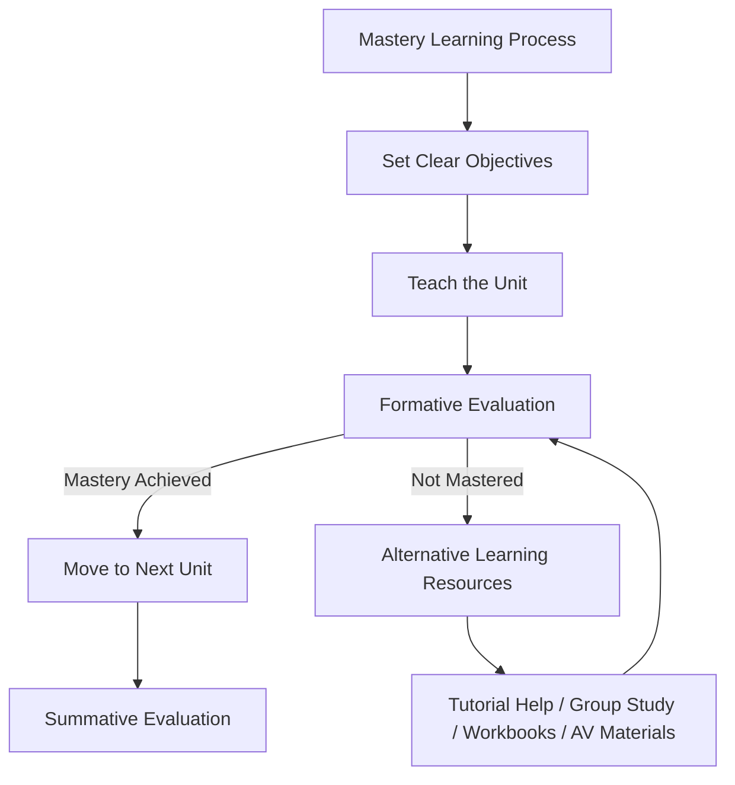
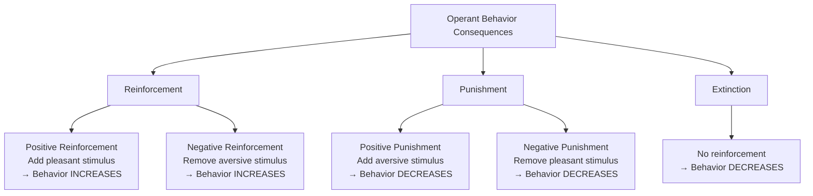
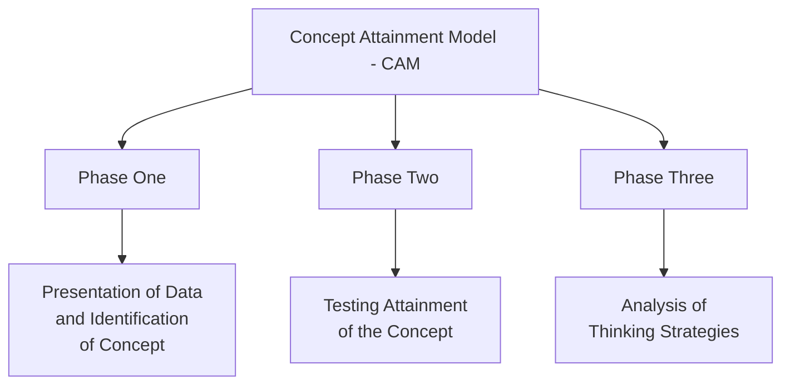
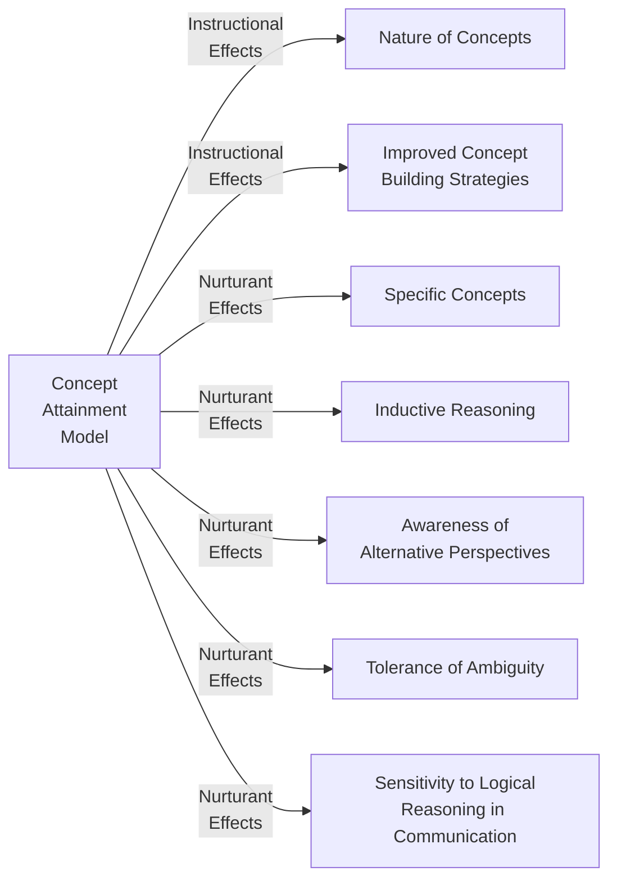
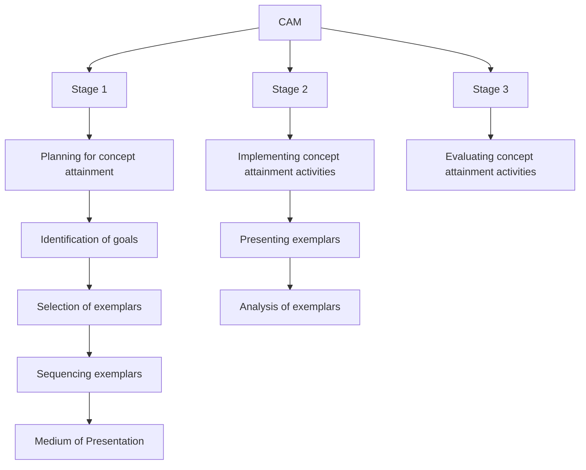

# 2. TEACHING MODELS (Part 1)
## Topics: 2.1 - 2.3

---

## 2.1 Bloom's Mastery Learning Model

### Introduction

**Mastery learning** (or, as it was initially called, **"learning for mastery"**, also known as **"mastery-based learning"**) is an instructional strategy and educational philosophy, first proposed by **Benjamin Bloom in 1968**.

Mastery learning maintains that **students must achieve a level of mastery** (e.g., 90% on a knowledge test) in prerequisite knowledge **before moving forward** to learn subsequent information.

- If a student does **not** achieve mastery on the test, they are given **additional support** in learning and reviewing the information and then **tested again**.
- This cycle continues until the learner accomplishes mastery, and they may then **move on to the next stage**.

!!! important "Key Idea"
    Mastery learning methods suggest that the **focus of instruction should be the time required** for different students to learn the same material and achieve the same level of mastery. This is in contrast with classic models of teaching, which focus more on **differences in students' ability** and where all students are given approximately the same amount of time to learn the same set of instructions.

In mastery learning, there is a **shift in responsibilities**, so that student's failure is more due to the instruction and not necessarily lack of ability on his or her part. Therefore, in a mastery learning environment, the challenge becomes **providing enough time and employing instructional strategies** so that all students can achieve the same level of learning.

---

### Definition

!!! note "Definition: Mastery Learning"
    Mastery learning is a set of **group-based, individualized teaching and learning strategies** based on the premise that students will achieve a **high level of understanding** in a given domain if they are given **enough time**.

---

### Motivation

The motivation for mastery learning comes from trying to **reduce achievement gaps** for students in average school classrooms.

During the 1960s, **John B. Carroll** and **Benjamin S. Bloom** pointed out that:

- If students are **normally distributed** with respect to aptitude for a subject
- And if they are provided **uniform instruction** (in terms of quality and learning time)
- Then **achievement level** at completion of the subject is also expected to be **normally distributed**

**Mastery Learning approaches propose that:**

> If each learner were to receive **optimal quality of instruction** and **as much learning time as they require**, then a **majority of students** could be expected to **attain mastery**.

---

### Mastery Learning Includes the Following Aspects

| No. | Aspect |
|-----|--------|
| 1 | **Baseline or diagnostic testing** |
| 2 | **Clear learning objectives**, sequenced units usually increasing in difficulty |
| 3 | **Engagement in educational activities** — e.g., deliberate skills practice, calculations, data interpretation, reading. All these are focused on reaching the objectives |
| 4 | A set **minimum passing standard** (Test score) for each educational unit |
| 5 | **Formative testing** to gauge unit completion at preset minimum passing standard for mastery |
| 6 | **Advancement to the next educational unit** given measured achievement at or above the mastery standard |
| 7 | **Continued practice or study** on an educational unit until the mastery standard is reached |

!!! tip "Bloom's Criticism of Normal Curve Grading"
    In many situations, educators preemptively use the **normal curve for grading** students. Bloom was critical of this usage, condemning it because it creates expectation by the teachers that some students will naturally be successful while others will not. Bloom defended that, if educators are effective, the **distribution of achievement could and should be very different** from the normal curve.

Bloom proposed Mastery Learning as a way to address this. He believed that by using his approach, the **majority of students (more than 90 percent)** would achieve successful and rewarding learning. As an added advantage, Mastery Learning was also thought to create **more positive interest and attitude** towards the subject learned if compared with usual classroom methods.

---

### Related Terms

#### Individualized Instruction

**Individualized instruction** has some elements in common with mastery learning, although it dispenses with group activities in favor of allowing **more capable or more motivated students to progress ahead** of others while maximizing teacher interaction with those students who need the most assistance.

#### Bloom's 2 Sigma

!!! note "Bloom's 2 Sigma Performance"
    **Bloom's 2 Sigma** is an educational phenomenon observed where the average student tutored **one-to-one** (using mastery learning techniques) performed **two standard deviations better** than students who learned via conventional instructional methods.

#### Competency-Based Learning

**Competency-based learning** is a framework for the assessment of learning based on **predetermined competencies**. It draws inspiration from mastery learning.

---

### Mastery Learning Strategies — LFM and PSI

Mastery learning strategies are best represented by:

1. **Bloom's Learning For Mastery (LFM)**
2. **Keller's Personalized System of Instruction (PSI)**

- Bloom's approach was focused in the **school room**
- Keller developed his system for **higher education**
- Both have been applied in many different contexts and have been found to be very **powerful methods for increasing student performance** in a wide range of activities
- Despite sharing some commonalities in terms of goals, they are built on **different psychological principles**

---

### Learning For Mastery (LFM)

#### Variables of LFM

Bloom, when first proposing his mastery learning strategy in 1968, was convinced that **most students can attain a high level of learning capability** if the following conditions are available:

- Instruction is approached **sensitively and systematically**
- Students are helped **when and where they have learning difficulties**
- Students are given **sufficient time to achieve mastery**
- There is some **clear criterion** of what constitutes mastery

!!! important "Key Point"
    Many variables will influence achievement levels and learning outcomes.

---

#### 1. Aptitude

**Aptitude**, measured by standard aptitude tests, in this context is interpreted as:

> **"The amount of time required by the learner to attain mastery of a learning task."**

- Several studies show that **majority of students can achieve mastery** in a learning task, but the **time that they need to spend on it is different**
- Bloom argues that there are **1 to 5 percent** of students who have **special talent** for learning a subject (especially music and foreign languages)
- There are also around **5 percent** of students who have **special disability** for learning a subject
- For the **other 90% of students**, aptitude is merely an **indicator of the rate of learning**

!!! tip
    Additionally, Bloom argues that aptitude for a learning task **is not constant** and can be **changed by environmental conditions** or learning experience at school or home.

---

#### 2. Quality of Instruction

**The quality of instruction** is defined as the degree to which the **presentation, explanation, and ordering** of elements of the task to be learned approach the **optimum for a given learner**.

- Bloom insists that the quality of instruction has to be **evaluated according to its effect on individual students** rather than on random groups of students
- Bloom shows that while in traditional classrooms the relationship between students' aptitude test for mathematics and their final grade in algebra is very high, this relationship is **almost zero** for students receiving **tutorial instruction** in the home
- He argues that a good tutor tries to find the **quality of learning best fit** to the given students, thus the majority of students would be able to **master a subject** if they have access to a good tutor

---

#### 3. Ability to Understand Instruction

According to Bloom, the **ability to understand instruction** is defined as the **nature of the task** that a learner is to learn and the **procedure that the learner is to follow**.

- **Verbal ability** and **reading comprehension** are two language abilities that are highly related to student achievements
- Since the ability to understand instruction **varies significantly** among students, Bloom recommends that teachers **modify their instruction**, provide help, and teaching aids to fit the needs of different students

**Teaching aids that could be provided according to the ability of the learner:**

- Alternative Textbooks
- Group Studies and Peer Tutoring
- Workbooks
- Programmed Instruction Units
- Audiovisual Methods
- Academic Games

These students will receive **constructive feedback** on their work and will be encouraged to **revise and revisit** their assignment until the objective is mastered.

---

#### 4. Perseverance

**Perseverance** refers to the amount of time a student is **willing to spend** on learning. If the quality of instruction and ability to understand are adequate, perseverance is expected to increase.

---

#### 5. Time Allowed

**Time allowed** refers to the actual time available for learning. Bloom argues that if students are given the time they need, most can achieve mastery.

---

### Preconditions

There are some **preconditions** for the process of mastery learning:

1. **Objectives and content** of instruction have to be **specified and clarified** to both the students and the teacher
2. **Summative evaluation criteria** should be developed and both the teacher and the learner should be **clear about the achievement criteria**
3. Bloom suggests that using **absolute standards** rather than **competitive criteria** helps students to collaborate and facilitates mastery

---

### Operating Procedures

The operating procedures are the **methods used to provide detailed feedback and instructional help** to facilitate the process of mastery in learning.

The main operating procedures are:

1. **Formative Evaluation**
2. **Alternative Learning Resources**

---

#### Formative Evaluation

!!! note "Formative Evaluation = Small Tests for Each Lesson"
    Formative Evaluation in the context of mastery learning is a **diagnostic progress test** to determine whether or not the student has mastered the subject unit.

- Each unit is usually a learning outcome that could be taught in **a week or two** of learning activity
- The formative tests are administered at the learning units
- Bloom insists that the diagnostic process has to be **followed by a prescription**
- The result of formative assessment is better to express in **not-grade format** since the use of grades on repeated progress evaluations prepare students for accepting a level of learning less than mastery

---

#### Alternative Learning Resources

The progress tests should be followed by **detailed feedback and specific suggestions** so that the students could work on their difficulties.

**Some of the alternative learning resources are:**

- **Small groups of students** (two or three) meet and work together
- **Tutorial help**
- **Reviewing the instructional material**
- **Reading alternative textbooks**
- **Using workbook or programmed texts**
- **Using selected audiovisual materials**

---

### Outcomes

The outcomes of mastery learning could be summarized into two groups:

1. **Cognitive Outcomes**
2. **Affective Outcomes**

#### Cognitive Outcomes

The cognitive outcomes of mastery learning are mainly related to **increase in student excellence** in a subject.

- According to one study, applying the strategies of mastery learning in a class resulted in the **increase of students with the grade of A from 20 percent to 80 percent** (about two standard deviations)
- Using the formative evaluation records as a base for **quality control** helped the teacher to improve the strategies and **increase the percent of students with grade of A to 90%** in the following year

#### Affective Outcomes

Affective outcomes of mastery are mainly related to the sense of **self-efficacy and confidence** in the learners.

- Bloom argues that when the society (through education system) recognizes a learner's mastery, **profound changes** happen in his or her **view of self and the outer world**
- The learner would start believing that he or she is able to **adequately cope with problems**
- Would have **higher motivation** for learning the subject in a higher level of expertise
- Would have a **better mental state** due to less feeling of frustration
- In a modern society that lifelong learning is a necessity, mastery learning can develop a **lifelong interest and motivation** in learning

---

---

## 2.2 Skinner's Operant Training

### Definition

!!! note "Definition: Operant Conditioning"
    **Operant conditioning or training** (also called **instrumental conditioning**) is a type of **associative learning process** through which the strength of a behavior is modified by **reinforcement or punishment**. It is also a procedure that is used to bring about such learning.

---

### Operant Conditioning vs Classical Conditioning

Although operant and classical conditioning both involve behaviors controlled by environmental stimuli, they **differ in nature**.

| Feature | Operant Conditioning | Classical Conditioning |
|---------|---------------------|----------------------|
| **Type of behavior** | **Voluntary** (operants) | **Involuntary** (reflexes) |
| **Control** | Behavior controlled by **external stimuli** (consequences) | Behavior based on **pairing of stimuli** with biologically significant events |
| **Response** | Responses are under the **control of the organism** | Responses are **reflexes, automatically elicited** by appropriate stimuli |
| **Choice** | Organism can **choose** (e.g., open a box or pet a puppy) | No choice — automatic (e.g., salivation at sight of sweets) |
| **Reinforcement** | Reinforced by **consequences** | **Not** reinforced by consequences |
| **Example** | A child learns to open a box to get sweets; the box is a "discriminative stimulus" | Sight of sweets causes salivation; door slam signals angry parent causing trembling |
| **Complexity** | Better describes **complex human behavior** — examines causes and effects of intentional behavior | Too **simplistic** to describe complex human behavior (according to Skinner) |

!!! tip
    However, both kinds of learning can affect behavior. Classically conditioned stimuli — for example, a picture of sweets on a box — might enhance operant conditioning by encouraging a child to approach and open the box. Research has shown this to be a **beneficial phenomenon** in cases where operant behavior is error-prone.

- The study of animal learning in the 20th century was dominated by the analysis of these **two sorts of learning**
- They are still at the core of **behavior analysis**
- They have also been applied to the study of **social psychology**, helping to clarify certain phenomena such as the **false consensus effect**

---

### B.F. Skinner (1904–1990)

**B.F. Skinner** is referred to as the **"Father of Operant Conditioning"**, and his work is frequently cited in connection with this topic.

**Key works and contributions:**

- **1938** — Published *"The Behavior of Organisms: An Experimental Analysis"*, which initiated his lifelong study of operant conditioning and its application to human and animal behavior
- Following the ideas of **Ernst Mach**, Skinner rejected **Thorndike's reference to unobservable mental states** such as satisfaction, building his analysis on **observable behavior** and its equally observable consequences
- Skinner believed that **classical conditioning was too simplistic** to describe something as complex as human behavior. **Operant conditioning**, in his opinion, better described human behavior as it examined **causes and effects of intentional behavior**
- **1948** — Published *"Walden Two"*, a fictional account of a peaceful, happy, productive community organized around his conditioning principles
- **1957** — Published *"Verbal Behavior"*, which extended the principles of operant conditioning to **language**, a form of human behavior that had previously been analyzed quite differently by linguists and others
- Skinner defined new **functional relationships** such as "mands" and "tacts" to capture some essentials of language, but he introduced no new principles, treating verbal behavior like any other behavior controlled by its consequences, which included the reactions of the speaker's audience

---

### Concepts and Procedures

#### Origins of Operant Behavior: Operant Variability

- Operant behavior is said to be **"emitted"**: that is, initially it is **not elicited by any particular stimulus**
- Thus one may ask why it happens in the first place
- The answer to this question is like **Darwin's answer** to the question of the origin of a "new" bodily structure, namely **variation and selection**
- Similarly, the behavior of an individual **varies from moment to moment**, in such aspects as the specific motions involved, the amount of force applied, or the timing of the response
- Variations that lead to **reinforcement are strengthened**, and if reinforcement is consistent, the behavior tends to remain stable
- However, the **behavioral variability can itself be altered** through the manipulation of certain variables

---

#### Modifying Operant Behavior: Reinforcement and Punishment

!!! important "Core Tools"
    **Reinforcement** and **punishment** are the core tools through which operant behavior is modified. These terms are defined by their **effect on behavior**. Either may be **positive or negative**.

| Type | Effect on Behavior |
|------|-------------------|
| **Positive Reinforcement** | **Increases** the probability of a behavior |
| **Negative Reinforcement** | **Increases** the probability of a behavior |
| **Positive Punishment** | **Decreases** the probability of a behavior |
| **Negative Punishment** | **Decreases** the probability of a behavior |
| **Extinction** | **Decreases** the probability of a behavior |

---

#### Extinction

!!! note "Extinction"
    **Extinction** occurs when a previously reinforced behavior is **no longer reinforced** with either positive or negative reinforcement. During extinction, the behavior **becomes less probable**.

- **Occasional reinforcement** can lead to an even **longer delay** before behavior extinction due to the learning factor of repeated instances becoming necessary to get reinforcement
- This is compared with reinforcement being given at each opportunity before extinction

---

### The Skinner Box

To implement his empirical approach, Skinner invented the **operant conditioning chamber**, or **"Skinner Box"**, in which subjects such as pigeons and rats were isolated and could be exposed to **carefully controlled stimuli**.

- Unlike **Thorndike's puzzle box**, this arrangement allowed the subject to make **one or two simple, repeatable responses**
- The rate of such responses became **Skinner's primary behavioral measure**
- Another invention, the **cumulative recorder**, produced a graphical record from which response rates could be estimated
- These records were the primary data that Skinner and his colleagues used to explore the effects on **response rate of various reinforcement schedules**

!!! note "Reinforcement Schedule"
    A reinforcement schedule may be defined as **"any procedure that delivers reinforcement to an organism according to some well-defined rule"**. The effects of schedules became, in turn, the basic findings from which Skinner developed his account of operant conditioning.

---

### Five Consequences of Operant Conditioning

#### 1. Positive Reinforcement

**Positive reinforcement** occurs when a behavior (response) is **rewarding** or the behavior is followed by another stimulus that is rewarding, **increasing the frequency** of that behavior.

> **Example:** If a rat in a Skinner box gets **food** when it presses a lever, its rate of pressing will go up. This procedure is usually called simply **"reinforcement"**.

---

#### 2. Negative Reinforcement

**Negative reinforcement** occurs when a behavior (response) is followed by the **removal of an aversive stimulus**, thereby **increasing** the original behavior's frequency.

> **Example:** In the Skinner Box experiment, the aversive stimulus might be a **loud noise** continuously inside the box; negative reinforcement would happen when the rat presses a lever to **turn off the noise**.

---

#### 3. Positive Punishment

**Positive punishment** (also referred to as **"punishment by contingent stimulation"**) occurs when a behavior (response) is followed by an **aversive stimulus**.

> **Example:** Pain from a **spanking**, which would often result in a **decrease** in that behavior.

!!! tip
    Positive punishment is a confusing term, so the procedure is usually referred to simply as **"punishment"**.

---

#### 4. Negative Punishment (Penalty)

**Negative punishment** (also called **"punishment by contingent withdrawal"**) occurs when a behavior (response) is followed by the **removal of a stimulus**.

> **Example:** Taking away a **child's toy** following an undesired behavior by him/her, which would result in a **decrease** in the undesirable behavior.

---

#### 5. Extinction

**Extinction** occurs when a behavior (response) that had previously been reinforced is **no longer effective**.

> **Example:** A rat is first given food many times for pressing a lever, until the experimenter no longer gives out food as a reward. The rat would typically **press less often, then stop**. Then lever pressing would be said to be **extinguished**.

---

### Summary Table: Five Consequences

| # | Consequence | What Happens | Effect on Behavior | Example |
|---|------------|--------------|-------------------|---------|
| 1 | **Positive Reinforcement** | Pleasant stimulus **added** | Behavior **increases** | Rat gets food for pressing lever |
| 2 | **Negative Reinforcement** | Aversive stimulus **removed** | Behavior **increases** | Rat presses lever to turn off loud noise |
| 3 | **Positive Punishment** | Aversive stimulus **added** | Behavior **decreases** | Pain from spanking |
| 4 | **Negative Punishment** | Pleasant stimulus **removed** | Behavior **decreases** | Taking away child's toy |
| 5 | **Extinction** | Reinforcement **stopped** | Behavior **decreases** | Rat stops pressing lever when food stops |

---

## 2.3 Bruner's Concept Attainment Model

### Definition

!!! note "Definition"
    **Concept Attainment Model** is given by **Jerome Bruner**. This model requires a student to **figure out the attributes of a category** that is already formed in another person's mind by **comparing and contrasting examples** (called **exemplars**) that contain the characteristics (called **attributes**) of the concepts with examples that **do not contain** those attributes.

---

### Exemplars

Essentially, the exemplars are a **subset of a collection of data** or a data set.

- The **category** is the subset or collection of examples that **share one or more characteristics** that are missing in the others
- It is by **comparing the positive exemplars** and **contrasting them with the negative ones** that the concept or category is learned

---

### COMPONENTS OF CONCEPT ATTAINMENT MODEL

#### (a) Syntax

The Concept Attainment Model has **three phases**:

##### Phase One: Presentation of Data and Identification of Concept

- Teacher presents **labeled examples** (positive and negative)
- Students **compare attributes** in positive and negative examples
- Students **generate and test hypotheses**
- Students state a **definition** according to the essential attributes

##### Phase Two: Testing Attainment of the Concept

- Students **identify additional unlabeled examples** as yes or no
- Teacher **confirms hypotheses**, names concepts, and **re-states definitions** according to essential attributes
- Students **generate examples**

##### Phase Three: Analysis of Thinking Strategies

- Students **describe thoughts**
- Students discuss the **role of hypotheses and attributes**
- Students discuss **type and number of hypotheses**

---

#### Phases of Concept Attainment Model (Table)

| Phase | Outline | Activity |
|-------|---------|----------|
| **Phase One** | Presentation of Data and Identification of Concept | 1. Teacher presents labeled examples. 2. Students compare attributes in positive and negative examples. 3. Students generate and test hypotheses. 4. Students state a definition according to the essential attributes. |
| **Phase Two** | Testing Attainment of the Concept | Students identify additional unlabeled examples as yes or no. Teacher confirms hypotheses, names concepts, and re-states definitions according to essential attributes. Students generate examples. |
| **Phase Three** | Analysis of Thinking Strategies | Students describe thoughts. Students discuss role of hypotheses and attributes. Students discuss type and number of hypotheses. |

---

---

#### (b) Social System

Prior to teaching with the Concept Attainment Model, the teacher:

1. **Chooses the concept**
2. **Selects and organizes** the material into **positive and negative examples**
3. **Sequences** the examples

The **three major functions** of the teacher during concept attainment activity are to:

1. **Record** student responses
2. **Prompt (cue)** students
3. **Present additional data**

---

#### (c) Principle of Reaction

- During the flow of the lesson, the teacher needs to be **supportive of the students' hypotheses**
- In the **later phase** of the model, the teacher turns the students' attention towards **analysis of their concepts and their thinking strategies**, again being very supportive

---

#### (d) Support System

- Concept Attainment lessons require that **positive and negative exemplars** be presented to the students
- The **data sources are known beforehand** and the **attributes are visible**
- When students are presented with an example, they **describe its characteristics (attributes)**, which can then be **recorded**

---

#### (e) Instructional and Nurturant Effects

**Concept Attainment Model** is designed for instruction on:

- **Specific concepts** and on the **nature of concepts**

With abstract concepts, the strategies nurture:

| Type | Effects |
|------|---------|
| **Instructional Effects** | Nature of concepts; Improved concept building strategies |
| **Nurturant Effects** | Specific concepts; Inductive reasoning; Awareness of alternative perspectives; Tolerance of ambiguity; Sensitivity to logical reasoning in communication |

---

---

#### Diagrammatic Representation of Strategies of CAM

---

!!! tip "Quick Revision: Key Differences"
    | Model | Proponent | Core Idea |
    |-------|-----------|-----------|
    | **Mastery Learning** | Benjamin Bloom (1968) | All students can master content if given enough **time and quality instruction** |
    | **Operant Training** | B.F. Skinner (1938) | Behavior is modified through **reinforcement and punishment** |
    | **Concept Attainment** | Jerome Bruner | Students learn concepts by **comparing positive and negative exemplars** |
