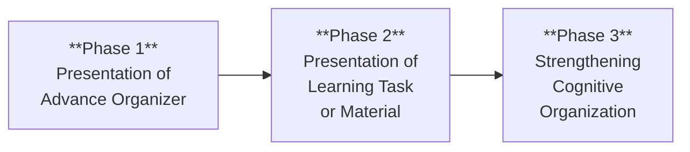
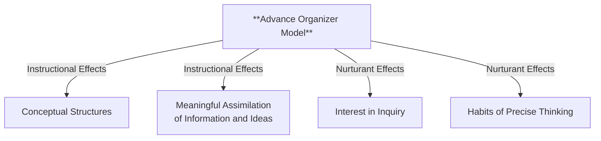
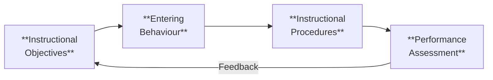
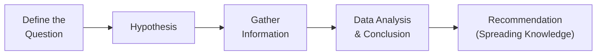
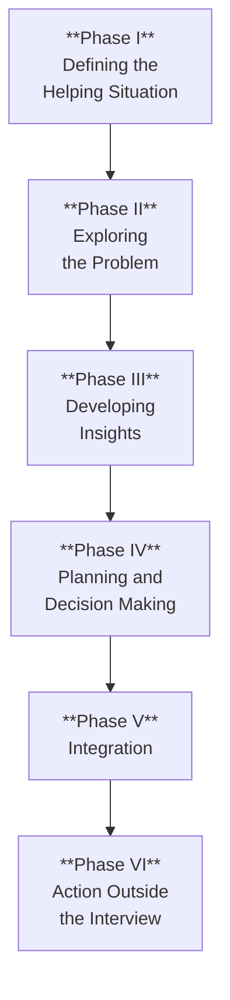
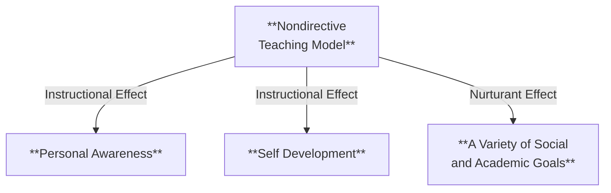

# 2. TEACHING MODELS (Part 2)
## Topics: 2.4 - 2.7

---

## 2.4 Ausubel's Advance Organizer Model

!!! note "Key Definition"
    **Advance Organizer Model (AOM)** is given by **David Ausubel**, who is one of the educational psychologists. His theory of **meaningful verbal learning** deals with **three concerns**.

### Meaningful Verbal Learning — Three Concerns

| # | Concern | Explanation |
|---|---------|-------------|
| 1 | **How knowledge is organized** | Curriculum content is organized; the mind works to process new information (learning) |
| 2 | **How the mind applies new material** | These ideas about how learners present and apply new material to instruction |
| 3 | **Strengthening cognitive structure** | This model is designed to strengthen the student's cognitive structure |

### Role of the Teacher

- The **teacher plays the role of organizer** of subject matter
- The teacher **presents information through lectures, readings** and provides tasks to the learner
- The teacher is responsible for **organizing and presenting material** so that the learner can integrate what is to be learned
- The **learner's primary role** is to **master ideas and information**
- The Advance Organizers provide **concepts and principles to the students directly**

!!! important "Ausubel's Key Principle"
    According to Ausubel, whether the material is meaningful or not depends **more on the prior knowledge of the learner** than on the organization of the material or the method of presentation.

### Cognitive Structures

- Ausubel maintains that **a person's existing cognitive structure is the foremost factor** in determining:
    - Whether new material will be **meaningful**
    - How well it can be **acquired and retained**
- There is a **parallel** between the way subject matter is organized and the way people organize knowledge in their minds (cognitive structures)

---

### Components of Advance Organizer Model

#### (a) Syntax

The Advance Organizer Model has **three phases** of activity:

| Phase | Name | Description |
|-------|------|-------------|
| **Phase 1** | **Presentation of Advance Organizer** | Presentation of the advance organizer to the learner |
| **Phase 2** | **Presentation of Learning Task** | Presentation of the learning task or learning material |
| **Phase 3** | **Strengthening Cognitive Organization** | Strengthening cognitive organization — relating the learning material to existing ideas to bring about an active learning process |

##### Details of Each Phase

**Phase 1 — Presentation of Advance Organizer:**

- Prompt awareness of **relevant knowledge**
- Provide a **conceptual organizer**
- Provide **guidelines for recognizing structural materials**

**Phase 2 — Presentation of Learning Task or Material:**

- **Present material**
- **Maintain attention**
- Make **organization explicit**
- Make **logical order of learning material explicit**

**Phase 3 — Strengthening Cognitive Organization:**

- Use **principles of integrative reconciliation**
- **Promote active reception learning**
- **Elicit critical approach** to subject matter
- **Clarify** concepts and relationships

---

#### (b) Social System

- In Advance Organizer Model, the **teacher retains control** of the intellectual structure
- The teacher's role is to **relate the learning material to the organizers**
- The teacher helps students **differentiate new material from previously learned material**
- This leads to the **successful acquisition** of material

#### (c) Principles of Reaction

- **Negotiation of meaning** and responses between the teacher and the learner clarifies the meaning of the new learning material with existing knowledge of the students
- **Mutual interaction** between teacher and learner responsively connects organizers and learning material

#### (d) Support System

- The effectiveness of the advance organizer depends on an **integral and appropriate relationship** between the **conceptual organizer and the content**
- This model provides **guidelines for recognizing structural materials**

#### (e) Instructional and Nurturant Effects

!!! tip "Instructional and Nurturant Effects of AOM"
    The **instrumental values** of this model are:

    - The **ideas themselves** that are used as the organizer are learned
    - **Information presented** to the students is retained effectively

---

### Diagrammatic Representation of Strategies of AOM

| Stage | Activity | Details |
|-------|----------|---------|
| **Stage 1** | Identification of goals | Selection of structures; Identification of attributes; Providing organizers |
| **Stage 2** | Presentation of organizers; Making learning material to organizers | Presenting organizers; Logical order of organizer; Repetition |
| **Stage 3** | Implementing cognitive organization; Evaluating concept attainment activities | Application of ideas; Reconciliation |

---

### Comparison: Concept Attainment Model and Advance Organizer Model

| Feature | Concept Attainment Model | Advance Organizer Model |
|---------|--------------------------|-------------------------|
| **Family** | Information Processing Family | Information Processing Family |
| **Approach** | Comparing Yes and No Examples | Classifying data into structures |
| **Given by** | Bruner | Ausubel |

---

## 2.5 Glaser's Basic Teaching Model

!!! note "Key Definition"
    **Glaser's Basic Teaching Model** was developed by **Robert Glaser** in **1962**. It explains the **relationship between teaching and learning**. It provides a **simple and adequate conceptualization** of the teaching process. This model belongs to the category of **psychological models of teaching**.

### Why This Teaching Model is Called "Basic"

- It is called **Basic Teaching Model** because it presents a **very basic analysis** of the process of teaching in terms of the **elements of teaching**
- This model applies to **all levels of education** — elementary, secondary, higher etc.
- It is also applied to **subject matter related to any subject** — a teacher can use this model for teaching any subject
- Teaching for **any length of time** (40 minutes, 1 hour, weeks etc.) is possible using this model

### Four Basic Components

It explains the whole teaching-learning process by dividing it into **four basic components**:

| # | Component | Description |
|---|-----------|-------------|
| 1 | **Instructional Objectives** | What the student should achieve |
| 2 | **Entering Behaviour** | What the student already knows |
| 3 | **Instructional Procedures** | How the teacher will teach |
| 4 | **Performance Assessment** | How learning will be measured |

### Assumptions of Basic Teaching Model

- It is developed on the assumption that **"every lesson assumes some knowledge on the part of the learner"**
- Through **instructional procedure**, the teacher guides the learner from **entry behavior to terminal behavior**

---

### Components of Basic Training Model

#### Step 1: Instructional Objectives

- The instructional objective is those objectives that the **student should attain upon completion** of a unit of instruction
- These objectives may be stated in **general, specific or in behavioral terms**
- For instruction to be **effective and systematic**, the instructional objectives are stated in **behavioral terms**
- Thereafter the instruction work is carried out to achieve the objectives keeping in view the **entering behavior** of the learner

#### Step 2: Entering Behaviour

- Entering behaviour refers to the **knowledge, skills, and abilities** that the learner already possesses before instruction begins
- The teacher must assess what the student **already knows** to plan instruction accordingly
- It forms the **baseline** from which the learner progresses toward the instructional objectives

#### Step 3: Instructional Procedures

- Instructional procedures are the **methods, strategies, and techniques** used by the teacher to guide the learner from entry behavior to terminal behavior
- The teacher selects **suitable teaching strategies** based on the objectives and the entering behaviour of the learner

#### Step 4: Performance Assessment

- The **ultimate behavior of the learner is determined** by using different types of tests
- Performance assessment measures whether the learner has achieved the **instructional objectives**
- It provides **feedback** for improving the teaching-learning process

---

### Social System

- The model describes a **teacher-dominated classroom climate**
- Here students are **receptive and appreciative** of the teaching activities
- The success of this model depends upon the **competency and ability of the teacher** in terms of various skills like:
    - Formulation of objectives
    - Use of proper strategies
    - Techniques of evaluation etc.

### Principles of Reaction

The main principles of reaction are as follows:

| Principle | Description |
|-----------|-------------|
| **Principles of Interdependence** | The student's responses are to be understood and dealt within the light of the **interaction and interdependence**, process and assessment |
| **Principle of Active Involvement** | Proper execution of this model requires **a lot of activity on the part of the teacher**. The model requires the **active involvement of the teacher from the beginning to the end**. Understanding of the potential and deficiencies of the students is required at every stage |
| **Principles of Follow Up** | An assessment is made after teaching. In case the results are not in accordance with set objectives, **gaps and deficiencies are found out** by the teacher. Then the teacher tries to **rectify the drawbacks** by taking corrective measures |

### Support System

The teacher needs the following support systems for its success:

| # | Support | Description |
|---|---------|-------------|
| a) | **Proper Environment** | Proper teaching-learning environment and situations are required for the use of suitable teaching strategies |
| b) | **Pre-service and In-service Facilities** | Availability of adequate pre-service and in-service activities to the teachers to acquire needed skills for using this model |
| c) | **Appropriate Evaluation Devices** | Availability of appropriate evaluation devices for the assessment of entering and terminal behavior of the students |

### Application

!!! tip "Application of Glaser's Basic Teaching Model"
    Since the model is quite **systematic and structured**, it is applicable to **almost all the learning and teaching situations**.

    - It implies a **personal contact** between the teacher and the student
    - It implies a **greater emphasis on the competency of the teacher** rather than on his personality

---

## 2.6 Byron Massials and Benjamin Cox's Social Inquiry Model

!!! note "Key Definition"
    **Social Inquiry Model** is a teaching model that **emphasizes the role of social interaction**. The social enquiry model utilizes methods of **resolving social issues** through a process of **logical reasoning** coupled with **academic inquiry**.

### What is Social Inquiry?

- There is considerable discussion about **"inquiry learning"** across schools
- While there are many inquiry models, many researchers agree that generic inquiry approaches provide a process that involves:
    - **Identifying questions**
    - **Gathering and synthesising information**
    - **Developing reflective understandings**
- Increasingly, this process is seen to be an approach that can be **student-centred and student-directed**

### Purpose

Its purpose is to **create knowledge (information)** and **citizenship (transformation) outcomes**. The type of question asked in social inquiry can be significant in generating different outcomes.

### Steps of Social Inquiry Model

| Step | Activity |
|------|----------|
| **Step 1** | **Define the question** |
| **Step 2** | **Hypothesis** |
| **Step 3** | **Gather information** |
| **Step 4** | **Data analysis and conclusion** |
| **Step 5** | **Recommendation** — spreading the knowledge |

!!! important "Key Point"
    Inquiry is an **organised and systematic scientific approach** used by scholars for **controlled investigations and experiments** to efficiently solve theoretical and practical problems, generating discoveries and science advances.

### Goal of Social Inquiry

- The goal is to obtain **understanding of the observable social world**
- To observe phenomenon in relation to **particular points of time and place** and realise how they have changed or not
- Social inquiry-based active learning allows the teachers to become **facilitator of the concept** rather than delivering stock of information
- It provides students with **compelling questions** that kindle their curiosity

### Five Elements of Social Inquiry Teaching-Learning Approach

| # | Element |
|---|---------|
| 1 | **Essential questions** |
| 2 | **Student engagement** |
| 3 | **Cooperative interaction** |
| 4 | **Performance evaluation** |
| 5 | **Variety of responses** — as many as students |

### Four Types of Social Inquiry Model

| Type | Description |
|------|-------------|
| **Confirmation** | Structured to understand |
| **Structured** | Guided to find out facts |
| **Guided** | Teacher provides the question, students design the investigation |
| **Open Inquiry** | Inquiry conducted by students independently |

!!! tip "Note"
    These student-centred methods could be adopted in **all subjects**.

### 5E Model

| Stage | Activity |
|-------|----------|
| **Engage** | Capture student interest |
| **Explore** | Investigate and discover |
| **Explain** | Clarify concepts |
| **Elaborate** | Extend and apply learning |
| **Evaluate** | Assess understanding |

### Benefits of Social Inquiry Model

- It **nurtures passions and talents**
- **Increases motivation and engagement**
- **Fortifies the importance of asking questions**
- Mostly students **learn by their own efforts**

### Drawbacks

- Sometimes the **students' performance may be affected**
- **Too much time is taken**, affecting core teaching

### Importance

- Students **analyse their interesting ideas** and essential questions
- It provides **critical thinking** through questioning
- Encourages **creative development of new knowledge** through inquiry

---

### Social Inquiry Model and Learning Outcomes

!!! note "Aim of Social Inquiry"
    The aim of this social inquiry was to enable students to **develop skills in social-inquiry research** and to develop **deeper understandings about their local community** (with a focus on the concepts of **identity, belonging, place and change**).

**Key Question:** *How does the past shape our identity today and in the future?*

#### Activities Related to Community Social Inquiry

- Examining **local history and contemporary issues**
- Participating in **community walks in groups** to encourage awareness of the local area
- Visiting the **local historical archives** and meeting with the archivist to explore social-inquiry questions
- Following this, students develop their **own social-inquiry question** centred on an aspect of the local community, history and identity

#### Three Types of Learning Outcomes

An analysis of the questions students and teachers ask in social inquiry revealed that **three broad types of learning outcomes** were generated:

| Type | Description |
|------|-------------|
| **Information-based outcomes** | Gaining deeper understandings of society; developing knowledge, concepts and skills; moving beyond lower-level facts to higher conceptual understandings |
| **Values-based outcomes** | Developing values and perspectives about social issues |
| **Citizenship outcomes** | Developing participatory skills, cultural identity and affective outcomes |

#### Five Main Outcomes in Social Inquiry Education

| # | Outcome |
|---|---------|
| 1 | **Knowledge** |
| 2 | **Skills** |
| 3 | **Participatory** |
| 4 | **Cultural Identity** |
| 5 | **Affective Outcomes** |

#### Information-Based Outcomes

- Informational outcomes are **pivotal to gaining deeper understandings** of society in social enquiry
- The goal in social enquiry is to develop **conceptual understandings** that move beyond lower-level facts through to higher conceptual understandings
- Teachers observed that the primary focus in this social inquiry was on **"getting the information"**, which was primarily at the **factual level**
- The majority of students framed their social-inquiry questions to focus on **getting and achieving information**

**Examples of information-based questions:**

- *"How was our river used 100 years ago?"*
- *"What leisure activities were popular in our town?"*

!!! tip "Conclusion"
    On the whole, social inquiry model is **useful in providing meaningful education** to students.

---

## 2.7 Carl Roger's Nondirective Teaching Model

!!! note "Key Definition"
    **Nondirective Teaching Model** is made on the basis of the work of **Carl Rogers** and some of the other advocates of **nondirective counseling**. Rogers gave his ideas on **therapy as a way of learning** to education.

### Rogers' Quote

!!! important "Rogers' Key Statement"
    *"Positive human relationships enable people to grow and therefore, instruction should be based on concepts of **human relations** rather than on concepts of subject matter, thought processes, or other intellectual sources. The teacher's role in nondirective teaching is that of a **facilitator** who has a personal relationship with students and who guides their growth and development."*

### Key Ideas

- The teacher **encourages students to develop innovative ideas** about their present and future lives
- The teacher encourages the **work of their school and healthy relationship with others**

### Assumptions

The nondirective model of teaching makes the assumption that:

!!! important "Core Assumption"
    *"The students are **willing to be responsible for their own learning**, and its success depends on the **willingness of student and teacher to share ideas openly** and to **communicate honestly with one another**."*

---

### Goals of Nondirective Teaching Model

The goals of Nondirective Teaching Model are:

| # | Goal |
|---|------|
| 1 | To help students in getting **greater personal integration**, effectiveness and a **realistic self-appraisal** |
| 2 | To make **learning environment conducive** |
| 3 | To make the process of **stimulation, examination and evaluation** with new perception |
| 4 | To help the students to **understand their own needs and values** |
| 5 | To make the students able to **direct their own educational decisions** |
| 6 | To help the students to **make their lives constructive** |
| 7 | To **see the world as the student sees it** |
| 8 | To create an **atmosphere of empathetic communication** |
| 9 | To **develop thoughts and feelings** |
| 10 | To make **emotional development** |

---

### The Nondirective Interview

!!! note "Definition"
    The nondirective interview is the **most important and most applicable technique** for maintaining facilitative relationships which requires a **chain of face-to-face encounters** between teacher and student.

- It helps the students in the process of **student self-exploration and problem-solving**
- The teacher structures the interview to **focus on the uniqueness of the students** and the importance of their **emotional life in all human activity**
- The interview technique is taken from **counseling** and is mostly used in the **clinical setting**

#### Uses of Nondirective Interview

| # | Use |
|---|-----|
| 1 | It is useful for **academic counseling** |
| 2 | It is useful for **behavioural counseling** |
| 3 | **Developing feelings** of students |
| 4 | Making **good partnership** between student and the teacher |
| 5 | Identifying **appropriate behavioural changes** |

#### Qualities of Nondirective Interview (Four Qualities by Rogers)

As Rogers stated, there are **four definite qualities** of the best interview atmosphere:

| # | Quality | Description |
|---|---------|-------------|
| 1 | **Warmth and Responsiveness** | *"The teacher shows warmth and responsiveness, expressing genuine interest in the student and accepting him or her as a person"* |
| 2 | **Permissiveness** | *"The counseling relationship is characterized by permissiveness in regard to the expression of feelings. The teacher does not judge or moralize. Because of the importance of emotions, much content is discussed that would normally be guarded against in more customary student relationships with teachers or advisors"* |
| 3 | **Freedom with Limits** | *"The student is free to express symbolically her feelings, but she is not free to control the teacher or to carry impulses into action. In the counselling situations, there are definite limitations in terms of responsibility, time, affection and aggressiveness action"* |
| 4 | **Freedom from Pressure** | *"The counseling relationship is free from any type of pressure or coercion. The teacher avoids showing personal bias or reacting in a personally critical manner to the student during the interview"* |

---

### Teacher Responses for Nondirective

- In nondirective interview, the **students are accountable** for the meaningful discussion
- The teacher must provide **"lead-taking" responses** for maintaining the well-thoughtful conversation
- These suitable and sufficient statements under responses of the teacher **support the students to start and initiate** the interview
- The directions are provided in an **open manner** or indicated to the students as to what they have to discuss specifically or generally
- Nondirective lead-taking remarks are spoken **straightly in a pleasant, positive and amiable manner**

**Examples of lead-taking responses:**

- *"What shall we talk about today?"*
- *"What do you think of that?"*
- *"Can you say more about that?"*
- *"How do you react when that happens?"*

---

### Nondirective Responses in Interview

| Category | Type | Description |
|----------|------|-------------|
| **A. Nondirective Responses to Feelings** | 1. Simple acceptance | Accepting the student's feelings without judgment |
| | 2. Reflection of feelings | Mirroring back the student's emotions |
| | 3. Paraphrasing of content | Restating what the student said in different words |
| **B. Nondirective Lead-Taking Responses** | 1. Structuring | Setting the framework for discussion |
| | 2. Directive questioning | Asking focused questions |
| | 3. Forcing student to choose and develop a topic | Encouraging the student to select a discussion topic |
| | 4. Nondirective leads and open questions | Using open-ended prompts |
| | 5. Minimal encouragement to talk | Brief prompts to keep conversation going |

---

### Characteristics of an Open Classroom

An open classroom adopts **nondirective principles**. The characteristics are:

| # | Characteristic |
|---|---------------|
| 1 | Objectives of school are grounded in the **effective development, growth of student self-concept**, and student determination of learning needs |
| 2 | Methods of teaching are based on **students' flexibility of learning** and group work |
| 3 | The role of the teacher is a **facilitator, resource person, guide, and advisor** |
| 4 | The **students determine** what is important to learn |
| 5 | More emphasis is given to **self-evaluation** rather than teacher evaluation. Progress is measured **qualitatively** rather than quantitatively |

---

### Phases of Nondirective Teaching Model

According to Rogers, the nondirective interview has been divided into **six phases** of activity:

#### Phase I: Defining the Helping Situation

- This phase consists of **structuring remarks** by the counselor that states the **freedom of students to explore feelings**
- An **agreement on the general focus** of the interview
- An **initial problem statement**
- Some discussion of the **relationship** if it is to be ongoing
- The **establishment of procedures** for meeting
- At this phase, the initial interview takes place in an **ongoing relationship** between student and teacher
- The teacher makes some **necessary structure of interview** if needed
- **Voluntary and involuntary situations** also occur and are to be framed differently
- The teacher **encourages the students to express feelings freely**
- The students are free to participate for **healthy and fruitful discussion**
- Students come to the **agreement for the central focus** of the interview
- The teacher **does not make interpretation, evaluation or provide advice** but reflects, considers, explains and demonstrates understanding

#### Phase II: Exploring the Problem

- At this phase, the teacher **encourages the students to explore and define the problem**
- Students express their **positive and negative feelings**
- The teacher **clarifies the problem** and accepts the responses of the students
- The students further are induced to ask **questions for clarification**
- The teacher provides **well-stated positive and short responses**

#### Phase III: Developing Insights

- At this stage, the students are **activated and motivated** to discuss the problem
- The role of the teacher is to **help students** whatever they require for the development of their insights for the sake of **creating innovative ideas**
- According to Rogers: *"He perceives new meaning in his experience, sees new relationships of cause and effect, and understands the meaning of his previous behaviour"*
- In most situations, the student **alternates between exploration of the problem** itself and the **development of new insight** into his feelings
- **Both activities are necessary for progress**
- *"Discussion of the problem without exploration of feelings would indicate that the student himself was being avoided"*

#### Phase IV: Planning and Decision Making

- The teacher **encourages the students to make planning decisions** with respect to the problem
- The most important role of the teacher is to **clarify the alternatives**

#### Phase V: Integration

- The teacher helps the students to **remember insights**
- Also helps the students to explore the **various activities for application in future**

#### Phase VI: Action Outside the Interview

- Several interviews help the students to **explore the problem and develop insights at the best possible level**
- Students apply their learning as a **reservoir** for future action

---

### Social System

- The social system of the nondirective interview requires **less external structure**
- The role of the teacher in nondirective interview is **facilitator and reflector**
- The **students are mainly accountable** for the initiation and maintaining the interaction process
- The **authority of the academic institution** takes participation between student and teacher
- The students make **open expression of their feelings**
- They maintain **autonomy of thought and behaviour**
- The process of **rewards and punishment is not applied** in nondirective interview

!!! important "Rogers on Rewards"
    According to Rogers, *"the rewards in nondirective interview are more subtle and intrinsic — acceptance, understanding and empathy from the teacher. The knowledge of oneself and the psychological rewards gained from self-reliance are generated by the student himself or herself."*

### Principle of Reaction

- The principles of reactions are grounded in **nondirective responses**
- The teacher **contacts the student**
- The teacher **empathizes with the personality** of the students with the help of his own experience as a teacher
- The teacher **tries to understand how the student feels**
- The teacher **helps the students to define, formulate problems and feelings**

### Support System

- The support system for this non-directive interview **varies according to the nature and function** of the interview
- If the interview considers **academic aspects**, the essential **self-directed resources for learning** must be provided beforehand
- If the interview is to negotiate **counseling for behavioural** issues, no resources beyond the **skills of the teacher** are necessary
- In both cases, the **one-to-one situation** desires specific settings
- The **privacy must be maintained**
- The **disturbing activities must be removed** from the classroom
- The teacher must provide **proper time** for exploring a problem adequately
- The teacher and students must **formulate and define problems not in hurried fashion**
- They must take **sufficient time** to develop their best possible insights for innovative and creative ideas

---

### Application of Nondirective Teaching Model

The application of nondirective interview are as under:

| # | Application |
|---|-------------|
| 1 | To solve **personal, social and academic problems** |
| 2 | To **explore feelings** of the students |
| 3 | To develop **good relationships** with others |
| 4 | To make the **integration of several events** of interview |
| 5 | To **investigate the problems** of the students |
| 6 | To **diagnose the specific feelings** of the students |
| 7 | To make emphasis on **personal content** rather than external |
| 8 | To utilize **personal experiences** of the teacher and the students |
| 9 | To develop **communication skills** of the students |
| 10 | To **perceive as the students perceive** |

---

### Instructional and Nurturant Effects

| Type | Effect |
|------|--------|
| **Instructional Effects** | Personal Awareness; Self Development |
| **Nurturant Effects** | A Variety of Social and Academic Goals |

---
