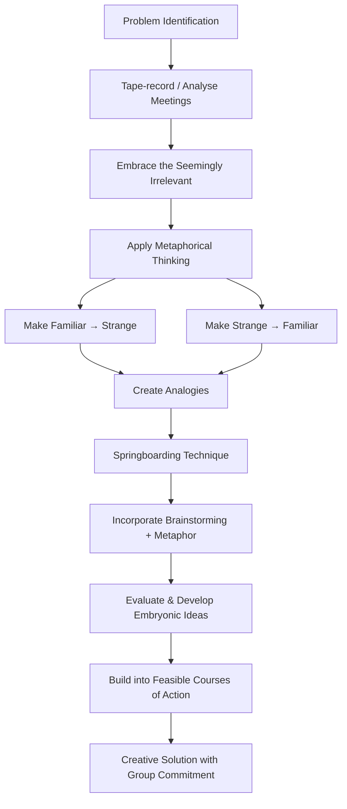
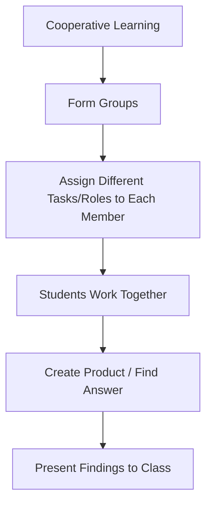
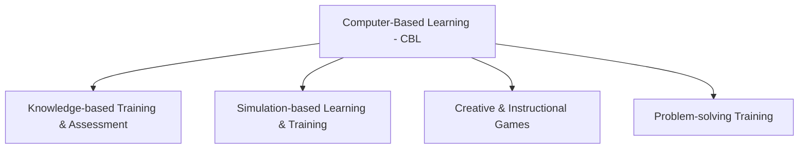

# 2. TEACHING MODELS (Part 3)
## Topics: 2.8 - 2.11

---

## 2.8 William Gordon's Synectics Models

### Definition

!!! note "What is Synectics?"
    **Synectics** is a **problem-solving methodology** that stimulates thought processes of which the subject may be unaware. The name Synectics comes from **Greek** and means **"the joining together of different and apparently irrelevant elements."**

### Developers

| Person | Details |
|--------|---------|
| **George M. Prince** | April 5, 1918 – June 9, 2009 |
| **William J.J. Gordon** | Co-developer of Synectics methodology |

---

### History

- The process was derived from **tape-recording** (initially audio, later video) meetings
- **Analysis of the results** was conducted along with **experiments** with alternative ways of dealing with obstacles to success in the meeting
- **"Success"** was defined as getting a **creative solution** that the group was **committed to implement**

---

### Theory

Synectics is a way to approach **creativity and problem-solving in a rational way**. The Synectics study has attempted to research the **creative process**.

#### Gordon's Three Main Assumptions

!!! important "Three Main Assumptions of Synectics Research"

    | # | Assumption |
    |---|-----------|
    | 1 | **The creative process can be described and taught** |
    | 2 | **Invention processes in arts and sciences are analogous** and are driven by the same **"psychic" processes** |
    | 3 | **Individual and group creativity are analogous** |

With these assumptions in mind, Synectics believes that **people can be better at being creative** if they **understand how creativity works**.

---

### Key Principles of Synectics

#### 1. Embracing the Seemingly Irrelevant

- One important element in creativity is **embracing the seemingly irrelevant**
- **Emotion** is emphasized over **intellect**
- The **irrational** is emphasized over the **rational**
- Through understanding the **emotional and irrational elements** of a problem or idea, a group can be **more successful at solving a problem**

#### 2. Prince's Emphasis on Creative Behaviour

- **Prince** emphasized the importance of **creative behaviour** in:
    - **Reducing inhibitions**
    - **Releasing the inherent creativity** of everyone
- He and his colleagues developed **specific practices and meeting structures** which help people ensure that their **constructive intentions are experienced positively** by one another
- The use of **creative behaviour tools** extended the application of Synectics to many situations **beyond inventive sessions** (particularly **constructive resolution of conflict**)

#### 3. Metaphorical Thinking

!!! tip "Gordon's Central Principle"
    **"Trust things that are alien, and alienate things that are trusted."**

- Gordon emphasized the importance of **"metaphorical thinking"** — to **make the familiar strange** and **the strange familiar**
- This encourages:
    - On one hand → **fundamental problem-analysis**
    - On the other hand → **alienation of the original problem** through the creation of **analogies**
- It is thus possible for **new and surprising solutions to emerge**

#### 4. Springboarding Technique

- As an invention tool, Synectics invented a technique called **"springboarding"** for getting **creative beginning ideas**
- For the development of beginning ideas, the method:
    - **Incorporates brainstorming** and deepens and widens it with **metaphor**
    - Adds an important **evaluation process for Idea Development**
    - Takes **embryonic new ideas** that are attractive but not yet feasible
    - Builds them into **new courses of action** which have the **commitment of the people** who will implement them

---

### Synectics vs Brainstorming

| Aspect | Synectics | Brainstorming |
|--------|-----------|---------------|
| **Complexity** | More complicated | Simpler |
| **Time & Effort** | Requires more time and effort | Less time-consuming |
| **Demand on Subject** | More demanding | Less demanding |
| **Facilitator** | Requires a **trained facilitator** | Can be self-directed |
| **Approach** | Uses metaphor, analogy, springboarding | Free idea generation |
| **Evaluation** | Includes evaluation process for idea development | Defers evaluation |

!!! note "Key Difference"
    Synectics is **more demanding** of the subject than brainstorming, as the steps involved imply that the process is **more complicated** and requires **more time and effort**. The success of the Synectics methodology depends highly on the **skill of a trained facilitator**.

---

### Synectics Process Flow

---

## 2.9 Types of Teaching Models

!!! note "Overview"
    While there are many teaching models, some basic ones are: **Direct Instruction, Lecture, Cooperative Learning, Inquiry-based Learning, Seminar, and Project-based Learning**.

**Teaching models** are **methods of teaching** or **underlying philosophies** that guide teaching methods. Effective teachers will **integrate different teaching models and methods** depending on the students that they are teaching and the **needs and learning styles** of those students.

---

### Summary Table of Teaching Models

| Teaching Model | Key Feature | Best For |
|---------------|-------------|----------|
| **Direct Instruction** | Teacher-led, structured steps | Clear lesson objectives |
| **Lecture** | Verbal presentation of information | College classrooms |
| **Cooperative Learning** | Group work with assigned roles | All subject areas |
| **Inquiry-based Learning** | Problem/puzzle solving | Mathematics & Science |
| **Seminar Method** | Socratic questioning & discussion | Critical thinking & analysis |
| **Project-based Learning** | Hands-on project creation | Applied learning |

---

### 1. Direct Instruction

In direct instruction, the **teacher is the person in charge** of presenting the lesson objectives and information to students.

#### Steps of Direct Instruction

| Step | Description |
|------|-------------|
| **Step 1: Present** | Teacher presents lesson objectives and information through a **lecture** or **multimedia presentation** |
| **Step 2: Guided Practice** | Teacher gives students **guided practice** so they can work with the **teacher's help** |
| **Step 3: Independent Practice** | Teacher gives students **independent practice** of lesson objectives (could be **homework** or **in-class activity**) |
| **Step 4: Test** | Teacher **tests the students** to see that they have **mastered the lesson objectives** |

---

### 2. Lecture Method

- Often used in **college classrooms**
- The **educator verbally presents** information and examples
- Sometimes accompanied by a **visual presentation**
- **Not necessarily much interaction** with students
- **Not much emphasis on practice** and putting information to practical use
- Students mainly need to **recite the information on a test**

!!! note "Limitation"
    The lecture method has limited student interaction and minimal emphasis on practical application of knowledge.

---

### 3. Cooperative Learning

- Students work in a **group setting** where each member has a **different task or role**
- **All students have to work together** to come up with the answer or to create the products or project that is required of them
- After all groups have finished, each group will be required to **present its findings** in front of the other groups and the teacher
- This method **works well in all subject areas**

---

### 4. Inquiry-based Learning

- Works especially well in **mathematics and science classes**
- Teacher presents a **problem or a puzzle** that students must solve based on **prior information** they have learned
- Can be used with **individual students** or with students **working in groups**

#### Process of Inquiry-based Learning

| Step | Activity |
|------|----------|
| 1 | Teacher presents a **problem or puzzle** |
| 2 | Learners create a **hypothesis** using the data they have been given |
| 3 | They **collect relevant information** |
| 4 | They **draw their conclusions** |
| 5 | They might **present to the class** |

!!! tip "Strength"
    This method presents learners with **authentic and engaging tasks** that are **highly motivating**.

---

### 5. Seminar Method (Socratic Inquiry)

- Also referred to as **Socratic inquiry**
- After students have all read a **common text**, the teacher uses **questions** to get students to:
    - **Analyze** the material
    - **Evaluate** the material
    - **Synthesize** the material
    - Reflect on their **own beliefs and thoughts** related to it
- Based on **higher-level thinking questions** used to **stimulate student thinking**
- The teacher **does not act as the primary presenter** of material
- Teacher **asks questions** and gets students to **back up their answers**
- **Students can ask each other clarifying questions** as well

!!! important "Key Feature"
    In the seminar method, the teacher is a **facilitator of discussion**, not a presenter. The focus is on **higher-order thinking** — analysis, evaluation, and synthesis.

---

### 6. Project-based Learning

- Students engage in **hands-on projects** that require application of knowledge
- Encourages **active learning** and **real-world problem solving**
- Students create **tangible products or outcomes**

---

## 2.10 Instructional Models in Computer Based Learning (CBL)

### Definition and Explanation

!!! note "What is Computer-Based Learning (CBL)?"
    **Computer-based learning (CBL)** is the term used for **any kind of learning with the help of computers**. It is also known as **Computer-aided instruction**.

- Computer-based learning makes use of the **interactive elements** of the computer applications and software and the ability to **present any type of media** to the users
- CBL has many benefits, including:
    - Users **learning at their own pace**
    - Learning **without the need for an instructor** to be physically present

---

### Techopedia Explains Computer-Based Learning (CBL)

- The computer-based learning model can be used by a **myriad of learning programs** across the world
- It can also be **combined with traditional teaching methods** to enhance the overall educational and training experience
- For **organizations**, computer-based learning could help in **training employees** in a more effective and profound manner
- **Individual courses** can be imparted in a **cost-effective manner** to learners

---

### Instructional Models in CBL

Computer-based learning is mainly used in the following instructional models:

| # | Instructional Model | Description |
|---|-------------------|-------------|
| 1 | **Knowledge-based training and assessment** | Training focused on knowledge delivery and evaluation |
| 2 | **Simulation-based learning and training** | Learning through simulated environments and scenarios |
| 3 | **Creative and instructional games** | Game-based learning for engagement and instruction |
| 4 | **Problem-solving training** | Training focused on developing problem-solving skills |

---

### Advantages of Computer-Based Learning

!!! tip "Key Advantages"

    | # | Advantage |
    |---|-----------|
    | 1 | Provides **more learning opportunity** for people in **disadvantaged environments** |
    | 2 | People can learn at a **pace comfortable for them**, unlike in a traditional classroom |
    | 3 | Learners need to spend only the **required time to learn** — no fixed schedule |
    | 4 | Learning material is **available all the time** |
    | 5 | **Cost effective** in many ways — reduces **travel time** and the same material can be used to teach **new students or users** |
    | 6 | Offers **safety and flexibility** |
    | 7 | Provides the **ability to track progress** |
    | 8 | Leads to **reduction of overall training time** |

---

### Disadvantages of Computer-Based Learning

!!! warning "Drawbacks"

    | # | Disadvantage |
    |---|-------------|
    | 1 | Students **do not have the opportunity for physical interaction** with the instructors |
    | 2 | **Development** of computer-based learning can be **time consuming** |
    | 3 | The **software or hardware** required for learning can be **expensive** |
    | 4 | **Not all subjects or fields** can be supported or assisted by computer-based learning |

---

### Advantages vs Disadvantages — Quick Comparison

| Advantages | Disadvantages |
|-----------|---------------|
| Self-paced learning | No physical interaction with instructors |
| Available all the time | Development is time-consuming |
| Cost effective | Software/hardware can be expensive |
| Tracks progress | Not suitable for all subjects |
| Reduces travel time | — |
| Safety and flexibility | — |
| More opportunity for disadvantaged learners | — |
| Reduces overall training time | — |

---

## 2.11 Test Items for Self Assessment

### I. Choose the correct answer

**1. Skinner's theory is on:**

- (a) Mastery Learning
- (b) Operant conditioning / training ✓

!!! note "Note"
    The self-assessment section in the source text is incomplete (only one question available from the extracted pages). Refer to the original textbook for the complete set of self-assessment questions.

---

## Quick Revision Summary

### Key Definitions to Remember

| Term | Definition |
|------|-----------|
| **Synectics** | A problem-solving methodology that stimulates thought processes of which the subject may be unaware; means "joining together of different and apparently irrelevant elements" |
| **Springboarding** | A Synectics technique for getting creative beginning ideas by incorporating brainstorming and deepening it with metaphor |
| **Direct Instruction** | Teacher-led model with steps: Present → Guided Practice → Independent Practice → Test |
| **Cooperative Learning** | Group-based learning where each member has a different task/role |
| **Inquiry-based Learning** | Problem/puzzle-based learning where students form hypotheses and draw conclusions |
| **Seminar Method** | Socratic inquiry method using higher-level thinking questions |
| **CBL** | Computer-Based Learning — any kind of learning with the help of computers; also called computer-aided instruction |

### Key People to Remember

| Person | Contribution |
|--------|-------------|
| **William J.J. Gordon** | Co-developer of Synectics; central principle: "Trust things that are alien, alienate things that are trusted" |
| **George M. Prince** | Co-developer of Synectics; emphasized creative behaviour in reducing inhibitions |

### Gordon's 3 Assumptions (Mnemonic: **C-I-I**)

1. **C**reative process can be described and taught
2. **I**nvention processes in arts and sciences are analogous (same psychic processes)
3. **I**ndividual and group creativity are analogous
