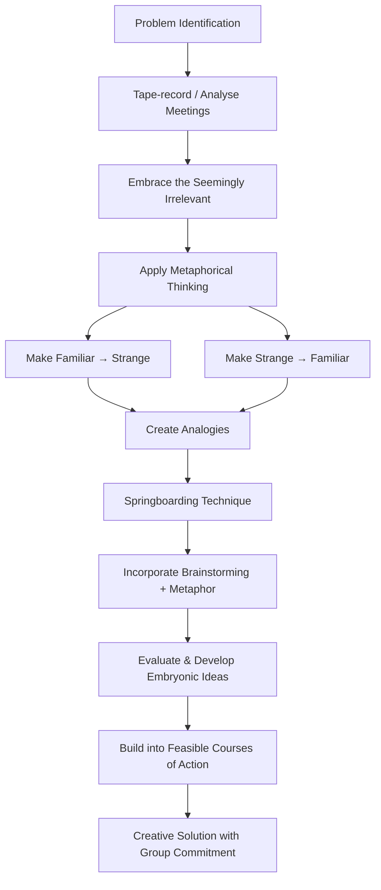
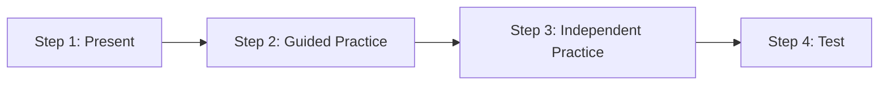
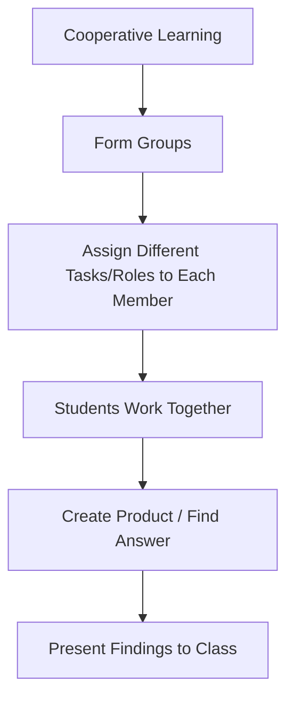
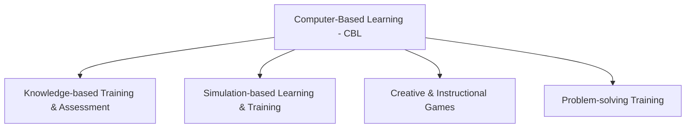

# 2. TEACHING MODELS (Part 3)
## Topics: 2.8 - 2.11

---

## 2.8 William Gordon's Synectics Models

### Definition

!!! note "What is Synectics?"
    **Synectics** is a **problem-solving method** that activates thinking in ways the person may not be aware of. The word Synectics comes from **Greek**. It means **"joining together different and seemingly unrelated things."**

### Developers

| Person | Details |
|--------|---------|
| **George M. Prince** | April 5, 1918 – June 9, 2009 |
| **William J.J. Gordon** | Co-developer of the Synectics method |

---

### History

- The process came from **tape-recording** (first audio, then video) of meetings
- The team **studied the results** and **tried new ways** to deal with problems in the meetings
- **"Success"** meant finding a **creative solution** that the group was **ready to carry out**

---

### Theory

Synectics is a way to approach **creativity and problem-solving in a logical way**. Synectics researchers have tried to study the **creative process**.

#### Gordon's Three Main Assumptions

!!! important "Three Main Assumptions of Synectics Research"

    | # | Assumption |
    |---|-----------|
    | 1 | **We can describe and teach the creative process** |
    | 2 | **Invention in arts and sciences works in a similar way** — both use the same **"inner mental" processes** |
    | 3 | **Individual creativity and group creativity work in a similar way** |

With these ideas in mind, Synectics says that **people can become more creative** if they **understand how creativity works**.

---

### Key Principles of Synectics

#### 1. Embracing the Seemingly Irrelevant

- One key part of creativity is **accepting ideas that seem unrelated**
- **Emotion** matters more than **logic**
- **Non-logical thinking** matters more than **logical thinking**
- When a group understands the **emotional and non-logical parts** of a problem, they can **solve it more successfully**

#### 2. Prince's Emphasis on Creative Behaviour

- **Prince** said that **creative behaviour** is important for:
    - **Reducing fears and mental blocks**
    - **Bringing out the natural creativity** in everyone
- He and his team created **specific practices and meeting formats**. These help people make sure their **positive ideas are received well** by others
- Using **creative behaviour tools** helped apply Synectics to many situations **beyond invention sessions**. This was especially useful for **solving conflicts in a positive way**

#### 3. Metaphorical Thinking

!!! tip "Gordon's Central Principle"
    **"Trust things that are alien, and alienate things that are trusted."**

- Gordon said **"metaphorical thinking"** is very important. It means to **make the familiar strange** and **the strange familiar**
- This helps in two ways:
    - It leads to **deep analysis of the problem**
    - It helps you **see the problem differently** by creating **comparisons (analogies)**
- This makes it possible for **new and surprising solutions to appear**

#### 4. Springboarding Technique

- Synectics created a technique called **"springboarding"** to get **early creative ideas**
- This method works by:
    - **Using brainstorming** and making it deeper and wider with **metaphor**
    - Adding an important **step to evaluate and develop ideas**
    - Taking **early new ideas** that look good but are **not yet doable**
    - Turning them into **real action plans** that the people involved are **committed to carry out**

---

### Synectics vs Brainstorming

| Aspect | Synectics | Brainstorming |
|--------|-----------|---------------|
| **Complexity** | More complex | Simpler |
| **Time & Effort** | Needs more time and effort | Takes less time |
| **Demand on Subject** | More demanding | Less demanding |
| **Facilitator** | Needs a **trained facilitator** | Can be self-directed |
| **Approach** | Uses metaphor, analogy, springboarding | Free idea sharing |
| **Evaluation** | Includes idea evaluation step | Delays evaluation |

!!! note "Key Difference"
    Synectics is **harder** than brainstorming. The steps are **more complex** and need **more time and effort**. The success of Synectics depends a lot on the **skill of a trained facilitator**.

---

### Synectics Process Flow

---

## 2.9 Types of Teaching Models

!!! note "Overview"
    While there are many teaching models, some basic ones are: **Direct Instruction, Lecture, Cooperative Learning, Inquiry-based Learning, Seminar, and Project-based Learning**.

**Teaching models** are **methods of teaching** or **basic ideas** that guide how teachers teach. Good teachers **mix different teaching models and methods**. They choose based on their students and the **needs and learning styles** of those students.

---

### Summary Table of Teaching Models

| Teaching Model | Key Feature | Best For |
|---------------|-------------|----------|
| **Direct Instruction** | Teacher-led, step-by-step | Clear lesson goals |
| **Lecture** | Teacher talks, students listen | College classrooms |
| **Cooperative Learning** | Group work with roles | All subjects |
| **Inquiry-based Learning** | Solving problems/puzzles | Maths & Science |
| **Seminar Method** | Questions & discussion | Critical thinking |
| **Project-based Learning** | Hands-on projects | Practical learning |

---

### 1. Direct Instruction

In Direct Instruction, the **teacher leads the lesson**. The teacher presents the lesson goals and information to students.

#### Steps of Direct Instruction

| Step | Description |
|------|-------------|
| **Step 1: Present** | The teacher shows the lesson goals and information using a **lecture** or **slides/video** |
| **Step 2: Guided Practice** | The teacher gives students **practice with help**. Students work with the **teacher's support** |
| **Step 3: Independent Practice** | Students **practice on their own**. This can be **homework** or an **in-class activity** |
| **Step 4: Test** | The teacher **tests students** to check if they have **learned the lesson goals** |

---

### 2. Lecture Method

- Often used in **college classrooms**
- The **teacher speaks** and gives information and examples
- Sometimes uses a **visual presentation** (slides)
- There is **not much interaction** with students
- There is **little focus on practice** or using knowledge in real life
- Students mostly need to **remember and repeat the information on a test**

!!! note "Limitation"
    The lecture method has little student interaction. It does not focus much on using knowledge in practice.

---

### 3. Cooperative Learning

- Students work in **groups**. Each member has a **different task or role**
- **All students must work together** to find the answer or create the product or project
- When all groups finish, each group **presents its results** to the other groups and the teacher
- This method **works well in all subjects**

---

### 4. Inquiry-based Learning

- Works very well in **maths and science classes**
- The teacher gives a **problem or puzzle**. Students solve it using **what they already know**
- You can use this with **one student** or with students **working in groups**

#### Process of Inquiry-based Learning

| Step | Activity |
|------|----------|
| 1 | The teacher gives a **problem or puzzle** |
| 2 | Students make a **guess (hypothesis)** using the data they have |
| 3 | They **collect useful information** |
| 4 | They **reach their conclusions** |
| 5 | They may **present to the class** |

!!! tip "Strength"
    This method gives students **real and interesting tasks**. These tasks are **very motivating**.

---

### 5. Seminar Method (Socratic Inquiry)

- Also called **Socratic inquiry**
- First, all students read a **common text**. Then the teacher uses **questions** to get students to:
    - **Analyze** the material
    - **Evaluate** the material
    - **Combine ideas from** the material
    - Think about their **own beliefs and thoughts** about it
- The teacher uses **higher-level thinking questions** to **activate student thinking**
- The teacher **does not present the material directly**
- The teacher **asks questions** and students must **support their answers with reasons**
- **Students can also ask each other questions** to understand better

!!! important "Key Feature"
    In the seminar method, the teacher is a **guide for discussion**, not a presenter. The focus is on **higher-order thinking** — analysis, evaluation, and combining ideas.

---

### 6. Project-based Learning

- Students do **hands-on projects** that need them to use their knowledge
- This method supports **active learning** and **real-world problem solving**
- Students create **real products or results**

---

## 2.10 Instructional Models in Computer Based Learning (CBL)

### Definition and Explanation

!!! note "What is Computer-Based Learning (CBL)?"
    **Computer-based learning (CBL)** means **any kind of learning that uses computers**. It is also called **Computer-aided instruction**.

- Computer-based learning uses the **interactive features** of computer programs and software. It can **show any type of media** to users
- CBL has many benefits:
    - Students can **learn at their own speed**
    - Students can learn **without a teacher being physically present**

---

### Techopedia Explains Computer-Based Learning (CBL)

- **Many learning programs** around the world can use the computer-based learning model
- You can also **combine it with traditional teaching** to make the learning experience better
- For **organizations**, CBL can help **train employees** in a more effective way
- **Individual courses** can be **given to learners at a low cost**

---

### Instructional Models in CBL

We mainly use computer-based learning in these instructional models:

| # | Instructional Model | Description |
|---|-------------------|-------------|
| 1 | **Knowledge-based training and assessment** | Training that focuses on giving knowledge and testing it |
| 2 | **Simulation-based learning and training** | Learning through simulated (virtual) settings |
| 3 | **Creative and instructional games** | Using games to teach and keep students interested |
| 4 | **Problem-solving training** | Training that builds problem-solving skills |

---

### Advantages of Computer-Based Learning

!!! tip "Key Advantages"

    | # | Advantage |
    |---|-----------|
    | 1 | Gives **more learning chances** to people in **difficult environments** |
    | 2 | People can learn at a **speed that is comfortable for them** |
    | 3 | Students only spend the **time they need to learn** — no fixed schedule |
    | 4 | Learning material is **available at all times** |
    | 5 | **Saves money** in many ways — less **travel time**, and the same material can teach **new students** |
    | 6 | Offers **safety and flexibility** |
    | 7 | You can **track your progress** easily |
    | 8 | **Reduces total training time** |

---

### Disadvantages of Computer-Based Learning

!!! warning "Drawbacks"

    | # | Disadvantage |
    |---|-------------|
    | 1 | Students **cannot meet or interact with teachers in person** |
    | 2 | **Creating** computer-based learning content **takes a lot of time** |
    | 3 | The **software or hardware** needed can be **expensive** |
    | 4 | **Not all subjects** can be taught well using computer-based learning |

---

### Advantages vs Disadvantages — Quick Comparison

| Advantages | Disadvantages |
|-----------|---------------|
| Self-paced learning | No face-to-face interaction with teachers |
| Available all the time | Creating content takes a lot of time |
| Saves money | Software/hardware can be expensive |
| Tracks progress | Not good for all subjects |
| Less travel time | — |
| Safety and flexibility | — |
| More chances for students in difficult settings | — |
| Less total training time | — |

---

## 2.11 Test Items for Self Assessment

### I. Choose the correct answer

**1. Skinner's theory is on:**

- (a) Mastery Learning
- (b) Operant conditioning / training ✓

!!! note "Note"
    The self-assessment section in the source text is incomplete (only one question available from the extracted pages). Refer to the original textbook for the complete set of self-assessment questions.

---

## Quick Revision Summary

### Key Definitions to Remember

| Term | Definition |
|------|-----------|
| **Synectics** | A problem-solving method that activates thinking the person may not be aware of. It means "joining together different and seemingly unrelated things" |
| **Springboarding** | A Synectics technique for getting early creative ideas. It uses brainstorming and makes it deeper with metaphor |
| **Direct Instruction** | Teacher-led model with steps: Present → Guided Practice → Independent Practice → Test |
| **Cooperative Learning** | Group-based learning where each member has a different task/role |
| **Inquiry-based Learning** | Problem/puzzle-based learning where students make guesses and reach conclusions |
| **Seminar Method** | Socratic inquiry method using higher-level thinking questions |
| **CBL** | Computer-Based Learning — any kind of learning that uses computers; also called computer-aided instruction |

### Key People to Remember

| Person | Contribution |
|--------|-------------|
| **William J.J. Gordon** | Co-developer of Synectics; central principle: "Trust things that are alien, alienate things that are trusted" |
| **George M. Prince** | Co-developer of Synectics; focused on creative behaviour to reduce fears and mental blocks |

### Gordon's 3 Assumptions (Mnemonic: **C-I-I**)

1. **C**reative process can be described and taught
2. **I**nvention processes in arts and sciences are similar (same inner mental processes)
3. **I**ndividual and group creativity are similar
