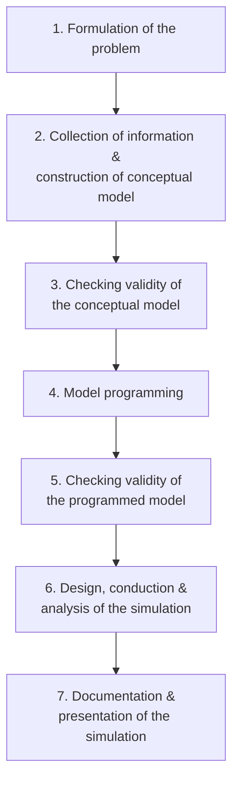
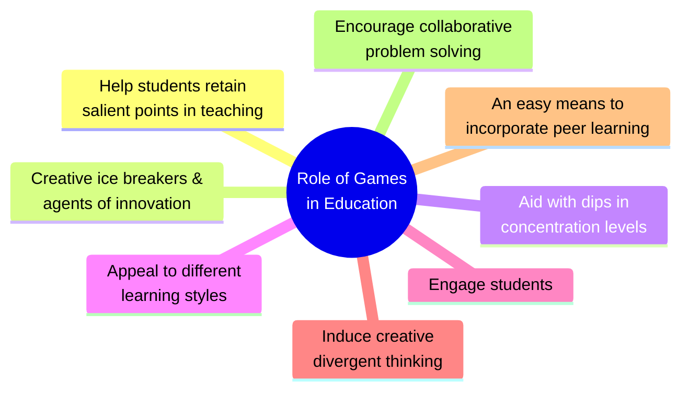

# 3. ACTIVITY BASED AND GROUP CONTROLLED INSTRUCTION (Part 1)
## Topics: 3.1.1 - 3.1.5 — Activity Based Instructions

---

## 3.1 Activity Based Instructions, Concept and Classification

Activity-based instruction involves **learner-centered strategies** where students actively participate in the learning process through role play, simulations, case studies, games, and other hands-on methods — rather than passively receiving lectures.

---

## 3.1.1 Role Play

### Introduction

- **Authentic learning activities** can better engage learners
- **Role playing** is an active learning and teaching strategy
- It can incorporate **drama, simulations, games, and demonstrations** of real-life cases related to any topic
- This strategy has been applied recently (from 2013 through 2015)
- Learning design plans were prepared with the expectation that role play activities would contribute positively
- Role play is also a **type of simulation game**

### Three Materials of Role Play Games

| # | Material | Description |
|---|----------|-------------|
| 1 | **Role cards or profiles** | Indicate the behaviour to be played |
| 2 | **Scenario or case study** | Describes the social situation in terms of which the roles are to be played |
| 3 | **Rules** | Specify the conditions under which the game is to be played; also helps decide winning or losing |

!!! note "Application in Computer Science"
    Mostly role play is applicable in **social situations**. In computer science, the roles of a **DTP operator**, a **programmer**, and a **Hardware Engineer** can be played.

### Role of the Teacher

- It is a **non-directive, non-managing role** — the teacher is a **consultant, referee, or both**
- S/he has to give directions to **introduce the game** and should **not interfere** when the game is played
- S/he may explain how the game was performed, what the flaws were, and how they could have been reduced

### Uses

#### Race (2010)

During the learning design process and in preparation for lessons, it is important for teachers to consider the numerous factors on which successful student learning depends:

- **Needing/wanting**
- **Doing**
- **Digesting**
- **Feedback**

Teachers need to organize **engaging activities** instead of delivering pure lectures that keep students in a passive state. Role play, as an active teaching strategy, can incorporate these positive elements of **enjoying learning** and **digesting knowledge** when designed accordingly and implemented successfully.

#### McSharry and Jones (2000)

- Although role play may not be difficult for many learners, it is advisable to **start with short role plays** and move gradually to longer role plays
- Both teachers and students should gain some **initial experience and confidence** first
- The role play activity should **not come immediately before or right after an exam** because the exam can cause stress and negatively influence effectiveness

!!! tip "Practical Application"
    Role play is suited for teaching **soft (personal and social) skills** to students and professionals. The systems analysis and design course offers many opportunities — including **client interviews**, **proposal presentations**, and **team meetings**.

### Learning Approaches Used

#### 1. Catering for Learner Needs

- The role play is organized to **cater to real-life needs** of learners
- This method caters to the needs of learners in specific subjects by clearly describing the role of the character created

#### 2. Active Learning Approaches

- Role play adopts **active learning approaches** by playing the roles of different characters students come across
- This makes teaching **interesting and active**
- It is one of the most useful active learning approaches

#### 3. Feedback to Learners

- In addition to the **teacher's feedback**, it is important to explore ways students can give **feedback to one another**
- Students discuss the case with each other in the first session as they draw diagrams
- In the second session, there is discussion with **peer feedback** between the role players and the observers (during and after the role play activity)
- After completing the role play, students get feedback from both students and teachers, which helps the role player **improve their function**

#### 4. Evaluation of Teaching

- Role play provides a mechanism for **evaluating teaching effectiveness** through observation of student engagement and learning outcomes

### Conclusion

- Role play as an active learning strategy can be used **not just in face-to-face classes**, but also in **blended or distance learning**
- This type of learning activity can be implemented more often in the context of **business and computing courses**
- Teachers who have already used this strategy can continue to **experiment with role play** by thinking of new scenarios for their courses

---

## 3.1.2 Simulation Models in Education

### Introduction

- **Simulation models** are a part of **computer-assisted learning** and an important guide for **lifelong education**
- **E-learning systems**, combined with simulation models as tools for interactivity, are the best way to provide **virtual reality in education**

!!! important "Requirements for a Good Simulation Model"
    A good model must be accompanied by:

    - Texts and demonstration material
    - Worksheets
    - Teacher's guides and student manuals
    - Tools for the teacher to make changes (text editor, graphic editor, resource editor)

### Simulation vs Experimentation

- **Simulation** is a particular type of **modelling** — a recognized way of understanding the world
- It is a **simplification of some structure or system**
- It can be a **prediction**, a **substitute for experiential learning**, or simply for **entertainment**

!!! note "Key Difference"
    In **simulation**, one is experimenting with a **model** and not with a **phenomenon**. In **experimentation**, one works directly with the phenomenon itself.

- The use of simulations represents the natural way of **"learning by doing"**
- Just as children do simulation activities by **role playing**, adults use computer simulations to **understand complex systems**, real situations, or dynamic processes
- Computer simulations allow analysing processes that would be **difficult, impossible, dangerous, too long, or too expensive** to perform in real life

### Types of Simulation Models

| Type | Description | Example |
|------|-------------|---------|
| **Physical Simulation** | Refers to physical objects or real things | Physical models of systems |
| **Interactive Simulation** | Physical simulation with human operators included | Flying or driving simulator |
| **Computer Simulation** | Simulates an abstract model of a particular system, with or without graphical output | Mathematical models in economics, chemistry, physics, psychology, social sciences, engineering, technology, traffic |

### Computer Simulation

!!! note "Fishwick's Definition"
    **Computer simulation** is the discipline of **designing a model** of an actual or theoretical system, **executing it on a digital computer**, and **analysing the execution output**.

- A simulation model is actually a **mathematical model** calculating the impact of certain inputs and decisions on outcomes
- Such a model could be created in a **programming language**, by statements, or using formulas in **spreadsheets**
- The output depends on **uncertain input** — therefore we deal with **uncertain variables** and **uncertain functions**

### Emulation vs Simulation

| Aspect | Simulation | Emulation |
|--------|-----------|-----------|
| **Purpose** | Models a system to study behaviour | Duplicates a system so the second behaves like the first |
| **Nature** | Approximation of reality | Imitation of another program |
| **Example** | Weather modelling, traffic simulation | Printers that emulate HP LaserJet printers to work with HP software |

### Why Computer Simulation Matters

- It is **interactive** and can be performed in **different forms**
- It can be used by pupils and students of **different background knowledge** and different possibilities
- Makes education **focused on the student** and their needs
- **E-learning** is one of the best models of learning environments today
- A computer is the tool that connects pupils and students with **lifelong education**
- **Interactive simulation** is today's best form of putting simulation models into education
- Computer simulation is a **cognitive tool** and a **learning object**
- **Computer literacy** is one of the key elements in basic education
- Computer simulation has become useful in modelling **natural systems** (physics, chemistry, biology) and **human systems** (economics, social and information science)

!!! tip "Example"
    A good example of the usefulness of using computers to simulate can be found in the field of **network traffic simulation**.

### Computer Assisted Learning (CAL) Categories

Computer simulation for educational purposes, which uses the computer as a learning environment, is called **Computer Assisted Learning (CAL)**. These "training simulations" come in three categories:

| Category | Description |
|----------|-------------|
| **"Live" Simulation** | Real people use simulated equipment in the **real world** |
| **"Virtual" Simulation** | Real people use simulated equipment in a **virtual reality** |
| **"Constructive" Simulation** | Simulated people use simulated equipment in a **virtual reality** |

!!! important
    In all three cases, people deal with **simulated equipment** — this shows the difference between simulation and experimentation. Information science includes all the above-mentioned uses and categories of simulation, which is very important for **lifelong learning** with a significant aspect of **interactivity**.

### Seven Steps for Building a Simulation Model

Building a valid and credible simulation model usually follows these steps:

### Three Models for Character Simulations

The idea of a character simulation is to **immerse the learner** in a social experience in which a "person" speaks, interacts, and guides learning. This character may have a **general persona** or be based on a **real and familiar personality**.

| Model | Role |
|-------|------|
| **Peer** | Character acts as an equal to the learner |
| **Expert** | Character acts as a knowledgeable guide |
| **Authority Figure** | Character acts as a directive leader |

### Suggestions for Development of Simulated Characters

1. **Create life-like characters**
2. **Plan the scenes** prior to development
3. **Check for understanding**
4. **Focus on learning objectives**
5. **Consider a multiskilled team**
6. **Run a pilot** to gather FAQs

### Conclusion

- Simulation models **interactively imitate reality** which would otherwise be very difficult to show to learners, or very dangerous to immerse them in without prior knowledge of how to react or behave
- Simulation models are applicable **throughout the learning process** — from school and university levels to lifelong learning situations
- It is always good to know the **designated community of users** to better customize the learning simulation model
- Simulation models are **very useful in information science education**

---

## 3.1.3 Incidence Method

### The Incident Process

- **Decision-makers** may find themselves inadequately prepared in trying to cope with **complicated, ill-structured issues**
- Attempts to gather information regarding complex relationships among participating individuals, political entities, principles, and policies may be **unsystematic**, with no stopping rule for ending the formulation process
- The incident process provides an opportunity for learning to **structure problems through effective inquiry**

!!! important "Key Characteristic"
    The incident process is intended to develop **problem-solving skills** through a procedure in which knowledge about the problem is revealed only by an **active process of inquiry**. Unlike typical case methodology, the student is **not initially provided with nearly enough information** to adequately address the problem.

### How It Develops Problem-Solving Skills

- Often the case will be initiated by a **single question** — an appreciation of why they need to know certain information
- The questions asked reflect the **schemas** that students have developed regarding the issue
- Students are **not automatically cued** to particular perspectives, data, or analyses
- Different frameworks developed in **"shaping" a problem** may be more evident
- The method is quite useful in **"non-traditional" classrooms** where there is diversity of age level and work experience
- Less experienced students can observe how **experience shapes the type of questions** asked
- A significant increase in **questioning skills** is often evident after 3 or 4 incident "cases"

| Aspect | Description |
|--------|-------------|
| **Student Role** | Increased activity — active social process drawing upon communication and listening skills |
| **Instructor Role** | Cannot be passive — must facilitate and guide the inquiry process |
| **Nature of Incident** | Need not be a dramatic event — just one that makes you stop and think, or raises questions |

!!! note
    Incidents are common in day-to-day teaching. It is neither reasonable nor possible to reflect on everything that happens — therefore a **selective focus** needs to be applied.

### Critical Incident Analysis

- The same incident will be **reflected on several times**, with a view to understanding its position and meaning in a wider perspective
- Promotes **professional development** for educators on teacher education programmes
- Critical incident analysis aims to **describe the nature of the incident** in depth

### Developments in Business Simulation & Experiential Learning

The incident method in business simulation follows this approach:

1. Students are told: *"You will get every bit of information that you want on this case, but you will have to ask for it. If you don't ask for it, you won't get it."*
2. Students are encouraged to **ask questions** to develop their understanding of the case and its context
3. Simple "yes or no" questions often **do not provide the level of information** needed
4. The **inquiry process continues** until a satisfactory solution is reached
5. At some point, one must **stop questioning and make a decision**
6. Over time, students begin to **assess the marginal utility** of further inquiry

!!! tip "Key Outcome"
    Experience with this process has led to the development of **methods for evaluation** and **methods for dealing with larger classes**.

---

## 3.1.4 The Case Study Method

### Definition

**Cases** are narratives, situations, select data samplings, or statements that present **unresolved and provocative issues**, situations, or questions.

!!! note "What is the Case Method?"
    The case method is a **participatory, discussion-based way of learning** where students gain skills in **critical thinking**, **communication**, and **group dynamics**. It is a type of **problem-based learning**.

- Often seen in professional schools of **medicine, law, and business**
- Now used successfully in **engineering, chemistry, education, and journalism**
- Students can work through a case during class **as a whole or in small groups**

### Case Method of Teaching — Characteristics

The case method of teaching (or learning):

- Is a **partnership** between students and teacher as well as among students
- Promotes more effective **contextual learning** and **long-term retention**
- Involves **trust** that students will find the answers
- Answers questions not only of **"how"** but **"why"**
- Provides students the opportunity to **"walk around the problem"** and see varied perspectives

### Value of Case Method (Bruner, 1991)

| Value | Description |
|-------|-------------|
| **Effective** | Employs active learning; involves self-discovery where the teacher serves as facilitator |
| **Builds Critical Thinking** | Uses questioning skills as modelled by the teacher; employs discussion and debates |
| **Exercises Administrative Viewpoint** | Students must develop a framework for making decisions |
| **Models Learning Environment** | Offers exchange and flow of ideas; achieves trust, respect, and risk-taking |
| **Models Inductive Learning** | Valuable in promoting life-long learning; promotes effective contextual learning and long-term retention |
| **Mimics the Real World** | Decisions are sometimes based not on absolute values of right and wrong, but on relative values and uncertainty |

### Ways to Use the Case Method

#### Types of Cases (Indiana University Teaching Handbook, 2005)

| Type | Description |
|------|-------------|
| **Finished cases** | Based on facts; useful for purposes of analysis |
| **Unfinished open-ended cases** | Results are not clear yet; student must predict, make suggestions, and conclusions |
| **Fictional cases** | Written by the teacher; difficulty is in making them reflect a real-world situation |
| **Original documents** | Use of news articles, reports, data sets, ethnographies; an interesting case provides two sides of a scenario |

#### Develop Effective Questions

- Think about ways to **start the discussion** such as using a hypothetical example
- Employ the **background knowledge** of your students

#### Get Students Prepared

To prepare for the next class, ask students to think about:

- What is the **problem or decision**?
- Who is the **key decision-maker**?
- Who are the **other people involved**?
- What **caused the problem**?
- What are some **underlying assumptions or objectives**?
- What **decision needs to be made**?
- Are there **alternative responses**?

#### Set Ground Rules

For effective class discussion, suggest the following:

- **Carefully listen** to the discussion, but do not wait too long to participate
- **Collaboration and respect** should always be present
- Provide **value-added comments**, suggestions, or questions
- Strive to think of the class objective by keeping the discussion going toward **constructive inquiry and solutions**

#### Other Suggestions

1. **Avoid being the "sage on the stage"** — if you monopolize, students merely absorb and do not engage with the material
2. **Let students finish presenting** their perspective before interjecting; check body language before adding or changing the discussion
3. **Take note of progress and content** — use the board or computer to structure comments; use the **two-column method** ("For and Against" or "Alternative A and Alternative B") where there is conflict or multiple alternatives
4. Try **debates, role-plays, and simulations** as additional ways to uncover the lesson from the case
5. If grading participation, ensure the **grading system is accurate and defensible**

### Principles

- **Send written case study materials in advance** so students can digest the facts and issues
- **Direct students to solve the problem** within a given time period
- **Include oral case studies** as a change of pace — keep them short (5–10 minutes) so others can assimilate the details
- **Let the instructor moderate**
- **Get reports from each site**
- **Have students construct their own cases**
- **Help students weigh and test values** and separate fact from opinion

### Case Study — Additional Details

!!! note "Theory"
    Case study is an **instructional method** (not a theory) that refers to assigned scenarios based on situations in which students **observe, analyse, record, implement, conclude, summarize, or recommend**.

- Case studies have a long tradition of use in **higher education**, particularly in **business and law**
- Cases are often based on **actual events**, which adds a sense of urgency or reality
- Case studies have elements of **simulations**, but students are **observers rather than participants**
- A good case has sufficient detail to necessitate **research** and stimulate **analysis from a variety of viewpoints**
- They place the learner in the position of **problem solver**

#### Single vs Multiple-Case Designs

| Design | Description |
|--------|-------------|
| **Single-case** | Used to confirm or challenge a theory, or represent a unique/extreme case; ideal for revelatory cases; can be holistic or embedded |
| **Multiple-case** | Follow a **replication logic** (not sampling logic); each individual case consists of a "whole" study with facts gathered from various sources |

!!! tip "As a Teaching Tool"
    Case studies are tools for engaging students in **research and reflective discussion**. Higher-order thinking is encouraged. Solutions may be ambiguous and facilitate **creative problem solving** coupled with application of previously acquired skills. Cases move "much of the responsibility for learning from the teacher on to the student, whose role shifts away from **passive absorption** toward **active construction**."

### Conclusion (Bruner, 2002)

- **The teacher is learning as well as the students** — because of the interactive nature, the teacher constantly "encounters fresh perspectives on old problems or tests classic solutions to new problems"
- **The students are having fun**, are motivated and engaged — if done well, students work **collaboratively to support each other**

---

## 3.1.5 Gaming in Education

### Introduction

- A **game** is a type of play where participants follow **defined rules** (Houghton et al., 2013)
- **Educational games** are the utilization of games to **support teaching and learning**
- Games can be used as a **support tool** to complement traditional teaching methods and to **enhance the learning experience**
- Games develop skills such as:
    - Following rules
    - Adaptation
    - Problem solving
    - Interaction
    - Critical thinking skills
    - Creativity
    - Teamwork
    - Good sportsmanship

!!! important
    Learning should **not feel like a chore** and should not only mean **rote memorization** where students learn through repetition or cramming. Teachers can take advantage of the **energy and innovative thinking** provided by using technology in learning to improve student performance.

### Aims

| # | Aim |
|---|-----|
| i | To develop an **enthusiastic learner** |
| ii | To **motivate and engage** students |
| iii | **Reduce monotonous** learning methods |
| iv | To help students with **focus, self-esteem, and memory** |

### Limitations

- **Limited time to experiment**
- **Open source application restrictions**:
    - **Moodle** — offers a demo mode where teachers can edit and upload content, but the demo period expires after **60 minutes** and all content is reset
    - **ProProfs** — also an open source application with restrictions which limit the application development process

### Overview of Games in Education

- Many different types of educational games are being applied in **educational institutions, schools, and homes**
- Using games in education mostly focuses on improving **critical thinking skills** while teaching a particular subject
- Students are allowed to **think outside the box** as they follow rules
- Some games focus on improving knowledge in a **specific subject** (e.g., math games)

!!! note "What Counts as an Educational Game? (Yue & Zin, 2009)"
    Games like **chess** cannot be viewed as educational games — they improve logic skills, reasoning, and other traits valued in education, but they **do not deliver content or relay curriculum material**. Games that incorporate **curriculum content** or other educational material are referred to as **educational games** (Michel, 2016).

### Roles of Games in Education

(Boyle, 2011) posits that games play a vital role in **building students' self-confidence**. As educational tools, games are constructive as they **liven up teaching methods** which are normally considered dull and boring.

### Advantages of Using Games in Education

| # | Advantage | Description |
|---|-----------|-------------|
| 1 | **Engage students** | The use of games plays an important role in engaging students by encouraging a **hands-on approach** |
| 2 | **Help students remember** | Active participation helps students remember what they have learnt; games help remember **critical points** applicable in examinations and real-world situations |
| 3 | **Visual and computer literacy** | By playing games, students gain **visual and computer literacy skills** which prepare them for the world of work |
| 4 | **Rule following and problem-solving skills** | Game drills are based on rule following; students learn to **think outside the box** and apply knowledge in real-world situations |
| 5 | **Beneficial for students with attention disorders** | Games capture students' attention as a **fun way of learning**; web-based games can assist kids with attention problems |
| 6 | **Teach other skills** | Games teach **critical thinking, problem solving, sportsmanship, interaction, and collaboration** with peers; helps create less stifled individuals who can adapt to any real-world situation |

### Disadvantages of Using Games in Education

| # | Disadvantage |
|---|-------------|
| 1 | **Lack of control** — Providing a platform for revision games becomes a challenge when teachers cannot control the environment; students can access **harmful platforms** |
| 2 | **Social seclusion** — Students who rely on games are often **secluded from real-life interaction** |
| 3 | **Health hazards** — Using computers and electronic devices can cause **eye strain** and other physical problems |
| 4 | **Cost and access gap** — Technologies required for full participation can be **expensive**, creating a gap between students who have access and those who do not |

### Role of Games in Education — Diagram (Boyle, 2011)

### Prioritization Exercise

**Executive functioning** problems come in different flavors. Planning and prioritizing is how our brain:

- **Evaluates information**
- **Recognizes sequences**
- **Decides what's most important**
- **Plots out next moves**

### Prioritization Activities (that are also Games)

| Activity | Description |
|----------|-------------|
| **Timed Races** | Complete certain work assigned, ordering certain activities |
| **Chess** | Excellent for learning to plan and prioritize because it involves so much strategy |
| **"Following Directions" Drawing Game** | Drawing based on verbal instructions |
| **Geocaching** | A type of treasure hunt |
| **Use a planner** | With details in a notebook |
| **Role play games** | Guide them to play games like bank, school, etc. |
| **Rewards** | Encourage children to specific role plays |
| **Write Everything Down** | On the activities to be followed on that day |

### Prioritization Activities at Home

- Talk about your own struggles in **prioritising daily activities** at home
- When children hear you verbalizing how you **weigh choices**, they learn the questions to ask themselves

**Sample questions to teach:**

- What's the **most important task** today/this week/this trip?
- How many things would we **like to do**?
- How long will **everything take**?
- Can any of these things be done **another time**?
- How much **energy** do I have today?

!!! tip "Cooking Activities for Prioritization"
    Cooking or baking together is one of the best prioritization activities because **everyone needs to eat**. Get your child to help you **plan the meals for a week**.

---

!!! note "Summary of Activity-Based Instruction Methods"

    | Method | Key Feature | Best Used For |
    |--------|-------------|---------------|
    | **Role Play** | Students act out characters/scenarios | Soft skills, social situations, interviews |
    | **Simulation** | Models of real/theoretical systems | Complex systems, dangerous/expensive processes |
    | **Incidence Method** | Inquiry-based problem discovery | Decision-making, critical thinking |
    | **Case Study** | Analysis of real/fictional scenarios | Critical thinking, discussion, problem-solving |
    | **Gaming** | Rule-based play with learning objectives | Engagement, motivation, skill building |
