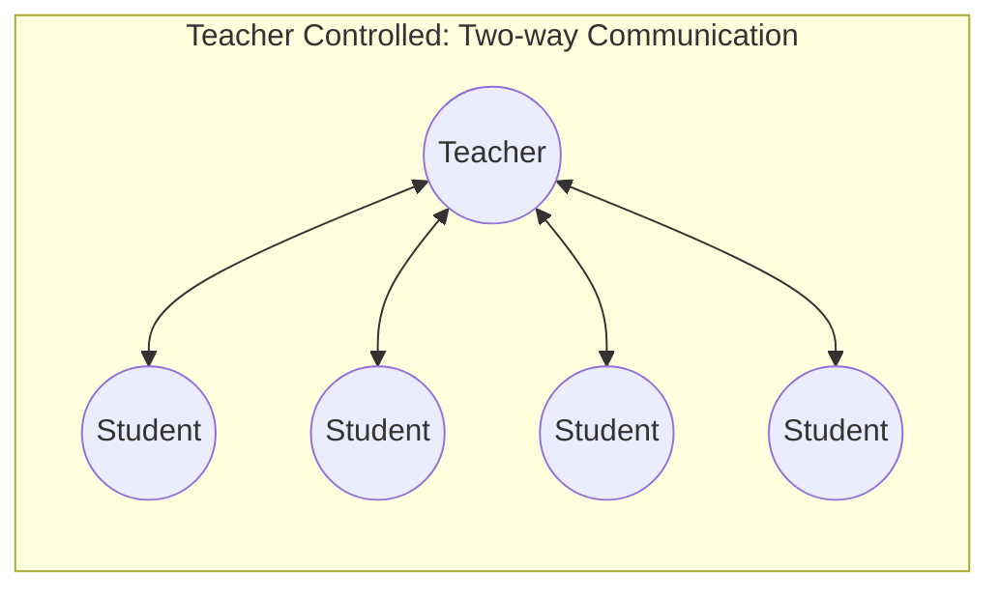
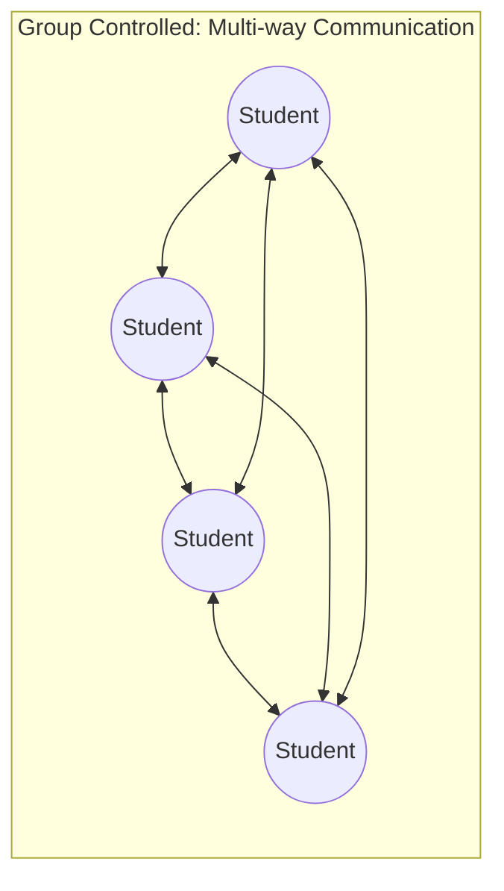
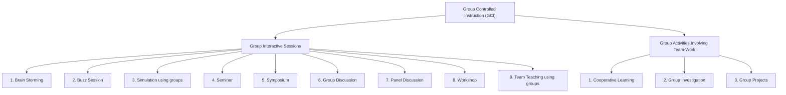

# 3. ACTIVITY BASED AND GROUP CONTROLLED INSTRUCTION (Part 2)
## Topics: 3.2.1 - 3.2.8 — Group Controlled Instruction

---

## 3.2 Group Controlled Instruction (GCI)

### 3.2.1 Introduction

Now we will discuss a **range of teaching methods** in which **co-operative activity** and **joint participation** feature strongly. These methods differ from the traditional passive and expository methods which rely on the sole efforts of the lecturer, for **group teaching** achieves skills from the **collective contribution** of the teacher and class members.

!!! note "Alternative Names"
    Group Controlled Instruction is sometimes referred to as:

    - **Discovery Learning**
    - **Indirect Instruction**
    - **Group Centered Methods**

---

### 3.2.2 Group-Controlled Instruction (GCI) Concept and Definition

When instruction is organized in such a manner that **students carry out the instructional activities together in a group**, it is called **GCI**. GCI is based on the fact that every member of the group **actively participates** in the instructional activity.

- **Learning** takes place due to **interaction among the group members** and **learning by doing** work in the group with the support of each other.
- Learning in this mode of instruction is controlled by the **interactive climate** generated by the group working as a **team with mutual support**.
- The **group takes up the responsibility** of organizing learning tasks.

!!! important "Definition of GCI"
    **GCI** may be defined as the **mode of instruction wherein learning is dependent on group interaction or mutual support of group members**. In this type of instructional method, the group takes up the responsibility of organizing learning tasks.

#### Definitions by Educationists

| Educationist | Year | Definition / Description |
|---|---|---|
| **George Brown** | 1988 | Describes small group teaching as **"Getting students to talk and think"** — a useful and succinct description |
| **G.D. Borich** | 1988 | Emphasizes the key characteristics of **inquiry, discovery and problem-solving**. These initiate *"a process of generalization and discrimination which requires students to rearrange and elaborate their understanding of a topic"* |
| **Curzon** | 1990 | Talks of **"Collective exploration and public evaluation of ideas"** |

---

### 3.2.3 Importance of the Nature of GCI

#### (a) Importance

Both the **teacher-controlled instruction** and the **learner-controlled instruction** are effective modes of instruction mainly for **cognitive and skill development** of individuals. However:

- In these modes, individuals develop a feeling of **competing with one another**, defeating one another
- It **spoils the innocent fun** of children and young students
- It does **not educate students on how to lead a harmonious life** in the society

!!! tip "Why Supplement with GCI?"
    It is important to **supplement** teacher-controlled and learner-controlled instruction with **group-controlled instruction** because GCI provides:

    - **Deeper understanding** of knowledge through participation in group work including discussion
    - Development of **power of expression**
    - **Critical thinking**
    - **Tolerance** and **belongingness**
    - **Trust** and **team spirit**
    - **Habit of helping each other**

    Thus, GCI can help prepare **knowledgeable and skilled human beings** who could support a society with **democratic values** leading to harmonious life, prosperity and happiness.

#### (b) Nature of Group Methods

##### Purposeful

Discussion in some form or other underpins all group teaching. These methods seek to **examine a topic or problem** through the **free flow of argument** in which participants learn from each other by **pooling ideas**. It is an attempt to **better understand knowledge and solve problems** rather than acquire new factual information — thus it is **discussion with a purpose**.

##### Complex

Group teaching is **complex**, for it combines the **strengths of individual instruction** and the **benefits of group interaction**.

##### Five Key Characteristics

**1. Learning**

The deeper learning that results from group teaching occurs in **two ways**:

1. **Through revision** — the reinforcement of existing knowledge
2. **Through re-structuring** — the modification of previous knowledge into a new conceptual framework

**2. Interaction**

The interaction of **communication patterns** that occurs between group members is of **two types**:

| Type | Description |
|---|---|
| **Two-way communication** | Limited to dialogue between **teacher and individual students** (Teacher Controlled) |
| **Multi-way communication** | Students interact **freely with one another** (Group Controlled) |

This will determine whether the instruction is **teacher-centred** or **learner-centred**.

**3. Development**

Another important finding from **group dynamics** is that each group passes through **several developmental phases** before getting into a **cohesive and productive learning group**.

**4. Leadership**

The teacher largely determines the types of group activity and interaction, so his or her **'leadership' role** is of great importance and calls for **high skills and adaptability**, as well as a knowledge of group dynamics.

The leadership role will vary according to several factors:

- Purpose
- Structure
- Teacher style
- Degree of control desired
- Group characteristics

The quality of tutorship is vital and will **enhance or hinder** group learning.

!!! important "Six Leadership Roles"
    | No. | Leadership Role |
    |---|---|
    | i) | **Initiator** |
    | ii) | **Motivator** |
    | iii) | **Facilitator** |
    | iv) | **Elaborator** |
    | v) | **Moderator** |
    | vi) | **Controller** |

**5. Student Engagement**

The teacher would present information, provide sources for further reading, ask questions and discuss ideas. In doing this, the teacher would **encourage the learner** to:

- Give **personal viewpoints** and interpretations
- Provide **examples**
- Justify **assumptions**
- Explore **relationships**
- Apply ideas to **new situations**
- Test for **confirmation**

!!! note
    As teacher, mentor and coach, we ensure our student is engaged in **active and purposeful learning**. Modern group teaching helps students **grasp difficult concepts** and **wrestle with misconceptions**. It enjoys the best of the more traditional **didactic approach** and the contemporary **discovery strategies**. The skills of the teacher are crucial in the techniques.

#### (c) Advantages, Objectives and Usefulness

**Advantages:**

Learning in interactive groups enhances:

- **Critical thinking**
- **Problem-solving**
- **Communication skills**
- **Innovativeness**
- **Inter-personal skills**
- **Team skills**

All of these are much in demand today with current external pressures and market forces in the field of computer science.

**Objectives and Usefulness:**

| Purpose | Methods / Examples |
|---|---|
| To ensure **participation and contributions** from each student | Pyramiding, Buzz groups |
| For **re-structuring information** to a higher level of cognition | Debate, Case study, Mind-maps |
| To **obtain consensus** | Nominal Group Technique |
| To **generate divergent ideas** | Fish bowl, Students' questions |
| For developing **personal skills** (assertiveness, working with others, communication skills) | Simulation, Project work, Syndicates |
| For **solving problems** | Brainstorming, Case study |
| To **reduce task or question** when group gets 'stuck' | Buzz groups, Syndicates |

#### (d) Constraints Impose Limitations

Several constraints and prerequisites impose limitations on group teaching:

##### Limitations of Size

- Size limitations are clearly necessary due to the **interactive nature** of small group teaching
- Group size is dictated by the **type of interaction desired** and by **practical considerations**
- Most authorities cite **"not more than ten students"** if full benefits are to be obtained

##### Pre-requisite Knowledge

- In order to have a **meaningful discussion**, some **previous knowledge or relevant experience** should be available with the group
- This is normally provided through:
    - Earlier lectures
    - Reading assignments
    - Practical tasks
- Often supplemented with a **lecturette or brief talk** immediately prior to group work
- Care needs to be taken that this does **not develop into a lengthy monologue** or another lecture

##### Organization

Several organizational or environmental factors that cause problems:

- **More staff** may be required — may not be possible if the student/staff ratio is rigidly fixed by tradition, politics or financial constraint
- **More time** may be required — may pose time-tabling problems
- **Space and seating** need to be intimate and flexible to be suitable
- **Seating arrangements** are very important — suitable configurations include circular, semi-circular, and U-shaped arrangements (where the lecturer is identified as **[L]** and the students as **O**)

---

### 3.2.4 Types of GCI

Considering the nature of activities organized under group-controlled instruction, GCI can be divided into **two broad categories**:

1. **Group Interactive Sessions**
2. **Group Activities Involving Team-Work**

!!! note
    This classification should not create a feeling that activities involving team-work do not have any interaction. These activities also have interaction. It is only the **emphasis of interaction and team work** and the **nature of instructional activities** on the basis of which classification is done.

| Group Interactive Sessions | Group Activities Involving Team-Work |
|---|---|
| 1. Brain Storming | 1. Cooperative Learning |
| 2. Buzz Session | 2. Group Investigation |
| 3. Simulation using groups | 3. Group Projects etc. |
| 4. Seminar | |
| 5. Symposium | |
| 6. Group Discussion | |
| 7. Panel Discussion | |
| 8. Workshop | |
| 9. Team Teaching using groups etc. | |

---

### 3.2.5 Group Interactive Sessions

In these discussion sessions, the group members **interact with each other** by asking questions, seeking clarifications, giving their own views, examining others' views, arguing the decisions, etc. In other words, in group interactive sessions a **theme or topic is presented or initiated** by someone, either by a member of the group or a teacher.

#### 1. Elements of Interactive Sessions

To organize an interactive session in a secondary or senior secondary school, either all the students of the class can take part in an instructional task as a group, or the class can be divided into smaller groups and given separate activities to work on.

!!! important "Four Main Elements of Interactive Sessions"
    | Element | Role |
    |---|---|
    | **Chairperson** | Chosen from the group as the coordinator of the session; conducts the proceedings; need not necessarily be the teacher — a student may act as the coordinator |
    | **Speaker** | The member who presents the topic; the second element of interactive session; meaningful interaction can take place only when individual members participate |
    | **Participants** | All members of the group who participate in the interactive sessions; the third element |
    | **Recorder** | The observer who systematically records the proceedings of the sessions; the fourth element |

!!! note
    Students cannot take part in discussion until they have some **briefing about the topic**. It is essential that we should make the students aware of the instructional activity and present a brief note according to the requirements.

#### 2. Pre-interactive Session Activities

It is essential to **plan and implement properly** and **assign importance** to interactive sessions.

**Allocation of Topics**

- Allocate the topic(s) to the students so that they can prepare for presentation
- Give students only a **small portion** which they can prepare and present in about **20 minutes**
- **Lengthy topics** should be presented by different students
- Suggest some **reference books** to the students
- Topic allocation may be taken up just after the **reopening of the school, within first 10-15 days**
- This will enable students to prepare their topics in time to start interactive sessions at an early date
- As a teacher, keep a **record of the portions allotted** to various students

**Decide the Dates of Presentation**

**Guiding and Motivating Students for Preparation of Write-ups**

- Ensure that every student prepares a write-up
- Encourage students to **start work immediately** — such as reading books on the topic
- Guide the students regarding **reference books** and in the **preparation of write-ups**
- Providing **continuous motivation** to the students may be essential

**Making Seating Arrangement**

**Orientation of the Students** — as to how it should be organized

**Circulating Write-ups in the Class** — is essential

**Demonstration Involving Team of Teachers**

- At the school stage, the **first presentation should be made by the teachers**
- The chairperson and recorder also may be teachers
- Students should be **encouraged to take part** along with the participating teachers
- Students should be asked to **observe the entire proceedings** of the sessions so that later on they can conduct the sessions **independently in the same manner**

#### 3. Interaction by Teacher

Teacher has to play the **leadership roles** in different forms: **Initiator, Motivator, Facilitator, Elaborator, Moderator and Controller** in the Interactive Sessions.

**Climate Setting**

The need for a **safe friendly climate** is important if students are to talk and share thoughts without risk or fear of 'being put down'.

**Generating Interest**

This can be done in a general way by:

- Using **students' names**
- Demonstrating your own **enthusiasm**
- **Varying activities**
- Relating learning to the **'real world'**
- Showing an **appreciation of students' contributions**

!!! tip "Motivating at the Start"
    Motivate students at the start of each small group teaching session when it is vital to:

    - **Outline the purpose**
    - **State the objectives**
    - **Brief the group** on the task and how it is to be tackled

    The use of **advance organizers** such as buzz groups or brainstorming tactics to generate ideas, stimulate thought, or determine an agenda are other ways to energize a learning group.

**Encouraging Participation**

Active participation by group members is **central to small group teaching** and your ability to make this happen will largely determine the effectiveness of the learning. Ensure participation by:

- **Skillful questioning**
- **Using sub-groups** — if group itself is large
- Using methods that **facilitate active participation**
- Handling members in a way that **promotes interaction**

#### 4. Closing the Interactive Session

- Close the session **within the time allotted** or when the participants have nothing more to contribute
- Before closing, **highlight and summarise** the views and arguments expressed during the discussion
- Take **notes during the session** for this purpose
- Make some **remarks on the conduct** of the session as well
- This may be done **without any personal reference** and without hurting the feelings of participants
- **Commend desirable behaviours** and caution against undesirable ones

#### 5. Interactive Sessions Conducted by Students

When group-controlled instruction becomes a **regular feature** in the school:

- One period may be **too small** for an interactive session
- It would be essential to **divide the class into smaller groups** and discuss the assigned topic or problem in a more satisfactory manner
- This arrangement ensures that **all the students take part** in discussion
- In a small group, students themselves can **choose one of them as the chairperson**
- In the **absence of the teacher**, some students who otherwise do not take part in discussion due to fear of committing mistakes may participate

!!! important "Gradual Transition"
    - Such an arrangement should be made only when the students have **observed 8-10 interactive sessions** chaired by the teacher
    - In some sessions, the teacher should be present as a **participant** and allow the students to chair the sessions
    - During such sessions, the teacher should **guide the interaction** and provide **feedback to the chairperson**
    - This would enable the students to conduct the interactive session **by themselves**

#### 6. Post-interactive Session Activities

Interactive sessions organized under group-controlled instruction in the school are an **integral part of the entire instructional process**. The objective of post-interactive session activities is to **integrate these activities with the entire instruction**.

**Chief Post-interactive Session Activities:**

- **Organizing lecture-discussion**
- **Providing references** and encouraging students to use library resources and prepare notes
- **Organizing practical or field-based activities**, if necessary these may be discussed
- **Assessing the gain** in their knowledge, skills and attitude

The post-interactive session activities include **collection of student's reactions, opinions and suggestions** on the conduct and effectiveness of the interactive sessions. Students' views can be used for **modifying and improving** interactive sessions. **Proper evaluation** should also be carried out.

!!! note
    All discussions made here are applicable to **all group interactive sessions**. It is mostly suitable for **general group discussions**. It is also applicable to other specific forms like **Brain storming, Seminar, Symposium, Panel discussion and Workshop**, with suitable modifications.

#### Types of Group Interactive Sessions (Specific Methods)

##### 1. Brain Storming

**Brain storming** is a technique used to gather a **large number/quantity of ideas**. The ideas generated are geared towards **solving a specific problem**. There are different brainstorming techniques which have been used. They are, however, often **group creativity techniques**, whereby a group of individuals join together so as to find a **new solution to a specific problem**.

##### 2. Buzz Session

The word Buzz reminds us of **'Bee'**. In this session all participants act as **busy as a bee** and this pressurized short period enables to suggest very useful solutions to the problem discussed.

If we need help in getting all of the members of a group to take more active part in group discussions, we try this idea: **divide the class into small groups** for short "buzz sessions". Have each group discuss the topic among themselves and then **present its ideas to the class**.

This is a good way to get **quick reactions** to new ideas or questions or problems. This activity is designed to increase **group communication, cooperation, and involvement** through buzz sessions.

**Preparation:**

- At the end of the time, call for **reports and questions**
- The duration will be short — **5 to 8 minutes**
- Have the class **listen to each group's ideas** and discuss them briefly
- After all buzz groups have responded, have the class **discuss all the ideas presented**
- Let the person in charge of the discussion **sum up the ideas**

!!! tip
    **Buzz session** can be considered as a **reduced or mini form of Brainstorming**. This could be used as a mini session or even in the course of a lecture because the duration provided is very short — **5 to 8 minutes**.

**Some Sample Topics:**

- "Why should we learn computer science?"
- "How internet is useful?"
- "How should we punish those involved in computer crime?"
- "What should be due to stop virus problem?"

##### 3. Simulation

**Simulation** as used in classroom teaching may be defined as a **combination of role playing and problem solving**.

**Simulations as Games:** Simulation is also known as **gaming** and many associations have been formed for its development. Simulation gaming is becoming an **effective means of communication** throughout the world.

**Steps in Simulation:**

1. Assign A, B, C — take students to provide **rotation**
2. Decide the **topic, plan, prepare**
3. Prepare **order of participative students**
4. Decide a **procedure for evaluation**
5. Provide **feedback**
6. Go to **next topic**

##### 4. Seminar

- **5 to 8 individual students** also prepare papers or reports and present them before a **group of peers** as part of the course work
- **Duration** of the presentation of papers at seminars varies from topic to topic and discipline to discipline
- Papers can be illustrated through:
    - **Projected aids** — filmstrips, slides, transparencies
    - **Non-projected aids** — charts, diagrams, maps, etc.
- Presentation of paper or papers is followed by **general discussion** by the entire group
- **Considerable student participation** is expected
- **Participants**, duration of each paper, **chairperson**, special invitees — all should be planned

##### 5. Symposium

**What?** — Symposium is a **group discussion** in which **subject experts or speakers** holding different points of view about the subject under discussion participate.

- Each speaker presents his ideas in a **short speech**
- Generally the **moderator or the chairperson** arranges speakers to discuss the various aspects of a theme in the symposium
- The chairperson **coordinates** the different presentations
- The total number of speakers usually does **not exceed five** excluding the chairperson
- The **audience very seldom participates** as the chairperson ensures the speakers anticipate possible questions and incorporate these in their presentation

##### 6. Group Discussion

Group discussion is organized as follows:

| Component | Description |
|---|---|
| **The Leader** | The teacher |
| **The Group** | The students |
| **The Problem** | The topic |
| **The Content** | Body of knowledge, selected for discussion |
| **Evaluation** | Change in ideas, attitudes etc. |

**Example:** Computer enabled services

It could be based on **prepared papers**, special work project, could use **pictures, charts** etc.

##### 7. Panel Discussion

It is also a **group dynamics (activity)** but only the **panel of experts** discuss among themselves before an **audience**. The other participants witness the discussion and finally **ask questions**.

- In panel discussion, **three or four speakers** discuss various aspects of a **single topic** in the class
- One of them acts as the **chairperson to monitor discussion**
- A **time schedule is fixed**

##### 8. Workshop

As the name indicates, it is **group work for activity** or production. As in a technical workshop — of course, here, the working material will be **educational, not mere technical material**.

**Purpose:** To produce **concrete educational products or papers**

**Duration and Organization:**

- Workshops may be organized for **2 or 3 days** or even for a week with various activities
- Organized with **20/30 participants**
- A **general lecture or plenary session** will be there to explain the activities/discussions to be carried out
- There may be **group discussions in small groups** on how to produce the product/report
- **Developing educational product/report is a must**

**Organization:**

- There will be a **Programme Director** who will be guiding along with a **consultant** — matters of production of the product or report

**Uses:**

- Since the workshop is based on **real involvement and work**, everyone will be interested and doing one thing or other
- **Nobody will be dull and drowsy**, which may be the case sometimes in lectures and seminars

**Activities:**

- The number of participants must be limited to **20 to 30**; then only they could divide themselves into small groups and every one will be involved in **individual or group production**

##### 9. Team Teaching

Team teaching is based on the assumption that **no single teacher possesses expertise** to do full justice to the entire course. Team teaching requires **cooperation of 2 or more teachers**.

| Teacher Expertise | Area |
|---|---|
| Some teachers may be experts in | **Teaching** |
| Some may be very good in | **Using multimedia or teaching aids** based on EJ |
| Some may be very good in | **Group organization** |
| Others may be excellent in | **Organization of field trips** |

Team teaching enables to **utilize the expertise of all teachers** to all students. Best suited for **inter-disciplinary subjects** like Sciences, Social Sciences.

**Procedure of Organisation:**

The team-teaching serves several purposes of teaching and it has different forms or types. It involves the following steps:

- **Step 1** — Planning
- **Step 2** — Organizing
- **Step 3** — Evaluating

**Operation:**

Team teaching can be effective only when the lecture in a **large group** is immediately followed by **small group discussion** under the guidance of all the teachers.

The large group is split up into **small groups of homogeneous abilities** and the teachers pay **individual attention** and work as **counsellor or consultant** to these small groups. This homogeneous grouping can be done on the basis of students' **abilities, interests, needs and achievements**.

**Phases of Ideal Team Teaching:**

1. **Planning**
2. **Lecture**
3. **Group work**

---

### 3.2.6 Co-operative Learning Methods

In order to develop in students the skill of **cooperation, belongingness and team spirit** and to reduce **individual competition** amongst them, you should adopt the **cooperative learning methods**. Cooperative learning is **not individual learning** but **group or peer learning**.

In cooperative learning, students work together to **achieve a common goal**. There is greater **participation and involvement** of the students in cooperative learning. Cooperative learning generates more **intrinsic motivation** than does individualized learning. The feeling of **belongingness** produces positive attitudes and **team spirit** in the students. Cooperative learning is specifically useful for learning **various skills and knowledge**.

#### a) Organizing Cooperative Learning

For organizing cooperative learning, you should ensure that students **work in groups** and each group member works in a **cooperative manner** to achieve the common goal.

**Specific activities to organize:**

**i) Formation of Groups**

- Divide the class into **small groups**
- While forming groups, keep in mind the **heterogeneity** among students in respect of **sex, intelligence, religion**, etc.
- Each group should consist of a **cross-section of the class**: boys, girls, above average, average and below average students in terms of intelligence
- Try to form groups by including students from **different communities**

**ii) Preparation of Cooperative Learning Sheets**

- Prepare these sheets for **all the topics** to be taught through cooperative learning
- These learning sheets consist of:
    - **Objectives**
    - **Activities** to be done by the group members in accordance with the content of the topic
    - **Evaluation items** based on the objectives

**iii) Orientation to the Students**

- As students are used to working individually, they have to be **oriented properly** to work together
- Inform them about how cooperative learning will be organized
- Every learning point should be **discussed collectively**
- A student who does not understand could be **explained well by another student**
- They should be informed that they will **not be evaluated individually**; the entire **group performance** will be the index of group progress
- The group as a whole should ensure that **every member of the group learns every concept**
- They should work as a **team to achieve the set goals**

**iv) Conducting the Cooperative Learning Session**

- Allot **time for cooperative learning sessions** and distribute cooperative learning sheets to the groups
- Groups should carry out learning activities according to the **guidelines given in the sheets**
- These learning sheets should provide **flexibility** to the students
- Students may **modify the activities** according to the requirement of the group members
- They may **discuss the problem, ask questions, explain concepts and solve problems** according to their convenience
- Every member may be **evaluated by the group**; if a member commits mistakes, he may be **helped by others**
- The teacher should observe how cooperatively the groups are working
- Give **feedback** to each group about whether they are proceeding in the right direction
- Finally, the group should **report** about what they have done and how they have performed
- The performance reported should be the **average performance of the group**

#### b) Advantages of Cooperative Learning

In cooperative learning, an **informal situation** is created based on **mutual dependence**, and supported by fellow students. They are free to explore their ideas, discuss with their friends, sharpen their thinking and actions, get help and provide support to others.

!!! important "Key Advantages"
    - Students are often able to **translate the teacher's language into their own language** and enrich their understanding
    - Students **learn by actually participating** in the teaching-learning process; they have to organize their thoughts to explain ideas to their mates — they engage themselves in **cognitive elaboration** that greatly enhances their understanding
    - Students can provide **individual attention** to and assistance from one another; as they can freely seek assistance from fellow students in cooperative learning, their **achievement will be much higher**

---

### 3.2.7 Group Investigation

At the school stage, certain topics are such which raise **doubts and questions** in the minds of the students and for those they do not find answers in the textbooks. To answer such questions requires **investigation into the phenomenon**.

Problems/questions whose answers are **not readily available** require investigation. Some of the problems are such that **no individual student can investigate** these by himself. It is, therefore, desirable to carry out **group investigation** in such a situation.

!!! note
    Group investigation as an instructional activity is very much possible at the school stage and to make it successful, your **guidance to students** is very essential. All students engaged in a group investigation will go through the following process.

#### Process of Group Investigation

**1. Group Formation and Selection of Members Deciding Problem or Topics**

- You may indicate some **exemplar problems** and guide the groups to select a **suitable problem** for investigation

**2. Cooperative Planning of Investigations**

The members of the group will plan their work regarding:

- **Collection of evidence**
- **Sources of evidence**
- **Allocation of work** among members
- **Estimation of time** to be devoted to investigation work
- Planning about how **data will be analyzed** and who will do the analysis
- Deciding the way the **report on the investigation** will be prepared
- For each activity, **time must be estimated**

**3. Implementation**

- Carry out the investigation work according to the **plan**
- Every member should try his/her best to **complete the activities within the stipulated time**
- Evidence from **all the sources and areas** should be collected

**4. Analysis and Synthesis**

- The collected evidence should be **analyzed**
- Plan the presentation
- Synthesized **logically** in order to arrive at **valid results**

**5. Preparation of Report and Presentation**

- The report of the work done should be prepared
- The report should include information about **how the work was done** and **what findings were arrived at**
- The report should **not be of more than a few pages**
- It should **not be a very technical report** but just a write-up
- Should be **presented by the coordinator** of each group

**6. Evaluation**

- Evaluate the **work of each group** on the basis of your observations of the way of solving the problem
- Judge whether the **evidence collected is adequate and valid**
- Judge whether the **solutions arrived at are logical** and based on facts
- **Provide feedback** to the group

!!! tip
    Investigation, as a group-controlled activity, needs a **lot of guidance** to be successful. The knowledge gained through this type of instruction promotes better understanding of how **children learn in groups as well as individually**.

---

### 3.2.8 Group Projects

In some situations, group investigation may be a **project work**. Thus project work is a **broader concept** which includes investigation or any other activity which may be completed in itself.

At the school stage there are several activities which **cannot be completed by an individual** and which require a **group of students to work together**.

#### Strategies for Successful Group Projects

##### 1) Create Interdependence

Some instructors don't mind if students give up and work separately; others expect a higher degree of collaboration. If **collaboration is your goal**, structure the projects so that students are **dependent on one another**.

**Ways to Create Interdependence:**

- **Ensure projects are sufficiently complex** that students must draw on one another's knowledge and skills
- **Create shared goals** that can only be met through collaboration
- **Limit resources** to compel students to share critical information and materials
- **Assign roles** within the group that will help facilitate collaboration

##### 2) Devote Time Specifically to Teamwork Skills

- **Don't assume** students already know how to work in groups
- While most students have worked on group projects before, they still may **not have developed effective teamwork skills**
- The same teamwork skills they learned in one context (say, a theatrical production) may **not be applicable** in another (e.g., a design project involving a small client)

**To work successfully in groups, students need to learn how to work with others to do things they might only know how to do individually, for example to:**

- Assess the **nature and difficulty** of a task
- **Break the task down** into steps or stages
- **Plan a strategy**
- **Manage time**

**Students also need to know how to handle issues that only arise in groups, for example, to:**

- **Explain** their ideas to others
- **Listen** to alternative ideas and perspectives
- **Reach consensus**
- **Delegate responsibilities**
- **Coordinate efforts**
- **Resolve conflicts**
- **Integrate** the contributions of multiple team members

**Strategies:**

- **Emphasize** the practical importance of strong teamwork skills

##### 3) Build in Individual Accountability

It is possible for a student to work hard in a group and yet **fail to understand crucial aspects** of the project. In order to gauge whether individual students have met the criteria for understanding and mastery, it is important to **structure individual accountability** into group work assignments.

!!! important "How to Build Individual Accountability"
    In addition to evaluating the work of the **group as a whole**, ask individual group members to demonstrate their learning via:

    - **Quizzes**
    - **Independent write-ups**
    - **Weekly journal entries**

    This helps monitor student learning and prevents the **"free-rider" phenomenon**. Students are considerably less likely to leave all the work to more responsible classmates if they know their **individual performance will affect their grade**.

**Methods to Create Individual Accountability:**

- Combine a **group project with an individual quiz** on relevant material
- Base part of the total project grade on a **group product** (e.g., report, presentation, design, paper) and part on an **individual submission**
- The individual portion might consist of:
    - A summary of the group's **decision-making process**
    - A synthesis of **lessons learned**
    - A description of the individual student's **contributions to the group**

---
