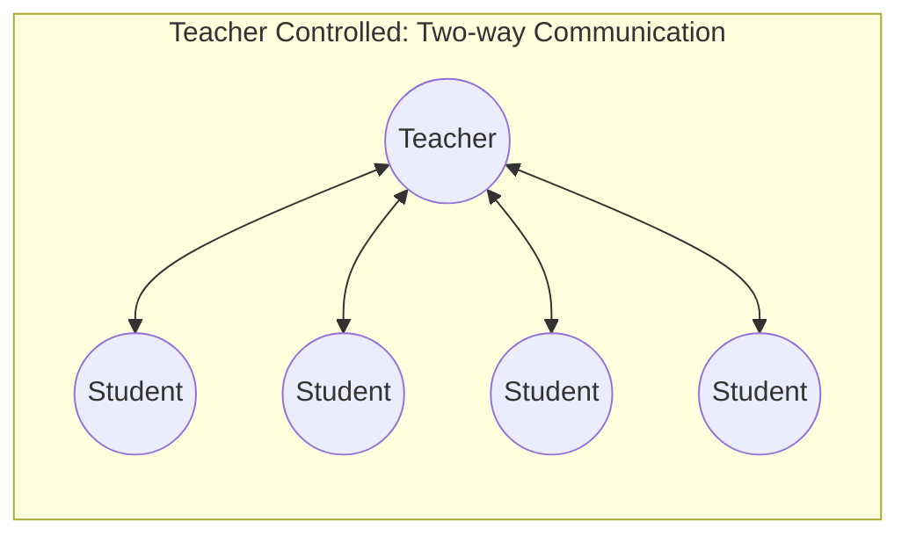
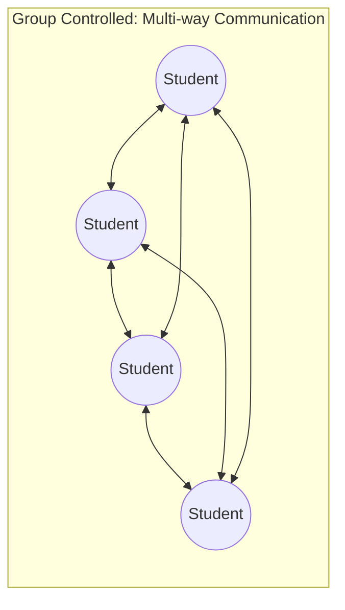
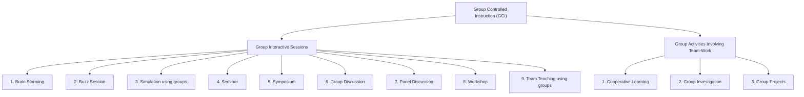

# 3. ACTIVITY BASED AND GROUP CONTROLLED INSTRUCTION (Part 2)
## Topics: 3.2.1 - 3.2.8 — Group Controlled Instruction

---

## 3.2 Group Controlled Instruction (GCI)

### 3.2.1 Introduction

Now we will look at **teaching methods** where **working together** and **joining in** are very important. These methods are different from traditional lecture-based methods. In lecture-based methods, only the teacher does the work. In **group teaching**, both the teacher and students **contribute together** to build skills.

!!! note "Alternative Names"
    Group Controlled Instruction is sometimes referred to as:

    - **Discovery Learning**
    - **Indirect Instruction**
    - **Group Centered Methods**

---

### 3.2.2 Group-Controlled Instruction (GCI) Concept and Definition

When we organize teaching so that **students do the learning activities together in a group**, we call it **GCI**. In GCI, every member of the group **takes an active part** in the learning activity.

- **Learning** happens because **group members talk to each other** and **learn by doing** work together. They support each other.
- The group creates a **friendly, active atmosphere**. This atmosphere helps everyone learn as a **team with shared support**.
- The **group takes responsibility** for organizing the learning tasks.

!!! important "Definition of GCI"
    **GCI** is a **way of teaching where learning depends on group interaction and shared support among group members**. In this method, the group takes responsibility for organizing the learning tasks.

#### Definitions by Educationists

| Educationist | Year | Definition / Description |
|---|---|---|
| **George Brown** | 1988 | Describes small group teaching as **"Getting students to talk and think"** — a short and clear description |
| **G.D. Borich** | 1988 | Highlights the key features of **inquiry, discovery and problem-solving**. These start *"a process where students rearrange and deepen their understanding of a topic"* |
| **Curzon** | 1990 | Talks of **"Exploring ideas together and judging them openly"** |

---

### 3.2.3 Importance of the Nature of GCI

#### (a) Importance

Both **teacher-controlled instruction** and **learner-controlled instruction** work well for building **thinking skills and practical skills** in individuals. However:

- In these modes, students start to feel they must **compete with each other** and beat one another
- This **takes away the fun** of learning for children and young students
- It does **not teach students how to live peacefully** in society

!!! tip "Why Supplement with GCI?"
    It is important to **add GCI** alongside teacher-controlled and learner-controlled instruction because GCI provides:

    - **Deeper understanding** of knowledge through group work and discussion
    - Better **ability to express ideas**
    - **Critical thinking**
    - **Tolerance** and a **feeling of belonging**
    - **Trust** and **team spirit**
    - **Habit of helping each other**

    In this way, GCI helps create **knowledgeable and skilled people**. These people can support a society with **democratic values**. This leads to peaceful life, success, and happiness.

#### (b) Nature of Group Methods

##### Purposeful

Discussion is at the heart of all group teaching. These methods try to **study a topic or problem** through **free sharing of ideas**. Students learn from each other by **putting their ideas together**. The goal is to **understand knowledge better and solve problems** — not just to get new facts. So it is **discussion with a purpose**.

##### Complex

Group teaching is **complex**. It combines the **strengths of individual instruction** with the **benefits of group interaction**.

##### Five Key Characteristics

**1. Learning**

Deeper learning from group teaching happens in **two ways**:

1. **Through revision** — going over what you already know to make it stronger
2. **Through re-structuring** — changing old knowledge into a new, better understanding

**2. Interaction**

The **communication patterns** between group members are of **two types**:

| Type | Description |
|---|---|
| **Two-way communication** | Only between **teacher and individual students** (Teacher Controlled) |
| **Multi-way communication** | Students talk **freely with one another** (Group Controlled) |

This decides whether the instruction is **teacher-centred** or **learner-centred**.

**3. Development**

Research on **group dynamics** (how groups behave) shows that each group goes through **several stages of growth**. Only then does it become a **united and productive learning group**.

**4. Leadership**

The teacher mostly decides the type of group activity and interaction. So the teacher's **'leadership' role** is very important. It needs **strong skills and the ability to adjust**. The teacher also needs to understand group dynamics.

The leadership role changes based on several factors:

- Purpose
- Structure
- Teacher style
- Degree of control desired
- Group characteristics

Good teaching guidance is essential. It will **help or block** group learning.

!!! important "Six Leadership Roles"
    | No. | Leadership Role |
    |---|---|
    | i) | **Initiator** |
    | ii) | **Motivator** |
    | iii) | **Facilitator** |
    | iv) | **Elaborator** |
    | v) | **Moderator** |
    | vi) | **Controller** |

**5. Student Engagement**

The teacher presents information, gives reading sources, asks questions, and discusses ideas. While doing this, the teacher **encourages the learner** to:

- Give **personal viewpoints** and interpretations
- Provide **examples**
- Justify **assumptions**
- Explore **relationships**
- Apply ideas to **new situations**
- Test for **confirmation**

!!! note
    As teacher, mentor, and coach, we make sure our students are doing **active and meaningful learning**. Modern group teaching helps students **understand hard concepts** and **correct wrong ideas**. It uses the best of the traditional **lecture-based approach** and modern **discovery strategies**. The teacher's skills are very important in these methods.

#### (c) Advantages, Objectives and Usefulness

**Advantages:**

Learning in interactive groups improves:

- **Critical thinking**
- **Problem-solving**
- **Communication skills**
- **Innovativeness**
- **Inter-personal skills**
- **Team skills**

All of these are in high demand today. The computer science field needs these skills because of current job market needs.

**Objectives and Usefulness:**

| Purpose | Methods / Examples |
|---|---|
| To make sure **every student takes part** | Pyramiding (building ideas step by step), Buzz groups |
| To **reorganize information** to a higher level of thinking | Debate, Case study, Mind-maps |
| To **reach agreement** | Nominal Group Technique |
| To **create many different ideas** | Fish bowl, Students' questions |
| To build **personal skills** (confidence, working with others, communication) | Simulation, Project work, Syndicates (small working groups) |
| To **solve problems** | Brainstorming, Case study |
| To **simplify a task** when the group gets 'stuck' | Buzz groups, Syndicates (small working groups) |

#### (d) Constraints Impose Limitations

Several limits and things needed beforehand make group teaching harder:

##### Limitations of Size

- Size limits are needed because small group teaching is **interactive by nature**
- Group size depends on the **type of interaction you want** and **practical needs**
- Most experts say **"not more than ten students"** to get the full benefits

##### Pre-requisite Knowledge

- To have a **useful discussion**, students need some **earlier knowledge or related experience**
- Teachers usually provide this through:
    - Earlier lectures
    - Reading assignments
    - Practical tasks
- A **short talk (lecturette)** just before group work often helps
- Be careful that this short talk does **not turn into a long speech** or another full lecture

##### Organization

Several practical problems can come up:

- **More staff** may be needed — this may not be possible if the student-to-teacher ratio is fixed by rules or budget
- **More time** may be needed — this can cause scheduling problems
- **Space and seating** must be comfortable and easy to rearrange
- **Seating arrangements** are very important — good setups include circular, semi-circular, and U-shaped (where **[L]** = lecturer and **O** = students)

---

### 3.2.4 Types of GCI

Based on the type of activities in group-controlled instruction, we can divide GCI into **two broad categories**:

1. **Group Interactive Sessions**
2. **Group Activities Involving Team-Work**

!!! note
    This grouping does not mean that team-work activities have no interaction. They also have interaction. We make this grouping based on whether the **main focus is on interaction or team work** and the **type of learning activities** involved.

| Group Interactive Sessions | Group Activities Involving Team-Work |
|---|---|
| 1. Brain Storming | 1. Cooperative Learning |
| 2. Buzz Session | 2. Group Investigation |
| 3. Simulation using groups | 3. Group Projects etc. |
| 4. Seminar | |
| 5. Symposium | |
| 6. Group Discussion | |
| 7. Panel Discussion | |
| 8. Workshop | |
| 9. Team Teaching using groups etc. | |

---

### 3.2.5 Group Interactive Sessions

In these sessions, group members **talk to each other**. They ask questions, seek explanations, share their views, examine others' views, and argue about decisions. In short, someone — a group member or the teacher — **introduces a topic**. Then the group discusses it.

#### 1. Elements of Interactive Sessions

To run an interactive session in a secondary or senior secondary school, you have two choices. All students can work on a task as one group. Or you can divide the class into smaller groups with separate activities.

!!! important "Four Main Elements of Interactive Sessions"
    | Element | Role |
    |---|---|
    | **Chairperson** | Chosen from the group to lead the session. Does not have to be the teacher — a student can lead too |
    | **Speaker** | The member who presents the topic. Good interaction happens only when members take part |
    | **Participants** | All group members who join in the discussion |
    | **Recorder** | The person who carefully writes down what happens in the session |

!!! note
    Students cannot join a discussion without some **basic information about the topic**. You must tell students about the activity and give them a short note on the topic.

#### 2. Pre-interactive Session Activities

It is important to **plan well** and **give proper attention** to interactive sessions.

**Allocation of Topics**

- Give topics to students so they can prepare for their presentation
- Give each student only a **small part** they can prepare and present in about **20 minutes**
- **Long topics** should be split among different students
- Suggest some **reference books** to the students
- Give out topics soon after **school reopens, within the first 10-15 days**
- This gives students enough time to prepare early
- As a teacher, keep a **record of which topics** you gave to which students

**Decide the Dates of Presentation**

**Guiding and Motivating Students for Preparation of Write-ups**

- Make sure every student prepares a write-up
- Encourage students to **start work right away** — such as reading books on the topic
- Help students find **reference books** and guide them in **writing their notes**
- You may need to give students **regular encouragement**

**Making Seating Arrangement**

**Orientation of the Students** — as to how it should be organized

**Circulating Write-ups in the Class** — is essential

**Demonstration Involving Team of Teachers**

- In the beginning, **teachers should do the first presentation**
- The chairperson and recorder can also be teachers
- **Encourage students to join in** along with the teachers
- Ask students to **watch the whole session carefully**. This way, they can later run sessions **on their own in the same way**

#### 3. Interaction by Teacher

The teacher plays **leadership roles** in different forms: **Initiator, Motivator, Facilitator, Elaborator, Moderator and Controller** in the Interactive Sessions.

**Climate Setting**

A **safe, friendly atmosphere** is important. Students need to feel they can talk and share ideas without fear of being embarrassed.

**Generating Interest**

You can create interest by:

- Using **students' names**
- Showing your own **enthusiasm**
- **Changing activities** often
- Connecting learning to the **'real world'**
- Showing that you **value students' ideas**

!!! tip "Motivating at the Start"
    At the start of each small group session, motivate students by:

    - **Explaining the purpose**
    - **Stating the goals**
    - **Telling the group** what the task is and how to do it

    You can also use **warm-up activities** like buzz groups or brainstorming. These help students come up with ideas, start thinking, or set an agenda. They are good ways to get a learning group excited.

**Encouraging Participation**

Active participation is **the key to small group teaching**. Your ability to make this happen decides how well students learn. You can encourage participation by:

- **Asking good questions**
- **Using sub-groups** — if the group is large
- Using methods that **help everyone take part**
- Managing members in a way that **encourages interaction**

#### 4. Closing the Interactive Session

- End the session **on time** or when students have nothing more to add
- Before ending, **highlight and summarize** the main views and arguments from the discussion
- Take **notes during the session** so you can do this
- Make some **comments about how the session went**
- Do this **without naming anyone** and without hurting anyone's feelings
- **Praise good behavior** and warn against bad behavior

#### 5. Interactive Sessions Conducted by Students

When group-controlled instruction becomes a **regular part** of school:

- One class period may be **too short** for an interactive session
- You may need to **divide the class into smaller groups** to discuss the topic better
- This makes sure **all students take part** in the discussion
- In a small group, students can **choose their own chairperson**
- When the **teacher is not there**, some shy students may feel more comfortable joining in

!!! important "Gradual Transition"
    - Let students run sessions only after they have **watched 8-10 sessions** led by the teacher
    - In some sessions, the teacher should sit as a **participant** and let students lead
    - During these sessions, the teacher should **guide the discussion** and give **feedback to the student chairperson**
    - This helps students learn to run sessions **by themselves**

#### 6. Post-interactive Session Activities

Interactive sessions in school are an **important part of the whole teaching process**. The goal of post-session activities is to **connect these sessions with the rest of the teaching**.

**Chief Post-interactive Session Activities:**

- **Holding a lecture-discussion**
- **Giving references** and encouraging students to use the library and prepare notes
- **Organizing hands-on or field activities**, and discussing them if needed
- **Checking what students learned** in knowledge, skills, and attitudes

After the session, **collect students' reactions, opinions, and suggestions** about how the session went. Use their views to **improve future sessions**. Also do a **proper evaluation**.

!!! note
    Everything discussed here applies to **all group interactive sessions**. It fits best for **general group discussions**. It also works for other types like **Brain storming, Seminar, Symposium, Panel discussion and Workshop**, with small changes.

#### Types of Group Interactive Sessions (Specific Methods)

##### 1. Brain Storming

**Brain storming** is a method used to collect a **large number of ideas**. These ideas aim to **solve a specific problem**. There are different brainstorming methods. They are usually **group creativity methods**. A group of people come together to find a **new solution to a specific problem**.

##### 2. Buzz Session

The word Buzz reminds us of **'Bee'**. In this session, all members work as **busy as a bee**. This short, fast-paced time helps the group suggest very useful solutions.

If you want all group members to be more active in discussions, try this: **divide the class into small groups** for short "buzz sessions". Each group discusses the topic and then **shares its ideas with the class**.

This is a good way to get **quick reactions** to new ideas, questions, or problems. Buzz sessions help increase **group communication, cooperation, and involvement**.

**Preparation:**

- At the end of the time, ask for **reports and questions**
- The session is short — only **5 to 8 minutes**
- Have the class **listen to each group's ideas** and discuss them briefly
- After all groups have shared, have the class **discuss all the ideas together**
- Let the discussion leader **sum up the ideas**

!!! tip
    A **Buzz session** is like a **smaller version of Brainstorming**. You can use it as a quick activity. You can even use it during a lecture because it only takes **5 to 8 minutes**.

**Some Sample Topics:**

- "Why should we learn computer science?"
- "How internet is useful?"
- "How should we punish those involved in computer crime?"
- "What should be due to stop virus problem?"

##### 3. Simulation

**Simulation** in classroom teaching means a **mix of role playing and problem solving**.

**Simulations as Games:** Simulation is also called **gaming**. Many groups have been formed to develop it. Simulation gaming is becoming a **powerful way to communicate** around the world.

**Steps in Simulation:**

1. Assign A, B, C — take students to provide **rotation**
2. Decide the **topic, plan, prepare**
3. Prepare **order of participative students**
4. Decide a **procedure for evaluation**
5. Provide **feedback**
6. Go to **next topic**

##### 4. Seminar

- **5 to 8 students** prepare papers or reports. They present them before a **group of classmates** as part of the course work
- **How long** each paper takes depends on the topic and subject area
- Papers can use visual aids:
    - **Projected aids** — filmstrips, slides, transparencies
    - **Non-projected aids** — charts, diagrams, maps, etc.
- After the presentation, the **whole group discusses** the paper
- **Active student participation** is expected
- Plan the **participants**, time for each paper, **chairperson**, and special guests

##### 5. Symposium

**What?** — A Symposium is a **group discussion** where **subject experts or speakers** with different views on the topic take part.

- Each speaker gives a **short speech** sharing their ideas
- The **moderator or chairperson** arranges speakers to cover different parts of the theme
- The chairperson **connects** the different presentations
- There are usually **no more than five speakers** (not counting the chairperson)
- The **audience rarely takes part**. The chairperson makes sure speakers cover likely questions in their talks

##### 6. Group Discussion

Group discussion is organized as follows:

| Component | Description |
|---|---|
| **The Leader** | The teacher |
| **The Group** | The students |
| **The Problem** | The topic |
| **The Content** | Knowledge chosen for discussion |
| **Evaluation** | Change in ideas, attitudes etc. |

**Example:** Computer enabled services

It could be based on **prepared papers**, special work project, could use **pictures, charts** etc.

##### 7. Panel Discussion

This is also a **group activity**. But only a **panel of experts** discusses the topic in front of an **audience**. The audience watches the discussion and then **asks questions**.

- In a panel discussion, **three or four speakers** discuss different parts of a **single topic** in the class
- One of them acts as the **chairperson to guide the discussion**
- A **time schedule is set**

##### 8. Workshop

As the name says, it is **group work to create something**. Like a technical workshop — but here, the material is **educational, not just technical**.

**Purpose:** To produce **real educational products or papers**

**Duration and Organization:**

- Workshops can last **2 or 3 days** or even a week with different activities
- They have **20 to 30 participants**
- A **general talk or full-group session** explains the activities and discussions to be done
- There may be **small group discussions** on how to create the product or report
- **Creating an educational product or report is required**

**Organization:**

- A **Programme Director** guides the work along with a **consultant**. They help with creating the product or report

**Uses:**

- Since the workshop involves **real work and hands-on tasks**, everyone stays interested and busy
- **Nobody gets bored or sleepy**, which can happen in lectures and seminars

**Activities:**

- Keep the number of participants to **20 to 30**. This way, they can form small groups. Everyone gets involved in **individual or group work**

##### 9. Team Teaching

Team teaching is based on the idea that **no single teacher is an expert in everything**. Team teaching needs **2 or more teachers working together**.

| Teacher Expertise | Area |
|---|---|
| Some teachers may be experts in | **Teaching** |
| Some may be very good in | **Using multimedia or teaching aids** based on EJ |
| Some may be very good in | **Group organization** |
| Others may be excellent in | **Organization of field trips** |

Team teaching lets you **use the strengths of all teachers** for all students. It works best for **subjects that mix different fields**, like Sciences and Social Sciences.

**Procedure of Organisation:**

Team teaching serves many purposes. It has different forms and types. It involves these steps:

- **Step 1** — Planning
- **Step 2** — Organizing
- **Step 3** — Evaluating

**Operation:**

Team teaching works best when a lecture to a **large group** is followed right away by **small group discussion**. All the teachers guide these discussions.

The large group is split into **small groups of students with similar abilities**. The teachers give **personal attention** and work as **helpers or advisors** to these small groups. You can form these groups based on students' **abilities, interests, needs, and achievements**.

**Phases of Ideal Team Teaching:**

1. **Planning**
2. **Lecture**
3. **Group work**

---

### 3.2.6 Co-operative Learning Methods

To help students build skills of **cooperation, feeling of belonging, and team spirit** — and to reduce **competition between individuals** — you should use **cooperative learning methods**. Cooperative learning is **not individual learning**. It is **group or peer learning**.

In cooperative learning, students work together to **reach a common goal**. Students **take part more** and get **more involved**. Cooperative learning creates stronger **inner motivation** (wanting to learn for yourself) than individual learning. The **feeling of belonging** builds positive attitudes and **team spirit**. Cooperative learning is especially useful for learning **different skills and knowledge**.

#### a) Organizing Cooperative Learning

To organize cooperative learning, make sure students **work in groups**. Each group member should work **together** to reach the common goal.

**Specific activities to organize:**

**i) Formation of Groups**

- Divide the class into **small groups**
- When forming groups, think about the **differences** among students — **gender, ability level, background**, etc.
- Each group should be a **mix of the class**: boys, girls, above average, average, and below average students
- Try to include students from **different communities** in each group

**ii) Preparation of Cooperative Learning Sheets**

- Prepare these sheets for **all the topics** you will teach through cooperative learning
- These learning sheets include:
    - **Objectives**
    - **Activities** for group members to do, based on the topic
    - **Test items** based on the objectives

**iii) Orientation to the Students**

- Students are used to working alone. You need to **train them properly** to work together
- Tell them how cooperative learning will work
- Every learning point should be **discussed as a group**
- A student who does not understand can get **help from another student**
- Tell them they will **not be graded individually**. The whole **group's performance** shows the group's progress
- The group must make sure **every member learns every concept**
- They should work as a **team to reach the goals**

**iv) Conducting the Cooperative Learning Session**

- Set aside **time for cooperative learning** and give the learning sheets to each group
- Groups should do the activities following the **instructions on the sheets**
- The sheets should give students **freedom to adjust**
- Students can **change the activities** to fit their group's needs
- They can **discuss problems, ask questions, explain ideas, and solve problems** as they like
- The group can **check each member's work**. If someone makes mistakes, **others can help**
- The teacher should watch how well the groups are working together
- Give **feedback** to each group about whether they are on the right track
- At the end, each group should **report** what they did and how they performed
- The reported performance should be the **average performance of the group**

#### b) Advantages of Cooperative Learning

In cooperative learning, students create a **relaxed setting** based on **depending on each other**. Fellow students support them. Students are free to explore ideas, discuss with friends, sharpen their thinking, get help, and help others.

!!! important "Key Advantages"
    - Students can often **put the teacher's words into their own words**. This helps them understand better
    - Students **learn by actually taking part** in the teaching-learning process. They must organize their thoughts to explain ideas to classmates. This **deep thinking** greatly improves their understanding
    - Students can give **personal attention** and help to each other. Since they can freely ask classmates for help, their **learning results will be much better**

---

### 3.2.7 Group Investigation

At the school level, some topics raise **doubts and questions** in students' minds. Students cannot find answers in their textbooks. To answer such questions, they need to **investigate the topic**.

Some problems have answers that are **not easy to find**. Some problems are too big for **one student to investigate alone**. In such cases, it is better to do a **group investigation**.

!!! note
    Group investigation works well at the school level. To make it successful, your **guidance to students** is very important. All students in a group investigation will follow these steps.

#### Process of Group Investigation

**1. Group Formation and Selection of Members Deciding Problem or Topics**

- You can suggest some **example problems**. Then guide the groups to pick a **good problem** to investigate

**2. Cooperative Planning of Investigations**

The group members will plan their work:

- **What evidence to collect**
- **Where to find the evidence**
- **Who does what** — dividing the work among members
- **How much time** to spend on the investigation
- How the **data will be studied** and who will do it
- How the **report** will be written
- **Set a time limit** for each activity

**3. Implementation**

- Do the investigation work following the **plan**
- Every member should try their best to **finish their tasks on time**
- Collect evidence from **all the sources and areas**

**4. Analysis and Synthesis**

- **Study** the collected evidence
- Plan the presentation
- Put the findings together **in a logical way** to reach **correct results**

**5. Preparation of Report and Presentation**

- Write a report of the work done
- The report should explain **how the work was done** and **what the group found**
- Keep the report **short — just a few pages**
- It should **not be too technical** — just a clear write-up
- The **group coordinator** should present it

**6. Evaluation**

- Check the **work of each group** based on how they solved the problem
- Judge whether the **evidence is enough and correct**
- Judge whether the **answers are logical** and based on facts
- **Give feedback** to the group

!!! tip
    Group investigation needs **a lot of guidance** to work well. The knowledge students gain this way helps them understand how **children learn in groups and on their own**.

---

### 3.2.8 Group Projects

Sometimes, group investigation can be a **project**. Project work is a **broader idea**. It includes investigation or any other activity that can be completed as a whole.

At the school level, many activities **cannot be done by one person alone**. They need a **group of students working together**.

#### Strategies for Successful Group Projects

##### 1) Create Interdependence

Some teachers are fine if students give up and work alone. Others want real teamwork. If **teamwork is your goal**, design projects so that students **depend on each other** (this is called interdependence).

**Ways to Create Interdependence:**

- **Make projects complex enough** so students must use each other's knowledge and skills
- **Set shared goals** that only teamwork can achieve
- **Limit resources** so students must share important information and materials
- **Give each person a role** in the group to encourage working together

##### 2) Devote Time Specifically to Teamwork Skills

- **Don't assume** students already know how to work in groups
- Even if students have done group projects before, they may **not have good teamwork skills yet**
- Teamwork skills from one setting (like a school play) may **not work** in another (like a design project with a real client)

**To work well in groups, students need to learn how to do things together that they may only know how to do alone, such as:**

- Judge the **size and difficulty** of a task
- **Break the task** into steps
- **Plan a strategy**
- **Manage time**

**Students also need to handle issues that only come up in groups, such as:**

- **Explain** their ideas to others
- **Listen** to different ideas and views
- **Reach agreement**
- **Share responsibilities**
- **Coordinate efforts**
- **Solve disagreements**
- **Combine** the work of all team members

**Strategies:**

- **Stress** the real-world importance of strong teamwork skills

##### 3) Build in Individual Accountability

A student can work hard in a group but still **miss important parts** of the project. To check whether each student truly understands the material, you need to **build individual accountability** into group assignments.

!!! important "How to Build Individual Accountability"
    Besides checking the **group's work as a whole**, ask each group member to show their learning through:

    - **Quizzes**
    - **Independent write-ups**
    - **Weekly journal entries**

    This helps you track student learning. It also stops the **"free-rider" problem** (when some students let others do all the work). Students are much less likely to leave work to others if they know their **own performance affects their grade**.

**Methods to Create Individual Accountability:**

- Combine a **group project with an individual quiz** on the topic
- Base part of the grade on a **group product** (e.g., report, presentation, design, paper) and part on an **individual submission**
- The individual part might include:
    - A summary of the group's **decision-making process**
    - A list of **lessons learned**
    - A description of what the student **personally contributed to the group**

---
