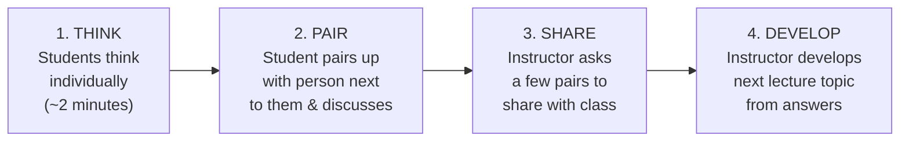
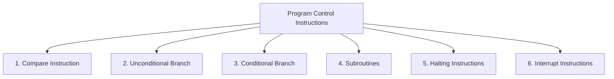

# 3. ACTIVITY BASED AND GROUP CONTROLLED INSTRUCTION (Part 3)
## Topics: 3.3 - 3.4 — Activities, Computer Architecture & Self Assessment

---

## 3.3 Activities

---

### 3.3.1 Computer Science Activities

Every high school student should become familiar with the **basic concepts of computer science**, whether or not they plan to pursue a career path in this field.

Activities involving computer science can be organized to build understanding and interest. **Four computer science activities** are described below:

| # | Activity | Description |
|---|----------|-------------|
| 1 | **Robotics** | Students are introduced to computational thinking, pattern recognition, and algorithm design — essential for pursuing a career |
| 2 | **Coding Lessons** | Students and teachers both can develop coding lessons as an activity, gaining knowledge of theory and practice |
| 3 | **Building Computers** | Parts and kits to build computers are available; with the help of a CS teacher, students could build computers and develop knowledge |
| 4 | **Field Trips** | Teachers can take students on field trips to computer exhibitions, production centres/factories, and places where large quantities of computers are used |

!!! note "Key Idea"
    Understanding computer science through **hands-on activities** builds both theoretical knowledge and practical skills.

---

### 3.3.2 Active Learning and its Use in Computer Science

Student learning and the **depth of the student's knowledge increase** when active learning methods are employed in the classroom.

#### 1) Introduction

- **Active learning** gets students involved in activity in the classroom rather than passively listening to a lecture
- Activity can be **reading, writing, discussing, solving a problem**, or responding to questions that require more than factual answers
- The idea is to get students **thinking about the material**
- Students who are passive have a **decline in concentration after 10–15 minutes** in a 50-minute lecture

!!! important "Why Active Learning Matters"
    The act of learning is **not passive**. As faculty, we learn actively — we read, compare with our experiences, synthesize into coherent notes, and develop examples. This leads to greater understanding. Unfortunately, we then use this understanding to lecture to students, **depriving them of this journey of discovery**.

#### Why Active Learning is Successful

By carefully involving students on the path to knowledge, we can **increase the depth of understanding** of the material.

#### Risks and How to Minimize Them

**Why is active learning not used more frequently?** Because there are perceptions that:

| Risk / Perception | Reality |
|---|---|
| Content will have to be taken out | Give students responsibility for factual material so they can apply it in class discussion |
| Class preparation time is higher | True, but manageable with planning |
| Active learning is not appropriate for large classes | Can be adapted with structured activities |
| **Largest fear**: Giving up control of the classroom | Real but surmountable |

!!! tip "Controlling the Level of Risk"
    - Select **short, highly structured, and well-planned activities** → level of risk is fairly low
    - Asking a **series of questions** about the current topic allows the teacher to control direction and content while keeping students active
    - Breaking students into **small groups** to independently solve a problem is higher risk but can be **highly rewarding**

#### Active Learning Strategies

##### Think-Pair-Share Technique

An activity that leads to a discussion is to **pose a question** and then employ the **'think-pair-share'** technique:



**In computer science class**, we could pose questions like:

- *"What will happen if I change this input?"*

#### 2) Algorithm Tracing

Instead of tracing the execution of an algorithm in a lecture, **break the students into groups** and have them trace the algorithm.

**Example — Comparing Sorting Algorithms:**

Break up the class into **groups of four students** each. Assign roles:

| Role | Responsibility |
|------|---------------|
| **Algorithm Tracer** | Traces the step-by-step execution of the algorithm |
| **Variable Tracker** | Keeps track of the variable values at each step |
| **Operation Counter** | Records the number of additions/multiplications performed |
| **List Recorder** | Records the changes to the list |

!!! tip "Practical Tip"
    By providing each team with **transparencies and markers**, teams can easily display their answers to the rest of the class. By then running an **implementation of the algorithm**, group results can be quickly compared with the actual answer.

#### 3) Demonstration Software

- In a classroom with a **projection unit** connected to a computer system running **demonstration software**, the instructor has a powerful tool to have students interact with the ideas of computer science
- By dividing the students into groups, you can ask them to **predict what will happen** to the output based on changes to the input or the algorithm
- A **large amount of software** of this type has been developed for a number of areas of computer science
- This is **readily available through the internet**

#### 4) Physical Activities

- **Role playing** can be a powerful tool in the computer science classroom
- To have students understand **network protocols**, you could have the class **passing a ball around** during a discussion, letting students talk **only if they have the ball**
- Several such activities could be planned

#### Conclusion

!!! important "Balance is Key"
    - There is a need to have a **balance between instructor presentations and student activities**
    - Some lecture is necessary to discuss things the instructor views as **critical or difficult to understand**
    - It is also important that there be **some activity** to get students active in the classroom
    - Adopting active learning techniques **can be risky** for faculty, but the risk can be **minimized by choosing short, well-structured activities**

---

### 3.3.3 Three Methods of Instruction

Determining which method of instruction to use can sometimes be difficult, because there are **many different instructional methods** which may be used. Each method has certain **advantages and disadvantages**; some are more suited for certain kinds of participation by students. One method, or perhaps a **combination of methods**, is usually most appropriate for most subject matter and objectives.

!!! note "Common Methods"
    The common methods of instruction are: **Instructor-led, Lecturer, Demonstrator, Practical Exercise**, and the **Self-study**.

    For each of these methods (except self-study), someone will be doing something to teach whatever it is you are there to learn.

Based on your subject matter, you will need to determine which instructional method will **best showcase the information** you will be teaching.

#### Instructor-Led Method

- This is the **most common** used method of instruction
- The instructor becomes the **sole disseminator of information**
- The instructor presents information to the student **systematically**
- Considered the **best method** because the instructor interfaces with students by:
    - Presenting **segments of instruction**
    - **Questioning** the students frequently
    - Providing **periodic summaries** or logical points of development

#### Lecturer Method

- Also a **widely used** method of instruction
- The lecture becomes the **sole disseminator** of information
- **Interaction with students is often limited** by the lectures
- When presenting segments of instruction, students frequently have only the choice of **listening to what is being presented**

#### Demonstration Method

- The demonstration method is one where the **student observes** the portrayal of a **procedure, technique, or operation**
- The demonstration method shows **how to do something** or **how something works**

#### Practical Exercise (PE)

A practical exercise may take **many forms**. Basically, it is a method of training in which the student **actively participates**, either individually or as a team member, by applying **previously learned knowledge or skills**.

- All students **actively participate**, although they may work at their own rate
- Students **may or may not** be required to follow a set sequence

##### Forms of Practical Exercise

| Form | Description |
|------|-------------|
| **Controlled PE** | Student is guided **step-by-step** through a technique or operation. Characterized by: (1) Students are **checked by the instructor** prior to continuing to the next step; (2) A **mistake is corrected** before the student is allowed to proceed |
| **Practice Method** | Students (alone or as part of a team effort) **repeatedly perform** previously learned actions, sequences, operations, or procedures |

##### Practice Method Sub-Types

| Sub-Type | Description |
|----------|-------------|
| **Case Study / Team Practice** | Student performs as a **member of a group** to solve a problem with a team solution or practice a sequenced task |
| **Coach and Pupil** | Student performs **individually** while being observed by the coach. The coach ensures the student performs the action or process **correctly**. When the student completes a given task, roles switch — the student becomes the coach and the coach becomes the pupil |
| **Independent** | The student **independently** applies prior skills or knowledge gained. The student may ask the instructor's advice if necessary |

---

### 3.3.4 Four Types of Instructional Activities

#### 1. Robotics

- Through robotics, students are introduced to **computational thinking, pattern recognition, and algorithm design** — all necessary for pursuing a career in **STEM**
- Students use these skills to **program their own robots** to move, make noise, light up, and follow other instructions
- Students are challenged to use their **creativity** and continuously **improve upon their robot designs** — just like scientists and engineers do every day

!!! note "FIRST Technical Challenge (FTC)"
    Marlborough is home to an award-winning **FIRST Technical Challenge (FTC)** robotics program. Students from **all grade levels** participate in the construction and programming of robots designed to compete in scrimmages and tournaments.

#### 2. Coding Lessons

- Students can learn to code their own **websites, animations, and even video games**
- They can learn the basics of **multiple programming languages** or become proficient in one particular language

!!! important "Concepts Over Syntax"
    Understanding the **underlying computer science concepts** and applying them to **real-world problems** is more important than the coding language itself.

- Students also dive deep into **object-oriented programming with Java**
- Learn **industry-standard techniques** for testing and debugging
- Apply everything they learn to a **year-long software project**

#### 3. Building Computers

- Students can use **premade assembly kits** to build their own computers
- It may sound intimidating at first, but building a simple system may take as little as **an hour**
- Students can then **program their computers** to do specific things — develop apps, build websites, create games, and more
- Building their own computers allows them to understand the **technical side** of what happens when they write and execute a line of code

!!! tip "Innovative Technologies"
    In computer science classes, innovative technologies including **Arduino microcontrollers** and **Raspberry Pi mini-computers** are used to give students a better look at computers that are built today.

#### 4. Field Trips

- Nothing excites students as much as an opportunity to take a **field trip**
- Field trips allow students to **imagine themselves** in the role of a computer scientist or software developer
- Annual **outreach events and field trips** show students the real-world applications of STEM education
- By interacting with the **local engineering and computer science community**, students understand the value of STEM education and begin imaging themselves in **STEM roles** in the future

---

### 3.3.5 Pros & Cons of Group Controlled Instruction

**Group controlled instruction** is organized in such a manner that students carry out their instructional activities together in a group; every student sometime or other participates in the activities.

#### Advantages of Group Controlled Instruction

| Advantage | Explanation |
|-----------|-------------|
| **New Perspective** | "Two heads are better than one" — students working together on problem-solving tasks are more likely to **experiment with different techniques**. They can also **learn faster** from positive and negative feedback. Students learn better by **questioning each other's opinions and reasoning**, developing different perspectives. This promotes **cognitive restructuring**, enhancing academic, social, and emotional learning. |
| **Personal Satisfaction** | Working in a group can be tough. When students overcome all the conflict, stress, and long hours, the end result of getting a good grade can be **extremely satisfying and motivating**. |
| **Teamwork Skills** | Teamwork allows students to explore **complex tasks** they otherwise wouldn't have done alone, enhancing both individual and collective skills. Provides opportunity to improve **communication skills, collaboration**, and a larger capacity for **brainstorming different ideas**. |
| **Enhances Learning** | Working in a group environment facilitates learning and collaborative skills. Learning in a group leads to **better memory recall** and understanding — students remember more from **group discussions** than if they listened to the same content in a more instructional format. |
| **Learn to Overcome Conflict** | Some teachers argue that conflict during group work can actually be a **good thing** — representative of experiences students will have in their **future workplaces**. By experiencing it in a more controlled setting, students learn about **communication skills** and how to **resolve interpersonal issues** more safely. Group work also allows students to develop a **better understanding of themselves** and how their peers view them through **constructive feedback**. |

#### Disadvantages of Group Controlled Instruction

| Disadvantage | Explanation |
|--------------|-------------|
| **Presence of Conflict** | It is quite natural to have **difference of opinion** and conflict, which may create to some extent **emotional issues** |
| **Unequal Participation** | All students may not get opportunity all the time to **contribute**. In case of large groups, it becomes more difficult |
| **Avoiding the Task** | Sometimes the discussion may be **off-topic**. Some students may not be fully involved. It is quite natural and unavoidable |
| **Time Consuming** | Researchers have argued whether the **time-consuming nature** of group strategies made the work ineffective. More research is emerging about **when not to use** group work in the classroom. For simpler tasks, students could complete them **individually** |
| **Individual Needs Affected** | There will be **individual differences** in time and completion of task, which will have impact on understanding and learning |

#### Final Thoughts

!!! note "Final Thoughts"
    **Group learning can be effective** regardless of people's socioeconomic status and other deficiencies.

---

## Control Instructions in Computer Architecture

**Program Control Instructions** are the machine code that are used by machine or in assembly language by user to command the processor to act accordingly.

- These instructions are of **various types**
- Used in **assembly language** by user
- In high-level language, user code is **translated into machine code** and thus instructions are passed to instruct the processor to do the task

### Types of Program Control Instructions



#### 1. Compare Instruction

- **Compare instruction** is specifically provided
- Similar to a **subtract instruction** except the **result is not stored** anywhere
- **Flags are set** according to the result

**Example:**

```
CMP R1, R2
```

---

#### 2. Unconditional Branch Instruction

- Causes an **unconditional change of execution sequence** to a new location

**Example:**

```assembly
JUMP L2
MOV R3, R1       ; goto L2
```

---

#### 3. Conditional Branch Instruction

- Used to examine the values stored in the **condition code register**
- Determines whether the **specific condition exists** and branches if it does

**Example:**

```assembly
Assembly Code  : BE R1, R2, L1
Compiler allocates R1 for x and R2 for y
High Level Code: if (x==y) goto L1;
```

---

#### 4. Subroutines

- A subroutine is a **program fragment** that lives in user space
- Performs a **well-defined task**
- It is **invoked by another user program** and **returns control** to the calling program when finished

**Example:**

| Instruction | Purpose |
|-------------|---------|
| **CALL** | Invokes the subroutine; saves return address |
| **RET** | Returns control to the calling program |

---

#### 5. Halting Instructions

| Instruction | Description |
|-------------|-------------|
| **NOP** (No Operation) | Causes **no change** in the processor state other than an advancement of the **Program Counter**. Used to **synchronize timing**. |
| **HALT** | Brings the processor to an **orderly halt**, remaining in an **idle state** until restarted by **interrupt, trace, reset, or external action** |

---

#### 6. Interrupt Instructions

**Interrupt** is a mechanism by which an I/O instruction can **suspend the normal execution** of a processor and get itself serviced.

| Instruction | Description |
|-------------|-------------|
| **RESET** | Resets the processor. This may include setting all or some registers to an **initial value** or setting the program counter to a **standard starting location** |
| **TRAP** | A **non-maskable**, edge and level triggered interrupt. TRAP has the **highest priority** and is a **vectored interrupt** |
| **INTR** | A **level triggered** and **maskable** interrupt. Has the **lowest priority**. Can be **disabled by resetting** the processor |

!!! important "Interrupt Priority Order"
    **TRAP** (highest) → **RESET** → **INTR** (lowest)

---

## 3.4 Test Items for Self Assessment

### I. Choose the Correct Answer (MCQs)

**1. Role play is:**

- (a) An Activity Based Instruction ✓
- (b) Playing in the ground
- (c) An incident method
- (d) It is relating to drama

**2. Gaming instruction is:**

- (a) Playing with balls
- (b) One of the activity based instruction ✓

**3. Group investigation is:**

- (a) Talking with each other in group
- (b) It is purposeful interaction
- (c) Playing together
- (d) Teacher took after the group

**4. Buzz session is:**

- (a) One of the characteristics of Group Methods
- (b) Teaching each other in group

---

### II. Answer in 250 Words

5. What is symposium? What are its benefits?

6. Give any example for group projects and explain.

7. What is simulation in teaching? Explain with example.

8. Describe active learning in computer science.

9. Four types of instructional activities — explain.

---

### III. Answer in 500 Words

10. What is cooperative learning method? Elaborate with more details.

11. What is the nature of group controlled instruction? Why should it be adopted? Describe with details.

12. Explain control instructions in computer architecture.

13. Explain pros and cons of Group Controlled Instructions.

---

!!! tip "Exam Preparation Checklist"
    - [ ] Can you explain the **think-pair-share** technique?
    - [ ] Can you list the **4 roles** in algorithm tracing groups?
    - [ ] Can you name the **3 methods of instruction** and their sub-types?
    - [ ] Can you describe the **4 types of instructional activities**?
    - [ ] Can you list **5 advantages and 5 disadvantages** of group controlled instruction?
    - [ ] Can you explain all **6 types of program control instructions** with examples?
    - [ ] Can you differentiate between **TRAP, RESET, and INTR** interrupts?
