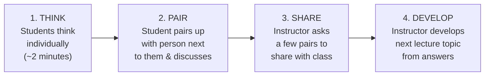
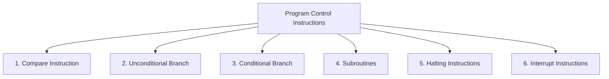

# 3. ACTIVITY BASED AND GROUP CONTROLLED INSTRUCTION (Part 3)
## Topics: 3.3 - 3.4 — Activities, Computer Architecture & Self Assessment

---

## 3.3 Activities

---

### 3.3.1 Computer Science Activities

Every high school student should learn the **basic concepts of computer science**. This is true even if they do not plan a career in this field.

Teachers can organize activities to build understanding and interest. **Four computer science activities** are described below:

| # | Activity | Description |
|---|----------|-------------|
| 1 | **Robotics** | Students learn computational thinking, pattern recognition, and algorithm design. These skills are important for a career in technology |
| 2 | **Coding Lessons** | Students and teachers can create coding lessons together. This helps them learn both theory and practice |
| 3 | **Building Computers** | Parts and kits are available to build computers. With help from a CS teacher, students can build computers and gain knowledge |
| 4 | **Field Trips** | Teachers can take students to computer exhibitions, factories, and places that use many computers |

!!! note "Key Idea"
    Learning computer science through **hands-on activities** builds both theory knowledge and practical skills.

---

### 3.3.2 Active Learning and its Use in Computer Science

Students learn more deeply when teachers use **Active Learning** methods in the classroom.

#### 1) Introduction

- **Active Learning** means students do things in class instead of just listening to a lecture
- Activities can include **reading, writing, discussing, solving a problem**, or answering questions that need more than simple facts
- The goal is to get students **thinking about the material**
- Students who just sit and listen **lose focus after 10–15 minutes** in a 50-minute lecture

!!! important "Why Active Learning Matters"
    Learning is **not passive**. As teachers, we learn actively — we read, compare with our experience, organize our notes, and create examples. This gives us deep understanding. But then we lecture to students, **taking away their chance to discover things on their own**.

#### Why Active Learning is Successful

When we carefully involve students in the learning process, we can **help them understand the material more deeply**.

#### Risks and How to Minimize Them

**Why don't more teachers use active learning?** Because they believe that:

| Risk / Perception | Reality |
|---|---|
| Content will have to be removed | Let students study facts on their own. Then they can apply them in class discussion |
| Class preparation time is higher | True, but you can manage it with good planning |
| Active learning does not work for large classes | You can adapt it with well-planned activities |
| **Biggest fear**: Losing control of the classroom | Real, but you can overcome it |

!!! tip "Controlling the Level of Risk"
    - Choose **short, well-planned, and clear activities** → the risk stays low
    - Asking a **series of questions** about the topic lets the teacher control the direction. Students still stay active
    - Putting students into **small groups** to solve a problem is riskier. But it can be **very rewarding**

#### Active Learning Strategies

##### Think-Pair-Share Technique

A good way to start a discussion is to **ask a question** and then use the **'think-pair-share'** technique:



**In computer science class**, we could ask questions like:

- *"What will happen if I change this input?"*

#### 2) Algorithm Tracing

Instead of tracing an algorithm yourself in a lecture, **put students into groups** and let them trace the algorithm.

**Example — Comparing Sorting Algorithms:**

Split the class into **groups of four students** each. Give each student a role:

| Role | Responsibility |
|------|---------------|
| **Algorithm Tracer** | Follows the algorithm step by step |
| **Variable Tracker** | Writes down the value of each variable at every step |
| **Operation Counter** | Counts the number of additions and multiplications done |
| **List Recorder** | Writes down how the list changes at each step |

!!! tip "Practical Tip"
    Give each team **transparencies and markers**. Teams can then show their answers to the whole class. Next, run the **actual algorithm on a computer**. Teams can quickly compare their results with the correct answer.

#### 3) Demonstration Software

- If the classroom has a **projector** connected to a computer with **demonstration software**, the teacher has a powerful tool for student interaction
- Put students into groups. Ask them to **predict what will happen** when you change the input or the algorithm
- **Many software tools** like this exist for different areas of computer science
- You can find them **easily on the internet**

#### 4) Physical Activities

- **Role playing** can be a powerful tool in the computer science classroom
- To help students understand **network protocols**, have the class **pass a ball around** during a discussion. Students can speak **only if they hold the ball**
- You can plan many such activities

#### Conclusion

!!! important "Balance is Key"
    - You need a **balance between teacher presentations and student activities**
    - Some lecture is needed to explain things the teacher sees as **important or hard to understand**
    - It is also important to include **some activity** so students stay active in class
    - Using active learning **can feel risky** for teachers. But you can **reduce the risk by choosing short, well-planned activities**

---

### 3.3.3 Three Methods of Instruction

Choosing the right teaching method can be hard. There are **many different methods** to choose from. Each method has **advantages and disadvantages**. Some work better for certain types of student participation. Often, one method or a **combination of methods** works best for a given topic and goal.

!!! note "Common Methods"
    The common methods of instruction are: **Instructor-led, Lecturer, Demonstrator, Practical Exercise**, and the **Self-study**.

    For each of these methods (except self-study), someone will be teaching you what you need to learn.

Based on your subject, you need to decide which method will **best present the information** you are teaching.

#### Instructor-Led Method

- This is the **most common** method of instruction
- The instructor is the **only provider of information** (the sole information provider)
- The instructor presents information to students **in an organized way**
- It is considered the **best method** because the instructor works with students by:
    - Presenting **small parts of the lesson**
    - **Asking questions** often
    - Giving **regular summaries** at key points

#### Lecturer Method

- This is also a **widely used** method of instruction
- The lecturer is the **only provider** of information
- **Students have little chance to interact** during lectures
- Students can usually only **listen to what is being said**

#### Demonstration Method

- In this method, the **student watches** the display of a **procedure, technique, or operation**
- It shows **how to do something** or **how something works**

#### Practical Exercise (PE)

A practical exercise can take **many forms**. It is a training method where the student **actively takes part**. Students work alone or in a team. They apply **knowledge or skills they learned before**.

- All students **actively take part**. They may work at their own speed
- Students **may or may not** need to follow a set order of steps

##### Forms of Practical Exercise

| Form | Description |
|------|-------------|
| **Controlled PE** | The teacher guides the student **step by step** through a task. Key features: (1) The teacher **checks the student's work** before they move to the next step; (2) Any **mistake is fixed** before the student continues |
| **Practice Method** | Students (alone or in a team) **repeat** actions, steps, or tasks they already learned |

##### Practice Method Sub-Types

| Sub-Type | Description |
|----------|-------------|
| **Case Study / Team Practice** | The student works as a **team member** to solve a problem or practice an ordered task together |
| **Coach and Pupil** | The student works **alone** while a coach watches. The coach makes sure the student does the task **correctly**. After the task is done, they switch roles — the student becomes the coach, and the coach becomes the pupil |
| **Independent** | The student works **on their own** using skills or knowledge they already have. They can ask the teacher for help if needed |

---

### 3.3.4 Four Types of Instructional Activities

#### 1. Robotics

- Through robotics, students learn **computational thinking, pattern recognition, and algorithm design**. These are all needed for a career in **STEM**
- Students use these skills to **program their own robots**. The robots can move, make sounds, light up, and follow commands
- Students are pushed to use their **creativity**. They keep **improving their robot designs** — just like real scientists and engineers do

!!! note "FIRST Technical Challenge (FTC)"
    Marlborough is home to an award-winning **FIRST Technical Challenge (FTC)** robotics program. Students from **all grade levels** build and program robots. They compete in scrimmages and tournaments.

#### 2. Coding Lessons

- Students can learn to code their own **websites, animations, and even video games**
- They can learn the basics of **many programming languages** or become skilled in one language

!!! important "Concepts Over Syntax"
    Understanding the **core computer science ideas** and using them to solve **real-world problems** matters more than the coding language itself.

- Students also study **object-oriented programming with Java** in depth
- They learn **industry-standard methods** for testing and debugging
- They apply everything to a **year-long software project**

#### 3. Building Computers

- Students can use **ready-made kits** to build their own computers
- It may sound scary at first. But building a simple system can take as little as **one hour**
- Students can then **program their computers** to do things — make apps, build websites, create games, and more
- Building their own computers helps them understand **what happens inside** when they write and run code

!!! tip "Innovative Technologies"
    In computer science classes, new technologies like **Arduino microcontrollers** and **Raspberry Pi mini-computers** help students see how modern computers are built.

#### 4. Field Trips

- Nothing excites students more than a **field trip**
- Field trips let students **picture themselves** as a computer scientist or software developer
- Yearly **outreach events and field trips** show students how STEM education is used in the real world
- By meeting people in the **local engineering and computer science community**, students see the value of STEM education. They start to imagine themselves in **STEM careers**

---

### 3.3.5 Pros & Cons of Group Controlled Instruction

**Group controlled instruction** is set up so that students do their learning activities together in a group. Every student takes part in the activities at some point.

#### Advantages of Group Controlled Instruction

| Advantage | Explanation |
|-----------|-------------|
| **New Perspective** | "Two heads are better than one." Students who work together on problems are more likely to **try different methods**. They also **learn faster** from good and bad feedback. Students learn better when they **question each other's ideas**. This helps them see things differently. It improves their thinking (called **cognitive restructuring**), and helps them grow in academic, social, and emotional ways. |
| **Personal Satisfaction** | Working in a group can be hard. But when students get through the stress and long hours, getting a good grade feels **very satisfying and motivating**. |
| **Teamwork Skills** | Teamwork lets students try **harder tasks** they could not do alone. It builds both personal and group skills. Students improve their **communication, teamwork**, and ability to **share different ideas**. |
| **Enhances Learning** | Working in a group helps students learn and work together. Group learning leads to **better memory** and understanding. Students remember more from **group discussions** than from just listening to a lecture. |
| **Learn to Overcome Conflict** | Some teachers say that conflict in group work can be a **good thing**. It is similar to what students will face in their **future jobs**. In a safe classroom setting, students learn **communication skills** and how to **solve problems with others**. Group work also helps students **understand themselves better**. They get **helpful feedback** from their classmates. |

#### Disadvantages of Group Controlled Instruction

| Disadvantage | Explanation |
|--------------|-------------|
| **Presence of Conflict** | It is normal to have **different opinions** and disagreements. This can sometimes cause **emotional problems** |
| **Unequal Participation** | Not all students get a chance to **contribute** every time. In large groups, this problem gets worse |
| **Avoiding the Task** | Sometimes the discussion goes **off-topic**. Some students may not fully take part. This is normal and hard to avoid |
| **Time Consuming** | Some researchers question whether group work **takes too much time** and becomes less useful. More studies now look at **when not to use** group work. For simple tasks, students could work **on their own** |
| **Individual Needs Affected** | Students differ in how fast they work and finish tasks. This **affects their understanding and learning** |

#### Final Thoughts

!!! note "Final Thoughts"
    **Group learning can work well** no matter what a person's social and financial background or weaknesses may be.

---

## Control Instructions in Computer Architecture

**Program Control Instructions** are machine code commands. Machines use them directly. Users use them in assembly language to tell the processor what to do.

- These instructions come in **many types**
- Users write them in **assembly language**
- In high-level languages, the computer **translates user code into machine code**. Then the instructions tell the processor what to do

### Types of Program Control Instructions



#### 1. Compare Instruction

- The processor has a special **Compare instruction**
- It works like a **subtract instruction**, but the **result is not saved** anywhere
- Instead, **flags are set** based on the result

**Example:**

```
CMP R1, R2
```

---

#### 2. Unconditional Branch Instruction

- This instruction makes the processor **jump to a new location** without any condition

**Example:**

```assembly
JUMP L2
MOV R3, R1       ; goto L2
```

---

#### 3. Conditional Branch Instruction

- This instruction checks the values in the **condition code register**
- It checks if a **specific condition is true**. If yes, the program jumps to a new location

**Example:**

```assembly
Assembly Code  : BE R1, R2, L1
Compiler allocates R1 for x and R2 for y
High Level Code: if (x==y) goto L1;
```

---

#### 4. Subroutines

- A subroutine is a **small piece of a program** that lives in user space
- It does a **specific task**
- Another program **calls it**. When it finishes, it **gives control back** to the program that called it

**Example:**

| Instruction | Purpose |
|-------------|---------|
| **CALL** | Starts the subroutine and saves the return address |
| **RET** | Goes back to the program that called the subroutine |

---

#### 5. Halting Instructions

| Instruction | Description |
|-------------|-------------|
| **NOP** (No Operation) | Does **nothing** to the processor state. It only moves the **Program Counter** forward. Used to **control timing**. |
| **HALT** | Stops the processor in an **orderly way**. The processor stays **idle** until restarted by an **interrupt, trace, reset, or outside action** |

---

#### 6. Interrupt Instructions

An **Interrupt** is a way for an I/O device to **pause the normal work** of a processor and get attention.

| Instruction | Description |
|-------------|-------------|
| **RESET** | Restarts the processor. It may set all or some registers to a **starting value**. It may also set the program counter to a **default start location** |
| **TRAP** | A **non-maskable** interrupt. It is edge and level triggered. TRAP has the **highest priority**. It is a **vectored interrupt** (meaning it points to a fixed memory address) |
| **INTR** | A **level triggered** and **maskable** interrupt (meaning it can be turned off). It has the **lowest priority**. You can **disable it by resetting** the processor |

!!! important "Interrupt Priority Order"
    **TRAP** (highest) → **RESET** → **INTR** (lowest)

---

## 3.4 Test Items for Self Assessment

### I. Choose the Correct Answer (MCQs)

**1. Role play is:**

- (a) An Activity Based Instruction ✓
- (b) Playing in the ground
- (c) An incident method
- (d) It is relating to drama

**2. Gaming instruction is:**

- (a) Playing with balls
- (b) One of the activity based instruction ✓

**3. Group investigation is:**

- (a) Talking with each other in group
- (b) It is purposeful interaction
- (c) Playing together
- (d) Teacher took after the group

**4. Buzz session is:**

- (a) One of the characteristics of Group Methods
- (b) Teaching each other in group

---

### II. Answer in 250 Words

5. What is symposium? What are its benefits?

6. Give any example for group projects and explain.

7. What is simulation in teaching? Explain with example.

8. Describe active learning in computer science.

9. Four types of instructional activities — explain.

---

### III. Answer in 500 Words

10. What is cooperative learning method? Elaborate with more details.

11. What is the nature of group controlled instruction? Why should it be adopted? Describe with details.

12. Explain control instructions in computer architecture.

13. Explain pros and cons of Group Controlled Instructions.

---

!!! tip "Exam Preparation Checklist"
    - [ ] Can you explain the **think-pair-share** technique?
    - [ ] Can you list the **4 roles** in algorithm tracing groups?
    - [ ] Can you name the **3 methods of instruction** and their sub-types?
    - [ ] Can you describe the **4 types of instructional activities**?
    - [ ] Can you list **5 advantages and 5 disadvantages** of group controlled instruction?
    - [ ] Can you explain all **6 types of program control instructions** with examples?
    - [ ] Can you differentiate between **TRAP, RESET, and INTR** interrupts?
