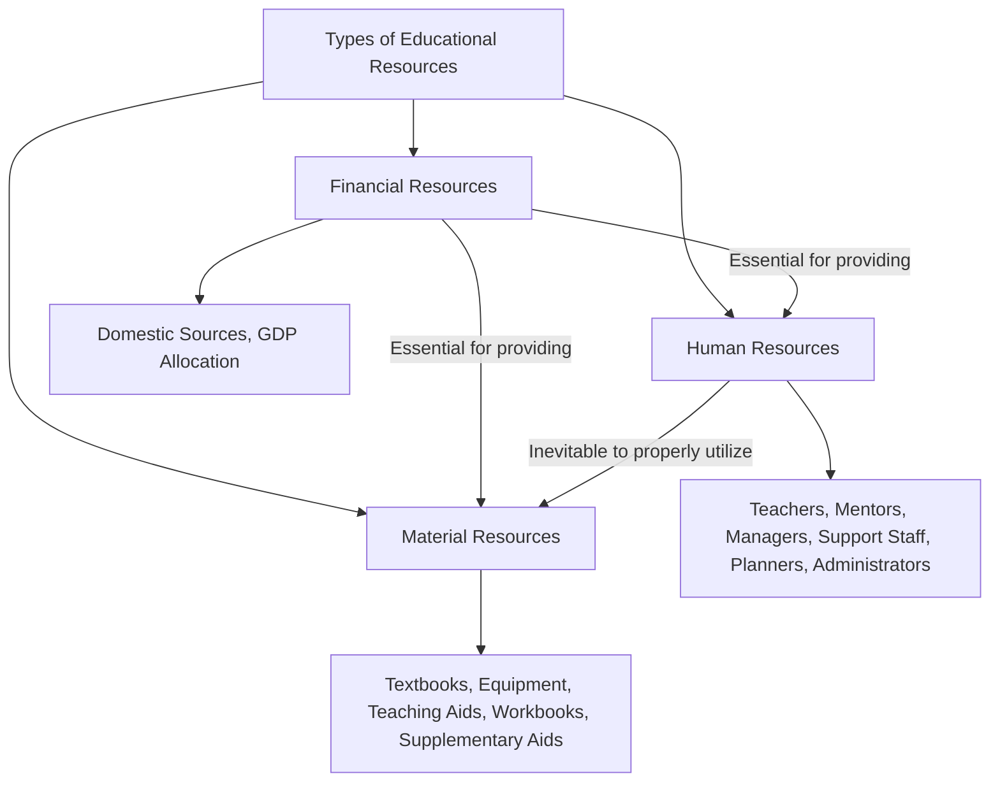
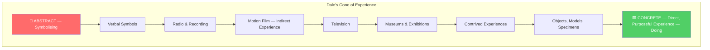

# 4. RESOURCE BASED LEARNING (Part 1)
## Topics: 4.1 - 4.6 — Educational Resources & Classification

---

## 4.1 Defining Educational Resource

### Resources — Definition

!!! note "What are Resources?"
    **Resources** make abstract teaching into **concrete concepts**, so that it could be understood better.

**Three kinds of resources** are necessary for delivery of quality formal and non-formal education programs:

| # | Resource Type | Description |
|---|---|---|
| 1 | **Human Resources** | Teachers, mentors, managers, support staff |
| 2 | **Material Resources** | Textbooks, equipment, teaching aids, workbooks |
| 3 | **Financial Resources** | Funding from domestic/country sources |

---

### Human Resources

- There is a full range of human resources that are essential for success
- These resources include **teachers, mentors, managers, and support staff**
- Teachers are one of the **critical aspects** of human resources
- **Planners and administrators** are useful for planning and implementing the program — they are not directly involved in teaching

!!! important "Quality Teaching"
    **Quality teaching** is the most powerful factor in **student learning**. There are **three critical domains** of supportive interactions in good teaching.

#### Three Domains of Quality Teaching

##### 1. Emotional Support

| # | Component |
|---|---|
| 1 | **Positive connection** of teacher and students |
| 2 | **Low level of negativity** expressed by teacher and students |
| 3 | **Teacher sensitivity** to students' needs |
| 4 | **Teacher regard** for students' interests, motivations, and points of view |

##### 2. Organizational Support

| # | Component |
|---|---|
| 1 | **Behavior management** |
| 2 | **Classroom productivity** |

##### 3. Instructional Support

| # | Component |
|---|---|
| 1 | **Learning strategies** — how teachers engage students in activities and facilitate activities so that learning opportunities are maximized |
| 2 | **Concept development** — how teachers use instructional discussions and activities to promote students' higher-order thinking skills and cognition |
| 3 | **Quality of feedback** — how teachers extend students' learning through their participation in activities |
| 4 | **Language modeling** — the extent to which teachers facilitate and encourage students' language development |

---

### Material Resources

- Both the **availability and quality** of materials are essential for a quality education
- In many countries there are **insufficient basic materials** such as:
    - Blackboards and chalk
    - Textbooks
    - Teacher support materials
    - Teaching aids and equipment
    - Student workbooks
    - Supplementary learning aids
- Materials may be **unavailable** due to:
    - Lack of **financial resources** to transport them
    - Lack of **human resources** to develop them and/or make them appropriate
    - **Geographical barriers** that make delivery untimely or impossible
- A key element in delivery of quality education is the **quality of material resources** for delivery of content
- This is reflected in **relevance and design** of the curriculum and learning materials available for acquisition of basic skills in all areas of education

---

### Financial Resources

- The most important source of financing for education comes from **sources within a country (domestic sources)**
- Even in many countries where the spending on education is a **significant percentage of GDP**, the actual amount of money available is **insufficient** to provide a quality education to those who are in school, let alone those who are excluded

!!! tip "Resource Centre"
    For quality teaching in schools, establishment of a **fully equipped resource centre** is essential depending on the resources available to schools. This could be at **excellent or medium level**. The ideal resource centre should have ideal resources as indicated in the flow chart of types of educational resources.

---

### Types of Educational Resources — Flow Chart

!!! note "Key Relationship"
    - **Financial resources** are essential for providing other material and human resources
    - **Human resources** are inevitable to properly utilize material resources

---

## 4.2 Accessibility to Resource Bank

### What is the Resource Bank?

!!! note "Definition"
    The **Resource Bank** is a **curated selection of research-based resources** that teachers can use to **scaffold access to classroom tasks** for all learners — especially those with **Foundations needs**.

- The bank is useful for anyone working **directly with students**, or those who **support instructional staff**
- Although the Resource Bank is primarily intended to serve the needs of:
    - Students who are **significantly behind grade level** in literacy or numeracy
    - **English learners**
    - Students receiving **special education services**
- It contains tools that can be useful with a **broad array of learners**

---

### How to Find the Resource Bank?

There is a **Resource Bank Platform** in Computer. Teachers, school leaders, and curriculum designers can find the **Accessibility Resource Bank** in the Platform:

1. Click **Educator Tools** from the left Navigation menu
2. Select **Accessibility Resource Bank** from the landing page

---

### How is the Resource Bank Organized?

The Resource Bank is organized into **6 Categories**:

| # | Category |
|---|---|
| 1 | **How to Use the Bank** |
| 2 | **Reading Resources** |
| 3 | **Writing Resources** |
| 4 | **Language Resources** |
| 5 | **Math Resources** |
| 6 | **Self-Directed Learning** |

Each category contains **6 resource tiles** containing information, strategies, and tools for a specific type of Foundations support.

Each tile is organized by **4 tabs**:

| Tab | Description |
|---|---|
| **"What"** | Summarizes the resource |
| **"When"** | Describes when to use it and the type of student to use it with |
| **"Why"** | Describes why the resource is effective and includes citations |
| **"How"** | Contains actionable implementation directions and information |

!!! tip
    You will find **linked resources, videos, and visual examples** on the right side of the page.

---

### Resource Bank for Teachers & Educators

**Countryside Classroom** is the **largest partnership** of its kind, bringing together organisations committed to helping children learn about **food, farming and the natural environment**.

Key features of Countryside Classroom:

- Designed **content submission tools**, approval and **curation platform**
- Created a site powered by **deep, rich-text search**
- Gives **instant access to over 3,000 resources**
- The partnership wanted to create a **single online resource** to help teachers and educators incorporate **food, farming and the natural environment** into their teaching
- Supported by **experts from outside the classroom**
- The partnership was to invite organisations and others in the same space to **submit resources**, check places to visit and people to ask, and to **curate and approve** the content on the Countryside Classroom
- Features include:
    - Beautifully crafted site with **improved information architecture**
    - Mapped out **user journeys** to ensure a seamless user experience
    - Developed a **robust bespoke content management system** that allowed the partnership full control over the structure and content
    - **Rich, fast full-text and category filtering** by embedding a comprehensive search API
- Countryside Classroom was awarded **two Silver Awards** for outstanding user experience and outstanding education website

---

## 4.3 Resource Island

### Island Educational Services

- **Island Educational Services** is located in **Bainbridge Island, WA (98110)**
- Functioning at **724, Ericksen Avenue, NE, Suite 102**
- It serves the schools around it with various services

---

### Resources Available

| Category | Resources |
|---|---|
| **Post-Secondary** | Beyond High School |
| **General** | General Education Resources |
| **Executive Function** | Executive Function/Study Skills, Executive Function Resources and Links |
| **Special Education** | Special Education Resources |
| **Behavior** | Positive Behavior Supports, Downloadable Resources for Behavior Supports |
| **Parents & Educators** | IEP Resources for Parents and Educators |
| **Local Resources** | Local Resources for Families/Children with Special Needs |
| **State & National** | State and National Resources for Families/Children with Special Needs |
| **Accommodations** | Downloadable Accommodation Resources |
| **Transition** | Transition to the Adult World |
| **Social Skills** | Social Learning/Social Skills Resources |
| **Language Arts** | Language Arts Resources |
| **Books** | Classification of Books, Top Ten Books, Resources for Choosing Reading Materials for Children and Teens, Books About Choosing Good Books |
| **Mathematics** | Mathematical Resources |
| **Mental Health** | Mental Health Resources |

!!! note
    The resources are also available **level-wise**: **Elementary, Middle and High School**.

- This is similar to the **school complex system in Tamil Nadu** which was implemented in almost all places
- The schools attached to a big school with many resources were helped by the complex school in all respects
- Since the school was started in an **Island**, it was called **Resources Island**

---

### Indian Sunday School Union (ISSU)

In India, a similar school is located in **Coonoor, Nilgiris, Tamil Nadu**. It is known as **Indian Sunday School Union (ISSU)** with the following services:

| # | Service |
|---|---|
| 1 | **Teacher Training** for Sunday school and day school teachers |
| 2 | **Youth, culture and ministry** consultancy and training youth leaders |
| 3 | **Counselling** by appointment |
| 4 | **Training of counsellors** |
| 5 | **Training for integration** counselling with education |
| 6 | **Developing transfer national Christian Curriculum** |
| 7 | **Developing curriculum** for day schools that integrate core subjects with the creative arts for discovery learning and transformation |
| 8 | **Consultancy** for developing educational institutions around the philosophy of transformation |

!!! note "Historical Background"
    - In **1876**, the school was started to provide education to **under-privileged children in Allahabad** with a mission
    - In the **18th century**, the Sunday school movement was created to provide education to **child labourers**

---

## 4.4 Resource Peninsula

### Definition

!!! note "What is a Resource Peninsula?"
    If a **resource centre (school)** is near a **lake, river or on the bank of such water sources**, the school can have other schools around that school. This could be around **three sides** as on the **fourth side there is a water source**. If such schools serve the schools around three sides of it, it can be said as **Resource (School) Peninsula**.

---

### Peninsula School, Dehradun

- There is a school named **Peninsula School** in **Pachhmiwala, Dehradun**
- There are **64 schools** in Pachhmiwala
- Located in **Anfield Grant, Vikasnagar, Uttarakhand, 248198, India**
- There are schools within a **radius of 1 km** and about **64 schools within a radius of 5 km**

!!! tip
    Apart from this, there are many schools all over the world with the name Peninsula School, but they may or may not be serving the schools around them.

---

## 4.5 Types of Resources

### Sense Organs as Gateways of Knowledge

!!! important
    **Sense organs are gateways of knowledge** — from the stage of a born child to the stage of a great scholar; it is only through senses that human beings acquire knowledge. It is the natural source of gaining wisdom. Especially through **eyes we gain 70 to 75% of knowledge**.

---

### Importance of Teaching Resources

- **Sensation** gained through sense organs, when interpreted with meaning, becomes **perception**
- **Perceptions**, when classified using common properties, yield **concepts** — the foundation on which thinking and knowledge are built
- This leads to **imagination and critical thinking**
- Ultimately, it is the **sense organs** which must be trained and kept sharp to acquire clear, strong, profound knowledge
- **Audio-visual media/resources** play a vital role in learning and teaching
- The term **"educational resource"** is better than "media" or "audio-visual aids" — it is more meaningful with broader implications

!!! note "Computer Science Context"
    Computer science being an **application-oriented science** which could help all other fields for their development, it is inevitable that students of computer science acquire **lucid knowledge without confusion**.

- **Learning experiences appealing to the senses** are more effective than abstract learning experiences
- There is a need for using **instructional aid/media/resource** for clear understanding
- Though all five senses are important, stress is placed on the **aural and the visual**, because they are widely involved in classroom situations
- **Comenius** was the first to introduce **pictures in books**
- **Pestalozzi** advocated the use of **objects before words**

!!! tip "Slogan of Audio-Visual Technologists"
    **"More learning, quick learning and longer retention"** is the slogan of the audio-visual technologists.

---

### 4.5.1 Audio-Visual Resources in Computer Science

!!! note "Definition"
    **Audio-visual aids** are the different types of materials that appeal to the **sense of hearing and vision** and are used in classrooms for presentation of abstract ideas. In computer science, these materials convey meaning **without complete dependence on verbal**.

- Some activities like **field trips, dramatising events, demonstrating experiments** are in the nature of process or experiences
- Some aids like **filmstrip or slide** need a **projector** to handle
- Others like a **chart, photograph or picture** need no equipment and can be directly used
- Experiences classified under **visual category** (charts, photographs, pictures)
- **Magnetic tape or disc recordings** belong to **audio category**
- The term **'Audio-visual aids'** designates both **processes and material things**
- The terms **'Audio-Visual materials'**, **'instructional aids'** or **'educational media'** mean the same thing — all generally classified as **'media'**

!!! important "Role of Media in Communication"
    In the process of communication, media play a significant role. For effective communication, the **message is sent to the receiver through the medium** which serves as a **channel**.

**Benefits in Computer Science Teaching:**

- Modern teaching materials could make learning easier — like **medicine in capsule form**
- Teachers should learn how to use **modern teaching aids**
- Computer science being a latest science, teachers should teach through **aids and practical experience**
- As it comprises of many new principles and procedures, the subject may appear difficult — when taught through **aids and media**, it becomes **easier and clear**
- Develops **interest to learn** and gives satisfaction of having learnt new facts
- The use of computers in daily life could be explained through aids
- Aids enable students to understand even **difficult concepts**
- When learnt through aids, **symbols and concepts become meaningful** — better than mere lecture and discussion
- Students could be given **direct experience** in using computers and operating with newly learnt programs
- They can be taken on **visits to organisations** where computers are professionally used
- **Field trips** to high-tech computer centres will also be useful

---

### 4.5.2 Use of Audio-Visual Resources in Computer Science

| # | Use / Benefit |
|---|---|
| 1 | By using audio-visual materials, **complex processes, events, objects, concepts, laws, principles** could easily be perceived by students |
| 2 | Use of audio-visual materials results in **faster understanding of concepts** and ensures **longer retention** of the information gained |
| 3 | Audio-visual materials supply a **concrete basis for conceptual thinking**, giving rise to **application of knowledge** |
| 4 | Audio-visual aids provide a **multi-sensory approach** and will therefore secure the **attention and interest** of pupils |
| 5 | Audio-visual materials can be used to **motivate and stimulate interest** of pupils to gain further knowledge |
| 6 | Audio-visual media will help to **illustrate, clarify and focus attention** |

---

### 4.5.3 Dale's Cone of Experience / Classification of Educational Resources

#### Chinese Proverb

!!! tip "Chinese Proverb"
    - **"I hear, I forget"**
    - **"I see, I remember"**
    - **"I do, I understand"**

#### Three Categories of Experiences

Based on this premise, all experiences can be classified into **three categories**:

| # | Category | Involves |
|---|---|---|
| 1 | **Concrete experiences** | **Doing** |
| 2 | **Iconic experiences** | **Observing** |
| 3 | **Abstract experiences** | **Symbolising** |

#### Dale's Cone of Experience

!!! important "Understanding the Cone"
    All learning experiences which can be utilised for classroom teaching were shown in a pictorial device — a **cone form** — by **Edgar Dale**, which he called the **"Cone of Experience."** If we travel up the pinnacle from its base, everything has been arranged in the order of **increasing abstractness** or **decreasing directness**.

**Levels of the Cone (Base to Top):**

| Level | Experience Type | Category |
|---|---|---|
| **Base** | Direct, purposeful experience | Doing (Concrete) |
| ↑ | Objects, models, specimens | Doing |
| ↑ | Contrived experiences | Doing |
| ↑ | Museums & exhibitions | Observing |
| ↑ | Television | Observing (Indirect) |
| ↑ | Motion film | Observing (Indirect) |
| ↑ | Radio & recording | Symbolising |
| **Top** | Verbal symbols | Symbolising (Abstract) |

---

### 4.5.4 Relative Effectiveness of Teaching-Learning Resources

!!! note
    The opportunities afforded by the sensory aids are very great. It all depends upon the **teacher** as to how he/she could exploit the learning situation by the **right use of appropriate aid**. Audio-visual aids are **not fun, frill and fad** in education.

- The richer the teaching materials, the more will be the **responsibility of the teacher** to correlate and plan his work

#### General Principles for Use of Aids

| # | Principle |
|---|---|
| 1 | There are **three stages** in a learning process when an educational aid is used to supplement ordinary teaching: **(i)** Preparing the pupils for the learning experience, **(ii)** Reinforcing the values while the pupils are sharing the experience, **(iii)** Relating the experience with the lesson and thus stimulating further learning |
| 2 | The aids must be **adapted to the intellectual maturity** of the pupils and to the nature and extent of their **previous experience** |
| 3 | There is **no best aid** which has all the advantages. Most visual aids suffer from **psychological limitations**. The teacher should be familiar with the **advantages and limitations** of the various types of sensory aids |
| 4 | Aids should **not be considered as substitutes** for oral and written methods of acquiring knowledge. They should be used to **supplement** the classroom teaching |
| 5 | Audio-visual instruction in the classroom should **not be confused with entertainment**. The effective use of an aid depends primarily on **careful planning** by the teacher |
| 6 | The **time and effort** on the use of a particular aid in preference to others must always be **justified** in all cases |

---

### 4.5.5 Educational Technology

!!! note "Why the Term Changed"
    The replacement of the older term **'Audio-visual materials in education'** by the newer term **'Educational Technology'** is mainly due to the **dynamic expansion** of the field of audio-visual education and the exciting new developments in the field of **computer technology**.

!!! important "Definition"
    **Educational Technology** includes *"the development, application and evaluation of systems, techniques and aids in the field of learning."* The main objective of the use of educational technology is the **improvement of learning**.

#### Hardware vs Software

| Aspect | Hardware | Software |
|---|---|---|
| **Definition** | Equipments and machines | Materials and content |
| **Examples** | Epidiascope, different types of projectors, radio, T.V., tape recorder, video recorder, teaching machines, computers | Pictures, printed materials, graphics (charts, maps, diagrams), 3D objects (models, specimens, actual objects), slides, film strips, audio and visual tapes |
| **Dependency** | Hardware can serve as a teaching aid **only when fed/supplied with software** — quite dependent upon software | Many software items may serve well **without the help of hardware** (e.g., graphics, 3D objects, pictures, printed material, books) |

---

## 4.6 Classification

!!! note
    Educational technological materials can be classified into **hardware** and **software**.

---

### 4.6.1 Classification According to Appeal to Senses

#### i) Audio

| # | Resource |
|---|---|
| 1 | Voice (any human sender of the message) |
| 2 | Gramophone records |
| 3 | Audio tapes (used in tape recorder or language laboratory) |
| 4 | Stereo records/tapes |
| 5 | Radio |
| 6 | Telephonic conversation |

#### ii) Visual (Verbal) — Print or Duplicated

| # | Resource |
|---|---|
| 1 | Textbooks, supplementary books |
| 2 | Reference books, encyclopaedia, etc. |
| 3 | Magazines, newspapers, etc. |
| 4 | Documents, clippings from published material |
| 5 | Duplicated written material |

#### iii) Visual (Non-Projected, Two-Dimensional)

| # | Resource |
|---|---|
| 1 | Messages/pictures on roll-up board |
| 2 | Flat picture, cut-outs |
| 3 | Posters, charts, graphs, etc. |
| 4 | Cartoons, comics, etc. |

#### iv) Visual (Non-Projected, Three-Dimensional)

| # | Resource |
|---|---|
| 1 | Models, mock-ups, display materials |
| 2 | Diagrams |
| 3 | Globes or maps (three-dimensional) |
| 4 | Specimens (animate or inanimate) |
| 5 | Puppets |

#### v) Visual (Projected Still)

| # | Resource |
|---|---|
| 1 | Slides |
| 2 | Filmstrips |
| 3 | Overhead transparencies |
| 4 | Micro image system: microfilm, microcard |

#### vi) Audio-Visual (Projected Motion)

| # | Resource |
|---|---|
| 1 | Film |
| 2 | Television |
| 3 | Close-circuit television |
| 4 | Video cassettes |
| 5 | Drama |

#### vii) Multimedia Packages (for more than one sense)

| # | Resource |
|---|---|
| 1 | Slide + tape |
| 2 | Slide + tape + workbook |
| 3 | Radio + slide or posters (radio vision) |
| 4 | Film + posters + workbook (print materials) |
| 5 | Television + workbook (print materials) |
| 6 | Any of the above + introductory and summarising talk by the teacher |
| 7 | Demonstration |
| 8 | Exhibition |
| 9 | Museum |
| 10 | Field trips |
| 11 | Simulation |

---

### 4.6.2 Classification According to Learner's Control

!!! note
    Another characteristic of media which can be used to classify them is the **extent to which they can be controlled by the learner**.

- While using a **textbook or audio tape** for learning, the learner can use them at **his/her own pace**, go back and read the paragraph or listen to the part of the programme again and again — these are called **learner-controlled media**
- A **television programme** — messages are transmitted according to the **pace of the sender** and may not be appropriate for an individual learner
- **Mass media** like radio or TV offer **no control** to the learner

#### Continuum of Learner Control

!!! important
    All new emerging media are designed to provide **more and more control** to the learner over the learning process.

---

### 4.6.3 Classification According to Type of Experience

- Media can be classified on the basis of the **type of experience** they provide
- The **Cone of Experience** has a broad base of **direct purposeful experience** which can be provided mostly through instructional media consisting of **real objects, specimens**
- Moving from the base towards **abstraction** (verbal messages only), we come across many instructional media which provide **indirect or vicarious experiences**
- They differ in their **degree of abstraction**:
    - **Case studies, video and TV programmes** → provide more **life-related experiences**
    - **Radio or audio tapes** → tend to provide only **verbal experiences**

---

### 4.6.4 Classification According to Reach

Media can be classified according to the **size of the group of learners** for whom they are intended and used:

| Reach Level | Media Type | Example |
|---|---|---|
| **Individual** | Computer Assisted Instruction (CAI) | Prepared for individualised learning; takes into account difficulties encountered by the individual learner learning on his/her own without help from teacher or peers |
| **Small Group** | Non-projected/graphics aids | Charts, maps, models — not quite useful for a class of 70-80 students |
| **Large Group** | Projected aids | Slides, filmstrips — can reach a larger group because of their quality of enlargement |
| **Mass** | Mass media | TV, radio, newspapers (print) — reach millions of people at a time |

---

### 4.6.5 Individualised Instructional Media

- Though the teacher generally plans for **classroom interaction** (small or large groups), there is always a need to provide an opportunity for **individualised learning**
- In an individualised learning situation, the learner works with the help of **self-learning material** which is in:
    - **Print form**, or
    - **Computer-assisted instruction**

#### Two Types of Individualised Instructional Media

| # | Type |
|---|---|
| a) | **Programmed Learning Material** |
| b) | **Computer Assisted Learning (CAL)** |

#### Media for Small Groups

- Media are also used for small groups
- These media may be further classified into:
    - **Non-projected visual media**
    - **Projected visual media**

!!! tip "Classification Summary"
    Media can be classified into **three major classes**:

    1. **Individualised media** — for individual learners
    2. **Media for a small group** — non-projected and projected visual media
    3. **Mass media** — reaching millions at a time

---
