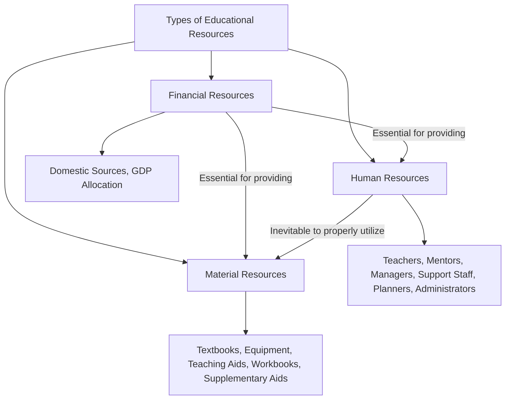
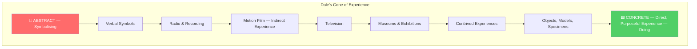
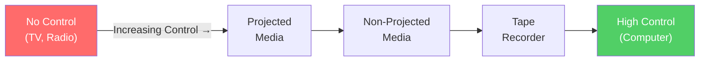

# 4. RESOURCE BASED LEARNING (Part 1)
## Topics: 4.1 - 4.6 — Educational Resources & Classification

---

## 4.1 Defining Educational Resource

### Resources — Definition

!!! note "What are Resources?"
    **Resources** turn abstract ideas into **concrete concepts**. They help students understand lessons better.

**Three kinds of resources** are needed for good formal and non-formal education:

| # | Resource Type | Description |
|---|---|---|
| 1 | **Human Resources** | Teachers, mentors, managers, support staff |
| 2 | **Material Resources** | Textbooks, equipment, teaching aids, workbooks |
| 3 | **Financial Resources** | Money from sources within the country |

---

### Human Resources

- Many types of human resources are needed for success
- These include **teachers, mentors, managers, and support staff**
- Teachers are one of the **most important** human resources
- **Planners and administrators** help plan and run the program. They do not teach directly

!!! important "Quality Teaching"
    **Quality teaching** is the strongest factor in **student learning**. Good teaching has **three key areas** of helpful interactions.

#### Three Domains of Quality Teaching

##### 1. Emotional Support

| # | Component |
|---|---|
| 1 | **Positive connection** between teacher and students |
| 2 | **Low negativity** shown by teacher and students |
| 3 | **Teacher sensitivity** to students' needs |
| 4 | **Teacher respect** for students' interests, goals, and views |

##### 2. Organizational Support

| # | Component |
|---|---|
| 1 | **Behavior management** |
| 2 | **Classroom productivity** |

##### 3. Instructional Support

| # | Component |
|---|---|
| 1 | **Learning strategies** — how teachers involve students in activities and help them get the most learning |
| 2 | **Concept development** — how teachers use discussions and activities to build higher-order thinking skills |
| 3 | **Quality of feedback** — how teachers help students learn more through their work in activities |
| 4 | **Language modeling** — how much teachers help and encourage students' language growth |

---

### Material Resources

- Both the **availability and quality** of materials are needed for good education
- In many countries, there are **not enough basic materials** such as:
    - Blackboards and chalk
    - Textbooks
    - Teacher support materials
    - Teaching aids and equipment
    - Student workbooks
    - Extra learning aids
- Materials may be **hard to get** because of:
    - Not enough **money** to transport them
    - Not enough **people** to create or adapt them
    - **Location barriers** that make delivery late or impossible
- The **quality of material resources** is a key part of good education
- This shows in the **relevance and design** of the curriculum. It also shows in the learning materials available for gaining basic skills

---

### Financial Resources

- The main source of money for education comes from **sources within a country (domestic sources)**
- In many countries, education spending is a **large share of GDP**. But the actual money available is still **not enough** for quality education. This is true even for students in school, and worse for those left out

!!! tip "Resource Centre"
    For quality teaching, schools need a **fully equipped resource centre**. The level depends on what the school can afford. It could be **excellent or medium level**. The ideal resource centre should have the resources shown in the flow chart below.

---

### Types of Educational Resources — Flow Chart

!!! note "Key Relationship"
    - **Financial resources** are needed to provide material and human resources
    - **Human resources** are necessary to properly use material resources

---

## 4.2 Accessibility to Resource Bank

### What is the Resource Bank?

!!! note "Definition"
    The **Resource Bank** is a **carefully chosen set of research-based resources**. Teachers use it to **support access to classroom tasks** for all learners — especially those with **Foundations needs**.

- The bank helps anyone working **directly with students**. It also helps those who **support teaching staff**
- The Resource Bank mainly serves:
    - Students who are **far behind grade level** in reading or math
    - **English learners**
    - Students getting **special education services**
- But it has tools that can help a **wide range of learners**

---

### How to Find the Resource Bank?

There is a **Resource Bank Platform** in Computer. Teachers, school leaders, and curriculum designers can find the **Accessibility Resource Bank** in the Platform:

1. Click **Educator Tools** from the left Navigation menu
2. Select **Accessibility Resource Bank** from the landing page

---

### How is the Resource Bank Organized?

The Resource Bank is organized into **6 Categories**:

| # | Category |
|---|---|
| 1 | **How to Use the Bank** |
| 2 | **Reading Resources** |
| 3 | **Writing Resources** |
| 4 | **Language Resources** |
| 5 | **Math Resources** |
| 6 | **Self-Directed Learning** |

Each category has **6 resource tiles**. Each tile has information, strategies, and tools for a specific type of Foundations support.

Each tile has **4 tabs**:

| Tab | Description |
|---|---|
| **"What"** | Gives a summary of the resource |
| **"When"** | Tells when to use it and which students it helps |
| **"Why"** | Explains why it works, with research references |
| **"How"** | Gives step-by-step directions to use it |

!!! tip
    You will find **linked resources, videos, and visual examples** on the right side of the page.

---

### Resource Bank for Teachers & Educators

**Countryside Classroom** is the **largest partnership** of its kind. It brings together groups that help children learn about **food, farming and the natural environment**.

Key features of Countryside Classroom:

- Has **content submission tools** and an approval and **review platform**
- The site uses **deep, rich-text search**
- Gives **instant access to over 3,000 resources**
- The partnership wanted to create a **single online resource**. It helps teachers add **food, farming and nature** into their teaching
- Supported by **experts from outside the classroom**
- The partnership invites groups to **submit resources**. They check places to visit and people to ask. They also **review and approve** the content
- Features include:
    - Well-designed site with **better information layout**
    - Planned **user journeys** for a smooth experience
    - Built a **strong custom content management system**. It gives the partnership full control over structure and content
    - **Fast full-text and category search** using a built-in search tool
- Countryside Classroom won **two Silver Awards** for great user experience and education website

---

## 4.3 Resource Island

### Island Educational Services

- **Island Educational Services** is in **Bainbridge Island, WA (98110)**
- Located at **724, Ericksen Avenue, NE, Suite 102**
- It serves the schools around it with many services

---

### Resources Available

| Category | Resources |
|---|---|
| **Post-Secondary** | Beyond High School |
| **General** | General Education Resources |
| **Executive Function** | Executive Function/Study Skills, Executive Function Resources and Links |
| **Special Education** | Special Education Resources |
| **Behavior** | Positive Behavior Supports, Downloadable Resources for Behavior Supports |
| **Parents & Educators** | IEP Resources for Parents and Educators |
| **Local Resources** | Local Resources for Families/Children with Special Needs |
| **State & National** | State and National Resources for Families/Children with Special Needs |
| **Accommodations** | Downloadable Accommodation Resources |
| **Transition** | Transition to the Adult World |
| **Social Skills** | Social Learning/Social Skills Resources |
| **Language Arts** | Language Arts Resources |
| **Books** | Classification of Books, Top Ten Books, Resources for Choosing Reading Materials for Children and Teens, Books About Choosing Good Books |
| **Mathematics** | Mathematical Resources |
| **Mental Health** | Mental Health Resources |

!!! note
    The resources are also available **level-wise**: **Elementary, Middle and High School**.

- This is similar to the **school complex system in Tamil Nadu**. It was used in almost all places
- A big school with many resources helped the smaller schools attached to it
- Since the school was on an **Island**, it was called **Resources Island**

---

### Indian Sunday School Union (ISSU)

In India, a similar school is in **Coonoor, Nilgiris, Tamil Nadu**. It is called **Indian Sunday School Union (ISSU)**. It offers these services:

| # | Service |
|---|---|
| 1 | **Teacher Training** for Sunday school and day school teachers |
| 2 | **Youth, culture and ministry** — advising and training youth leaders |
| 3 | **Counselling** by appointment |
| 4 | **Training of counsellors** |
| 5 | **Training for integration** — combining counselling with education |
| 6 | **Developing transfer national Christian Curriculum** |
| 7 | **Developing curriculum** for day schools that mix core subjects with creative arts for discovery learning |
| 8 | **Advising** on building educational institutions based on the idea of transformation |

!!! note "Historical Background"
    - In **1876**, the school started to educate **under-privileged children in Allahabad**
    - In the **18th century**, the Sunday school movement began to educate **child labourers**

---

## 4.4 Resource Peninsula

### Definition

!!! note "What is a Resource Peninsula?"
    Imagine a **resource centre (school)** near a **lake, river or water source**. Other schools can be around it on **three sides**. The **fourth side** faces the water. If this school serves the schools on three sides, we call it a **Resource (School) Peninsula**.

---

### Peninsula School, Dehradun

- There is a school called **Peninsula School** in **Pachhmiwala, Dehradun**
- There are **64 schools** in Pachhmiwala
- It is in **Anfield Grant, Vikasnagar, Uttarakhand, 248198, India**
- Some schools are within **1 km**. About **64 schools** are within **5 km**

!!! tip
    Many schools around the world have the name Peninsula School. But they may or may not serve the schools around them.

---

## 4.5 Types of Resources

### Sense Organs as Gateways of Knowledge

!!! important
    **Sense organs are gateways of knowledge.** From birth to becoming a great scholar, we gain knowledge only through our senses. This is the natural way we learn. Through our **eyes, we gain 70 to 75% of knowledge**.

---

### Importance of Teaching Resources

- When sense organs pick up information and we give it meaning, it becomes **perception**
- When we group **perceptions** by shared features, we form **concepts**. Concepts are the base of thinking and knowledge
- This leads to **imagination and critical thinking**
- So we must train and sharpen our **sense organs** to gain clear, strong, deep knowledge
- **Audio-visual media/resources** play a key role in learning and teaching
- The term **"educational resource"** is better than "media" or "audio-visual aids." It has a wider and clearer meaning

!!! note "Computer Science Context"
    Computer science is a **hands-on, applied science**. It helps all other fields grow. So it is important that computer science students gain **clear knowledge without confusion**.

- **Learning through the senses** works better than learning through abstract ideas alone
- We need **instructional aids/media/resources** for clear understanding
- All five senses matter. But we focus on **hearing and seeing** because they are used most in classrooms
- **Comenius** was the first to put **pictures in books**
- **Pestalozzi** said we should use **objects before words**

!!! tip "Slogan of Audio-Visual Technologists"
    **"More learning, quick learning and longer retention"** is the slogan of the audio-visual technologists.

---

### 4.5.1 Audio-Visual Resources in Computer Science

!!! note "Definition"
    **Audio-visual aids** are materials that use **hearing and sight**. Teachers use them in classrooms to present abstract ideas. In computer science, these materials share meaning **without relying only on words**.

- Some activities like **field trips, acting out events, showing experiments** are hands-on experiences
- Some aids like a **filmstrip or slide** need a **projector**
- Others like a **chart, photograph or picture** need no equipment. You can use them directly
- Charts, photographs, and pictures fall under the **visual category**
- **Magnetic tape or disc recordings** fall under the **audio category**
- The term **'Audio-visual aids'** refers to both **processes and physical materials**
- The terms **'Audio-Visual materials'**, **'instructional aids'** or **'educational media'** mean the same thing. We group them all as **'media'**

!!! important "Role of Media in Communication"
    Media play a big role in communication. For good communication, the **message goes to the receiver through a medium**. This medium works as a **channel**.

**Benefits in Computer Science Teaching:**

- Modern teaching materials make learning easier — like **medicine in capsule form**
- Teachers should learn how to use **modern teaching aids**
- Computer science is a new field. Teachers should teach with **aids and hands-on experience**
- The subject has many new ideas and steps. It may seem hard. But when taught with **aids and media**, it becomes **easier and clearer**
- Aids build **interest in learning**. Students feel happy about learning new facts
- Teachers can use aids to explain how we use computers in daily life
- Aids help students understand even **difficult concepts**
- When students learn with aids, **symbols and concepts become meaningful**. This works better than just lectures and discussions
- Students can get **direct experience** using computers and new programs
- Teachers can take students on **visits to workplaces** that use computers
- **Field trips** to high-tech computer centres are also helpful

---

### 4.5.2 Use of Audio-Visual Resources in Computer Science

| # | Use / Benefit |
|---|---|
| 1 | Audio-visual materials help students easily understand **complex processes, events, objects, concepts, laws, and principles** |
| 2 | They lead to **faster understanding** and help students **remember longer** |
| 3 | They give a **solid base for thinking about concepts**. This leads to **using knowledge in practice** |
| 4 | They use **many senses at once**. This holds students' **attention and interest** |
| 5 | They **motivate students** and make them want to learn more |
| 6 | They help **show, explain, and focus attention** on key ideas |

---

### 4.5.3 Dale's Cone of Experience / Classification of Educational Resources

#### Chinese Proverb

!!! tip "Chinese Proverb"
    - **"I hear, I forget"**
    - **"I see, I remember"**
    - **"I do, I understand"**

#### Three Categories of Experiences

Based on this idea, we can group all experiences into **three categories**:

| # | Category | Involves |
|---|---|---|
| 1 | **Concrete experiences** | **Doing** |
| 2 | **Iconic experiences** | **Observing** |
| 3 | **Abstract experiences** | **Symbolising** |

#### Dale's Cone of Experience

!!! important "Understanding the Cone"
    **Edgar Dale** showed all learning experiences in a picture shaped like a **cone**. He called it the **"Cone of Experience."** As you move from the base to the top, things become **more abstract** and **less direct**.

**Levels of the Cone (Base to Top):**

| Level | Experience Type | Category |
|---|---|---|
| **Base** | Direct, purposeful experience | Doing (Concrete) |
| ↑ | Objects, models, specimens | Doing |
| ↑ | Contrived experiences | Doing |
| ↑ | Museums & exhibitions | Observing |
| ↑ | Television | Observing (Indirect) |
| ↑ | Motion film | Observing (Indirect) |
| ↑ | Radio & recording | Symbolising |
| **Top** | Verbal symbols | Symbolising (Abstract) |

---

### 4.5.4 Relative Effectiveness of Teaching-Learning Resources

!!! note
    Sensory aids offer great learning chances. It depends on the **teacher** to make the best use of the right aid. Audio-visual aids are **not just fun or a trend** in education.

- The more teaching materials you have, the more the **teacher must plan and connect** them well

#### General Principles for Use of Aids

| # | Principle |
|---|---|
| 1 | There are **three stages** when using an aid with regular teaching: **(i)** Get students ready for the experience, **(ii)** Strengthen learning while students share the experience, **(iii)** Connect the experience to the lesson to encourage more learning |
| 2 | Aids must match the **thinking level** of students and their **past experience** |
| 3 | There is **no single best aid**. Most visual aids have **limits**. Teachers should know the **strengths and weaknesses** of each type |
| 4 | Aids are **not replacements** for reading and writing. Use them to **add to** classroom teaching |
| 5 | Audio-visual teaching is **not entertainment**. Good use of aids needs **careful planning** by the teacher |
| 6 | The **time and effort** spent on any aid must always be **worth it** |

---

### 4.5.5 Educational Technology

!!! note "Why the Term Changed"
    The old term **'Audio-visual materials in education'** changed to **'Educational Technology'**. This happened because audio-visual education grew fast. New developments in **computer technology** also played a big role.

!!! important "Definition"
    **Educational Technology** includes *"the development, application and evaluation of systems, techniques and aids in the field of learning."* Its main goal is to **improve learning**.

#### Hardware vs Software

| Aspect | Hardware | Software |
|---|---|---|
| **Definition** | Equipment and machines | Materials and content |
| **Examples** | Epidiascope, projectors, radio, T.V., tape recorder, video recorder, teaching machines, computers | Pictures, printed materials, graphics (charts, maps, diagrams), 3D objects (models, specimens, real objects), slides, film strips, audio and visual tapes |
| **Dependency** | Hardware works as a teaching aid **only when you load it with software**. It depends heavily on software | Many software items work well **without hardware** (e.g., graphics, 3D objects, pictures, printed material, books) |

---

## 4.6 Classification

!!! note
    We can group educational technology materials into **hardware** and **software**.

---

### 4.6.1 Classification According to Appeal to Senses

#### i) Audio

| # | Resource |
|---|---|
| 1 | Voice (any person sending the message) |
| 2 | Gramophone records |
| 3 | Audio tapes (used in tape recorder or language laboratory) |
| 4 | Stereo records/tapes |
| 5 | Radio |
| 6 | Telephonic conversation |

#### ii) Visual (Verbal) — Print or Duplicated

| # | Resource |
|---|---|
| 1 | Textbooks, extra books |
| 2 | Reference books, encyclopaedia, etc. |
| 3 | Magazines, newspapers, etc. |
| 4 | Documents, clippings from published material |
| 5 | Duplicated written material |

#### iii) Visual (Non-Projected, Two-Dimensional)

| # | Resource |
|---|---|
| 1 | Messages/pictures on roll-up board |
| 2 | Flat picture, cut-outs |
| 3 | Posters, charts, graphs, etc. |
| 4 | Cartoons, comics, etc. |

#### iv) Visual (Non-Projected, Three-Dimensional)

| # | Resource |
|---|---|
| 1 | Models, mock-ups, display materials |
| 2 | Diagrams |
| 3 | Globes or maps (three-dimensional) |
| 4 | Specimens (living or non-living) |
| 5 | Puppets |

#### v) Visual (Projected Still)

| # | Resource |
|---|---|
| 1 | Slides |
| 2 | Filmstrips |
| 3 | Overhead transparencies |
| 4 | Micro image system: microfilm, microcard |

#### vi) Audio-Visual (Projected Motion)

| # | Resource |
|---|---|
| 1 | Film |
| 2 | Television |
| 3 | Close-circuit television |
| 4 | Video cassettes |
| 5 | Drama |

#### vii) Multimedia Packages (for more than one sense)

| # | Resource |
|---|---|
| 1 | Slide + tape |
| 2 | Slide + tape + workbook |
| 3 | Radio + slide or posters (radio vision) |
| 4 | Film + posters + workbook (print materials) |
| 5 | Television + workbook (print materials) |
| 6 | Any of the above + opening and closing talk by the teacher |
| 7 | Demonstration |
| 8 | Exhibition |
| 9 | Museum |
| 10 | Field trips |
| 11 | Simulation |

---

### 4.6.2 Classification According to Learner's Control

!!! note
    We can also group media by **how much control the learner has** over them.

- With a **textbook or audio tape**, the learner can go at **their own speed**. They can re-read or re-listen as many times as needed. These are called **learner-controlled media**
- A **television programme** sends messages at the **sender's speed**. This may not suit every learner
- **Mass media** like radio or TV give the learner **no control**

#### Continuum of Learner Control

!!! important
    All new media are designed to give **more and more control** to the learner over the learning process.

---

### 4.6.3 Classification According to Type of Experience

- We can group media by the **type of experience** they give
- The **Cone of Experience** has a wide base of **direct, hands-on experience**. Teaching media like **real objects and specimens** provide this
- As we move up toward **abstract ideas** (words only), we find media that give **indirect experiences**
- These media differ in **how abstract they are**:
    - **Case studies, video and TV programmes** → give more **real-life experiences**
    - **Radio or audio tapes** → give mostly **word-based experiences**

---

### 4.6.4 Classification According to Reach

We can group media by the **size of the group** they are meant for:

| Reach Level | Media Type | Example |
|---|---|---|
| **Individual** | Computer Assisted Instruction (CAI) | Made for one learner at a time. It handles the problems a student faces when learning alone, without a teacher or classmates |
| **Small Group** | Non-projected/graphics aids | Charts, maps, models — not very useful for a class of 70–80 students |
| **Large Group** | Projected aids | Slides, filmstrips — can reach more students because the image is enlarged |
| **Mass** | Mass media | TV, radio, newspapers (print) — reach millions of people at once |

---

### 4.6.5 Individualised Instructional Media

- Teachers usually plan for **classroom work** (small or large groups). But there is always a need for **individual learning** too
- In individual learning, the student works with **self-learning material**. This can be in:
    - **Print form**, or
    - **Computer-assisted instruction**

#### Two Types of Individualised Instructional Media

| # | Type |
|---|---|
| a) | **Programmed Learning Material** |
| b) | **Computer Assisted Learning (CAL)** |

#### Media for Small Groups

- We also use media for small groups
- These media can be split into:
    - **Non-projected visual media**
    - **Projected visual media**

!!! tip "Classification Summary"
    We can group media into **three major classes**:

    1. **Individualised media** — for one learner at a time
    2. **Media for a small group** — non-projected and projected visual media
    3. **Mass media** — reaching millions at once

---
