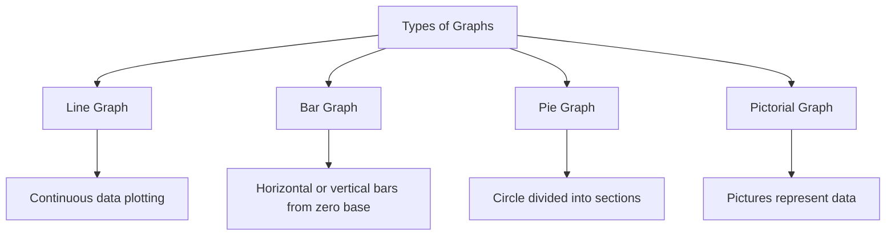
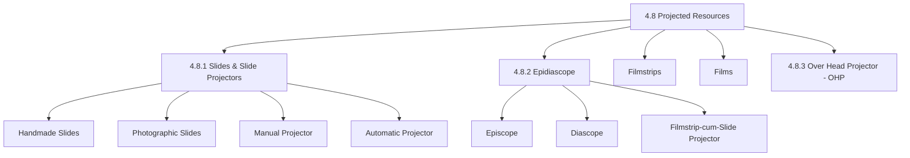
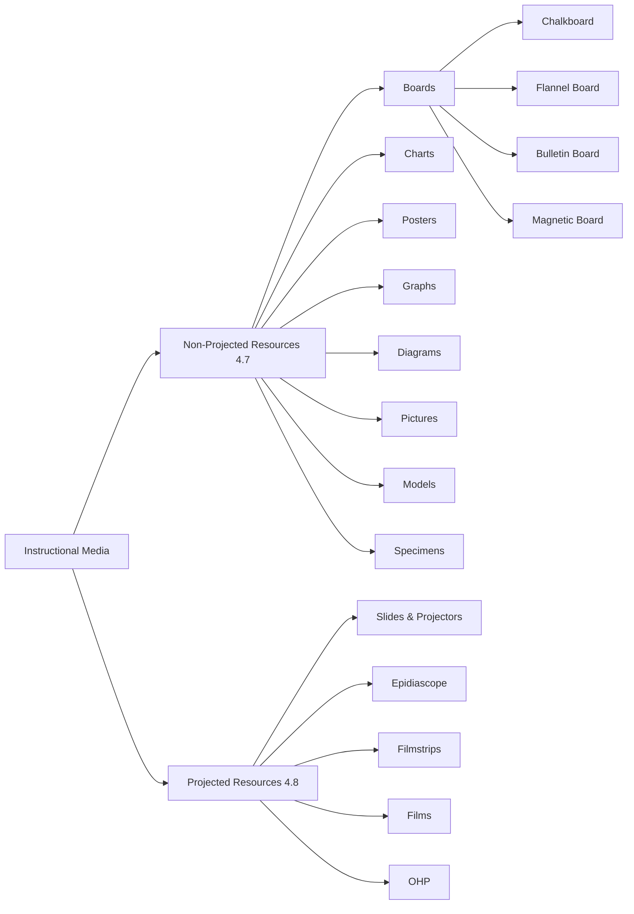

# 4. RESOURCE BASED LEARNING (Part 2)
## Topics: 4.7 - 4.8 — Non-Projected & Projected Resources

---

## 4.7 Non-Projected Learning Resources

**Non-projected media** are teaching tools that do **not** need electricity or projectors. They are simple, easy to find, and used in all schools.

!!! note "Key Characteristic"
    Non-projected aids (graphic aids) like charts, maps, or models work best for **small groups** of students. They are not very useful for a class of 70–80 students.

---

### Boards

Teachers use many types of boards in schools. Here are the main types:

| Board Type | Material | Key Feature |
|---|---|---|
| **Chalkboard** | Wooden or glass board + chalk | Most common; used for writing, drawing, solving problems |
| **Flannel Board** | Flannel cloth on board | Items stick to it and can be moved around |
| **Bulletin Board** | Soft board covered with felt cloth | Items are pinned on; easy to put up and take down |
| **Magnetic Board** | Board with magnetic surface | Uses magnets to hold display items |

---

#### Chalkboard

The **chalkboard** (or blackboard) is used for **visual display**. Teachers write on a wooden or glass board using chalk. The chalk can be white or coloured. The traditional board was black with white chalk. But you can also use other colours. For example, use a green board with yellow chalk.

**Uses of the Chalkboard:**

- Writing **important points**, keywords, and new ideas
- Drawing **figures and diagrams**
- Solving **problems step by step**
- Can also be used **by students**

##### Five Components of Chalkboard Work

For neat and clear writing, the teacher should know these **five components**:

| # | Component | Description |
|---|---|---|
| **i** | **Legibility (Size of letters)** | Letters must be big enough for students at the back to read easily |
| **ii** | **Spacing** | Leave enough space between letters, words, and lines. Good spacing makes writing neat and easy to read. Keep the same gap between all lines |
| **iii** | **Straight lines** | Write in straight lines. The teacher should **walk along the board** while writing. Standing in one spot makes the writing slant |
| **iv** | **Use of coloured chalk** | Use different colours to write, draw, underline key points, or colour parts of diagrams. This makes the board more interesting. But do **not use too many** colours |
| **v** | **Organisation (Layout)** | Top part → title of the lesson. Rest of the board → planned content. For subjects with diagrams (Science, Maths, Geography), split the board: **left side** for diagrams, **right side** for writing |

!!! tip "Chalkboard Space Management"
    Erase some writing to make room for new content. If the board gets too full, it can **confuse students**. The teacher must plan how to use the board space **very carefully**.

**Drawing Diagrams on the Chalkboard:**

- Drawing a diagram **while explaining** the topic makes it easier to understand
- You can also use a **chart** with ready-made diagrams. This saves time and looks neater
- To draw maps, figures, and diagrams, the teacher can use:
    1. **Templates** — ready-made cutouts of shapes
    2. **Geometrical tools** — ruler, compass, etc.
    3. **Dotted figures** drawn on paper, then pressed on the board with chalk dust
- Always **keep drawings accurate**. For example, use a ruler for parallel lines. Use measurements for maps

**Chalkboard in Different Teaching Methods:**

- In **teacher-led methods** (lecture, demonstration) — one-way communication; the teacher uses the board
- In **small group methods** (group discussion, group tasks) — put several boards on the front wall. Write different points or tasks for each group on separate boards
- In **student group work** — use the other three walls as boards too. This gives more space and lets students take charge

!!! important "Beyond the Classroom"
    The **outer walls** of the classroom (corridor, school building) can also be used as chalkboards. Many schools use wall space to share messages with students, parents, and visitors.

---

#### Flannel Board

A **flannel board** is made using **flannel cloth** (a soft, fuzzy fabric).

**How it works:**

- Stick a piece of **flannel or sand paper** on the back of pictures, photos, or flash cards
- These items **stick to the flannel board** when you press them gently
- You can **remove and rearrange** them as needed

**Uses and Advantages:**

- You can make **flannel units** for different topics
- Very useful when the topic has **steps or a sequence**
- Example: Teaching **operators of C++** — stick each operator on the flannel with short notes
- Helps students understand **hard topics** by breaking them down
- **Grabs students' attention**
- Students can also make flannel units for **group presentations**

---

#### Bulletin Board (Display Board)

A **bulletin board** or **display board** is a **soft board covered with felt cloth**. You **pin** materials to this board.

**Materials that can be displayed:**

- Posters, small charts, photographs, pictures, etc.
- Easy to **put up and take down** while teaching

**Uses of the Bulletin/Display Board:**

| Use | Description |
|---|---|
| **During teaching** | Pin and show related materials while teaching |
| **After teaching** | Show extra information on a topic (e.g., newspaper clippings, photos about solar energy) for about a week |
| **Before teaching** | Display material before starting a topic to **build interest** and **make students curious** |
| **Learner display** | Students show their own work — essays, pictures, poems, photo collections on a topic |
| **Wall paper** | Students can make wall papers for longer display |

!!! tip "Encouraging Learner Participation"
    When students display their own work, it gives them a chance to present before the class. This encourages them to take part more **actively** in learning.

**Summary on Boards:**

Teachers can use the walls of the classroom (inside and outside) with different boards. This helps send **visual messages** to students. Students should also use the boards — chalkboard, flannel board, display board — for **class work and extra activities**.

---

### Charts

A **chart** is a simple, flat display material. It usually has pictures, but not always. Charts can show information very well if you plan them properly.

**Common elements of a chart:**

1. **Caption (Title)** — usually written in bold letters at the top, sometimes at the bottom
2. **Actual message** — can be words, pictures, or both

**Preparation of Charts:**

Charts are usually made on **card paper** (can be folded to store) or on **mounting board**.

#### Aspects to Consider While Preparing Charts

| Aspect | Details |
|---|---|
| **a) Verbal message** | Choose the right words. Too many words make it crowded. Words must be big enough for all students to see. Use different colours to tell things apart. Use block letters to catch attention. Use **stencils** (plastic/acrylic letter cutouts) for neat letters |
| **b) Graphic message** | Add pictures, diagrams, graphs, maps, or photos to support the words. Make them the right size. Use many colours. You can draw them, make them bigger using an epidiascope (a device that projects images — see section 4.8.2) or OHP, or paste them from newspapers/magazines (**collage**) |

!!! note "Collage"
    When you paste a real picture, map, or graph from a newspaper or magazine onto a chart, it is called a **collage**.

**Graphic Aids — Definition:**

**Graphic aids** are **two-dimensional (flat) visual aids** shown on a flat surface. They use simple symbols that look close to real things. These symbols replace words. Graphic aids grab attention with their visual and picture-based messages. Short captions make the message clear. They are easy to find, easy to make, and easy to store.

!!! important "Graphic Aids Include"
    Charts, graphs, diagrams, drawings, cartoons, sketches, pictures, and illustrative materials.

#### Types of Charts

You can group charts by **how they show the message**:

| Type | Description | Example |
|---|---|---|
| **a) Tree Chart** | Shows a family tree or a step-by-step order | History of computer generations |
| **b) Classification Chart** | Shows how things are grouped | Base class and Derived class examples |
| **c) Flap Chart** | Has flaps you can open to see the message below. Made with two chart papers | Showing different parts of a computer system |
| **d) Collage** | Pictures and information from newspapers or magazines are pasted on. More attractive because of coloured images | — |
| **e) Overlays** | Add extra layers to a chart. Can be **still** or **moving** (to show motion) | — |

#### Classification by Usage

Based on how they are used, teaching charts can be grouped as:

**i) Classroom Charts:**

- Used to **support the teacher's explanation** in the classroom
- Two sub-types:
    - **Wall charts** — hung on the wall
    - **Flip charts** — a set of charts on one topic, shown one after another. They sit on a stand and flip backward like calendar pages

**ii) Exhibition Charts:**

- Made on a **specific theme or topic** (e.g., population education, renewable energy)
- Used for **exhibitions** — displayed in the corridor for about a week
- Useful for celebrating events like:
    - **Science Day** (28th February)
    - **Population Day** (11th July)
    - **Children's Day** (14th November)
- Helps create a **learning atmosphere** in the school

!!! tip "Preparing Charts Using Computers"
    Computers make it easy to plan chart layouts. You can try different designs on screen. Then print the chart and make it bigger to fit your needs.

---

### Posters

**Posters** show a **single message in a bold way** to students.

**Characteristics:**

- Use **few words** and **few colours**
- Show the message **very clearly**
- Are **easy to understand on their own**
- Used to **support explanations**
- A **mass media** tool — printed in thousands to reach many people

**Sources for Posters:**

Teachers can get posters from groups like the health department, waste management department, or energy department. Examples: posters on blood donation, blood groups, or tree planting. You can use these directly in class.

---

### Graphs

!!! note "Definition"
    A **graph** is a **picture that shows number data**. It is a tool for showing how numbers relate to each other. Graphs are much easier to understand than words and numbers alone. They show facts clearly. The data speaks for itself.

**Characteristics of Graphs:**

- A good way to **study, compare, and predict** facts
- Useful for showing **number data** in picture form
- **Easy and quick** to read
- You can draw correct conclusions easily
- Uses symbols to show ideas
- Best used in the **main part or summary** of a lesson, after students know the basics
- Works as a **summary tool**

#### Types of Graphs

| Type | Description |
|---|---|
| **Line Graph** | Used when there is a lot of data to plot, or when the data is **continuous** (ongoing) |
| **Bar Graph** | Uses bars placed **side by side or up and down** from a zero line. The size, length, and colour of bars show different values. Good for **comparing** many items |
| **Pie Graph** | A **circle** split into parts. Each part shows a piece of the whole |
| **Pictorial Graph** | Uses **pictures** to show data. A very clear way to present information |

---

### Purposes of Using Graphic Resources

Graphic aids help make ideas clear and easy to understand. Here is what they can do:

- **Show relationships** using facts, figures, or numbers
- **Summarize information** at the end or during a lesson
- **Present materials** using symbols
- Show **step-by-step flow** in thinking and processes
- Present **abstract (hard-to-picture) ideas** in visual form
- **Create problems** for new situations and encourage clear thinking

### Educational Values of Graphic Resources

| Value | Description |
|---|---|
| **Build interest and curiosity** | Graphic aids make students interested in the subject |
| **Help self-learning** | They inspire students and help them learn on their own |
| **Grab attention** | They play a big role in catching attention and making things easy to understand |
| **Make explanations simpler** | They add reality and make explanations easier. Even average students can understand facts quickly |
| **Make abstract topics real** | They help explain hard-to-see ideas and draw science figures |

---

### Diagrams

A **diagram** is a **simple drawing** that shows how things connect. It mainly uses **lines and symbols**.

- Think of them as **short visual summaries** of facts
- They explain facts **more easily** than charts
- **Essential** in science subjects
- Better for **summary and review** than for first-time teaching

---

### Pictures

A **picture** is a **visual tool** made to grab attention. It shares ideas, facts, stories, or images **quickly and clearly**.

---

### Illustrative Material

Illustrative material includes **paintings, photographs, drawings, and engravings**. It **explains itself** without extra words.

---

### Models

Unlike charts and posters, **models** are **three-dimensional (3D) visual aids**. Models look like real things in every way except size and shape.

#### Types of Models

| Type | Description | Example |
|---|---|---|
| **Simple (Static) models** | Show different parts, but the parts **cannot be taken apart** | Thermocol model of a cell |
| **Sectional models** | All parts can be **taken apart, shown, and put back** | Sectional model of an eye |
| **Working models** | Show the **actual working** of a real object | Working model of logic gates using circuits; working model of hydroelectricity using turbines |

#### Preparation of Models

**Materials used:** thermocol, paper, wax, plaster of paris, cardboard, straws, card paper, match sticks, rubber bands, etc.

**Purpose:** To turn **abstract (hard-to-picture) ideas** into something real or close to real.

!!! tip "Essential Qualities of a Good Model"
    A good model should be **accurate, simple, useful, strong, and clever in design**.

#### Educational Values of Models

| Value | Description |
|---|---|
| **Easy-to-manage size** | Small enough for the classroom. You can shrink or enlarge objects to a size students can see |
| **Simplify reality** | A working model helps students fully understand how things work |
| **Show a process** | You can explain how a big factory works using a small model |
| **Clear up confusion** | Working models explain steps that are hard to understand just by watching. Being 3D, they create more interest |
| **Meaningful teaching-learning** | Working models guide students through each step of a process in order |
| **Help learn skills** | Students understand by **"learning by doing"** |
| **Make abstract ideas real** | They simplify complex objects. Colour and texture highlight key parts |
| **Grab attention** | A working model gets the viewer's attention right away |

!!! important "Models vs Charts"
    You can **hold, operate, and view models from different angles**. This makes them more interesting and useful than a picture or chart, which is flat (2D).

---

### Specimens

!!! note "Definition"
    A **specimen** (real sample or object) is a **three-dimensional teaching aid**. Objects that are incomplete, or that represent a group of similar objects, are called specimens. A specimen is a **typical object or part of an object** taken out of its natural setting.

**Key Features:**

- A strong tool that can involve **all five senses** — seeing, touching, hearing, smelling, and tasting
- Example: We can display **parts of a computer and hardware** as specimens

---

## 4.8 Projected Resources

!!! note "Definition"
    Media like **slides, filmstrips, films, or overhead projector transparencies** (clear sheets used with a projector) are called **projected media**. They all need to be **shown on a screen** using a projector. When projected, the image on a slide or transparency gets **made much bigger**. So a **large group** of students can see it.

---

### 4.8.1 Slides and Slide Projectors

#### Types of Slides

| Type | Description |
|---|---|
| **Handmade slides** | Made by drawing or writing on clear film. Cut the film into **24 × 18 mm** (single frame) or **24 × 36 mm** (double frame) pieces. Then mount them on cardboard or plastic frames |
| **Photographic slides** | Made using a **positive film** with a **Single Lens Reflex (SLR) camera** |

#### Preparation of Slides

1. **Pick a topic** to teach using slides
2. **Write a script**
3. **Film the slides** (e.g., 10–12 slides on solar energy uses — solar cooker, solar heater, solar batteries, solar pumps)
4. Decide how to make the slides:
    - **Live situations** — go to real places and shoot photos
    - **Photos or drawings** — collect them or ask an artist to make them, then photograph them
5. Be careful to **keep things accurate**. Avoid extra details or unrelated content in the frame

!!! tip "Computer Graphics for Slides"
    A newer method is to use **computer graphics**. You can design slides on a colour screen and photograph them directly. Computers give you a lot of freedom in planning and making slides.

#### Types of Slide Projectors

| Type | Description |
|---|---|
| **Manual slide projector** | Holds two slides at a time. While one is shown, you can swap the other |
| **Automatic slide projector (Slidomatic)** | Has trays for **20 to 120 slides** in order. Shows them one by one. A **remote control** lets you go forward, backward, pause, or change speed |

#### Synchroniser

- You must show slides in a **dark room**
- Since slides are visual only, you may need **spoken commentary** about the content
- The teacher can speak **while showing slides**, or use a **pre-recorded** tape
- The commentary and visuals must be **matched together** (timed together)
- A machine called a **synchroniser** connects to the automatic slide projector
- It adjusts the speed so the commentary and visuals stay in sync

#### Slide — Educational Values

| Value | Description |
|---|---|
| **Partly dark room is enough** | Can be shown in a partly dark room. Other class activities can still happen |
| **Enlargement** | The image can be made bigger to any size you want |
| **Repeated showing** | Can be shown again and again. You can keep the image on screen as long as needed |
| **Show the invisible** | Help teachers show things you cannot see with your eyes alone |
| **Low cost** | Making a slide is fairly cheap |
| **Easy handling** | Easy to use and easy to store |

---

### 4.8.2 Epidiascope

!!! note "Definition"
    An **Epidiascope** (a device that projects both clear and solid materials onto a screen) combines an **episcope** and a **diascope**. It can project **both see-through and non-see-through materials**.

| Mode | Function | Material Type |
|---|---|---|
| **Episcope** | Projects **non-transparent (solid/opaque)** material | Pictures from books, flat pictures, photos, postcards, student drawings, sketches, written pages, small objects |
| **Diascope** | Projects **transparent (see-through)** material | Slides |

All materials appear **much bigger** on the screen.

#### Filmstrip-cum-Slide Projector

A **filmstrip-cum-slide projector** is a modern projector. It can show **both filmstrips and 2" × 2" photo slides**.

**Features:**

- Easy to use; **not expensive** and **easy to carry**
- Comes with different light strengths:
    - Small **100 watt** projector — for small groups
    - Larger **1000 watt** projector — for big halls
- Has a slot to put in a **slide carrier**
- Slides go into a **straight tray** or **round tray** in the right order
- You can operate and focus it with **remote controls**
- You can record narration on a tape and connect it to the projector. This gives **automatic commentary** without the teacher speaking

---

### Filmstrips

!!! note "Definition"
    A **filmstrip** is a **still-picture visual tool**. It is a series of clear still pictures placed in order on a strip of **35 mm film**.

**Specifications:**

| Feature | Details |
|---|---|
| **Material** | Cellulose acetate sheet, 35 mm wide |
| **Length** | 2 feet to 5 feet |
| **Single frame size** | 18 × 24 mm |
| **Double frame size** | 24 × 36 mm |
| **Frames per strip** | 10 to 50 frames (depends on length and type) |
| **Content** | Drawings, photographs, diagrams, or a mix |

**Preparation:**

- Teachers can make filmstrips with a **camera** if they plan the sequence first
- You can use **photography methods** or **draw pictures by hand** on the film

#### Educational Values of Filmstrips

| Value | Description |
|---|---|
| **Build readiness** | Help students get ready and eager to learn their subject quickly and easily |
| **Hold attention and motivate** | Have great power to keep attention and motivate students |
| **Light and easy to carry** | Easy to move around; cheap to make; teachers can make their own |
| **Cannot catch fire** | Safe to carry — the material cannot catch fire |
| **Handy and flexible** | When projected, a large group or even one student can view them well |
| **Variety of information** | Can include maps, drawings, photographs, etc. |

!!! important "Limitation of Filmstrips"
    The biggest weakness of filmstrips is that they **have no sound**. You can fix this by recording the commentary on an **audio tape**.

---

### Films

!!! note "Definition"
    An **educational film** is a projected aid that helps reach learning goals. It uses **moving pictures** to communicate. Films are useful for showing **moving things or visuals** that you cannot show in the classroom any other way.

!!! tip "Note"
    Because of **television and video-cassette technology**, educational films are now somewhat outdated. But schools that have film projectors can still use them.

#### Technique of Teaching with Films

A teacher who wants to use films well should follow these steps:

| Step | Action |
|---|---|
| **1** | Make all needed **preparations well before** the class |
| **2** | **Watch the film yourself** before showing it to students |
| **3** | Tell students the **purpose of the film** before you play it |
| **4** | After the film, hold a **question-and-answer session** to clear up doubts |
| **5** | Plan **follow-up activities** (written or spoken) well in advance |

#### Educational Values of Films

| Value | Description |
|---|---|
| **Combines picture, motion, and sound** | Makes teaching and learning more effective |
| **Brings past and present** | Can bring past events and the present into the classroom |
| **Motivates and grabs attention** | Helps motivate students and keeps their attention |
| **Enlarge or shrink** | Can make objects bigger or smaller for better understanding |
| **Shows invisible processes** | Processes too small for a microscope or too far for a telescope can be shown using **animation** |
| **Shows natural events** | Can show events like lunar and solar eclipses that we cannot always see in real life |
| **Explains hard topics** | Helps the teacher explain difficult ideas in **less time** than any other method |
| **Fast and slow motion** | With **fast motion** and **slow motion**, we can closely watch processes that happen very slowly or very quickly |

---

### 4.8.3 Over Head Projector (OHP)

The OHP is the **most handy and effective tool** for both teachers and students. It is **useful in many ways** in the teaching-learning process.

!!! note "Key Feature"
    The OHP projects messages (words or pictures) written on a **transparent sheet** (a clear, see-through sheet). So it can replace a **picture, graph, map, chart, or even a chalkboard**.

#### Description

The **O.H.P.** looks like a **rectangular metal box**.

| Component | Description |
|---|---|
| **Light source** | A 650 watt halogen lamp inside the box |
| **Concave reflector** | Placed below the lamp; sends all light rays upward |
| **Fresnel lens** | Placed above the bulb; focuses the light into an even beam that **lights up the stage evenly** |
| **Projection lens** | Focuses the light from the stage |
| **Plane mirror** | Set at a **45° angle**; bounces the image onto a screen behind and over the teacher's head |

#### Principle and Operation

In overhead projection, you place a **clear visual** on the flat stage above the light source. Light passes through the clear material. Then a mirror reflects the image onto the **screen or wall** behind and **over the head** of the teacher.

#### Structure of an Overhead Projector — 4 Advantages

| # | Advantage | Description |
|---|---|---|
| **i** | **Large group use** | The whole class can see the projected image at once. Experiments (e.g., magnetic field lines) that only a small group can see in person can be shown to everyone using transparencies |
| **ii** | **No dark room required** | Unlike slides or films, the OHP works in **normal classroom light** |
| **iii** | **Two-way communication** | The teacher **faces the students** while using the OHP. You can explain while showing the image **without losing eye contact**. You can also write on the transparency with OHP pens, just like a chalkboard |
| **iv** | **Easy to handle** | No complex parts. Just turn the knob or switch to turn it on and adjust brightness. Even **students can use it easily** |

#### Preparation of OHP Transparency

The OHP can project:

- **One single transparency**
- A **roll of transparent sheets**
- A **set of transparencies** joined together in a planned way

**Transparencies** are clear sheets used as still visuals with an OHP. They are made from **triacetate sheets**.

| Feature | Details |
|---|---|
| **Standard size** | 25 cm × 25 cm (or) 20 cm × 25 cm |
| **Mounting** | Can be placed on a cardboard frame |
| **Use** | Show ideas, processes, facts, outlines, and summaries to small, medium, or large groups |

##### i) Single Transparency

You can make a single transparency by:

| Method | Description |
|---|---|
| **Writing with OHP pen** | Write words or draw figures, diagrams, pictures, graphs on the sheet. Use OHP pens of different colours (black, blue, green, red show best). You can also use a **coloured transparency** |
| **Xeroxing** | Copy from any printed material. Can be same size, bigger, or smaller. **Colour xeroxing** is also possible |
| **Tracing** | Trace the material from the original source |

**Types of impressions:**

- **Temporary, erasable** marks — made with **water-based marker pens**
- **Permanent** marks — made with **special permanent marker pens**
- Complex pictures and diagrams can be put on acetate sheets by **xeroxing**

##### ii) Roll of Transparency

- Every OHP has a way to attach a **roll** and a handle to move it
- Write on the roll and project the message while you explain
- Good for showing **long processes** (e.g., making metals from ores)
- You can move the roll **backward or forward**

##### iii) Overlay Technique

When you want to **add details step by step** to a diagram, overlays are very useful.

**How it works:**

1. Show the **base transparency** first
2. As the lesson moves on, **place more transparencies on top** of the first one
3. This is also called **progressive disclosure** (showing information bit by bit)
4. Example: Classification of media — add one overlay at a time

!!! tip "Additional Techniques"
    - **Transparent models** can also be used
    - **Animation** can be created by moving transparencies

##### iv) Silhouette Technique

You can use transparent models and moving transparencies to create **shadow effects** and **animation** on the OHP screen.

---

#### Educational Values of OHP

| Value | Description |
|---|---|
| **Enlarge image** | A big projected image appears even at a short distance from the screen |
| **Face the students** | The teacher always faces the class. You can watch student reactions, guide them, hold their attention, and control the flow of information |
| **Easy to carry** | Light enough to carry around. Simple to use. Needs very little maintenance |
| **Same view as teacher** | Students see the visual from the same angle as the teacher. This creates a feeling of **togetherness** |
| **Works in a lit room** | Can be used in a well-lit room. The teacher can still watch what students are doing |
| **Focus attention** | The teacher can draw a diagram on the transparency while teaching. A **pointer on the stage** helps focus on key parts |
| **Personal presentation** | Teachers can make their own transparencies or buy ready-made ones. Methods like **pointing, reveal technique, and step-by-step overlays** make it more interesting |
| **Flexible and useful in many ways** | The teacher controls the order, timing, and materials. This keeps the class organized |
| **Save cost and time** | You can make good visuals quickly and cheaply. Once made, they are **permanent** — no need to erase like a chalkboard |
| **Large group teaching** | The OHP works very well for large groups |

---

## Summary: Non-Projected vs Projected Resources

| Feature | Non-Projected Resources | Projected Resources |
|---|---|---|
| **Electricity needed** | No | Yes |
| **Projector needed** | No | Yes |
| **Group size** | Small groups | Large groups (bigger image) |
| **Examples** | Boards, charts, models, specimens, graphs, posters | Slides, filmstrips, films, OHP transparencies |
| **Dimensions** | 2D (charts, graphs) and 3D (models, specimens) | 2D (shown on screen) |
| **Preparation** | Simple, low cost | Needs equipment and planning |
| **Reusability** | High | High |

---
