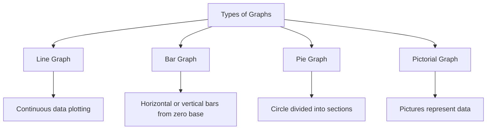
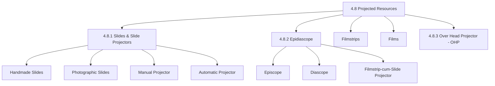
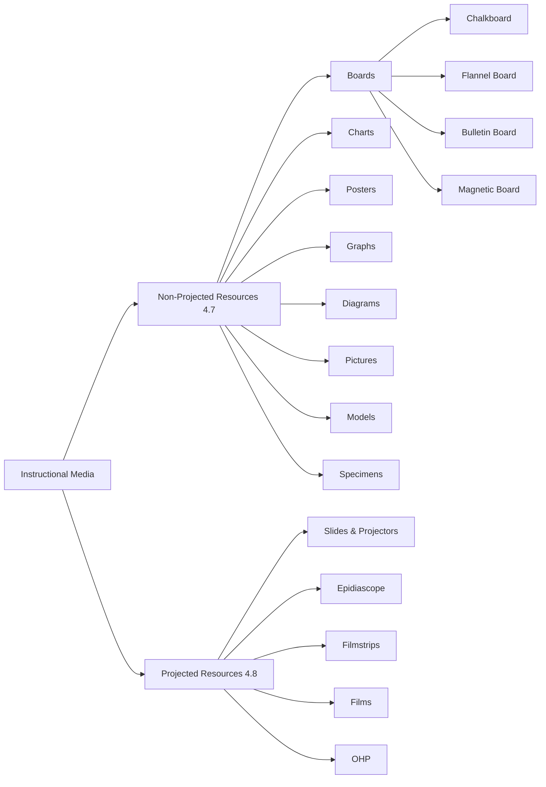

# 4. RESOURCE BASED LEARNING (Part 2)
## Topics: 4.7 - 4.8 — Non-Projected & Projected Resources

---

## 4.7 Non-Projected Learning Resources

**Non-projected media** are instructional media that do **not** require infrastructural facilities such as electricity, projectors, etc. They are simple, readily available, and widely used in all schools.

!!! note "Key Characteristic"
    Non-projected aids (graphic aids) such as charts, maps, or models are best suited for **small groups** of learners. They are not quite useful for a class of 70–80 students.

---

### Boards

Use of various types of boards is very popular in all schools. The major types of boards used by teachers are:

| Board Type | Material | Key Feature |
|---|---|---|
| **Chalkboard** | Wooden or glass board + chalk | Most common; used for writing, drawing, solving problems |
| **Flannel Board** | Flannel cloth on board | Graphics stick and can be rearranged |
| **Bulletin Board** | Soft board covered with felt cloth | Material is pinned; easy to display and remove |
| **Magnetic Board** | Board with magnetic surface | Uses magnets to hold display materials |

---

#### Chalkboard

The **chalkboard** (or blackboard) is used for **visual display**. The display on a wooden or glass board is made with the help of chalk — white or coloured. Traditionally the board colour was black and chalk was white, but it is equally advisable to use different colours for the board (e.g., green, white) and corresponding colours of chalk (e.g., yellow chalk on green board).

**Uses of the Chalkboard:**

- Writing **important points**, keywords, and new concepts
- Drawing **figures and diagrams**
- Solving **problems step by step**
- Can also be used **by students**

##### Five Components of Chalkboard Work

For neat and systematic presentation, the teacher should be aware of the following **five components**:

| # | Component | Description |
|---|---|---|
| **i** | **Legibility (Size of letters)** | Letters should be large enough to be easily legible for students sitting on the back benches |
| **ii** | **Spacing** | Adequate space between letters, words, and lines. Proper spacing makes writing neat and legible. Space between two lines should be adequate and uniform throughout |
| **iii** | **Straight lines** | Matter should be written in straight lines. The teacher should **move along the board** while writing, not stand at a fixed point — otherwise writing will be tapering |
| **iv** | **Use of coloured chalk** | Different colours can be used to write, draw, underline important points, colour specific portions of diagrams, etc. This increases attractiveness. However, **excessive use** of coloured chalks should be avoided |
| **v** | **Organisation (Layout)** | Upper portion → title of the lesson. Remaining portion → planned content. For subjects needing diagrams (Science, Maths, Geography), divide the board into two parts: **left** for figures/diagrams, **right** for writing |

!!! tip "Chalkboard Space Management"
    Some writing must be cleaned to provide space for more presentation. Otherwise the board becomes full and may give **confusing messages** to students. The teacher must plan the use of chalkboard space with **utmost care**.

**Drawing Diagrams on the Chalkboard:**

- If a diagram is drawn **while explaining** the concept, it reduces complexity and increases understanding
- Alternatively, use a **chart** with pre-prepared diagrams — saves time and brings neatness and accuracy
- For drawing maps, figures, diagrams in the classroom, the teacher may use:
    1. **Templates** — readymade cutouts of visuals
    2. **Geometrical apparatus** — ruler, compass, etc.
    3. **Dotted figures** drawn on paper which can be imprinted on the board with chalk dust
- Care must be taken to **maintain accuracy** (e.g., do not draw parallel lines without a ruler, or draw a map of India without measurements)

**Chalkboard in Different Teaching Methods:**

- In **teacher-dominated techniques** (lecture, demonstration) — one-way communication; teacher uses the board
- In **small group methods** (group discussion, group assignments) — multiple boards on the front wall; points, questions, assignments for different groups written on different boards
- In **student group work** — remaining three walls of the room can be used as boards, increasing flexibility and learner-controlled activities

!!! important "Beyond the Classroom"
    The **outer walls** of the classroom (corridor, school building) can also be used as chalkboards. Many schools utilise wall space to communicate messages to students, parents, and visitors.

---

#### Flannel Board

A **flannel board** is prepared with the help of **flannel cloth**.

**How it works:**

- A piece of **flannel or sand paper** is pasted on the back side of the graphics (pictures, photographs, flash cards, etc.)
- These graphics **stick to the flannel board** if pressed softly
- They can be **removed and rearranged** as needed

**Uses and Advantages:**

- **Flannel units** can be prepared for different topics
- Especially useful when the topic has **continuity**
- Example: Teaching **operators of C++** — every operator can be fastened on the flannel along with explanatory comments
- Helps in understanding **difficult concepts** by reducing their complexity
- **Attracts attention** of students
- Students can also prepare flannel units for **group presentations**

---

#### Bulletin Board (Display Board)

A **bulletin board** or **display board** is a **soft board covered with felt cloth**. Material to be displayed is **pinned** to this board.

**Materials that can be displayed:**

- Posters, small charts, photographs, pictures, etc.
- Can be displayed and taken out **with ease** while teaching

**Uses of the Bulletin/Display Board:**

| Use | Description |
|---|---|
| **During teaching** | Pin and display relevant materials while teaching |
| **After teaching** | Display additional information on a topic (e.g., newspaper clippings, photographs on non-conventional energy) for a week or so |
| **Before teaching** | Display material before starting a teaching unit to **create interest** and **arouse curiosity** among students |
| **Learner display** | Students display their own work — essays, pictures, poems, photograph collections on a topic |
| **Wall paper** | Learners can prepare wall papers for longer display |

!!! tip "Encouraging Learner Participation"
    Displaying learner-prepared materials provides an opportunity to present their work before the class and encourages them to participate more **actively** in the learning process.

**Summary on Boards:**

The teacher can utilise the walls of the classroom (both inside and outside) through various types of boards and communicate **visual messages** to the learners. Learners should also be encouraged to use the boards — chalkboard, flannel board, display board — for various **curricular and co-curricular activities**.

---

### Charts

A **chart** is a simple, flat, generally (but not necessarily always) pictorial, display material. Information can be very effectively presented through charts if planned properly.

**Common elements of a chart:**

1. **Caption (Title)** — generally written in bold letters at the top, sometimes at the bottom
2. **Actual message** — may be verbal, graphical (pictorial), or a combination of both

**Preparation of Charts:**

Charts are generally prepared on **card paper** (can be folded for storage) or on **mounting board**.

#### Aspects to Consider While Preparing Charts

| Aspect | Details |
|---|---|
| **a) Verbal message** | Select appropriate words. Too many words make it crowded. Size of words should be visible to all students. Use different colours for differentiation. Use block letters for catching attention. Use **stencils** (plastic/acrylic cutouts) for letters |
| **b) Graphic message** | Supplement verbal message with graphics (figures, diagrams, graphs, maps, pictures, photographs). Size should be appropriate. Use various colours. Graphics may be drawn, enlarged using epidiascope or OHP, or pasted from newspapers/magazines (**collage**) |

!!! note "Collage"
    When an actual graphic (picture, map, graph from newspaper or magazine) is pasted on the chart, this type of chart is called a **collage**.

**Graphic Aids — Definition:**

**Graphic aids** are **two-dimensional visual aids** represented on a plane surface. Conventionalized symbols nearer to reality are used perceptually instead of verbal symbols. They secure attention through their attractive format of visual and pictorial message made meaningful by suitable captions. They are easily available, readily prepared, and stored for future use.

!!! important "Graphic Aids Include"
    Charts, graphs, diagrams, drawings, cartoons, sketches, pictures, and illustrative materials.

#### Types of Charts

Charts may be classified according to **style of presentation** of message:

| Type | Description | Example |
|---|---|---|
| **a) Tree Chart** | Used to present a particular dynasty or hierarchy | History of generation of computers |
| **b) Classification Chart** | Used to present classification | Base class and Derived class examples |
| **c) Flap Chart** | Has flaps which can be opened to disclose the message underneath. Prepared using two chart papers | Overlay of different parts of a computer system |
| **d) Collage** | Information, pictures, photographs from other sources (newspapers, magazines) are pasted. More attractive because of coloured graphics | — |
| **e) Overlays** | Give additional dimension to charts. Can be **static** or **dynamic** (used to show movement) | — |

#### Classification by Usage

In terms of how they are used, instructional charts can be classified as:

**i) Classroom Charts:**

- Used to **supplement the explanation** given by the teacher in the classroom
- Further classified as:
    - **Wall charts** — hung on the wall
    - **Flip charts** — a series of charts on one unit, shown one after the other; put on a chart stand and flipped backward like sheets of a calendar

**ii) Exhibition Charts:**

- Prepared on a **particular theme or concept** (e.g., population education, non-conventional energy resources)
- Used for **exhibition purposes** — displayed in the corridor for a week or so
- Useful while celebrating events such as:
    - **Science Day** (28th February)
    - **Population Day** (11th July)
    - **Children's Day** (14th November)
- Helps in creating a **learning climate** in the school and classroom

!!! tip "Preparing Charts Using Computers"
    Computers offer flexibility and experimentation in planning chart layouts. With various software, charts can be planned on screen, printed using a printer, and enlarged to suit the needs of the teacher and students.

---

### Posters

**Posters** are used to present a **single message boldly** to the learners.

**Characteristics:**

- Use **minimum words** and **minimum colours**
- Display the message **very effectively**
- Are **self-explanatory**
- Used to **supplement explanations**
- Basically a **mass media** — printed in thousands to reach the masses

**Sources for Posters:**

Teachers can approach various organisations such as the health department, solid waste management department, energy department, etc. to collect posters. Examples: posters on blood donation, blood groups, tree plantation — can be directly used for classroom teaching.

---

### Graphs

!!! note "Definition"
    A **graph** is a **visual representation of numerical data**. It is fundamentally a tool for expressing numerical relationships, which is much easier to visualize than statements made only in words and figures. It depicts facts clearly, and statistical data are made to speak for themselves.

**Characteristics of Graphs:**

- Offers a judicious technique for **analysing, comparing, and predicting** facts
- Useful for showing **quantitative data** in visual form
- Interpretation is **easy and very quick**
- Correct inferences can be drawn with ease
- Symbolic or abstract in character
- Best used in the **body or summary** of a lesson after the student has acquired background information
- By nature, a **summarizing device**

#### Types of Graphs

| Type | Description |
|---|---|
| **Line Graph** | Used when a considerable quantity of data is to be plotted or when the data are **continuous** |
| **Bar Graph** | Consists of bars arranged **horizontally or vertically** from a zero base. Size, length, and colour of bars represent different values. Helpful in **comparing or contrasting** many subjects |
| **Pie Graph** | A **circle** where sections represent component parts of a whole |
| **Pictorial Graph** | An outstanding method of graphic representation where **pictures** are used for the expression of ideas |

---

### Purposes of Using Graphic Resources

Graphic aids play a major role in making ideas clear and comprehensive. The following purposes can be achieved:

- **Show relationships** by means of facts, figures, or statistics
- **Summarize information** at the end or during the lesson
- **Present materials** in symbolic form
- Show **continuity** in the process and product of thought
- Present **abstract ideas** in visual form
- **Create problems** for new situations and stimulate objective thinking

### Educational Values of Graphic Resources

| Value | Description |
|---|---|
| **Stimulate interest and curiosity** | Graphic aids stimulate interest in learning subject matter |
| **Means to impart self-education** | Constant source of inspiration and means of imparting self-education to students |
| **Attention compeller** | Play a significant role in capturing attention and making things understandable |
| **Simplify the explanation** | Give reality and simplify explanation and narration. Even average students can understand facts very quickly |
| **Concretize abstract subject matter** | Serve as an instrument for explaining abstract nature of subject matter and drawing various figures in science subjects |

---

### Diagrams

A **diagram** is a **simplified drawing** to show interrelationship primarily by means of **lines and symbols**.

- Can be truly considered as **brief visual synopses** of facts to be presented
- Explain facts **more easily** than charts
- **Indispensable** in science subjects
- Better used for **summary and review** than for instruction

---

### Pictures

A **picture** is a **pictorial device** designed to attract attention and communicate ideas, facts, story, or image **rapidly and clearly**.

---

### Illustrative Material

Illustrative material can be displayed in the form of **painting, photograph, drawing, and engraving** and is **self-explanatory**.

---

### Models

Unlike charts and posters, **models** are **three-dimensional visual aids**. Models provide representation of real things in all respects except size and shape.

#### Types of Models

| Type | Description | Example |
|---|---|---|
| **Simple (Static) models** | Show different parts but parts **cannot be separated** | Thermocol model of a cell |
| **Sectional models** | All parts can be **separated, shown, and replaced** | Sectional model of an eye |
| **Working models** | Show **actual operation or working** of a real object | Working model of logic gates using circuits; working model of hydroelectricity generation using turbines |

#### Preparation of Models

**Materials used:** thermocol, paper, wax, plaster of paris, cardboard, straws, card paper, match sticks, rubber bands, etc.

**Purpose:** To convert **abstract concepts** into reality or near reality.

!!! tip "Essential Qualities of a Good Model"
    A model should have the essential qualities of **accuracy, simplicity, utility, solidity, and ingenuity** to be maximally useful.

#### Educational Values of Models

| Value | Description |
|---|---|
| **Manageable dimensions** | Compact dimensions for classroom use; enable reducing or enlarging objects to an observable size |
| **Simplify reality** | A working model gives thorough understanding of various operations |
| **Demonstrate process** | The whole functioning of a big industrial unit can be explained with a model |
| **Clarification** | Working models give clarification about operations that cannot be understood by mere observation; being three-dimensional, they evoke greater interest |
| **Effective and meaningful teaching-learning** | Working models logically lead students through various developmental stages of process of action |
| **Help in learning skills** | Students understand things by the psychological principle of **"learning by doing"** |
| **Concretize abstract concepts** | Simplify complex objects and accentuate important features with colour and texture |
| **Capture attention** | A working model secures immediate attention of the viewer |

!!! important "Models vs Charts"
    Models can be **handled, operated, and seen from different angles** and hence are more interesting and instructive than a picture or a chart which is two-dimensional.

---

### Specimens

!!! note "Definition"
    A **specimen** is a **three-dimensional teaching aid**. Objects which are incomplete or representative of a group or class of similar objects are called specimens. A specimen may also be defined as a **typical object or a part of an object** which has been separated from its natural setting and environment.

**Key Features:**

- A powerful device possessing the capacity of involving **all five senses** — seeing, touching, hearing, smelling, and tasting
- Example: We can display **parts of computer and hardware** as specimens

---

## 4.8 Projected Resources

!!! note "Definition"
    Media such as **slides, filmstrips, films, or overhead projector transparencies** are called **projected media** because they all need to be **projected on the screen** with the help of some projector. On projection, the message on a slide or transparency gets **magnified several times** and hence can be seen by a **large group** of students.

---

### 4.8.1 Slides and Slide Projectors

#### Types of Slides

| Type | Description |
|---|---|
| **Handmade slides** | Prepared by drawing/writing on transparent film. Cut the film into **24 × 18 mm** (single frame) or **24 × 36 mm** (double frame) pieces and mount on cardboard or plastic mounts |
| **Photographic slides** | Prepared using a **positive film** with a **Single Lens Reflex (SLR) camera** |

#### Preparation of Slides

1. **Select a topic** for teaching through slides
2. **Write a script**
3. **Filming** is done (e.g., a slide show of 10–12 slides on application of solar energy — solar cooker, solar heater, solar batteries, solar pumps)
4. Decide whether to make slides from:
    - **Live situations** — actual field shooting (select sites and shoot)
    - **Photographs or drawings** — collect or get them done by artists, then shoot
5. Care should be exercised to **maintain accuracy**; unnecessary details or irrelevant content in the frame should be avoided

!!! tip "Computer Graphics for Slides"
    A latest technique is to use **computer graphics** for preparing slides on the colour screen and shooting directly from the screen. The computer offers a lot of flexibility in planning and preparing slides.

#### Types of Slide Projectors

| Type | Description |
|---|---|
| **Manual slide projector** | Two slides can be arranged at a time; while one is projected, the other can be replaced |
| **Automatic slide projector (Slidomatic)** | Has trays for **20 to 120 slides** arranged in order. Projects them one by one. **Remote control** allows going backward/forward, pausing, or increasing speed |

#### Synchroniser

- Slides must be projected in a **dark room**
- Since it is a visual medium, **background commentary** on the content may be necessary
- Commentary can be made by the teacher **while showing slides** or **pre-recorded** and played on a tape recorder
- This must be **synchronised** — commentary and visuals should match
- A machine called **synchroniser** can be attached to the automatic slide projector
- By adjusting the speed of commentary, the commentary and visuals can be synchronised

#### Slide — Educational Values

| Value | Description |
|---|---|
| **Partially darkened room** | Can be projected in a partially darkened room, thus facilitating further class activities |
| **Enlargement** | May be enlarged to desired size |
| **Repeated showing** | Can be repeatedly shown and keep the image on screen for any period of time |
| **Demonstrate the invisible** | Help teachers demonstrate things not possible to see through the naked eye |
| **Inexpensive** | Preparation of a slide is comparatively inexpensive |
| **Easy handling** | Easy to handle and easy to store |

---

### 4.8.2 Epidiascope

!!! note "Definition"
    **Epidiascope** is a combination of **episcope** and **diascope**. This device is used to project **both transparent and non-transparent materials**.

| Mode | Function | Material Type |
|---|---|---|
| **Episcope** | Projects **non-transparent (opaque)** material | Pictures from texts, flat pictures, photographs, postcards, students' drawings, sketches, written materials, small objects |
| **Diascope** | Projects **transparent** material | Slides |

All materials can be projected in **magnified form** on the screen.

#### Filmstrip-cum-Slide Projector

A **filmstrip-cum-slide projector** is a modern projector that provides the facility to project **both filmstrips and 2" × 2" photographic slides**.

**Features:**

- Easy to operate; **less expensive** and **portable**
- Available with different kinds of illumination:
    - Small **100 watt** projector — for small groups
    - Larger **1000 watt** projector — for use in auditoriums
- Designed to allow a **slide carrier** to be inserted
- Slides can be loaded in a **linear tray** or **circular tray** in proper sequence
- Can be operated and focussed by **remote controls**
- Possible to record narration in a tape recorder and hook it up to the projector for **automatic commentary** without the help of the teacher

---

### Filmstrips

!!! note "Definition"
    A **filmstrip** is a **still picture visual medium**. It is a related sequence of transparent still pictures or images arranged in a specific order on a strip of **35 mm film**.

**Specifications:**

| Feature | Details |
|---|---|
| **Material** | Cellulose acetate sheet, 35 mm width |
| **Length** | 2 feet to 5 feet |
| **Single frame size** | 18 × 24 mm |
| **Double frame size** | 24 × 36 mm |
| **Frames per strip** | 10 to 50 frames (depending on length and type) |
| **Content** | Drawings, photographs, diagrams, or a combination |

**Preparation:**

- Teachers can prepare filmstrips using a **camera** if the sequence is planned ahead
- Can be prepared by applying **photographic techniques** or by **drawing pictures by hand** on the film itself

#### Educational Values of Filmstrips

| Value | Description |
|---|---|
| **Readiness and awareness** | Infuse in students a readiness and awareness to learn their subject in a short time without difficulty |
| **Hold attention and motivate** | Great power to hold attention and motivate students in the teaching-learning process |
| **Lightweight and portable** | Easy to transport; inexpensive aids; teacher can prepare own filmstrips |
| **Non-inflammable** | No danger in carrying them |
| **Convenient and flexible** | When projected, can be viewed effectively by a larger group or even a single student |
| **Variety of information** | Can incorporate maps, drawings, photographs, etc. |

!!! important "Limitation of Filmstrips"
    The greatest limitation of filmstrips is that they **lack sound**. This can be overcome by recording the commentary in an **audio tape**.

---

### Films

!!! note "Definition"
    An **educational film** is a projected aid which contributes to the attainment of desirable educational outcomes by making effective use of **motion picture** as a medium of communication. They are useful for presenting **dynamic things or visuals** which cannot be presented in the classroom by other means.

!!! tip "Note"
    As a result of the advent of **television and video-cassette technology**, educational films have become somewhat out of date. However, schools which possess film projectors may continue to use them.

#### Technique of Teaching with Films

The teacher who wants to make good use of films as a teaching aid must follow these steps:

| Step | Action |
|---|---|
| **1** | Teacher should make all necessary **arrangements well in advance** |
| **2** | **Preview the film** before the actual film show |
| **3** | Give the **purpose of the film** before it is shown to students |
| **4** | After the film show, there should be **questioning, comments, and discussion** to clarify doubts |
| **5** | **Follow-up activities** (written or oral) should be planned much in advance |

#### Educational Values of Films

| Value | Description |
|---|---|
| **Combines visual, motion, and sound** | Contributes to effective teaching and learning process |
| **Brings past and present** | Has the capacity of bringing past events and present into the classroom |
| **Motivates and compels attention** | Helps to motivate students and compels attention |
| **Enlarge or reduce** | Can enlarge or reduce the original size of the object for better understanding |
| **Shows invisible processes** | Processes which cannot be seen by human eye even with microscope or telescope can be shown using **animation technique** |
| **Reproduces natural phenomena** | Can reproduce natural phenomena like lunar and solar eclipses which are not always possible to see |
| **Clarifies difficult concepts** | Enables the teacher to clarify difficult concepts in **less time** than with any other technique |
| **Fast and slow motion** | With **fast motion technique** and **slow motion technique**, we can closely observe and discern movements and processes happening slowly or very quickly |

---

### 4.8.3 Over Head Projector (OHP)

The OHP is considered to be the **most convenient and effective medium** in the hands of the communicator (both teacher and learner). It is a **versatile tool** in the teaching-learning process.

!!! note "Key Feature"
    The OHP can be used in many ways since it projects messages (verbal or pictorial) written on a **transparent sheet**. It can therefore substitute a **picture, graph, map, chart, or even a chalkboard**.

#### Description

**O.H.P.** looks like a **rectangular box** made up of metal sheet.

| Component | Description |
|---|---|
| **Light source** | 650 watt halogen lamp inside the box |
| **Concave reflector** | Fixed below the light source; reflects all light rays to the top |
| **Fresnel lens** | Fixed above the bulb; forms a converging beam of light that illuminates the stage uniformly |
| **Projection lens** | Converges light from the stage |
| **Plane mirror** | Kept at **45° incline**; reflects the image to fall on a screen kept behind and over the head of the teacher |

#### Principle and Operation

In overhead projection, a **transparent visual** is placed on the horizontal stage on the top of the light source. The light passes through this transparent material and then is reflected at an angle on to the **screen or wall** at the back side and **over the head** of the instructor.

#### Structure of an Overhead Projector — 4 Advantages

| # | Advantage | Description |
|---|---|---|
| **i** | **Large group use** | As it is a projected medium, the entire class can see the projected transparency at a time. Experiments (e.g., formation of magnetic lines) which can only be explained to a small group can be displayed through transparencies for the whole class |
| **ii** | **No dark room required** | Unlike other projected media (slide or film projection), the OHP can be used in **normal classroom light** |
| **iii** | **Two-way communication** | The teacher **faces the students** while using OHP. He/she can explain the concept while showing the transparency **without losing eye-contact** with students. Can also be used as a chalkboard — write on the transparency with OHP pens, draw diagrams while teaching |
| **iv** | **Easy to handle** | No complicated mechanism. By just turning its knob or switch, one can switch it on and increase light intensity. Even **students can use it easily** |

#### Preparation of OHP Transparency

The OHP can be used to project:

- **One single transparency**
- A **roll of transparent sheets**
- A **bunch of transparencies** bound together in a desired way

**Transparencies** are projected as still visual aids for use with an OHP. They are made in **triacetate sheets**.

| Feature | Details |
|---|---|
| **Standard size** | 25 cm × 25 cm (or) 20 cm × 25 cm |
| **Mounting** | Can be suitably mounted on cardboard frame |
| **Use** | Visually present concepts, processes, facts, outlines, and summaries to small groups, normal-size classes, and large groups |

##### i) Single Transparency

A single transparency can be prepared by:

| Method | Description |
|---|---|
| **Writing with OHP pen** | Write words or draw figures, diagrams, pictures, graphs on the transparency. OHP pens of different colours can be used (black, blue, green, red are most visible). Can also use a **coloured transparency** |
| **Xeroxing** | From any printed material; can be same size, magnified, or reduced. **Colour xeroxing** is also available |
| **Tracing** | Tracing the material from the original source |

**Types of impressions:**

- **Temporary, erasable** impressions — developed with **water-soluble marker pens**
- **Permanent** impressions — created with **special permanent marker pens**
- Complicated pictures and diagrams can be prepared on acetate sheets by means of **xeroxing**

##### ii) Roll of Transparency

- Every OHP has a mechanism to attach a **roll** and a handle to roll the transparency
- Write on the roll and project the message along with explanation/narration
- **Long processes** (e.g., manufacturing metals from ores) can be shown effectively
- Can move the roll **backward or forward**

##### iii) Overlay Technique

When interested in **progressively adding details** to a diagram or presentation, overlays are very useful.

**How it works:**

1. The **base transparency** is presented first
2. As the teaching process progresses, **other transparencies are placed over** the first one
3. This is also called **progressive disclosure**
4. Example: Classification of media — overlay one by one

!!! tip "Additional Techniques"
    - **Transparent models** can also be used
    - **Animation** can be adopted by moving transparencies

##### iv) Silhouette Technique

Transparent models and moving transparencies can be used to create **silhouette effects** and **animation** on the OHP screen.

---

#### Educational Values of OHP

| Value | Description |
|---|---|
| **Enlarge image** | An enlarged projected image of transparent visual is obtained in a minimum of projection distance |
| **Face the students** | Teacher can always face the class, observe students' reactions, guide students, control attention, and regulate the flow of information |
| **Portable** | Comparative light weight makes it portable, simple to operate, and requires only minimal servicing |
| **Identity with the teacher** | Students see the visual from the same point of view as the teacher — creates a feeling of **oneness** with the teacher |
| **Lighted room** | Can be used in a well-lighted room, enabling the teacher to watch student activities |
| **Focus student's attention** | Teacher can develop a diagram while teaching over the transparency on the stage; can focus attention on important aspects using a **pointer on the stage** |
| **Personalized presentation** | Teacher production of personal transparencies and commercial transparencies enhance OHP use. Techniques like **pointing method, revelation technique, step-by-step presentation with overlays** increase interest |
| **Flexibility and versatility** | "User-operated" visualization integrated into total presentation with complete flexibility. Teacher has complete control of sequences, timing, and material manipulation — maintains discipline |
| **Minimize cost and time** | Effective visuals can be made in minimum time and cost. Once made, it is **permanent** and need not be erased as in a chalkboard |
| **Large group instruction** | OHP is very useful, particularly with sufficiently large groups |

---

## Summary: Non-Projected vs Projected Resources

| Feature | Non-Projected Resources | Projected Resources |
|---|---|---|
| **Electricity needed** | No | Yes |
| **Projector needed** | No | Yes |
| **Group size** | Small groups | Large groups (magnified image) |
| **Examples** | Boards, charts, models, specimens, graphs, posters | Slides, filmstrips, films, OHP transparencies |
| **Dimensions** | 2D (charts, graphs) and 3D (models, specimens) | 2D (projected on screen) |
| **Preparation** | Simple, low cost | Requires equipment and planning |
| **Reusability** | High | High |

---
