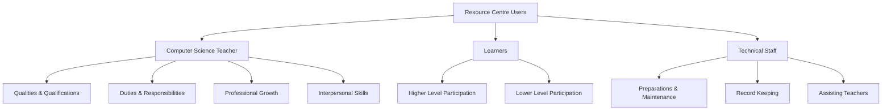
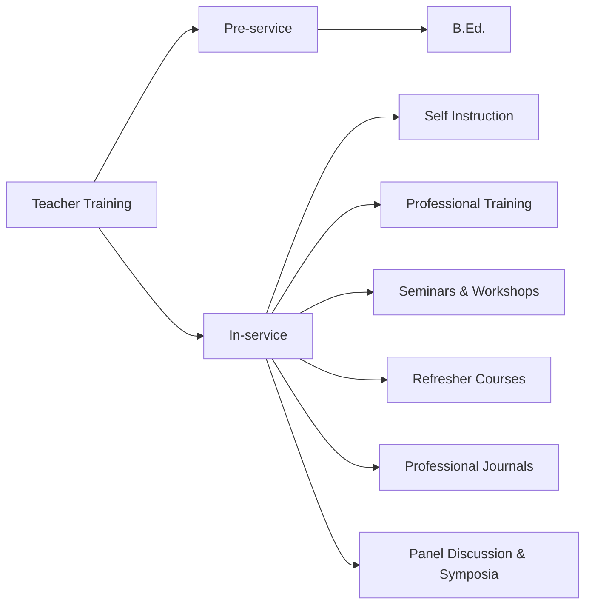
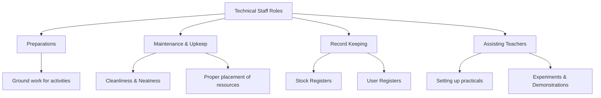
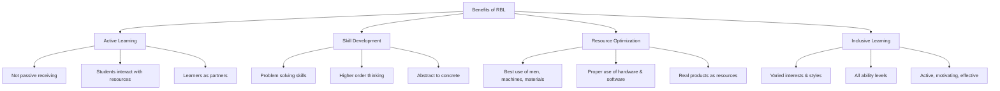

# 4. RESOURCE BASED LEARNING (Part 3)
## Topics: 4.9 - 4.11 — Users, RBL & Self Assessment

---

## 4.9 Users and Their Role in a Resource Centre

!!! important "Key Principle"
    Resource centre would be really meaningful only when **users — Teachers, Learners, Technical Staff** — play their roles properly. *"The quality of a pudding is in its eating."* The functioning of a resource centre and its success depend on its proper use by the users. Only then will the purpose and objectives of establishing a resource centre be fulfilled.

The use of all major resources is different and each user should understand their roles and carry them out effectively.

---

### 4.9.1 Computer Science Teacher

#### Introduction

A computer science teacher requires a certain amount of **teaching competencies** such as:

- The capacity to **plan instructional sessions**
- To prepare appropriate **instructional material**
- To conduct **group and individualized instruction**
- To **assess student progress**

Similarly, they should have sufficient ability in **diagnostic and evaluation skills** such as:

- Ability to **gather and analyse data** related to student behaviour
- To **design, develop and administer** appropriate instruments to measure student development
- The ability to **interpret objectively** the findings obtained through the use of such tools
- Required **communication skills**

!!! tip "Role Model"
    A competent, efficient and effective teacher becomes a **role model** for the students. They observe and follow the teachers till the end of their life. Many times they quote examples of their teacher as a model character.

#### Concept of Competence

!!! note "Roe's Definition"
    According to **Roe**, the concept of competence refers to *"a learned ability to adequately perform a task, duty or role."* It integrates several skills, types of knowledge and attitudes to complete a work in a particular work setting. Competencies are typically acquired by a process of **learning by doing** in the actual work situation, during internship or a simulation-based learning situation.

!!! quote "Henry Van Dyke"
    *"Famous educators plan new system of pedagogy but it is the unknown teacher who directs and guides the young."*

As teacher is a crucial component in the field of education in evolving and implementing ideas, as ideal models, **competent teachers should be trained**.

---

#### Computer Science Teacher — Qualities and Qualifications

All resources like good laboratory and aids to teach will be of little use in the hands of a teacher who is not really endowed with qualities which make him an ideal computer science teacher.

##### Overall General Qualities

| Quality | Description |
|---------|-------------|
| **Effective Personality** | The teacher should possess an effective personality capable of leaving a desirable influence on the minds and hearts of students. S/he should have a sharp intellect with proper emotional maturity, social outlook and sound morality. |
| **Self Confidence** | A teacher must have confidence in his abilities and demonstrate it through his behaviour in general and in classroom teaching. |
| **Leadership and Love for Computer Sciences** | The teacher must be a good leader in whom students may have genuine faith. He should inspire them to seek knowledge with sincerity and show love for discipline. |
| **Patience** | A teacher should not unnecessarily get disturbed over minor mistakes and shortcomings of pupils but must show a lot of patience in dealing with them. Pupils should not live in constant fear but must receive proper guidance. |
| **Affectionate Behaviour** | The teacher should create an atmosphere of goodwill, love and cooperation. S/he should not get irritated on minor faults but should create an environment of mutual trust and affection congenial for proper work and learning. |
| **Hardworker and Responsible** | The teacher should inspire students in creating interest for learning, doing hardwork as well as sharing responsibility sincerely. |
| **Impartial Behaviour and Attitude** | A teacher should not have any bias and prejudice of any kind towards any of his students. |
| **A Good Communicator of Ideas** | A teacher should be clear in expression and should be able to convey ideas to pupils with ease and effectiveness. Black-board work and sketches should be quite neat, bold and effective. |
| **Studious and Learned** | A very desirable quality of a teacher is his taste for reading. S/he should have the habit of keeping himself in touch with the latest development especially in his/her own subject. |
| **Sincerity of Purpose** | A teacher should have love for his profession. He should be proud both for his own personal achievements and that of his pupils. |

---

##### Academic and Professional Qualifications

!!! important "Minimum Qualifications"
    - S/he should be **UG or PG** with **B.Ed.**
    - Higher qualifications are welcome.

| Qualification Area | Description |
|--------------------|-------------|
| **Mastery of Subject** | A computer science teacher should have profound knowledge of his subject. He should be able to answer all the questions put to him by students to their satisfaction in all branches of his subject. |
| **Thorough Knowledge of History of Computer Science** | A computer science teacher should acquaint himself with the history and contributions of great scientists. Armed with such knowledge, he is likely to encourage his students. |
| **Knowledge of Related Subjects** | A teacher equipped with the knowledge of all related subjects will be able to handle students efficiently. S/he could demonstrate the application of computer science in those areas. |
| **Knowledge of Methods of Teaching** | It is essential for the teacher to be trained in the latest techniques, strategies and methodology of teaching computer science including the use of all types of teaching aids including the latest technological aids. |
| **Ability to Do Practical Work** | A computer science teacher must acquire proper skills and manual dexterity in handling and manipulating various types of instruments. Must be able to demonstrate all programs satisfactorily in class and provide necessary help and guidance to students working in the laboratory. |
| **Knowledge of Psychology Related to CS Teaching** | The teacher should have full knowledge of the behaviour of students in order to handle them effectively in the teaching-learning process. Knowledge of psychology helps the teacher understand the ability and behaviour of children at different stages of learning or development. |
| **Knowledge of New System of Examination** | Traditional essay type tests have been enriched by the introduction of objective type tests. These new tests are of different nature and types and their marking system is also different from the traditional ones. |
| **Practical Tests** | The teacher should know about the construction of unit tests and diagnostic tests as well as administration, scoring and interpretation of these tests. Must get trained in the evaluation of all learning outcomes in terms of behavioural changes and objectives. |
| **Knowledge of First-Aid** | There are possibilities of accidents in laboratories — fire, explosion, short circuits, electric shock etc. The teacher should take necessary immediate steps to render first aid to the injured at the earliest. |

---

##### Additional Professional Qualities

- **Taste for Scientific Activities** — A good computer science teacher should have taste and love for organizing and participating in activities like establishment of computer science museum, computer science club, organizing excursions and computer science fairs, and engaging in purposeful scientific hobbies. Such activities constitute real education and help in the proper development of **scientific attitude** among students.

- **Efficiency in Preparation and Use of Teaching Aids** — The teacher should have sufficient skill and dexterity in improvising and constructing his own aids in teaching of computer science according to local needs and situations. S/he should have full self-confidence in handling all types of demonstration equipment and materials as well as in using all types of audio-visual and computer aids.

- **Scientific Thinking and Attitude** — A good computer science teacher tries to imbibe scientific thinking and attitude in his own actions and thoughts. For inspiring pupils to imbibe these traits, he attempts to provide computer science education in such a way as to inculcate in the pupils the habit of **testing the validity of certain beliefs and facts** by their own independent observations and experimentation.

!!! note "S/he should also:"
    - Take care for **individual differences**
    - Be a **friend, philosopher and guide**

---

#### Objectives for Computer Science Teachers

The teacher must keep the **six objectives** in view:

1. **Proficiency** in fundamental skills
2. **Comprehension** of basic concepts
3. **Appreciation** of significant meanings
4. **Development** of desirable attitudes
5. **Efficiency** in making sound applications
6. **Confidence** in making intelligent and independent interpretations

---

#### Planning

In order to attain these objectives, the teacher must plan his work with at least **five things** in mind:

1. Decide what **exercises and activities** will contribute most effectively to produce the desired understandings and skills. The teaching material should be selected with great care.
2. **Analyse materials carefully** to anticipate the specific difficulties which the pupils are likely to encounter in attaining the objectives of the unit.
3. Become **expert in sensing the procedures and devices** that promise to be specifically helpful and learn to be adept in adjusting procedure to the requirements of each immediate situation.
4. Make a **careful selection and arrangement of motivating materials**. It is the teacher's responsibility to create, stimulate and maintain interest as well as to strive for proficiency in skills and the amassing of information.
5. Give **careful thought to evaluation techniques** and remedial procedures.

---

#### Identification of Instructional Problems

The analysis of instructional problems divides itself into **six considerations**:

| # | Consideration |
|---|---------------|
| 1 | What **background of experience and understanding** may the student be expected to have when he begins the study of the topic? |
| 2 | What are the **particular understandings or abilities** which the student should acquire or strengthen through the study of the topic? |
| 3 | What **activities or procedures** on the part of the teacher and student will enable the student most effectively to gain these desired understandings and abilities? |
| 4 | What **specific difficulties** may the student be expected to encounter in his effort to acquire these understandings and abilities? |
| 5 | What **specific suggestions, devices and procedures** will help the student most effectively to avoid or overcome these specific difficulties? |
| 6 | What **materials and procedures** related to the particular topic will best stimulate and maintain the student's interest? |

S/he must plan as explained above to solve the problems of the students through suitable **remedial measures**.

---

#### Special Qualities of a Computer Science Teacher

Computer science being the latest science, which is ever growing and changing, a computer science teacher has to be **abreast of time and up to date**.

- Topics like **Ms-Word, Ms-Excel, C Program** need slow and steady teaching. Teacher should use **LCD Projector** and demonstrate the stages and steps clearly. If the students do not know the first step they can't understand later concepts.
- If LCD projector is not available, using computer itself, explanation should be given in **small groups**, using necessary charts.
- Computer science teacher has to **carefully maintain the computer science laboratory** since the equipment is costly.
- S/he should **plan well for lab work**, collecting required stationery items.
- S/he should arrange for **keeping records** for students' work; lab materials and outdated stuff should be properly disposed by getting proper approval.
- Computer science teachers should be **alert to know the latest changes** in the field.
- The computer science teacher should have a **degree in computer science** and a **B.Ed. degree**.
- Teacher should have **deep subject knowledge**.
- Teacher should give **life, career-oriented education** rather than only theoretical knowledge.
- If the students' doubts cannot be clarified in the class itself, it can be cleared later also.
- Computer science may become difficult to follow if students don't attend regularly. So S/he should **create interest and attract students** to attend without break.
- The method of teaching should be according to **students' level of understanding**.
- Teacher should give **clear explanation** for new concepts.
- The teacher should develop the **creative thinking** of the student through teaching.
- The teacher can follow **different types of techniques** in teaching.

---

#### Duties and Responsibilities of a Computer Science Teacher

Attaining the characteristics and qualities mentioned above, a computer science teacher is supposed to discharge various duties and responsibilities belonging to his/her profession:

| Duty | Description |
|------|-------------|
| **School Acquaintance** | Full knowledge and acquaintance with the school time table, the ideals of the school, the work and the social environment of the school, etc. Providing double periods for lab work. |
| **Teaching Theory** | Teaching computer science theory to various classes assigned to him/her in the school timetable. |
| **Demonstrations** | Arranging and performing demonstrations relevant to the computer science teaching in his/her respective classes. |
| **Practical Work** | Arranging and helping the students to carry on their practical work in the laboratory or outside and checking their records. |
| **Organization** | Organization of computer science laboratory, computer science library and computer science museum. |
| **Co-curricular Activities** | Organization of various co-curricular activities particularly related to scientific activities like computer science fair, computer science exhibition, scientific excursion, scientific hobbies etc. |
| **Assignments** | Assigning appropriate and relevant home-work and assignments to the students, and its regular check-up. |
| **Record Keeping** | Keeping proper record of the progress of students and providing information to them as well as to school authorities and parents for better results. |
| **Audio-Visual Aids** | Making use of various audio-visual aids in teaching, helping in the establishment of an audio-visual room or centre in the school, working towards the preparation and collection of audio-visual materials and improvised apparatus etc. |

---

#### Professional Growth

Striving hard for his own professional growth by being acquainted with:

- The **latest knowledge and development** in his subject and methodology of computer science teaching
- **New trends** in computer science
- **Computer science journals** and instructional materials
- **Attending workshops, seminars, summer institutes** on the subject and methodology of science teaching
- **Joining computer science associations** and teacher associations
- Being in contact with the **National and State level institutions** of science for up-to-date scientific knowledge and methodology of teaching computer science
- Having touch with the **schemes and provisions** for the progress and career of the students like science scholarships, National Science Talent Search Scheme and the future career courses etc.
- **Maintaining a Computer Science diary** for helping in the proper exercise of duties and responsibilities by writing down all details relating to teaching and co-curricular activities
- **Helping management** in inspection of Computer Science department

---

#### Interpersonal Skills

!!! important "Key Professional Competency"
    Another professional competency expected of the teacher is a certain amount of **interpersonal skills**.

As a teacher we should develop the ability to:

- **Communicate** with students clearly and precisely
- **Identify** student concerns and needs
- **Respond** to students with an open and stable attitude
- **Demonstrate self-confidence** in dealing with them
- **Interact** with them in ways that are adaptable

By dealing with them kindly, effectively and fairly, we should be in a position to develop their strong confidence in us. This is more important in the case of a computer science teacher.

- **The ability to inspire and motivate** pupils is another great asset. A major obstacle to learning is **fear** — fear of failure, fear of criticism and fear of appearing stupid. A teacher should learn to **tolerate mistakes**. It should be taken as a conscious attempt on the part of a student towards learning. Instead of chiding a student, the teacher should try to find out **strong points** in each student and give them the required opportunity and motivation to promote their growth and development. Only through such exposure and motivation will you be able to lead them to **self-actualization**.

!!! tip "Summary"
    To be a computer science teacher, an individual has to develop several **personal qualities** as well as **professional competencies**. S/he needs to be trained so that he/she develops the required awareness, knowledge, skills and attitudes to be effective as a teacher.

---

#### Organizational Competency

**Organizational competency** is yet another asset of a teacher. As a teacher we should be able to:

- **Manage the material resources** available in our classroom
- **Plan and utilize** different equipment
- Use awareness of **group dynamics** for classroom management
- Be familiar with **individualized, group as well as teacher-centered techniques** of instruction
- Develop expertise in handling **library resources** such as use of dictionaries, encyclopedias, library catalogues, atlases, maps, etc.
- Be good at **information gathering skills** such as interviewing, note-taking, using reference materials, etc.

---

#### Keeping Academic Diary and Use of Time Table

##### Academic Diary

Computer science teacher should keep an academic diary for noting the following:

1. **Annual distribution** of computer science curriculum
2. **Division of annual curriculum** for monthly, weekly, daily teaching along with required aids/equipment and activities
3. **List of experiments / lab work** for the year
4. **List of computer science club members** and the annual plan of action
5. **Special and specific nature of doubts** asked by students and how the teacher cleared them
6. **Students' test materials, marks** etc. which will be useful for future guidance

##### Use of Time Table

!!! note "Special Considerations"
    The work load of computer science teachers needs **special consideration**.

- The teacher may require **double periods** for conducting lab work / experiments. It is better this double period is planned at the **end of the day** so that even if a few minutes more are needed, it could be utilized.
- The computer science teacher has to **check and maintain the computer** for proper working.
- S/he may have to help **office / administration** to do computer-based work.
- In the time table, there should **not be over workload**.

---

#### Need for Training

For proficiency and efficiency, teachers should have proper training:

| Type | Details |
|------|---------|
| **1. Pre-service Training** | B.Ed. etc. |
| **2. In-service Training** | Self instruction |
| | Professional training |
| | Seminars, workshops |
| | Refresher courses |
| | Studying professional journals |
| | Panel discussion, symposia |

---

### 4.9.2 Learners' Role in Resource Centre

!!! important "Importance"
    Next to teacher, **learners' role is important** in the learning process. Without them, all other resources have no need. Every resource moves or functions around the **learner**.

Learners should make **full use of the resource centre** in order to make his/her learning perfect and useful.

#### Higher Level Participation

When students at higher levels participate in **interactive learning opportunities** like:

- Seminars, workshops
- Panel discussion, symposia
- School programmes
- Study Groups

They themselves become **resources in educating each other**, of course with the guidance of the teacher.

#### Lower Level Participation

At lower level, when students participate in:

- **Play group**
- **Educational games**
- **Learning by activities**
- **Singing, dancing** and other cultural activities

With interest, they become part of the learning resources. Without such participation, there cannot be any learning at all.

---

### 4.9.3 Technical Staff — Role in Resource Centre

!!! important "Vital Role"
    In order to make all preparations and ground work for all kinds of activities in the resource centre, the role of **Technical Staff is vital**. Without them, all resources can never be properly maintained and used to serve learners and teachers. There will be only chaos and confusion.

| Role Area | Responsibilities |
|-----------|-----------------|
| **Maintenance** | Properly maintain the resources in respective places and enable students and teachers to make use of them whenever required. |
| **Upkeep** | Cleanliness, neatness of the centre become their responsibilities. |
| **Record Keeping** | Maintain proper record of stock registers and user registers — indicate when and which class used or took the resources for teaching-learning. |
| **Assisting Teachers** | Assist the teacher in setting up practicals, experiments, demonstrations. Technical staff could help the teacher and class. |

---

## 4.10 Resource Based Learning (RBL)

### 4.10.1 Implications for Students and Institutions

#### Introduction

For the success of the RBL model, many **innovative efforts** have to be taken.

Implications include the need for:

- Students and staff to acquire a **wide range of new skills**
- **Large-scale curriculum review** if new learning technologies are to be fully integrated
- Acknowledging that, given student and staff perceptions of change, the process may be **long and costly**

#### Innovations Adopted

It is envisaged that a significant shift to **Resource-Based Learning (RBL)** would occur. Learning outcomes were completely revised, and a range of assessment strategies, including computer-based tests, was identified. A **resources guide** was produced which identified the materials and activities that would enable students to achieve the learning outcomes.

A number of **innovations were adopted**, including:

- **Computer-based curriculum delivery**, assessment and student evaluation of the course
- An **open approach to assessment**
- **Abolishing lectures** in favour of a diverse range of teaching and learning activities

A mid-semester computer-based evaluation was conducted using **Question Mark Designer**, with the specific intention of providing data to inform future curriculum revision.

#### Conclusion

!!! note "Key Findings"
    The adoption of RBL can be viewed as an **opportunity to review curriculum**. In order to be effective, any such activity must be appropriately supported and supervised, and the outcomes need to contribute to the final grade.

- While students may welcome some **innovations**, they also wish to **retain traditional approaches** and value contact with tutors.
- If students perceive lectures as important and necessary, then an approach which precludes them may **not be popular**.
- An institution wishing to move towards RBL will need to consider these **perceptions** and how best to accommodate them.

#### Skills Needed

Compared with more traditional approaches, and in common with open and distance learning, students and staff need a **different, and wider, range of skills**:

**For Students:**

- Be competent users of **software, hardware and information**
- Be able to **manage their time effectively**
- Institution-wide use of such technologies can occur only if all undergraduates possess or have the opportunity to acquire this vast array of skills

**Possible Approaches:**

| Approach | Description |
|----------|-------------|
| **Core Programme** | A core programme in information and study skills and computer literacy for all undergraduates |
| **Embedded Skills** | Embed these skills into the curriculum of all subject areas so that they become contextualized |

**For Staff:**

- Be able to **redesign and evaluate curricula**
- **Understand new learning technologies** and employ them appropriately
- Construct a range of **learning and assessment activities** to meet outcomes
- **Design teaching and learning materials**
- Provide **tutorial support**
- Operate effectively in **teams**

!!! important "Staff Development"
    RBL makes the full range of these skills **essential and not merely desirable**. This raises the issue of **staff development**. The time required to prepare RBL projects exceeds that for a standard lecture and seminar programme. Innovation is an expensive exercise. Unless sufficient funding can be found, it is unlikely that thorough and continuing curriculum review can be sustained.

**Infrastructure Implications:**

- Physical design of **IT facilities** to permit discussion and group activities in conjunction with computer work
- **Technical support** needed to ensure hardware is configured correctly and software operates as intended
- Training of **IT support staff** to play a pedagogical rather than merely technical role

---

### 4.10.2 Coding and Computer Science Resources

!!! note "The Skills Gap"
    It is estimated that there will be **1.4 million computing jobs** but only **400,000 computer-science graduates** with the skills to fill them. Looking toward a future of work that includes automation, artificial intelligence and programming, there is no better time to introduce coding to students.

This will help students to learn more on Computer Science and develop as learners, making students interested in learning computer science.

#### Coding & Computer Science Resources

| # | Resource | Description |
|---|----------|-------------|
| 1 | **AI4 All** | An organization dedicated to increasing diversity and inclusion in AI education, research, development, and policy. Their summer education programs are an entry point into artificial intelligence and computer science for underrepresented high school students. |
| 2 | **AI4K12** | The Association for the Advancement of Artificial Intelligence (AAAI) and the Computer Science Teachers Association (CSTA) launched the AI for K-12 Working Group (AI4K12) to define what students should know and be able to do in artificial intelligence. |
| 3 | **Black Girls CODE** | A non-profit organization dedicated to teaching girls ages 7-17 about computer programming and digital technology. |
| 4 | **Code.org** | An organization dedicated to expanding access to computer science in schools and increasing participation by women and underrepresented minorities. Provides coding resources such as games, apps and courses. |
| 5 | **CodeHS** | A teaching platform for helping schools teach computer science. They provide web-based curriculum, teacher tools and resources, and professional development. |
| 6 | **CodeAcademy** | An online catalog of coding courses ranging from web development to programming. |
| 7 | **CS for All Teachers** | A virtual community of practice, welcoming all teachers from PreK through high school who are interested in teaching computer science. Provides an online home for teachers to connect with one another and with resources and expertise. |
| 8 | **Computer Science Teachers Association (CSTA)** | A membership organization that supports and promotes the teaching of computer science. Provides opportunities for K-12 teachers and their students to better understand computer science. |
| 9 | **Exploring Computer Science** | A year-long, research-based, high school intro-level computer science curriculum and teacher professional development program that focuses on broadening participation in computing. |
| 10 | **The Hour of Code** | Started as a one-hour introduction to computer science to show that anybody can learn the basics. |

There are many such resources in states and other countries.

#### National Educational Policy

!!! important "NEP on Coding"
    The **National Educational Policy** has made **coding a mandatory subject from Class 6**. It is believed this will revolutionize the education system. In India also, coding is the most visible component of Computer Science.

---

### 4.10.3 Resource-Based Learning Activities

#### Definition

!!! note "What is RBL?"
    **Resource-Based Learning (RBL)** is an approach to pedagogy which actively involves **students, teachers and resource providers** in the application of a range of resources (both human and non-human) in the learning process.

It is claimed that this approach offers a **flexible structure** to learning such that the learner can develop as a learner according to their *"varied interests, experiences, learning styles, needs and ability levels."*

#### The RBL Approach

The RBL approach focuses on the **resources available to the learners** and how the learners interact with these resources. This leads to an interest in the uses of **technology** to support and develop a learning environment.

#### Teaching and Learning Resources

This includes any spoken, written or visual text or activity used or conducted by schools:

- **Text books**, story books
- **Films** — plays, radio, TV, multimedia, digital learning resources, video, audio, animations, lectures, speeches, performances

#### Resource Guide

Resource-Based Learning being an innovative technique and new to many teachers, a **resource guide book** will be needed to help teachers.

A resources guide should be produced which identifies the materials and activities that would enable students to achieve the learning outcomes. A number of innovations would be adopted, including:

- **Computer-based curriculum delivery**, assessment, and student evaluation of the course
- An **open approach to assessment**
- **Abolishing lectures** in favour of a diverse range of teaching and learning activities

#### Major Activities of Resource Teacher

Specialists to help class teacher:

- **Assessing** a student's abilities by observing data and creating tests
- **Modifying lesson plans** for individual learning abilities
- **Collaborating** with class teachers to design individualized education programs
- **Communicating** regularly with students and teachers
- **Helping** classroom teacher in planning
- **Designing** tools, strategies, activities to help students

#### Innovations vs Traditional Methods

If the adoption of RBL is viewed as an opportunity to **review the curriculum**, then it may also be used as a vehicle for **embedding IT** into that curriculum.

| Aspect | Observation |
|--------|-------------|
| **Effectiveness** | Any such activity must be appropriately supported and supervised, and the outcomes need to contribute to the final grade. |
| **Student Preference** | While students may welcome some innovations, they also wish to retain traditional approaches and value contact with tutors. |
| **Perception** | If students perceive lectures as important and necessary, then an approach which precludes them may not be popular. |
| **Institutional Need** | An institution wishing to move towards RBL will need to consider these perceptions and how best to accommodate them. |

#### Developing Special Skills Among Teachers

For using this approach, teachers need to be able to:

- **Redesign and evaluate** curricula
- **Understand new learning technologies** and employ them appropriately
- Construct a range of **learning and assessment activities** to meet outcomes
- **Design teaching and learning materials**
- Provide **tutorial support**
- Operate effectively in **teams**

!!! important "Essential Skills"
    While one may argue that these are the skills all teachers require, in our experience RBL makes the full range of these skills **essential and not merely desirable**. This raises the issue of **staff development**. Innovation is an expensive exercise.

#### Infrastructure Required

Further infrastructural implications include:

- The **physical design of IT facilities** so as to permit discussion and other group activities in conjunction with computer work
- The **technical support** needed to ensure that hardware is configured correctly and software operates as intended
- The **training of IT support staff** to play a pedagogical rather than merely technical role

---

### 4.10.4 Benefits of Resource-Based Learning (RBL)

RBL is very useful in providing effective learning and education.

| # | Benefit |
|---|---------|
| 1 | It promotes **problem solving skills** and **higher order thinking skills** |
| 2 | Learning is **not passively receiving information** |
| 3 | Students **actively interact with resources** through engaging relevant resources, which makes learning deep, concrete and meaningful |
| 4 | **Teachers, students, resource providers** are actively involved in learning |
| 5 | This approach appeals to **varied interests, experiences, learning styles, needs and ability levels** of students |
| 6 | RBL makes **best use of resources** of men, machines and materials available in schools |
| 7 | **Human Resources** — well trained teachers, persons providing education resources for classroom teaching, helpers — all should play their roles correctly, effectively |
| 8 | **Computer, computer-based equipment** — different hardware like OHP, projector, audio-video player should all be properly used at right time and right place/context |
| 9 | **Resource materials** like charts, substitution tables, discs for matching, any improvised aid — all should be properly used to make understanding better and first-hand |
| 10 | **Real products** could also be shown and explained if necessary and not dangerous to use and there is no problem in fetching |
| 11 | Several **abstract concepts** could be made concrete, clear and meaningful by using suitable resources |
| 12 | RBL makes **dull and monotonous learning** active, motivating, interesting and effective |
| 13 | RBL could involve **students/learners as partners** of the learning process by themselves handling tools, equipment, models etc. |

---

## 4.11 Test Items for Self Assessment

### I. Choose the Correct Answer (MCQs)

**1. Resource centre is:**

- (a) In school
- (b) In society
- (c) It is for playing games
- (d) It is nothing but library

**2. Why do you need learning resources?**

- (a) To make abstract learning concrete in an understanding way
- (b) As they are available
- (c) School funds can be utilized
- (d) They are attractive

**3. Resources Bank is:**

- (a) Useful to deposit savings money
- (b) It is a collection of teaching aids for ready use in teaching
- (c) It is connected with bank in society
- (d) It is a classroom

---

!!! tip "Exam Preparation Tips"
    - Focus on the **qualities and qualifications** of a computer science teacher — frequently asked in essay questions.
    - Remember the **six objectives** for computer science teachers.
    - Understand the **difference between pre-service and in-service training**.
    - Know the **13 benefits of RBL** — commonly asked as a list question.
    - Be familiar with the **roles of all three users** (Teacher, Learner, Technical Staff) in a resource centre.
    - Understand the **implications of RBL** for students and institutions.
    - Remember the **10 Coding & Computer Science Resources** listed.
