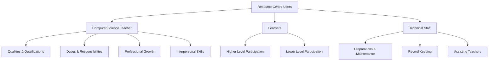
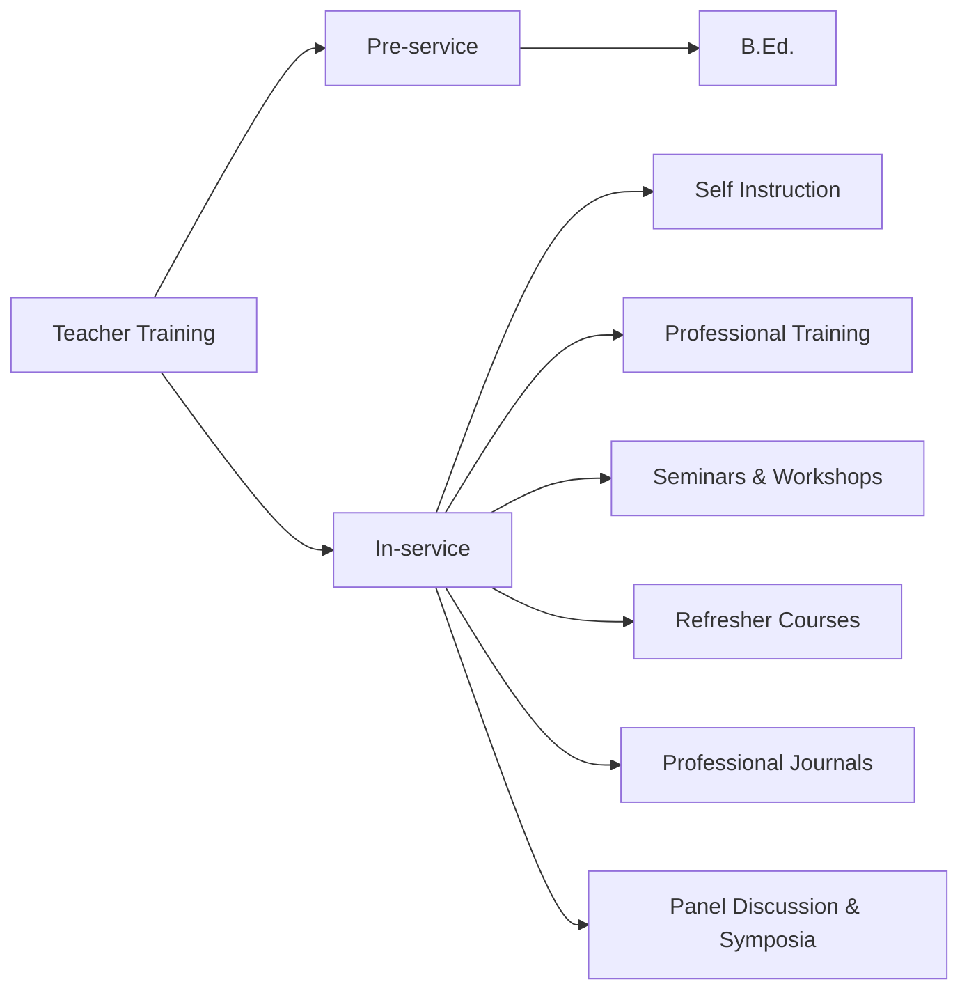
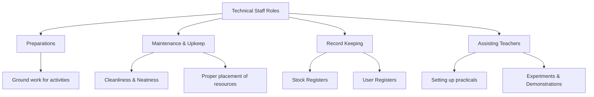
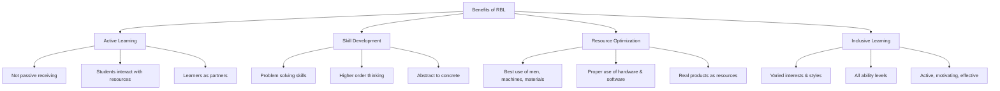

# 4. RESOURCE BASED LEARNING (Part 3)
## Topics: 4.9 - 4.11 — Users, RBL & Self Assessment

---

## 4.9 Users and Their Role in a Resource Centre

!!! important "Key Principle"
    A resource centre is useful only when its **users — Teachers, Learners, Technical Staff** — do their jobs well. *"The quality of a pudding is in its eating."* The success of a resource centre depends on how well people use it. Only then will the goals of the resource centre be met.

Each type of resource is used differently. Each user must know their role and do it well.

---

### 4.9.1 Computer Science Teacher

#### Introduction

A computer science teacher needs certain **teaching skills** (competencies) such as:

- The ability to **plan lessons**
- To prepare good **teaching materials**
- To teach **groups and individual students**
- To **check student progress**

They should also have good **testing and evaluation skills** such as:

- Ability to **collect and study data** about student behaviour
- To **create and use** proper tools to measure student growth
- The ability to **understand clearly** what the test results show
- Good **communication skills**

!!! tip "Role Model"
    A skilled and effective teacher becomes a **role model** for students. Students watch and follow their teachers for life. They often give examples of their teacher as a model person.

#### Concept of Competence

!!! note "Roe's Definition"
    According to **Roe**, competence means *"a learned ability to adequately perform a task, duty or role."* It combines skills, knowledge, and attitudes to do work in a specific setting. People usually gain competencies through **learning by doing** — in real work, internships, or practice-based learning.

!!! quote "Henry Van Dyke"
    *"Famous educators plan new system of pedagogy but it is the unknown teacher who directs and guides the young."*

Teachers are a key part of education. They develop and use new ideas. So we must train **competent teachers** (teachers with the right skills).

---

#### Computer Science Teacher — Qualities and Qualifications

Good labs and teaching tools are not enough. They are of little use if the teacher does not have the right qualities.

##### Overall General Qualities

| Quality | Description |
|---------|-------------|
| **Effective Personality** | The teacher should have a strong personality that leaves a good effect on students. They need sharp thinking, emotional balance, social awareness, and good values. |
| **Self Confidence** | A teacher must believe in their own abilities. They should show this confidence in class and in daily behaviour. |
| **Leadership and Love for Computer Sciences** | The teacher must be a good leader whom students trust. They should inspire students to learn with honesty and show love for the subject. |
| **Patience** | A teacher should not get upset over small mistakes by students. They must show patience. Students should not live in fear but should get proper guidance. |
| **Affectionate Behaviour** | The teacher should create a friendly atmosphere of goodwill and teamwork. They should not get angry over small faults. Instead, they should build trust and care that helps learning. |
| **Hardworker and Responsible** | The teacher should inspire students to enjoy learning, work hard, and take responsibility seriously. |
| **Impartial Behaviour and Attitude** | A teacher should not show any favouritism or bias towards any student. |
| **A Good Communicator of Ideas** | A teacher should explain things clearly and simply. Board work and drawings should be neat, bold, and easy to read. |
| **Studious and Learned** | A good teacher loves reading. They should stay updated with the latest changes in their subject. |
| **Sincerity of Purpose** | A teacher should love their profession. They should feel proud of their own work and their students' success. |

---

##### Academic and Professional Qualifications

!!! important "Minimum Qualifications"
    - S/he should be **UG or PG** with **B.Ed.**
    - Higher qualifications are welcome.

| Qualification Area | Description |
|--------------------|-------------|
| **Mastery of Subject** | A computer science teacher should have deep knowledge of the subject. They should be able to answer all student questions clearly in every topic area. |
| **Thorough Knowledge of History of Computer Science** | A computer science teacher should know the history and work of great scientists. This knowledge helps them inspire their students. |
| **Knowledge of Related Subjects** | A teacher who knows related subjects can teach students better. They can show how computer science is used in other fields. |
| **Knowledge of Methods of Teaching** | The teacher must be trained in the latest teaching methods and strategies. This includes using all types of teaching aids and modern technology. |
| **Ability to Do Practical Work** | A computer science teacher must have good hands-on skills with tools and equipment. They must be able to show all programs clearly in class and help students in the lab. |
| **Knowledge of Psychology Related to CS Teaching** | The teacher should understand student behaviour well. Knowing psychology helps the teacher understand how children learn at different stages of growth. |
| **Knowledge of New System of Examination** | Traditional essay tests now include objective-type tests too. These new tests have different formats and marking systems. The teacher must know both. |
| **Practical Tests** | The teacher should know how to create unit tests and diagnostic tests. They must also know how to give, score, and understand these tests. They should be trained to measure all learning results. |
| **Knowledge of First-Aid** | Accidents can happen in labs — fire, short circuits, electric shock, etc. The teacher should know how to give first aid quickly to anyone who gets hurt. |

---

##### Additional Professional Qualities

- **Interest in Scientific Activities** — A good computer science teacher should enjoy organizing activities. These include computer science museums, clubs, field trips, fairs, and science hobbies. Such activities are real education. They help build a **scientific attitude** in students.

- **Skill in Making and Using Teaching Aids** — The teacher should be able to make their own teaching aids based on local needs. They should feel confident using all types of equipment, audio-visual tools, and computer aids.

- **Scientific Thinking and Attitude** — A good computer science teacher practises scientific thinking in their own actions. To inspire students, they teach in a way that builds the habit of **testing beliefs and facts** through observation and experiments.

!!! note "S/he should also:"
    - Take care for **individual differences**
    - Be a **friend, philosopher and guide**

---

#### Objectives for Computer Science Teachers

The teacher must keep these **six objectives** in mind:

1. **Skill** (proficiency) in basic skills
2. **Understanding** (comprehension) of key concepts
3. **Appreciation** of important meanings
4. **Development** of good attitudes
5. **Ability** (efficiency) to apply knowledge well
6. **Confidence** to think and interpret on their own

---

#### Planning

To reach these objectives, the teacher must plan with at least **five things** in mind:

1. Choose the **exercises and activities** that best help students learn the needed skills. Pick teaching materials carefully.
2. **Study the materials carefully** to predict the problems students may face while learning the topic.
3. Become **skilled at finding the best methods and tools** for each situation. Learn to adjust your approach as needed.
4. **Choose and arrange materials that motivate students**. It is the teacher's job to create and keep interest alive, while also building skills and knowledge.
5. Give **careful thought to testing methods** and ways to help struggling students.

---

#### Identification of Instructional Problems

Finding teaching problems involves **six questions**:

| # | Consideration |
|---|---------------|
| 1 | What **background knowledge and experience** does the student already have before starting this topic? |
| 2 | What **specific skills or understanding** should the student gain from studying this topic? |
| 3 | What **activities or methods** by the teacher and student will best help the student learn these skills? |
| 4 | What **specific problems** might the student face while trying to learn these skills? |
| 5 | What **specific tips, tools, and methods** will best help the student avoid or solve these problems? |
| 6 | What **materials and methods** for this topic will best keep the student interested? |

The teacher must plan as explained above. They should solve student problems through suitable **corrective steps** (remedial measures).

---

#### Special Qualities of a Computer Science Teacher

Computer science is always growing and changing. So a computer science teacher must **stay up to date**.

- Topics like **Ms-Word, Ms-Excel, C Program** need slow, step-by-step teaching. The teacher should use an **LCD Projector** and show each step clearly. If students miss the first step, they cannot understand later parts.
- If no LCD projector is available, the teacher should explain on the computer in **small groups**. Use charts when needed.
- The computer science teacher must **take good care of the lab**. The equipment is expensive.
- S/he should **plan lab work well** and collect all needed supplies.
- S/he should **keep records** of students' work. Old or broken materials should be removed with proper approval.
- Computer science teachers should **stay alert about the latest changes** in the field.
- The computer science teacher should have a **degree in computer science** and a **B.Ed. degree**.
- The teacher should have **deep subject knowledge**.
- The teacher should give **practical, career-focused education** — not just theory.
- If students' doubts cannot be cleared in class, they can be answered later.
- Computer science gets hard to follow if students miss classes. So the teacher should **make the subject interesting** so students attend regularly.
- The teaching method should match the **students' level of understanding**.
- The teacher should give **clear explanations** for new ideas.
- The teacher should build **creative thinking** in students through teaching.
- The teacher can use **different teaching methods** in class.

---

#### Duties and Responsibilities of a Computer Science Teacher

With the qualities listed above, a computer science teacher must carry out these duties:

| Duty | Description |
|------|-------------|
| **School Knowledge** | Know the school timetable, school values, work culture, and social setting well. Arrange double periods for lab work. |
| **Teaching Theory** | Teach computer science theory to the classes given in the timetable. |
| **Demonstrations** | Plan and perform demonstrations related to computer science in class. |
| **Practical Work** | Help students do their practical work in the lab or outside. Check their records. |
| **Organization** | Set up and manage the computer science lab, library, and museum. |
| **Co-curricular Activities** | Organize activities like computer science fairs, exhibitions, field trips, and science hobbies. |
| **Assignments** | Give useful homework and assignments to students. Check them regularly. |
| **Record Keeping** | Keep proper records of student progress. Share this information with students, school staff, and parents. |
| **Audio-Visual Aids** | Use audio-visual aids in teaching. Help set up an audio-visual room in school. Collect and prepare teaching materials and tools. |

---

#### Professional Growth

The teacher should work hard to grow professionally by learning about:

- The **latest knowledge and developments** in their subject and teaching methods
- **New trends** in computer science
- **Computer science journals** and teaching materials
- **Attending workshops, seminars, summer courses** on the subject and teaching methods
- **Joining computer science associations** and teacher groups
- Staying in touch with **National and State level science institutions** for updated knowledge and teaching methods
- Knowing about **schemes and support** for students — like science scholarships, National Science Talent Search, and career courses
- **Keeping a Computer Science diary** — writing down all details about teaching and activities to stay organized
- **Helping management** with inspection of the Computer Science department

---

#### Interpersonal Skills

!!! important "Key Professional Competency"
    Another important professional skill is having good **people skills** (interpersonal skills).

As a teacher, we should develop the ability to:

- **Communicate** with students clearly and simply
- **Identify** student concerns and needs
- **Respond** to students with an open and steady attitude
- **Show self-confidence** when dealing with them
- **Interact** with them in flexible ways

By treating students kindly, fairly, and well, we can build their strong trust in us. This is even more important for a computer science teacher.

- **The ability to inspire and motivate** students is a great strength. A big barrier to learning is **fear** — fear of failing, fear of being criticized, and fear of looking foolish. A teacher should learn to **accept mistakes**. Mistakes show that a student is trying to learn. Instead of scolding a student, the teacher should find **strong points** in each student. Give them chances and encouragement to grow. Only through such support can you help them reach their **full potential** (self-actualization).

!!! tip "Summary"
    To be a computer science teacher, a person must build several **personal qualities** and **professional skills**. They need training to develop the right awareness, knowledge, skills, and attitudes to teach well.

---

#### Organizational Competency

**Organizational skill** (competency) is another important quality of a teacher. As a teacher, we should be able to:

- **Manage the materials and resources** in our classroom
- **Plan and use** different equipment
- Use knowledge of **group behaviour** (group dynamics) for classroom management
- Know **individual, group, and teacher-led methods** of teaching
- Become skilled at using **library resources** — dictionaries, encyclopedias, catalogues, atlases, maps, etc.
- Be good at **gathering information** — interviewing, note-taking, using reference materials, etc.

---

#### Keeping Academic Diary and Use of Time Table

##### Academic Diary

A computer science teacher should keep an academic diary to note:

1. **Yearly plan** for the computer science curriculum
2. **Monthly, weekly, and daily teaching plan** with needed aids, equipment, and activities
3. **List of experiments / lab work** for the year
4. **List of computer science club members** and the yearly action plan
5. **Special doubts** asked by students and how the teacher solved them
6. **Students' test papers, marks** etc. — useful for future guidance

##### Use of Time Table

!!! note "Special Considerations"
    The workload of computer science teachers needs **special attention**.

- The teacher may need **double periods** for lab work and experiments. It is best to plan this double period at the **end of the day**. This way, if a few extra minutes are needed, they can be used.
- The computer science teacher must **check and maintain the computers** so they work properly.
- S/he may need to help the **office / administration** with computer-based work.
- The timetable should **not overload** the teacher.

---

#### Need for Training

For good skill and performance, teachers need proper training:

| Type | Details |
|------|---------|
| **1. Pre-service Training** | B.Ed. etc. |
| **2. In-service Training** | Self instruction |
| | Professional training |
| | Seminars, workshops |
| | Refresher courses |
| | Studying professional journals |
| | Panel discussion, symposia |

---

### 4.9.2 Learners' Role in Resource Centre

!!! important "Importance"
    After the teacher, the **learner's role is most important** in learning. Without learners, no other resource is needed. Every resource exists for the **learner**.

Learners should **use the resource centre fully** to make their learning complete and useful.

#### Higher Level Participation

When older students take part in **interactive learning activities** like:

- Seminars, workshops
- Panel discussion, symposia
- School programmes
- Study Groups

They become **resources who teach each other**, with the teacher's guidance.

#### Lower Level Participation

At lower levels, when students take part in:

- **Play groups**
- **Educational games**
- **Learning by doing activities**
- **Singing, dancing** and other cultural activities

With interest, they become part of the learning resources. Without such participation, no real learning can happen.

---

### 4.9.3 Technical Staff — Role in Resource Centre

!!! important "Vital Role"
    The **Technical Staff** plays a vital role in the resource centre. They do all the preparation and groundwork for activities. Without them, resources cannot be properly kept or used. There would be only disorder and confusion.

| Role Area | Responsibilities |
|-----------|-----------------|
| **Maintenance** | Keep all resources in their proper places. Make sure students and teachers can use them when needed. |
| **Upkeep** | Keep the centre clean and neat. |
| **Record Keeping** | Maintain stock registers and user registers. Record when and which class used or borrowed resources. |
| **Assisting Teachers** | Help teachers set up practicals, experiments, and demonstrations. Support the teacher and class as needed. |

---

## 4.10 Resource Based Learning (RBL)

### 4.10.1 Implications for Students and Institutions

#### Introduction

For the RBL model to succeed, many **new and creative efforts** are needed.

Key needs include:

- Students and staff must learn a **wide range of new skills**
- A **large-scale review of the curriculum** is needed to fully use new learning technologies
- The process may be **long and expensive**, because students and staff take time to accept change

#### Innovations Adopted

It was expected that a big shift to **Resource-Based Learning (RBL)** would happen. Learning outcomes were fully revised. A range of testing methods, including computer-based tests, was chosen. A **resources guide** was created. It listed the materials and activities that help students reach the learning goals.

Several **new methods were adopted**, including:

- **Computer-based teaching**, testing, and student feedback on the course
- An **open approach to assessment**
- **Replacing lectures** with a wide range of teaching and learning activities

A mid-semester computer-based review was done using **Question Mark Designer**. The goal was to collect data to improve the curriculum later.

#### Conclusion

!!! note "Key Findings"
    Adopting RBL is a good **chance to review the curriculum**. To work well, any such activity must be properly supported and supervised. The results should count towards the final grade.

- Students may welcome some **new methods**. But they also want to **keep traditional approaches** and value contact with tutors.
- If students see lectures as important, then removing them may **not be popular**.
- Schools that want to use RBL must think about these **views** and find ways to address them.

#### Skills Needed

Compared to traditional methods, students and staff need a **different and wider set of skills**:

**For Students:**

- Be able to use **software, hardware, and information** well
- Be able to **manage their time well**
- All students can use these technologies only if they have the chance to learn these many skills

**Possible Approaches:**

| Approach | Description |
|----------|-------------|
| **Core Programme** | A basic programme in information skills, study skills, and computer literacy for all students |
| **Embedded Skills** | Build these skills into every subject's curriculum so they are connected to real subjects (contextualized) |

**For Staff:**

- Be able to **redesign and review** curricula
- **Understand new learning technologies** and use them properly
- Create a range of **learning and testing activities** to meet goals
- **Design teaching and learning materials**
- Give **tutorial support**
- Work well in **teams**

!!! important "Staff Development"
    RBL makes all these skills **essential, not just nice to have**. This raises the question of **staff training**. Preparing RBL projects takes more time than preparing regular lectures. New methods are expensive. Without enough funding, ongoing curriculum review is hard to maintain.

**Basic Setup (Infrastructure) Needs:**

- Design **IT rooms** so students can discuss and do group work along with computer work
- Provide **technical support** to make sure hardware and software work correctly
- Train **IT support staff** to play a teaching-related (pedagogical) role, not just a technical one

---

### 4.10.2 Coding and Computer Science Resources

!!! note "The Skills Gap"
    It is estimated that there will be **1.4 million computing jobs** but only **400,000 computer-science graduates** with the skills to fill them. With a future that includes automation, artificial intelligence, and programming, now is the best time to teach coding to students.

This will help students learn more about Computer Science. It will make them interested in the subject and help them grow as learners.

#### Coding & Computer Science Resources

| # | Resource | Description |
|---|----------|-------------|
| 1 | **AI4 All** | An organization that works to increase diversity in AI education, research, and policy. Their summer programs introduce AI and computer science to underrepresented high school students. |
| 2 | **AI4K12** | The AAAI and CSTA created the AI for K-12 Working Group (AI4K12). Its goal is to define what students should know about artificial intelligence. |
| 3 | **Black Girls CODE** | A non-profit that teaches girls aged 7-17 about computer programming and digital technology. |
| 4 | **Code.org** | An organization that works to bring computer science to more schools. It focuses on women and underrepresented groups. It offers coding games, apps, and courses. |
| 5 | **CodeHS** | A teaching platform that helps schools teach computer science. It provides online curriculum, teacher tools, and professional training. |
| 6 | **CodeAcademy** | An online collection of coding courses — from web development to programming. |
| 7 | **CS for All Teachers** | An online community for all teachers (PreK to high school) who want to teach computer science. Teachers can connect with each other and find resources. |
| 8 | **Computer Science Teachers Association (CSTA)** | A membership group that supports computer science teaching. It gives K-12 teachers and students chances to learn more about computer science. |
| 9 | **Exploring Computer Science** | A year-long, research-based high school intro course in computer science. It includes teacher training and focuses on getting more students into computing. |
| 10 | **The Hour of Code** | Started as a one-hour introduction to computer science. It shows that anyone can learn the basics. |

There are many such resources in different states and countries.

#### National Educational Policy

!!! important "NEP on Coding"
    The **National Educational Policy** has made **coding a required subject from Class 6**. This is expected to change the education system greatly. In India too, coding is the most visible part of Computer Science.

---

### 4.10.3 Resource-Based Learning Activities

#### Definition

!!! note "What is RBL?"
    **Resource-Based Learning (RBL)** is a teaching approach (pedagogy) that actively involves **students, teachers, and resource providers** in using a range of resources (both human and non-human) for learning.

This approach offers a **flexible way** to learn. It lets learners grow based on their *"varied interests, experiences, learning styles, needs and ability levels."*

#### The RBL Approach

The RBL approach focuses on the **resources available to learners** and how learners use these resources. This creates interest in using **technology** to support and build a learning environment.

#### Teaching and Learning Resources

This includes any spoken, written, or visual material used by schools:

- **Text books**, story books
- **Films** — plays, radio, TV, multimedia, digital learning resources, video, audio, animations, lectures, speeches, performances

#### Resource Guide

RBL is a new method for many teachers. So a **resource guide book** is needed to help them.

A resource guide should list the materials and activities that help students reach the learning goals. Several new methods can be used, including:

- **Computer-based teaching**, testing, and student feedback on the course
- An **open approach to assessment**
- **Replacing lectures** with a wide range of teaching and learning activities

#### Major Activities of Resource Teacher

Specialists who help the class teacher:

- **Testing** a student's abilities by looking at data and creating tests
- **Changing lesson plans** to fit each student's learning ability
- **Working together** with class teachers to design individual education programs
- **Talking regularly** with students and teachers
- **Helping** the classroom teacher plan lessons
- **Creating** tools, strategies, and activities to help students

#### Innovations vs Traditional Methods

If adopting RBL is seen as a chance to **review the curriculum**, it can also be used to **add IT skills** into that curriculum.

| Aspect | Observation |
|--------|-------------|
| **Effectiveness** | Any such activity must be properly supported and supervised. The results should count towards the final grade. |
| **Student Preference** | Students may welcome some new methods. But they also want to keep traditional ways and value contact with tutors. |
| **Perception** | If students think lectures are important, then removing them may not be popular. |
| **Institutional Need** | A school that wants to use RBL must think about these views and find ways to address them. |

#### Developing Special Skills Among Teachers

To use this approach, teachers need to be able to:

- **Redesign and review** curricula
- **Understand new learning technologies** and use them properly
- Create a range of **learning and testing activities** to meet goals
- **Design teaching and learning materials**
- Give **tutorial support**
- Work well in **teams**

!!! important "Essential Skills"
    Some may say all teachers need these skills. But in practice, RBL makes all of them **essential, not just nice to have**. This raises the question of **staff training**. New methods are expensive to develop.

#### Infrastructure Required

Other basic setup (infrastructure) needs include:

- The **design of IT rooms** should allow discussion and group work along with computer use
- **Technical support** is needed to make sure hardware and software work correctly
- **IT support staff** should be trained to play a teaching-related (pedagogical) role, not just a technical one

---

### 4.10.4 Benefits of Resource-Based Learning (RBL)

RBL is very useful for effective learning and education.

| # | Benefit |
|---|---------|
| 1 | It builds **problem-solving skills** and **higher-order thinking skills** |
| 2 | Learning is **not just sitting and receiving information** |
| 3 | Students **actively work with resources**. This makes learning deeper, more real, and more meaningful |
| 4 | **Teachers, students, and resource providers** are all actively involved in learning |
| 5 | This approach works for **different interests, experiences, learning styles, needs, and ability levels** of students |
| 6 | RBL makes the **best use of resources** — people, machines, and materials in schools |
| 7 | **Human Resources** — trained teachers, education resource providers, helpers — all should do their jobs correctly and well |
| 8 | **Computer and computer-based equipment** — hardware like OHP, projector, audio-video player should all be used at the right time and place |
| 9 | **Resource materials** like charts, matching discs, and homemade aids should all be used well to make understanding better and direct |
| 10 | **Real products** can also be shown and explained, if they are safe to use and easy to bring |
| 11 | Many **abstract ideas** can be made clear, real, and meaningful by using the right resources |
| 12 | RBL turns **boring, dull learning** into active, motivating, interesting, and effective learning |
| 13 | RBL lets **students become partners** in learning by handling tools, equipment, and models themselves |

---

## 4.11 Test Items for Self Assessment

### I. Choose the Correct Answer (MCQs)

**1. Resource centre is:**

- (a) In school
- (b) In society
- (c) It is for playing games
- (d) It is nothing but library

**2. Why do you need learning resources?**

- (a) To make abstract learning concrete in an understanding way
- (b) As they are available
- (c) School funds can be utilized
- (d) They are attractive

**3. Resources Bank is:**

- (a) Useful to deposit savings money
- (b) It is a collection of teaching aids for ready use in teaching
- (c) It is connected with bank in society
- (d) It is a classroom

---

!!! tip "Exam Preparation Tips"
    - Focus on the **qualities and qualifications** of a computer science teacher — frequently asked in essay questions.
    - Remember the **six objectives** for computer science teachers.
    - Understand the **difference between pre-service and in-service training**.
    - Know the **13 benefits of RBL** — commonly asked as a list question.
    - Be familiar with the **roles of all three users** (Teacher, Learner, Technical Staff) in a resource centre.
    - Understand the **implications of RBL** for students and institutions.
    - Remember the **10 Coding & Computer Science Resources** listed.
