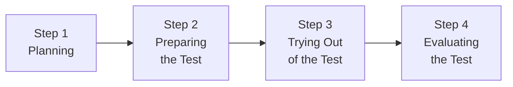
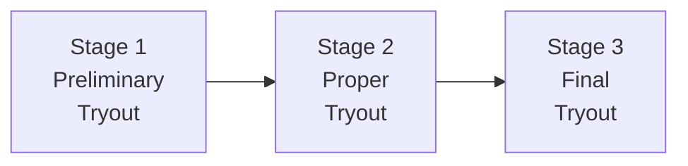
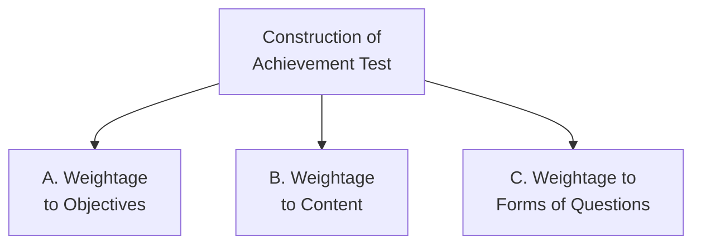

# 5. ASSESSMENT IN PEDAGOGY OF COMPUTER SCIENCE (Part 1)
## Topics: 5.1 - 5.4 — Teacher Evaluation, Tests & Achievement Test Construction

---

## 5.1 Criteria for Teacher Evaluation

### Introduction — The Teacher's Changing Role

A teacher needs to show **leadership traits**. Today, many **managerial tasks** have been added to the teacher's role. A teacher manages:

- **Resources**
- **Curriculum**
- **Co-curricular activities**
- **Examination**
- **Innovation and changes**
- **Time and conflicts**

A teacher has to solve many **behavioural and social problems** in the classroom before teaching can begin. Only a good **evaluation system** can help us see all these skills.

!!! important "Key Insight"
    The duty of **change and improvement** in schools falls on the shoulders of teachers. Checking a teacher's work is important. It helps us **find the strengths and weaknesses** of the system. It also helps **improve the quality of education**.

- Teachers know that people always judge them — students, parents, colleagues, bosses, and the community do this in an **informal or unplanned way**.
- But no **organized formal method** of checking teachers in their key work areas has been created yet.
- We cannot ignore the need for a **well-planned teacher evaluation system** in education.

---

### Meaning and Concept of Evaluation

Experts have defined evaluation in many ways:

!!! note "Definition 1"
    Evaluation means **regular and organized checking** of how valuable a person is to an organization. It is usually done by a senior or someone who can watch the person's work.

!!! note "Definition 2"
    Evaluation means **organized checking** of a person's job performance and their **ability to grow**. In simple words, evaluation shows what a person **needs to improve**.

**Key Points about Evaluation:**

- Checking a teacher's work on a **regular basis** is very important
- Evaluation can **reassure teachers** that they are doing good and valued work
- It gives **security and respect** to teachers who do well
- It helps **spread new and creative teaching ideas**
- It shows that teachers are **helping society in a meaningful way**
- It helps make sure that **training and development** of teachers matches what each teacher and school needs
- It connects to **training, career planning, guidance, counselling**, and help for teachers who are struggling

---

### Need for Teacher Evaluation

!!! important "Core Principle"
    The quality of education depends on the **quality of the people** who provide it. Teachers are a **major force** in the school system. The quality of teachers **directly affects** the quality of education in schools.

#### Public Accountability

- It is fair that an educated public expects teachers to be **responsible for how well** schools and students perform
- Schools introduce formal checking because people care more about **being responsible to the public**
- Public interest in education is strong and **valid** — we must address it in all cases
- Today, the public does not accept that only teachers decide how schools are run. They want a say too
- Teacher evaluation lets people know **how well teachers help** their students and society

#### Opportunities for Improvement

Most teachers feel quite tense and **worried** when someone checks their work. But evaluation is an **unavoidable part of growing as a professional**. We must see it in the right way.

A teacher can use the evaluation process to his/her benefit. The evaluation process gives chances for:

- **Improving teaching performance**
- **Finding out what training is needed**
- **Better communication between people**

!!! tip "Research Evidence"
    Research shows that there are often **gaps** between what teachers think they do, what they seem to do, and what they actually do. Good teacher evaluation plans often bring **very helpful results** for teachers and the whole school.

**Benefits of Evaluation:**

- **Fresh motivation** to do better
- More **effective classroom teaching**
- **Better relationships** with students and colleagues
- More **sharing of ideas and problems**
- Overall **improvement in the school atmosphere**
- Teachers get their **work noticed and appreciated**
- **Self-esteem** goes up — many teachers feel this matters as much as money
- Teachers get a chance to **talk about and think over** their own performance

#### From the School Management's Point of View

- The process can greatly raise the level of **awareness about the school**
- Knowing about **staff feelings, achievements, strengths, problems, and limits** helps leaders be more sensitive to the work environment
- It leads to better **decision-making and communication**
- **Training needs** of staff become clearer — this helps plan resources and training programs
- Teacher training colleges can learn from **well-written evaluation reports** of successful teachers
- A **'Knowledge base'** can be built that is close to what happens in the classroom
- Evaluation systems can be **powerful tools** for creating a positive and healthy school climate

---

### Teacher Evaluation Schemes

Here are the main benefits that come from teacher evaluation:

#### 1. For a Competent and Good Teacher

- To **increase job satisfaction**
- To **increase motivation**
- To **share ideas and skills**
- To **support new projects** and staff growth
- To **raise or restore self-esteem**

#### 2. For Teachers in Difficulty

- To **offer support**
- To **offer counselling**
- To **help improve performance**

#### 3. For the School

- To **help students** by supporting their teachers
- To **build a whole school approach**
- To **find training needs** and plan programs

#### 4. For Teacher Training Institutions

- To build a strong **'knowledge base'** from evaluation reports

!!! important "Conclusion"
    Teacher evaluation plays a big role in bringing **quality learning** to our classrooms.

---

## 5.2 Concept of Tests

### 5.2.1 Tests, Measurement and Evaluation

#### (a) Test and Examination

| Aspect | **Test** | **Examination** |
|---|---|---|
| **Frequency** | Done at short intervals | Done over a long period |
| **Examples** | Daily test, weekly test, monthly test | Quarterly exam, half-yearly exam, annual exam |
| **Scope** | Covers small portions | Covers many units taught up to that point |

!!! note "Key Points"
    - Tests and exams help us **check the teaching** done to reach the goals already set.
    - An **examination** is an **end event**. Teaching based on goals is the **means** to reach it.
    - We check how well the means worked by looking at the end results.
    - Exams are **targets** that teachers and students try to reach.
    - Exams show the **student's achievement** and help them revise their studies.
    - **Exams are a tool for evaluation** — the exam itself is NOT evaluation.

---

#### Measurement

!!! note "Definition"
    **Measurement** means finding out *"how much or how little, how great or how small, how much more or how much less"*.

- Measurement is an important part of our daily life
- We make different types of measurements in all areas of life
- It is also **essential in education**
- In education, we often try to find **how much students have learned** from teaching
- To make that measurement, we need a **tool** — that is, an **achievement test**
- In education, measurement means giving a **number** to express something in a measurable way

!!! tip "Measurement vs Evaluation — Quick Distinction"
    **Measurement** is stating a fact — telling what is.  
    **Evaluation** is making a judgement — telling how good or bad it is.

- The field of exams has changed a lot. A new idea called **'evaluation'** has replaced simple measurement.

---

### 5.2.2 Measurement and Evaluation

- In daily life, we often measure length, width, height, and weight
- Since we have accurate measuring tools, errors in measuring **physical things** are very small
- But in **education**, measurement deals with **mental processes** of a person. These are **not visible or touchable** — so it is not exact

!!! important "Core Relationship"
    The **objectives** are the core of both **teaching** and **testing and evaluation**.

**Evaluation** covers all areas:

- **Cognitive domain** (thinking and knowledge)
- **Affective domain** (feelings and attitudes)
- **Psychomotor domain** (physical skills)

#### Evaluation

!!! note "Definition"
    **Evaluation** is a bigger idea than measurement. Marks alone do not show where a student stands in the class. For example, 60 marks in history may be the highest, but 60 marks in maths may be the lowest. We need to **read the marks with other information** to understand them.

!!! important "Key Formula"
    **Evaluation = Measurement + Value Judgement**

**Key Characteristics of Evaluation:**

- A complete evaluation helps in giving **guidance and counselling**
- Education is a process of making **planned changes** in how students behave and think
- The direction of this change is set by the **goals or objectives** of teaching
- Evaluation needs a **clear idea of the goals** the teacher wants to reach through teaching
- It includes ways of **measuring how far** these goals have been reached
- It uses some kind of measurement, but evaluation **adds a value judgement** to it
- Evaluation is a **continuous process**. It always guides the teacher and student to reach the goals of teaching

---

#### Uses of Tests and Examinations

To check how students grow in different areas, we use different types of tests and tools:

- **Achievement test** — used to find out how much students have learned, based on the goals set
- **Diagnostic tests** — used to find what problems students have, and where those problems are

**Purposes of Tests and Examinations:**

| No. | Purpose |
|-----|---------|
| 1 | To know the **progress of students** in their subjects |
| 2 | To check if the **teaching methods and aids** work well, and to change them if needed |
| 3 | To find the **weak areas of students** and fix those problems |
| 4 | Test marks help in **grouping students** by their scores for group activities |
| 5 | Exams help in **planning school activities and teaching** for set periods — quarterly, half-yearly, etc. |
| 6 | **Employers and companies** use marks and results to pick candidates |
| 7 | For **promoting students** to higher classes |
| 8 | To **check the impact** of the curriculum and education system |

---

### 5.2.3 Difference Between Assessment and Evaluation

!!! note "Definition — Assessment"
    **Assessment** means checking the quality, value, or importance of something or someone. We do assessment to **find out how well** a person is performing.

!!! note "Definition — Evaluation"
    **Evaluation** means making a **judgement** about values, numbers, or performance. We do evaluation to **find out how far goals have been reached**.

!!! important "Basic Difference"
    The main difference between assessment and evaluation is in their **focus**. Assessment looks at the **process** (how things are done). Evaluation looks at the **product** (what was achieved).

#### Comparison Chart

| Basis for Comparison | **Assessment** | **Evaluation** |
|---|---|---|
| **Meaning** | Collecting, reviewing, and using data to improve current performance | Making a judgement based on set standards |
| **What it does?** | Gives feedback on performance and areas to improve | Checks how far objectives have been reached |
| **Purpose** | **Formative** (to help improve) | **Summative** (to judge the result) |
| **Orientation** | **Process Oriented** | **Product Oriented** |
| **Feedback** | Based on watching and noting good and bad points | Based on quality level as per set standards |
| **Relationship between parties** | **Reflective** (rules are set from inside) | **Prescriptive** (standards come from outside) |
| **Criteria set by** | Both parties **together** | The **evaluator** alone |
| **Measurement standards** | **Absolute** — tries to reach the best possible result | **Comparative** — tells the difference between better and worse |

#### Definition of Assessment (Detailed)

- Assessment is an **organized way** of collecting, reviewing, and using information about someone or something to **make improvements where needed**
- The word is used in many fields — education, psychology, finance, tax, human resources, etc.
- Assessment is an **ongoing back-and-forth process** with two parties: the **assessor** (who checks) and the **assessee** (who is checked)
- The **assessor** checks performance based on set standards
- The **assessee** is the person being checked
- The goal is to find out **how well someone is doing overall** and where they can improve
- The process works like this: **set goals → collect information (both numbers and descriptions) → use the information to improve quality**

#### Definition of Evaluation (Detailed)

- The word **'evaluation'** comes from the word **'value'**, which means 'how useful something is'
- Evaluation means **examining something** to measure how useful it is
- Evaluation is an **organized and fair process** of measuring or watching someone or something. The goal is to draw conclusions using rules — either **set standards** or **comparisons**
- It checks the performance of a person, finished project, process, or product to find its **worth or importance**
- Evaluation uses both **numbers and descriptions** to study data. It is done **once in a while**, not all the time
- It checks whether the **standards or goals** have been met or not
- If goals are met, it finds the **gap between what actually happened and what was planned**

#### Key Differences Between Assessment and Evaluation

| No. | Difference |
|-----|-----------|
| 1 | **Assessment** = collecting and using data to improve performance; **Evaluation** = making a judgement based on set rules and proof |
| 2 | Assessment is **diagnostic** (finds areas to improve); Evaluation is **judgemental** (gives an overall grade) |
| 3 | Assessment gives **feedback on performance** and how to get better; Evaluation checks if **standards have been met** |
| 4 | Assessment purpose is **formative** (to improve quality); Evaluation purpose is **summative** (to judge quality) |
| 5 | Assessment looks at the **process**; Evaluation looks at the **product** |
| 6 | Assessment feedback is based on **watching and noting good/bad points**; Evaluation feedback is based on **quality level as per set standards** |
| 7 | Assessment relationship is **reflective** (rules set from inside); Evaluation relationship is **prescriptive** (standards come from outside) |
| 8 | Assessment rules are set by **both parties together**; Evaluation rules are set by the **evaluator** alone |
| 9 | Assessment standards are **absolute** (aim for the best); Evaluation standards are **comparative** (compare better vs worse) |

!!! tip "Conclusion"
    **Evaluation** is about making judgements. **Assessment** is about fixing weak points in performance. Both play an important role in **studying and improving** the performance of a person, product, project, or process.

---

## 5.3 Standardised Test

Making standardised tests takes **many careful steps**.

!!! note "Four Main Steps"
    The four main steps in building a standardised test are:
    
    1. **Planning**
    2. **Preparing the Test**
    3. **Trying Out of the Test**
    4. **Evaluating the Test**

---

### Step 1 — Planning

!!! note "Definition"
    *"Test planning covers all the different tasks needed to create the tests. It is not just about making an outline or table of content and topics. It also means paying careful attention to how hard items are, what types of items to use, and what directions to give the examiner."*

**Planning includes these activities:**

| No. | Activity |
|-----|----------|
| 1 | **Setting the objectives / purposes** of the test |
| 2 | Deciding how much **weight to give each learning objective** |
| 3 | Deciding how much **weight to give each content area** |
| 4 | Deciding the **types of items** to include |
| 5 | Making the **Table of Specification — Blueprint** |
| 6 | Deciding **practical details** — time allowed, test size, total marks, printing, font size, etc. |
| 7 | Writing instructions for **scoring** the test and how to **run the test** |
| 8 | Deciding the **weight for different difficulty levels** of questions |

---

### Step 2 — Preparing the Test

- After the blueprint is ready, the next step is **writing the right questions** that match the plan set in the blueprint
- Take **one small block** of the blueprint at a time and write the needed questions
- For each filled block of the blueprint, write questions **one by one**
- When done, all questions will meet the **requirements** set in the blueprint
- Writing a standardised test needs **great care at every step**
- Give enough time to think about **how much weight to give** to each content area

**At this stage, we need to prepare:**

| No. | Item to Prepare |
|-----|-----------------|
| (i) | The **test items** (questions) |
| (ii) | The **directions for test items** |
| (iii) | The **directions for running the test** |
| (iv) | The **directions for scoring** |
| (v) | A **question-by-question analysis chart** |

---

### Step 3 — Trying Out of the Test

A group of people and experts prepare the test. So it **cannot be completely free of errors**. That is why all standardised tests need a **try-out version**. This version is tested on a **sample group of students**.

**Why do we try out the test?**

| No. | Purpose |
|-----|---------|
| 1 | To find **faulty or unclear items** |
| 2 | To find **problems in how the test is run** |
| 3 | To find **wrong options that no one picks** in multiple choice questions (these are useless distractors) |
| 4 | To get data for finding the **difficulty level** of each item |
| 5 | To get data for finding **how well each item separates good from weak students** (discriminating value) |
| 6 | To decide the **number of items** for the final test |
| 7 | To decide the **time limit** for the final test |

!!! important "Main Purpose"
    The main goal of trying out is to **keep the good items** and **remove the poor items**.

**The try-out happens in three stages:**

---

### Step 4 — Evaluating the Test

We standardise and evaluate the test in these ways:

#### 1. Printing the Final Form
- Print the **final version** of the test
- Print the **answer sheet** too

#### 2. Determining Time Required
- Find the time needed by taking the **average time of three students** who answer the test
- Pick one student from each group: **bright, average, and below average**

#### 3. Administration Instructions
- Write and print instructions for the people who will **run the test**

#### 4. Standardisation — Statistical Analysis
- List all the scores in a table and calculate different measures:
    - **Measures of Central Tendency**: Mean, Median, and Mode (these show the "middle" or "typical" score)
    - **Measures of Variability**: Standard Deviation, Quartile Deviation, etc. (these show how spread out the scores are)

#### 5. Norms
- Plot the scores on a **graph** to see if they follow a normal pattern
- Calculate **derived scores** like T-score and Z-score
- Calculate **Norms** (reference points that help compare one student's score to others) as needed:

| Type of Norm | Description |
|---|---|
| **Age Norms** | Based on age groups |
| **Class Norms** | Based on class/grade level |
| **Sex Norms** | Based on gender |
| **Rural-Urban Norms** | Based on where students live (city or village) |

#### 6. Validity
- **Validity** means: does the test measure what it is supposed to measure?
- We check validity by comparing test scores with some other standard (criterion)
- **Construct validity** can be found using **factor analysis** (a statistical method)

#### 7. Reliability
- **Reliability** means: does the test give the same results each time?
- We also check reliability for new tests
- Ways to check reliability:

| Method | Description |
|---|---|
| **Parallel Forms** | Compare scores on two similar versions of the test |
| **Split-Half Method** | Used when there are no parallel forms — split the test in two halves and compare |
| **Rational Equivalence** | Another option instead of the split-half method |
| **Test-Retest Method** | Give the same test again later and compare the two sets of scores |

#### 8. Usability
- Check how easy the test is to use from these angles:
    - **Running the test** — is it easy to give?
    - **Scoring** — is it easy to mark?
    - **Time** — does it take a reasonable amount of time?
    - **Cost** — is it affordable?
- The test must provide:
    - **Percentile norms** (what percentage of students scored below a given score)
    - **Standard-score norms**
    - **Age-norms**
    - **Grade-norms**
- These help us **understand what the scores mean**

---

## 5.4 Principles and Steps Involved in the Construction of Achievement Test

### Construction of Achievement Test

To check how well students have learned a subject, we need to build an achievement test. It must be **well-structured and designed** using a **step-by-step plan** that follows **3 main dimensions**.

---

### A. Weightage to Objectives

- The main task is to decide **how much weight to give** to each objective set during teaching
- It is usually easy to test the **cognitive area** (knowledge and thinking) with a written test
- Under the **psychomotor domain** (physical skills), we may only test one skill — like asking students to **draw neat diagrams**
- Out of the total marks, we must decide the **weight given to each objective**

---

### B. Weightage to Content

- After deciding the topics to test, the teacher must **spread the total marks** across every topic
- Give proper weight to topics based on their **importance** and **number of pages**

---

### C. Weightage to Different Forms of Questions

- Many types of test questions exist. Each type has **pros and cons**
- To test what students have learned, use these types wisely:
    - **Essay type** questions
    - **Short-answer type** questions
    - **Objective type** questions
- Decide how much of the total marks to give to each type of question

---

### Weightage to Difficulty Level

| Difficulty Level | Criteria | Description |
|---|---|---|
| **Easy** | 70% students could answer | Easy question |
| **Average** | 70% to 30% students could answer | Average question |
| **Difficult** | Less than 30% students could answer | Difficult question |

!!! important
    A good test must have **more average questions** than easy or difficult ones.

---

### Blueprint for the Question Paper

!!! note "Definition"
    The **blueprint** is a big **three-dimensional chart** that shows the weight given to:
    
    1. **Objectives**
    2. **Content**
    3. **Form of questions**

- A blueprint is a document that gives a **complete picture** of the test
- To prepare a blueprint:
    1. First, write the weights (in marks) for objectives, content areas, and question forms in the **total column**
    2. Then fill the cells to show **where each question goes**
    3. Write the total marks in each cell
    4. The **column totals and row totals** must both add up to the final total

---

### Preparation of Question Paper

- Once the blueprint is ready, the **actual writing** of the test begins
- Write test items based on the **specific objective** they test
- The question paper writer must also prepare:
    - The **marking scheme** for essay and very short answer questions
    - The **answer key** for objective test items
- This helps the examiner be as **fair and objective as possible** when marking

---

### Design of the Question Paper

#### A. Weightage to Objectives

| Objectives | Marks | Percentage |
|---|---|---|
| **Knowledge** | 11 | 22% |
| **Understanding** | 22 | 44% |
| **Application** | 17 | 34% |
| **Total** | **50** | **100%** |

!!! note
    These percentages may change depending on the lessons or units. Some units may allow more application and skill questions. Other topics may focus more on knowledge.

#### B. Weightage to Content

| Content | Marks | Percentage |
|---|---|---|
| Circumference, area | 25 | 50% |
| Sector area | 15 | 30% |
| Annular ring | 10 | 20% |
| **Total** | **50** | **100%** |

!!! note
    The weight is based on the objectives to reach and how important each topic is.

#### C. Weightage to Forms of Questions

| Type | Marks | Percentage |
|---|---|---|
| **Long/Essay type** | 25 | 50% |
| **Short answer type** | 20 | 40% |
| **Objective type** | 5 | 10% |
| **Total** | **50** | **100%** |

!!! note
    This is decided by the question paper pattern set by the Board of Studies. The Board also decides the type of choice — internal choice or total choice. **Internal choice is better**, but it is hard to write questions of the same difficulty level.

#### D. Weightage to Difficulty Level

| Difficulty Level | Marks | Percentage |
|---|---|---|
| **Easy** | 15 | 30% |
| **Average** | 25 | 50% |
| **Difficult** | 10 | 20% |
| **Total** | **50** | **100%** |

!!! note
    Setting the difficulty level is itself hard. But by looking at the steps and sub-marks, we can set the level.

---

### Scheme of Options

- Scheme of options means the **choices given** to students when answering questions
- Because of choices, students learn to **skip 40% to 50% of lessons** and still score well — this goes **against the purpose of evaluation**
- To reduce this bad effect, the **internal choice system** was created
- Internal choice means the choice is **within the same lesson or unit**. It works well for **essay type questions** but not for other types

---

### Divisions in Question Paper

| Part | Type of Questions |
|---|---|
| **Part I or A** | Multiple choice and other **one mark questions** (like fill-in-the-blank) |
| **Part II or B** | **Short answer** questions |
| **Part III or C** | **Essay** questions |

---

### Sequence of Questions

- According to **learning principles**, questions should go from **simple to difficult**
- But in practice, questions follow the **order of lessons or units**. This helps students know which unit each question comes from

---

### 5.4.1 Blueprint Preparation

The blueprint is based on the **rough plan** made in the Design Stage. It shows all the dimensions in a **table form**.

#### Sample Blueprint Table

**Topic: Circle | X Standard | Marks: 50 | Time: 1 Hour**

| Content | Knowledge ||| Understanding ||| Application ||| Total |||
|---|---|---|---|---|---|---|---|---|---|---|---|
| | E | S | TM | E | S | TM | E | S | TM | E | S | TM |
| Circle — Circumference, Area | | 4 | 2 | 7 | | | | | | | | | |
| Sector, Arc, Area | | | | | | | | | | | | | |
| Annular Ring Area, Width | | | | | | | | | | | | | |

*NB: E = Essay, S = Short Answer, TM = Total Marks*

*Written brackets = number of questions; above the bracket = marks*

---

### Scoring Key

- The scoring key has **value points** or **outline answers** and a **marking scheme**
- We prepare this at the same time as the **question paper**
- This helps avoid **unexpected mistakes** in the questions

!!! tip "Computer Science Specific"
    In computer science, some questions may be **harder than expected** or may not have a practical answer. We can **spot and remove such questions** while making the scoring key.

---

### Questionwise Analysis

We must check every question based on its objective. We can then compare it with the Blueprint.

**Use these headings for the analysis:**

| No. | Heading |
|-----|---------|
| a) | **Objective** of the question |
| b) | **Specific Objective (SIO)** of the question |
| c) | **Topic and sub-topic** of the question |
| d) | **Type** of question |
| e) | **Expected difficulty level** |
| f) | **Expected time needed** |
| g) | **Marks given** |

---

!!! tip "Summary of Key Concepts"
    | Concept | Key Point |
    |---|---|
    | **Teacher Evaluation** | Organized checking of teacher performance to improve quality |
    | **Measurement** | Quantitative — stating a fact (how much/how little) |
    | **Evaluation** | Measurement + Value Judgement |
    | **Assessment** | Process-oriented, formative, diagnostic |
    | **Evaluation** | Product-oriented, summative, judgemental |
    | **Standardised Test** | 4 steps: Plan → Prepare → Try Out → Evaluate |
    | **Achievement Test** | 3 dimensions: Objectives + Content + Forms of Questions |
    | **Blueprint** | Three-dimensional chart: Objectives × Content × Question Forms |
