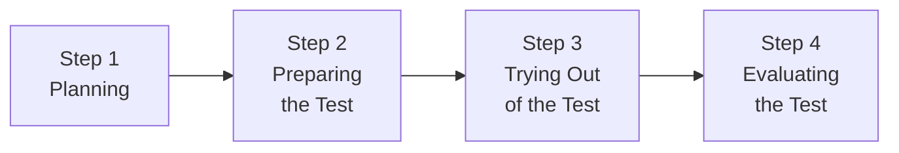
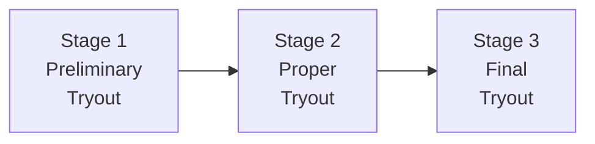
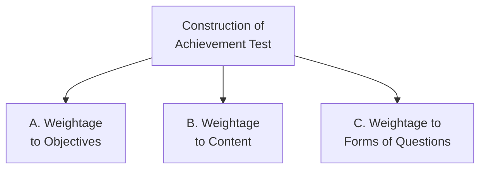

# 5. ASSESSMENT IN PEDAGOGY OF COMPUTER SCIENCE (Part 1)
## Topics: 5.1 - 5.4 — Teacher Evaluation, Tests & Achievement Test Construction

---

## 5.1 Criteria for Teacher Evaluation

### Introduction — The Teacher's Changing Role

A teacher needs to exhibit **leadership traits** and innumerable **managerial functions** have been added to his/her ever-changing role. A teacher manages:

- **Resources**
- **Curriculum**
- **Co-curricular activities**
- **Examination**
- **Innovation and changes**
- **Time and conflicts**

A teacher has to solve various **behavioural and social problems** in the classroom before s/he can actually start teaching. Only an **evaluation system** could help to realise all the skills.

!!! important "Key Insight"
    The responsibility for **change and improvement** in schools ultimately rests on the shoulders of teachers. Evaluation of a teacher's performance becomes significant particularly to **identify the strengths and weaknesses** of the system and to **improve the quality of education**.

- Teachers are aware that they are being constantly evaluated — be it in an **informal or unsystematic manner** — by students, parents, colleagues, superiors, and the community at large.
- However, no **systematic formal procedure** of evaluation in relation to their key functional areas appears to have been evolved.
- The importance of a **systematic teacher evaluation system** in education cannot be underrated at any cost.

---

### Meaning and Concept of Evaluation

Theorists and practitioners have defined evaluation in a variety of ways:

!!! note "Definition 1"
    A **systematic periodic evaluation** of the worth of an individual to an organization, usually made by a superior or someone in a position to observe her/his performance.

!!! note "Definition 2"
    A **systematic evaluation** of an individual with respect to his/her performance on the job and his/her **potential for development**. In other words, evaluation reveals the **developmental need** of an individual.

**Key Points about Evaluation:**

- An appraisal of an employee on a **continuous basis** (i.e., a teacher in the school context) is highly desirable
- Evaluation can **reassure teachers** that they are doing good and valued jobs
- It gives **security and status** to well-functioning teachers
- It helps **spread innovative educational ideas**
- It reassures that teachers are **successfully contributing to society**
- It helps ensure that **in-service training and development** of teachers matches the needs of individual teachers and schools
- It relates to access to **in-service training, career management, guidance, counselling**, and training for teachers experiencing performance difficulty

---

### Need for Teacher Evaluation

!!! important "Core Principle"
    The quality of educational services depends ultimately on the **quality of the people** who provide them. Teachers comprise a **major force** in the school system. The quality of teachers has a **direct bearing** on the quality of education imparted in schools.

#### Public Accountability

- It is not unreasonable that an increasingly educated public should expect teachers to be **accountable for performance** of school and students
- The reason for a management's intention to introduce formal appraisal procedures arises from the growth of concern for **public accountability**
- Public interest in education is strong and definitely **legitimate** — it has to be satisfied under all circumstances
- The public today resents the exclusiveness of the teacher's position and demands the right to say the way that schools are run
- Teacher evaluation has the purpose of letting interested groups know **how well, and in what ways**, teachers contribute to their students and to society

#### Opportunities for Improvement

Most teachers remain quite tense and apprehensive when it comes to their evaluation. However, evaluation being an **inescapable feature of human resources development**, it has to be viewed in the right perspective.

A teacher can turn the evaluation process to his/her advantage. The evaluation process offers opportunities for:

- **Improvement of teaching performance**
- **Identification of in-service training needs**
- **Promotion of improved communications**

!!! tip "Research Evidence"
    Observational research tells us that there are often **gaps** between what teachers think and say they are doing, what they appear to be doing, and what they actually are doing. Successful teacher evaluation schemes have results which are often **remarkably beneficial** for individuals and the whole school.

**Benefits of Evaluation:**

- **Renewal of motivation**
- More **effective classroom teaching**
- **Improved relationships** with pupils and colleagues
- More **sharing of ideas and problems**
- General **improvement in the atmosphere** of a school
- Opportunity for teachers to get their **contributions appreciated**
- **Self-esteem** is boosted — considered by many teachers to be as important as financial rewards
- Offers the opportunity to **discuss and reflect** on their performance

#### From the School Management's Point of View

- The process can greatly enhance the level of **institutional awareness**
- Information about **staff feelings, achievements, strengths and difficulties, constraints and problems** can mean increased sensitivity to working atmosphere
- Improvement in **decision-making and communication**
- **Training needs** of the staff become more clearly apparent — implications for provision of resources and in-service initiatives
- Teacher training programmes could benefit from **well-documented evaluation reports** of successful teachers
- A **'Knowledge base'** can be developed which is not distant from activities in the classroom
- Evaluation systems can be **powerful instruments** in creating a positive and healthy climate in school

---

### Teacher Evaluation Schemes

The criteria or major benefits which result from teacher evaluation are given below:

#### 1. For a Competent and Good Teacher

- To **enhance job satisfaction**
- To **enhance motivation**
- To **share ideas and expertise**
- To **support new initiatives** and staff development
- To **raise or restore self-esteem**

#### 2. For Teachers in Difficulty

- To **offer support**
- To **offer counselling**
- To **help improve performance**

#### 3. For the School

- To **help pupils** through supporting their teachers
- To **build a whole school approach**
- To **identify in-service and staff development needs** and plan programmes

#### 4. For Teacher Training Institutions

- To develop a sound **'knowledge base'** from evaluation reports

!!! important "Conclusion"
    To bring about **quality learning** in our classrooms, teacher evaluation goes a long way.

---

## 5.2 Concept of Tests

### 5.2.1 Tests, Measurement and Evaluation

#### (a) Test and Examination

| Aspect | **Test** | **Examination** |
|---|---|---|
| **Frequency** | Conducted at small intervals | Conducted over a long period |
| **Examples** | Daily test, weekly test, monthly test | Quarterly exam, half-yearly exam, annual exam |
| **Scope** | Covers small portions | Covers several units taught up to the period of examination |

!!! note "Key Points"
    - Tests and examinations are useful in **assessing the teaching** organised for achieving the objectives already fixed.
    - **Examination** is an **end event** and objective-based teaching is the **means**.
    - The effectiveness of means is assessed through end results.
    - Exams are **targets** to be achieved by teachers and students.
    - Exams reveal the **student's achievement** and enable them to revise their studies.
    - **Exams are a tool for evaluation** — exam itself is NOT evaluation.

---

#### Measurement

!!! note "Definition"
    **Measurement** is a matter of determining *"how much or how little, how great or how small, how much more than or how much less than"*.

- Measurement is an important feature in our daily life
- Different types of measurements are made in all aspects of human activity
- It is also **indispensable in the domain of education**
- In the educational process, we often try to find **how much the students have gained** as a result of instruction
- For making that measurement, we need a **tool** — i.e., an **achievement test**
- In education, measurement involves the assignment of a **number** to express in quantitative measures

!!! tip "Measurement vs Evaluation — Quick Distinction"
    **Measurement** is making a statement, stating a fact.  
    **Evaluation** is passing a verdict, making a judgement.

- The field of examination has undergone quite a lot of changes and a new concept **'evaluation'** has emerged in the place of measurement.

---

### 5.2.2 Measurement and Evaluation

- Often, measurement of length, breadth, height, weight are taken in life
- As there are infallible measuring devices, the possibility of errors in measuring **physical phenomena** is very little
- But in the **educational process**, measurement involves the **mental processes** of the individual which are **not tangible** — it is not precise

!!! important "Core Relationship"
    The **objectives** constitute the core for both **teaching** and **testing and evaluation**.

**Evaluation** is comprehensive including:

- **Cognitive domain**
- **Affective domain**
- **Psychomotor domain**

#### Evaluation

!!! note "Definition"
    **Evaluation** is a concept which is **more comprehensive** than measurement. Marks will not reveal in what position the student stands in the class. 60 marks in history may be first, whereas it may be the last mark in maths exam. The marks need **interpretation** with the help of other information.

!!! important "Key Formula"
    **Evaluation = Measurement + Value Judgement**

**Key Characteristics of Evaluation:**

- A complete and comprehensive evaluation will be useful for providing **guidance and counselling**
- Education is a process of bringing about **purposeful changes** in pupils' behaviour
- The direction of this change is determined by the **goals or objectives** of teaching
- Evaluation requires a **clear concept of goals** the educator wishes to reach by means of instruction
- It involves the ways and means of **measuring the extent** to which these goals are realised
- It implies some kind of measurement, but evaluation **places a value** on it
- Evaluation is a **continuous process** and constantly guides the teacher and the student to attain the goals of instruction

---

#### Uses of Tests and Examinations

To assess the development of students in various domains, different types of tests (and tools) are used:

- **Achievement test** — used to ascertain how far students have learnt the subject according to the objectives set forth
- **Diagnostic tests** — used to find the difficulties of students, and the level and area of difficulties

**Purposes of Tests and Examinations:**

| No. | Purpose |
|-----|---------|
| 1 | To know the **progress of students** in respective areas/subjects |
| 2 | To assess the **effectiveness of teaching methods** and teaching aids used, and to make necessary modifications if required |
| 3 | To understand the **deficiencies of students** and to remedy the problems/deficiencies |
| 4 | Test marks are useful for **grouping students** on the basis of marks obtained, for engaging them in group activities |
| 5 | Exams are useful for **planning school activities/teaching** for specific periods — quarterly, half-yearly, etc. |
| 6 | **Employers and Industries** use the results and marks for selecting candidates |
| 7 | For **promoting students** to higher classes |
| 8 | To **evaluate the impact** of curriculum and education system |

---

### 5.2.3 Difference Between Assessment and Evaluation

!!! note "Definition — Assessment"
    **Assessment** is defined as a process of **appraising** something or someone, i.e., the act of gauging the quality, value or importance. Assessment is made to **identify the level of performance** of an individual.

!!! note "Definition — Evaluation"
    **Evaluation** focuses on making a **judgment** about values, numbers or performance of someone or something. Evaluation is performed to **determine the degree to which goals are attained**.

!!! important "Basic Difference"
    The basic difference between assessment and evaluation lies in the **orientation** — while assessment is **process oriented**, evaluation is **product oriented**.

#### Comparison Chart

| Basis for Comparison | **Assessment** | **Evaluation** |
|---|---|---|
| **Meaning** | A process of collecting, reviewing and using data, for the purpose of improvement in the current performance | Described as an act of passing judgement on the basis of set of standards |
| **What it does?** | Provides feedback on performance and areas of improvement | Determines the extent to which objectives are achieved |
| **Purpose** | **Formative** | **Summative** |
| **Orientation** | **Process Oriented** | **Product Oriented** |
| **Feedback** | Based on observation and positive & negative points | Based on the level of quality as per set standard |
| **Relationship between parties** | **Reflective** (criteria defined internally) | **Prescriptive** (standards imposed externally) |
| **Criteria set by** | Both parties **jointly** | The **evaluator** |
| **Measurement standards** | **Absolute** — seeks to achieve the quintessential outcome | **Comparative** — makes a distinction between better and worse |

#### Definition of Assessment (Detailed)

- Assessment is defined as a **methodical way** of acquiring, reviewing and using information about someone or something, so as to make **improvement where necessary**
- The term is interpreted in a variety of ways — educational, psychological, financial, taxation, human resource, etc.
- Assessment is an **ongoing interactive process**, in which two parties (**assessor** and **assessee**) are involved
- The **assessor** assesses the performance based on defined standards
- The **assessee** is someone who is being assessed
- The process aims at determining the **effectiveness of the overall performance** and the areas of improvement
- The process involves: **setting up goals → collecting information (qualitative and quantitative) → using the information for increasing quality**

#### Definition of Evaluation (Detailed)

- The term **'evaluation'** is derived from the word **'value'** which refers to 'usefulness of something'
- Evaluation is an **examination of something** to measure its utility
- Evaluation is a **systematic and objective process** of measuring or observing someone or something, with an aim of drawing conclusions, using criteria, usually governed by **set standards** or by making a **comparison**
- It gauges the performance of a person, completed project, process or product, to determine its **worth or significance**
- Evaluation includes both **quantitative and qualitative analysis** of data and is undertaken **once in a while**
- It ascertains whether the **standards or goals** established are met or not
- If met successfully, it identifies the **difference between actual and intended outcomes**

#### Key Differences Between Assessment and Evaluation

| No. | Difference |
|-----|-----------|
| 1 | **Assessment** = collecting, reviewing and using data for improvement in current performance; **Evaluation** = passing judgment on the basis of defined criteria and evidence |
| 2 | Assessment is **diagnostic** in nature (identifies areas of improvement); Evaluation is **judgemental** (provides an overall grade) |
| 3 | Assessment provides **feedback on performance** and ways to enhance it; Evaluation ascertains whether **standards are met or not** |
| 4 | Assessment purpose is **formative** (increase quality); Evaluation purpose is **summative** (judging quality) |
| 5 | Assessment is concerned with **process**; Evaluation focuses on **product** |
| 6 | Assessment feedback is based on **observation and positive/negative points**; Evaluation feedback relies on **level of quality as per set standard** |
| 7 | Assessment relationship is **reflective** (criteria defined internally); Evaluation relationship is **prescriptive** (standards imposed externally) |
| 8 | Assessment criteria are set by **both parties jointly**; Evaluation criteria are set by the **evaluator** |
| 9 | Assessment measurement standards are **absolute**; Evaluation measurement standards are **comparative** |

!!! tip "Conclusion"
    While **evaluation** involves making judgments, **assessment** is concerned with correcting the deficiencies in one's performance. Although, they play a crucial role in **analysing and refining** the performance of a person, product, project or process.

---

## 5.3 Standardised Test

Preparing standardised tests involves **elaborate steps** in preparation.

!!! note "Four Main Steps"
    The four main steps involved in the construction of a standardised test are:
    
    1. **Planning**
    2. **Preparing the Test**
    3. **Trying Out of the Test**
    4. **Evaluating the Test**

---

### Step 1 — Planning

!!! note "Definition"
    *"Test planning encompasses all of the varied operations that go into producing the tests. Not only does it involve the operation of an outline or table specifying the content or options to be covered by the test, but it must also involve careful attention to item difficulty, to types of items, to direction to the examiner etc."*

**Planning includes the following activities:**

| No. | Activity |
|-----|----------|
| 1 | **Fixing up the objectives / purposes** |
| 2 | Determining the **weightage to different instructional objectives** |
| 3 | Determining the **weightage to different content areas** |
| 4 | Determining the **item types** to be included |
| 5 | Preparation of the **Table of Specification — Blueprint** |
| 6 | Taking decision about **mechanical aspects** — time duration, test size, total marks, printing, size of letters, etc. |
| 7 | Giving instructions for **scoring** of the test and its **administration procedure** |
| 8 | **Weightage to different categories of difficulty level** of the questions is to be fixed |

---

### Step 2 — Preparing the Test

- The next step after the finalization of the blueprint is **writing appropriate questions** in accordance with the broad parameters set out in the blueprint
- One should take **one small block** of the blueprint at a time and write out the required questions
- For each block of blueprint which is filled in, questions are written **one by one**
- Once done, we have all the questions meeting the **necessary requirements** laid down in the blueprint
- Standardised test writing needs **all types of care and considerations**
- Enough time has to be devoted to give thought regarding **weightage to the contents and areas** to be covered

**At this stage, we have to prepare:**

| No. | Item to Prepare |
|-----|-----------------|
| (i) | The **test items** |
| (ii) | The **directions to test items** |
| (iii) | The **directions for administration** |
| (iv) | The **directions for scoring** |
| (v) | A **question-wise analysis chart** |

---

### Step 3 — Trying Out of the Test

Since the test is being prepared by a group of persons and experts, it **cannot be entirely error-free**. Therefore, all standardisation requires preparation of a **try-out form** of the test and its testing over a **sample population**.

**Purposes of the trying-out:**

| No. | Purpose |
|-----|---------|
| 1 | To identify the **defective or ambiguous items** |
| 2 | To discover the **weakness in the mechanism** of test administration |
| 3 | To identify the **non-functioning or implausible distractors** in case of multiple choice tests |
| 4 | To provide data for determining the **difficulty level** of items |
| 5 | To provide data for determining the **discriminating value** of the items |
| 6 | To determine the **number of items** to be included in the final form of the test |
| 7 | To determine the **time limit** for the final form |

!!! important "Main Purpose"
    The main purpose of trying out is to **select the good items** and **reject the poor items**.

**The try-out is done in three stages:**

---

### Step 4 — Evaluating the Test

Standardisation and evaluation of the test is done in the following manner:

#### 1. Printing the Final Form
- The **final form** of the test is printed
- The **answer sheet** is also printed

#### 2. Determining Time Required
- Time required for the test is determined by taking the **average of three pupils' time** on answering the test
- The pupils selected represent three groups: **bright, average, and below average**

#### 3. Administration Instructions
- Instructions to the persons who will **administer the test** are prepared and printed

#### 4. Standardisation — Statistical Analysis
- The scores are **tabulated** and various measures are calculated:
    - **Measures of Central Tendency**: Mean, Median, and Mode
    - **Measures of Variability**: Standard Deviation, Quartile Deviation, etc.

#### 5. Norms
- The scores are plotted on a **graph sheet** to compare the normality of the distribution
- **Derived scores** like T-score and Z-score etc. are estimated
- **Norms** are calculated as per the requirement:

| Type of Norm | Description |
|---|---|
| **Age Norms** | Based on age groups |
| **Class Norms** | Based on class/grade level |
| **Sex Norms** | Based on gender |
| **Rural-Urban Norms** | Based on geographical setting |

#### 6. Validity
- The **Validity** of the test scores is estimated by correlating the test scores with some other criterion
- The **construct validity** can be found out by **factor analysis**

#### 7. Reliability
- **Reliability** is also estimated for newly constructed tests
- Methods of determining reliability:

| Method | Description |
|---|---|
| **Parallel Forms** | Correlating scores on two parallel forms |
| **Split-Half Method** | If parallel forms have not been prepared |
| **Rational Equivalence** | Alternative to split-half method |
| **Test-Retest Method** | Re-administering the test and correlating scores |

#### 8. Usability
- Evaluate how far a test is **usable** from:
    - **Administration** point of view
    - **Scoring** point of view
    - **Time** point of view
    - **Economy** point of view
- The test must provide:
    - **Percentile norms**
    - **Standard-score norms**
    - **Age-norms**
    - **Grade-norms**
- These will facilitate **interpretation of scores**

---

## 5.4 Principles and Steps Involved in the Construction of Achievement Test

### Construction of Achievement Test

For evaluating students' achievement in a subject, an achievement test has to be prepared based on the criteria discussed. It has to be **structured and designed** according to a **systematic pattern** by following the **3 major dimensions**.

---

### A. Weightage to Objectives

- The main task is to decide the **weightage to be given** to the different objectives formulated while teaching the unit
- It is normally easy to test the **cognitive area** by means of a written test
- Under the **psychomotor domain**, it may be possible to test only one objective under **manipulative skill** (e.g., asking the student to draw neat sketches)
- Out of the total marks for which the question paper is set, the **weightage given to various objectives** must be decided

---

### B. Weightage to Content

- Having decided the number of topics to be tested, the teacher has to **distribute the total marks** to every topic
- Give due weightage to the topics based on its **importance** and **number of pages**

---

### C. Weightage to Different Forms of Questions

- Although different forms of test questions are available, every type has got **advantages and limitations**
- In testing the learning outcomes, the following types may be **judiciously used**:
    - **Essay type** questions
    - **Short-answer type** questions
    - **Objective type** questions
- Out of the total marks set for the question paper, how much weightage to be given for different types of questions should be decided

---

### Weightage to Difficulty Level

| Difficulty Level | Criteria | Description |
|---|---|---|
| **Easy** | 70% students could answer | Easy question |
| **Average** | 70% to 30% students could answer | Average question |
| **Difficult** | Less than 30% students could answer | Difficult question |

!!! important
    There must be **more average questions** in an ideal test.

---

### Blueprint for the Question Paper

!!! note "Definition"
    The **blueprint** is a major **three-dimensional chart** showing the weightages given for:
    
    1. **Objectives**
    2. **Content**
    3. **Form of questions**

- Blueprint is a document which gives a **complete functional picture** of the test
- To prepare a blueprint:
    1. The weightages in terms of marks to objectives, content areas and forms of questions are first put down in the **total column**
    2. The cells are then subsequently filled to indicate the **position of questions**
    3. The total of the marks is indicated in the cells
    4. Both **column-wise and row-wise total** must tally with the final total

---

### Preparation of Question Paper

- Once the blueprint is prepared, the **actual preparation** of the test starts
- Test items must be prepared based on the **particular objective**
- The question paper setter is expected to prepare:
    - The **marking scheme** for essay type questions and very short answer questions
    - The **key** for the objective test items
- This will help the examiner to be as far as possible **objective in his evaluation**

---

### Design of the Question Paper

#### A. Weightage to Objectives

| Objectives | Marks | Percentage |
|---|---|---|
| **Knowledge** | 11 | 22% |
| **Understanding** | 22 | 44% |
| **Application** | 17 | 34% |
| **Total** | **50** | **100%** |

!!! note
    This percentage may vary depending upon the nature of the lessons/units. In some units there may be opportunity for asking more application and skill questions, but in some topics, it may not be possible. The unit may be more knowledge oriented.

#### B. Weightage to Content

| Content | Marks | Percentage |
|---|---|---|
| Circumference, area | 25 | 50% |
| Sector area | 15 | 30% |
| Annular ring | 10 | 20% |
| **Total** | **50** | **100%** |

!!! note
    The weightage is based on the objectives to be achieved and importance of the topics in this respect.

#### C. Weightage to Forms of Questions

| Type | Marks | Percentage |
|---|---|---|
| **Long/Essay type** | 25 | 50% |
| **Short answer type** | 20 | 40% |
| **Objective type** | 5 | 10% |
| **Total** | **50** | **100%** |

!!! note
    This is decided by the question paper pattern as fixed by the Board of Studies. The choice — whether internal choice or total choice — is also fixed by the Board. **Internal choice is better** but it is difficult to frame questions of same difficulty levels.

#### D. Weightage to Difficulty Level

| Difficulty Level | Marks | Percentage |
|---|---|---|
| **Easy** | 15 | 30% |
| **Average** | 25 | 50% |
| **Difficult** | 10 | 20% |
| **Total** | **50** | **100%** |

!!! note
    Fixing the difficulty level is in itself difficult, but depending upon analysis of steps and sub-marks, the level can be fixed.

---

### Scheme of Options

- Scheme of option is about **choice provided** in answering questions
- Because of choice, students learn to **omit 40% to 50% of lessons** and still get good marks — this is **against the principle of evaluation**
- To restrict the bad effect of choice, **internal choice system** has been evolved
- The choice within the same lesson/unit — the **internal choice** is suitable for **essay type questions** and not others

---

### Divisions in Question Paper

| Part | Type of Questions |
|---|---|
| **Part I or A** | Multiple choice and other **one mark questions** (like completion type) |
| **Part II or B** | **Short answer** questions |
| **Part III or C** | **Essay** questions |

---

### Sequence of Questions

- According to **psychological principles**, the questions must be from **simple to difficult** ones
- But in practice, the **order of the lessons or units** is maintained so that students could decide from which unit the question is asked

---

### 5.4.1 Blueprint Preparation

Blueprint is based on the **tentative plan** worked out in the Design Stage. Blueprint covers all the dimensions in a **tabular form**.

#### Sample Blueprint Table

**Topic: Circle | X Standard | Marks: 50 | Time: 1 Hour**

| Content | Knowledge ||| Understanding ||| Application ||| Total |||
|---|---|---|---|---|---|---|---|---|---|---|---|
| | E | S | TM | E | S | TM | E | S | TM | E | S | TM |
| Circle — Circumference, Area | | 4 | 2 | 7 | | | | | | | | | |
| Sector, Arc, Area | | | | | | | | | | | | | |
| Annular Ring Area, Width | | | | | | | | | | | | | |

*NB: E = Essay, S = Short Answer, TM = Total Marks*

*Written brackets = number of questions; above the bracket = marks*

---

### Scoring Key

- This consists of **value points** or **outline answers** and **marking scheme**
- This is done at the time of **preparation of question paper** itself
- This will avoid **unexpected mistakes** in the questions framed

!!! tip "Computer Science Specific"
    In computer science, some questions may be **more complex than expected** or not having any practical solution. Such questions could be **avoided while preparing the scoring key**.

---

### Questionwise Analysis

All questions must be analysed on the basis of its objective. This could be compared with the Blueprint.

**The following headings are used for analysis:**

| No. | Heading |
|-----|---------|
| a) | **Objective** of the question |
| b) | **Specific Objective (SIO)** of the question |
| c) | **Topic and sub-topic** of the question |
| d) | **Type** of question |
| e) | **Expected difficulty level** |
| f) | **Expected required time** |
| g) | **Marks allocated** |

---

!!! tip "Summary of Key Concepts"
    | Concept | Key Point |
    |---|---|
    | **Teacher Evaluation** | Systematic assessment of teacher performance for quality improvement |
    | **Measurement** | Quantitative — stating a fact (how much/how little) |
    | **Evaluation** | Measurement + Value Judgement |
    | **Assessment** | Process-oriented, formative, diagnostic |
    | **Evaluation** | Product-oriented, summative, judgemental |
    | **Standardised Test** | 4 steps: Plan → Prepare → Try Out → Evaluate |
    | **Achievement Test** | 3 dimensions: Objectives + Content + Forms of Questions |
    | **Blueprint** | Three-dimensional chart: Objectives × Content × Question Forms |
