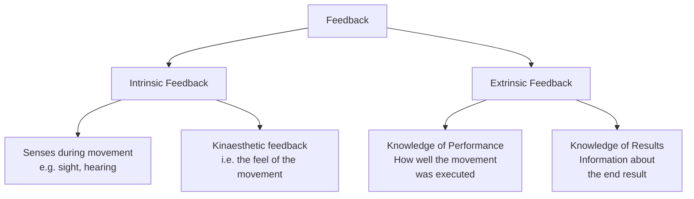
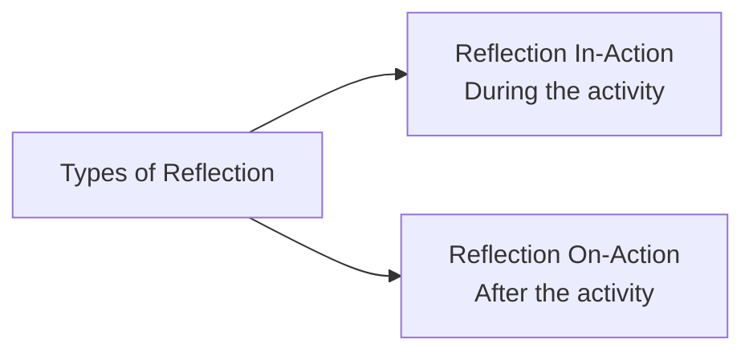
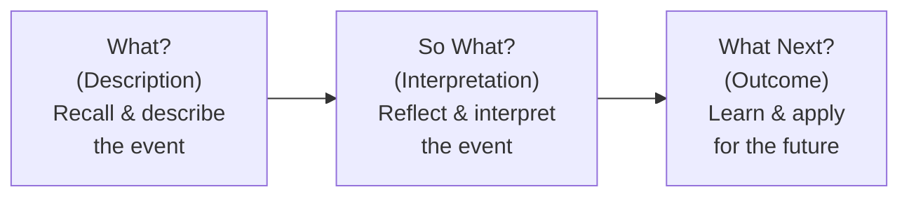
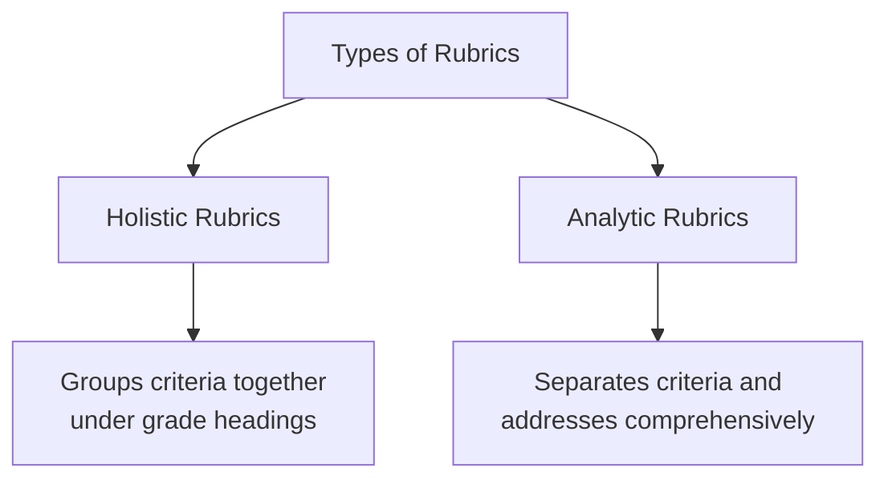

# 5. ASSESSMENT IN PEDAGOGY OF COMPUTER SCIENCE (Part 2)
## Topics: 5.5 - 5.8 — Feedback, Portfolio Assessment, Rubrics & Competency-based Evaluation

---

## 5.5 Feedback Devices

### 5.5.1 Meaning

!!! note "Definition"
    **Feedback** means using information that a learner gets **during** or **after** doing a task to **improve future performance**. Feedback is **essential** for learning to happen.

Feedback comes in many forms. The simplest way to group it is **intrinsic** or **extrinsic**.

#### Major Divisions of Feedback

| Type | Description | Example |
|------|-------------|---------|
| **Intrinsic Feedback** | Comes from your **senses** during the action; you feel or notice it yourself | You hear a wrong sound when you hit a tennis ball with the racket frame |
| **Kinaesthetic Feedback** | A sub-type of intrinsic feedback — the **feel** of the movement | Feeling the correct body position during a swing |
| **Extrinsic Feedback** | Comes from **outside sources**; a key part of coaching | A coach gives analysis after a performance |
| **Knowledge of Performance** | Tells you **how well** you did the movement (not the end result) | A coach explains that your technique was correct |
| **Knowledge of Results** | Feedback given **after completion** about the **end result** | Seeing the final score or outcome |

!!! tip "Key Insight"
    **Knowledge of performance** helps more than just seeing the result. When a coach or teacher explains how you performed, you can change your **technique**, **movement pattern**, or **tactics** during training or a match.

---

### 5.5.2 Criteria

Feedback serves **three key functions**:

| Criterion | Explanation |
|-----------|-------------|
| **Motivates** | Knowing about success or failure can **push you to do better** |
| **Reinforces** | **Positive reinforcement** makes it more likely that you will repeat good performance |
| **Informs** | Feedback tells you about **mistakes** and helps with **error correction** |

---

### 5.5.3 Types of Feedback

#### Positive Feedback

- A coach gives positive feedback when a skill is done **correctly** with a **successful outcome**
- The coach **points out and reinforces** the correct parts of the skill
- The player then knows **what to repeat** next time
- Positive feedback can **motivate** the learner and encourage more progress
- It is especially helpful for **beginners** in the **cognitive stage** of learning

!!! example "Example"
    An athletics coach **praises** the correct angle of release for a javelin thrower.

#### Negative Feedback

- People often think negative feedback means **punishment**, but that is **not true**
- It is about **finding weaknesses** in the player's game
- It should also tell the player **how to fix the fault**
- Use it **carefully** because too much negative feedback can **discourage** the player
- For a player in the **autonomous stage** of learning, this feedback is **vital to fine-tune** their performance

!!! example "Example"
    A tennis coach tells the player that the ball toss on the serve is **too low**.

#### Terminal Feedback

- Coaches and teachers use this type **very often**
- It is feedback given **after** the player finishes performing

!!! example "Example"
    A golf coach **studies** the player's putting action and gives feedback on it.

#### Concurrent Feedback

- Given **during** the performance of the skill
- Can be **intrinsic** or **extrinsic** depending on the learner's stage
- **Extrinsic**: A coach shouts instructions during a match or training
- **Intrinsic**: The performer feels the movement as it happens

!!! example "Example"
    A rugby goal kicker often knows right away if the kick will succeed by the **feel of contact with the ball**.

#### Summary Table: Types of Feedback

| Type | When Given | Nature | Best For |
|------|-----------|--------|----------|
| **Positive** | After correct performance | Reinforces correct parts | Beginners (cognitive stage) |
| **Negative** | After incorrect performance | Finds weaknesses + suggests fixes | Autonomous stage learners |
| **Terminal** | After performance is complete | Analysis of the finished action | All stages |
| **Concurrent** | During performance | Real-time information | Varies by learning stage |

---

#### Guidance

**Guidance** means any information we give learners to help them build their skills. The type of guidance depends on several things:

- The **stage of learning** — cognitive, associative, or autonomous
- The **nature of the activity** — how complex or dangerous the skill is
- **Individual preferences** — most people like to see what the skill looks like before trying it

#### Three Basic Forms of Guidance

| Form | Description | Examples |
|------|-------------|---------|
| **1. Visual** | Useful in **all stages**, but most valuable in the **cognitive stage** | A teacher demonstrates the skill, visual aids (charts showing steps), video of an 'ideal' performance, markers on the floor (e.g., for correct foot placement). **The demonstration must be accurate** so the learner builds the correct mental picture. |
| **2. Verbal** | Teachers/coaches use words to **explain the task** and describe the actions | Counting a beat out loud in dance. Most often used **together with visual guidance**. |
| **3. Manual/Mechanical** | Involves **physical contact or support** | Often used when there is **danger** (e.g., a safety harness in trampolining). |

---

### 5.5.4 Advantages/Disadvantages

| Form of Guidance | Advantages | Disadvantages |
|------------------|------------|---------------|
| **Visual** | The learner can see correct performance. You can repeat demonstrations. Slow-motion video helps learners study the skill closely. Useful in **all stages** of learning. Helps form a **mental picture** of correct performance. | Problems arise if **no accurate image** is available. |
| **Verbal** | Good questions from coaches/teachers can **improve learning and understanding**. Works well with visual guidance to give a clearer picture. It is **immediate**. | Some instructions are **too long and complex** — beginners often have **short attention spans**. Some movements **cannot be explained well with words alone**. |
| **Manual/Mechanical** | In **dangerous activities**, it stops the learner from making unsafe movements. Helps a learner deal with **fear** by creating a safe setting. Helps develop **kinaesthetic awareness** (the feel) of the motion. Useful in **early stages** when the teacher can position the learner's body (e.g., correct hand position on a ball). | Should **not be overused** — learners can become **dependent on support**. Can give an **unrealistic feeling** of the motion (e.g., learners do not carry their full body weight, so they may fail when support is removed). |

#### Practical Application — How and When Different Types of Guidance Are Used

| Type of Guidance | When and How to Use |
|------------------|---------------------|
| **Visual** | Very effective in the **cognitive stage** but useful in all stages. In later stages, you can **slow down** video to highlight details (e.g., looking at different phases of a gymnastics vault). |
| **Verbal** | Keep explanations **brief and clear**, especially in the cognitive stage when learners can only process limited information. More useful in **later stages** when learners can handle more detail. |
| **Manual/Mechanical** | Very useful in the **cognitive stage** to help the learner feel the movement. Gymnastics uses a lot of manual guidance for difficult moves (e.g., supporting a gymnast learning a flic-flac). Also used by experienced performers for **safety reasons** (e.g., rock climbing). |

---

### 5.5.5 Other Forms of Feedback

During matches or training, coaches and teachers give many types of feedback about individual, team, and unit performance. These also **guide students** toward better learning.

The main types are:

- **Positive feedback**
- **Negative feedback**
- **Terminal feedback**
- **Concurrent feedback**

#### Summary of Feedback in Learning

!!! important "Key Points"
    - The methods of guidance, practice, and feedback will **change** depending on the learner's **stage of learning**
    - Guidance is either **visual**, **verbal**, or **mechanical**
    - The type of practice depends on the **type of skill**

**Types of Practice include:**

| Practice Type | Description |
|---------------|-------------|
| **Fixed (Closed)** and **Variable (Open)** | Based on how predictable the setting is |
| **Massed (Continuous)** and **Distributed (Discrete)** | Based on rest breaks between practice |
| **Whole** (high-organisation and simple) and **Part** (low-organisation, serial, and complex skills) | Based on how complex the skill is |

**We use feedback to:**

- **Motivate** the performer
- **Reinforce** good habits
- **Inform** the athlete of any errors

**The main types of feedback are:**

- Extrinsic feedback
- Intrinsic feedback
- Knowledge of performance
- Knowledge of results
- Positive feedback
- Negative feedback
- Terminal feedback
- Concurrent feedback

---

## 5.6 Assessment

### 5.6.1 Portfolio Assessment

!!! note "Definition"
    **Portfolio assessment** is a term with many meanings. It can serve many purposes. A **portfolio** is a collection of student work that shows a student's **efforts**, **progress**, and **achievements** across different parts of the curriculum.

Portfolio assessment looks at student-selected samples of work and documents related to learning outcomes. It can support progress toward **academic goals**, including **student confidence and ability**.

---

#### The Development of Portfolio Assessment

!!! important "Historical Background"
    Portfolio assessments became popular in the **United States in the 1990s**. They were part of a growing interest in **alternative assessment** (non-traditional ways to test students).

**Timeline of Development:**

| Period | Development |
|--------|-------------|
| **1980s** | Schools used more **standardised multiple-choice tests** to measure academic achievement because of high-stakes accountability |
| **End of 1980s** | **Criticism grew** against these tests — critics said they tested only a **narrow range of knowledge** and pushed a **"drill and kill"** multiple-choice curriculum |
| **1990s** | Portfolio assessments became popular as part of the **alternative assessment** movement |

**Arguments by Supporters of Alternative Assessment:**

- Teachers shaped their curriculum to match the limited tests — they were **"teaching to the test"** instead of teaching real subject matter
- Assessments should be **worth teaching to**. They should model the kinds of meaningful teaching and learning activities
- Assessments should be **useful learning experiences** that prepare students for real-world success
- Such assessments let teachers and researchers look at the full range of **complex thinking and problem-solving skills** needed for subject mastery
- They are more likely than traditional tests to **cover many areas** — they can show different parts of the learning process, including **thinking skills**, **strategies**, and **decision-making**
- By telling students and schools about **strengths and weaknesses**, portfolio assessment could support **school reform goals**
- By getting students more involved in learning and assessment, portfolios could also **improve student learning**

---

#### Types of Portfolios

| Portfolio Type | Description | Purpose |
|----------------|-------------|---------|
| **Showcase Portfolio** | Shows the **best** of a student's work | Display highest quality work |
| **Working Portfolio** | May contain **drafts** that students and teachers use to think about the process | Reflect on the learning process |
| **Progress Portfolio** | Contains **many examples** of the same type of work done **over time** | Track progress over time |

!!! tip "Key Point"
    If you want to assess **thinking processes**, the content and rubric (scoring guide) must be designed to **capture those processes**. The contents and criteria must match the **intended purpose** of the portfolio.

---

#### Uses of Portfolios

**Connecting Assessment and Instruction:**

- Much of the research on portfolio assessment focuses on using portfolios to **connect assessment and instruction** and to promote **meaningful classroom learning**
- A good portfolio assessment program needs **ongoing student involvement** in creating and assessing the portfolio
- Portfolio design should give students chances to **think more deeply** about their own work while showing their ability to learn and achieve

**Working Together:**

- Teachers and students **work together** to decide the criteria for assessing student progress
- During instruction, students and teachers identify **important pieces of work** and the steps needed for the portfolio
- Students can get **feedback from classmates and teachers** about their work
- There is more chance for **self-reflection (looking inward) and group discussion**
- Students can think about and report on their own **thinking processes** as they track their understanding
- The portfolio process is **dynamic** — it changes through the interaction between students and teachers

---

#### Formative and Summative Uses

| Use | Description |
|-----|-------------|
| **Formative** (ongoing, during learning) | Tracking **progress toward** learning goals; checking how students are doing **along the way** |
| **Summative** (final, end-of-course) | Used as the basis for **final grades**; student conferences at key points where teacher and student review the completed portfolio together |

Portfolio assessments can serve **both formative and summative** purposes for tracking progress. By setting clear criteria for content and outcomes, portfolios can tell students **exactly what is expected** in terms of content and quality.

!!! note "Summative Conferences"
    Conferences involve the **student and teacher** (and sometimes a parent). They review the completed portfolio together. They discuss the **thinking processes** behind the collection. They also talk about the student's **view of their own progress** toward academic goals.

---

#### Measurement Challenges

!!! warning "Challenges in Large-Scale Portfolio Assessment"
    Using portfolios for **large-scale assessment** and **accountability** creates difficult **measurement problems**.

| Challenge | Description |
|-----------|-------------|
| **Costly to score** | Portfolios need complex tasks and writing, which are **expensive to grade** |
| **Reliability problems** | Scorers may not always **agree on grades** |
| **Generalizability** | Each portfolio task is unique, so results may **not apply broadly** |
| **Comparability** | Portfolio tasks can differ in **topic and difficulty** from one classroom to another |
| **Differences in help** | Students may get **different amounts of help** from teachers, parents, and classmates |
| **Student choice** | When students choose their own content, portfolios may **differ from student to student** |
| **Varying conditions** | Conditions and chances to perform **vary from one student to another** |

---

### 5.6.2 What is a Reflective Journal?

!!! note "Definition"
    A **reflective journal** is a place to write down your daily thoughts and reflections. It can be about something **good or bad** that happened to you. You **look back at it** and **learn from past experiences**.

A reflective journal helps you find important learning events in your life. These events include your **relationships**, **careers**, and **personal life**. By writing a reflective diary, you can find the **source of your inspiration** that shapes who you are today. A reflective journal also helps you understand your **thought process** better.

---

#### Reasons to Write a Reflective Journal

1. To **understand** the things that have happened
2. To **think about** why things happened the way they did
3. To **plan future actions** based on your values and lessons from the past
4. To **share** your thoughts and get ideas out of your head

---

#### How to Reflect Effectively

There are **two types of reflection** — one during and one after an activity or event.

##### Reflection In-Action

When you think about or reflect **while you are doing** an activity, you are using reflection in-action.

Reflection in-action includes:

- **Experiencing**
- **Thinking on your feet**
- **Thinking about what to do next**
- **Acting straight away**

##### Reflection On-Action

You can do reflection on-action **after the activity is finished**. Step back into the experience. Explore your memory and recall what happened. Think about what occurred and **draw lessons** from it.

Reflection on-action includes:

- **Thinking about something that has happened**
- **Thinking what you would do differently next time**
- **Taking your time**

---

#### Examples to Reflect Effectively

| Stage | Reflection Prompts |
|-------|-------------------|
| **Before the Experience** | • Think about the things that could happen |
| | • What things might be a **challenge**? |
| | • What can you do to **prepare** for these experiences? |
| **During the Experience** | • Notice what is happening **right now** as you make a decision |
| | • Is it going as **expected**? Are you handling the challenges well? |
| | • Is there anything you should **do, say, or think** to make it successful? |
| **After the Experience** | • Write down your thoughts **right after**, and/or later when you feel calmer |
| | • Is there anything you would **do differently** next time? |
| | • What are the **lessons** from this experience? |

---

#### How to Write Reflectively — The Three "W"s

!!! tip "The 3 W's Framework"
    Use the three **"W"s** to write reflectively: **What**, **So What**, and **What Next**.

##### What (Description)

Recall an event and write it down **as a description**.

- What happened?
- Who was involved?

##### So What? (Interpretation)

Take a few minutes to **think about and interpret** the event.

- What is the most **important / interesting / useful** part of the event?
- How can you **explain** it?
- How is it **similar to or different from** other events?

##### What's Next? (Outcome)

Decide what you can **learn** from the event and how you can **use it** next time.

- What have I **learned**?
- How can I **apply** this in the future?

---

#### 10 Reflective Journal Prompts

| No. | Prompt |
|-----|--------|
| 1 | What makes you **unique**? |
| 2 | Name someone that means a lot to you and **why**? |
| 3 | Write a letter to your **younger self** |
| 4 | What can you do to focus more on your **health and well-being**? |
| 5 | What makes you feel at **peace**? |
| 6 | List **10 things** that make you smile |
| 7 | What does it mean to live **authentically**? |
| 8 | What is your **favourite animal**, and why? |
| 9 | How do you take care of your **physical/mental health**? What can you do to improve? |
| 10 | List the things that you want to **achieve this week** |

---

## 5.7 Field Engagement using Rubrics

### When to Use Rubrics

You might want to create and use rubrics (scoring guides) if:

- You are **writing the same comments** on many different students' work
- Your **marking load is heavy**, and writing comments takes too much time
- Students **keep asking** about the assignment requirements, even after you return the marked work
- You want to show the **specific parts** of your marking scheme to students **before** and **after** they submit
- You wonder if you are **grading fairly** at the start, middle, and end of a grading session
- You have a **team of graders** and want to make sure grading is **consistent and fair**

---

### What is a Rubric?

!!! note "Definition"
    A **rubric** (scoring guide) is an assessment tool that clearly shows **achievement criteria** for all parts of student work — **written**, **oral**, or **visual**. You can use it for marking assignments, class participation, or overall grades.

A rubric is a **multi-purpose scoring guide** for assessing students. It works in many ways. It is especially helpful for **non-traditional, first-generation students**. Rubrics also **improve teaching** and provide useful information for **program improvement**.

---

### Types of Rubrics

| Type | Description |
|------|-------------|
| **Holistic Rubrics** (overall/whole) | Group several criteria together and **classify them under grade levels** or achievement levels. You give one overall score. |
| **Analytic Rubrics** (detailed/part-by-part) | **Separate** different criteria and address each one **individually**. The top axis shows values as numbers, letter grades, or a scale from Exceptional to Poor. |

---

### How to Make a Rubric

1. **Decide criteria** — Choose what must be present in the student's work for it to be high quality. You might also pick samples of **excellent student work** to show students when you set the assignment.
2. **Decide achievement levels** — Choose how many levels your rubric will have. Make sure they match your school's grading system and your own grading scheme.
3. **Describe performance** — For each criterion, describe in detail what **performance at each level** looks like.
4. **Leave space** — Leave room for extra comments, overall impressions, and a final grade.

---

### Developing Rubrics Interactively with Students

- You can improve students' learning by **involving them** in making the rubric
- As a class or in small groups, students **decide the criteria** for grading the assignment
- It helps to give students **samples of excellent work** so they can spot the criteria more easily
- The teacher acts as a **guide**, helping students create the final rubric
- This activity creates a **better learning experience**. Students feel more **ownership and involvement** in the process.

---

### How to Use Rubrics Effectively

| Principle | Description |
|-----------|-------------|
| **Make a different rubric for each assignment** | This takes time at first, but you can change or reuse rubrics later. Whether you make your own or use an existing one, **practice with other graders** to make sure everyone grades the same way. |
| **Be transparent** | Give students a copy of the rubric when you **assign the task**. The criteria should not be a surprise. |
| **Build rubrics into assignments** | Ask students to **attach the rubric** when they hand in their work. Some teachers ask students to **self-assess** or give **peer feedback** using the rubric before submitting. |
| **Use rubrics to save time** | When you mark the assignment, **circle or highlight** the achieved level for each criterion on the rubric. |
| **Be ready to revise your rubrics** | Decide the final grade based on the rubric. If the work meets criteria but still feels too high or too low, **update the rubric** for next time. |

---

## 5.8 Competency-based Evaluation

### Meaning of Competency

!!! note "Definition"
    According to **Webster's Third New International Dictionary**, **competency** (skill or ability) means being **able to do a task well**. It means having enough **knowledge**, **judgement**, **skills**, or **strength** to do the job.

If a person can do an assigned task successfully, we say that person is **competent** for that work. So, **competence or competency** means a person's ability to complete a given task successfully.

The task can be defined in terms of certain **processes** or **products** that may need:

- Knowledge and understanding of certain **facts/principles**
- **Skills**
- **Application of knowledge**
- **Habits**
- **Attitudes**

!!! important "Two Components of Every Competency Statement"
    Every competency statement has two parts:

    1. **(a)** The **nature of the task or content**
    2. **(b)** A **statement of the expected performance**

    **Example:** "The learner recognizes numerals for numbers 1 to 9"

    - Nature of the task/content → numerals for numbers 1 to 9
    - Statement of performance → the learner recognises

---

### Nature of Evaluation in Education

**Educational evaluation** is the process of judging how well students have achieved in different areas. It answers two questions:

- **How much?**
- **What value?**

It gives a **qualitative measure** (how good) along with the needed **numbers** (how much).

Educational evaluation at the primary stage has **two kinds**:

| Type | Description |
|------|-------------|
| **Formative Evaluation** (ongoing, during learning) | Happens alongside teaching and learning. It checks learners' progress **from time to time**. Teachers use this information to **find learning problems** and arrange **extra help (remedial teaching)**. |
| **Summative Evaluation** (final, end-of-course) | Done at the **end of a course** to make decisions like **giving grades**, **promoting** learners to the next class, or **comparing** how different learners or schools performed. |

---

### Competency-Based Evaluation

!!! note "Definition"
    In competency-based evaluation, **statements of competencies** (skills or abilities) are the most important part. All evaluation activities are **guided by them**. A test item is good only if it successfully **measures the given competency**.

**Key Points:**

- The goal of competency-based teaching is to help children gain the stated competencies at the **mastery level**
- The target performance level in mastery learning is **80 per cent** (ideally 100 per cent)
- Competency-based evaluation checks **how much mastery** children have gained for a given competency
- Ideally, you would create unlimited test questions. In practice, **3 to 5 questions per competency** are enough.

---

#### Components of a Sound Competency-Based Evaluation Programme

| Component | Description |
|-----------|-------------|
| **(a) Continuous Informal Evaluation** | Built into the **teaching-learning process** |
| **(b) Periodical Evaluation** | Done through **unit tests** to improve performance until it reaches the **mastery level** |
| **(c) Summative Evaluation** | Compares children's achievements against the **set standards** of performance |
| **(d) Pre-testing and Post-testing** | Tests performance at the **beginning** and at the **end** of the year |

---

### Main Features of Competency-Based Evaluation

- **Competency is at the centre** — all activities and evaluation are planned around the competency being tested
- If the competency involves **oral**, **written**, or **both types** of outcomes, the evaluation follows the **same pattern**
- **All parts** of the competency are tested through a reasonable number of questions
- Children get **enough time** to answer the questions
- Results show the **performance of each student** across different competencies
- Results give **useful information** for planning **extra help and remedial teaching**

#### Merits of Competency-Based Evaluation

| No. | Merit |
|-----|-------|
| i | Helps find out which **specific competencies** a child has achieved |
| ii | Shows which competencies **were or were not achieved** by students |
| iii | Groups children as **masters**, **partial masters**, and **non-masters** for each competency |
| iv | Tests all parts of a competency through a **good number** of questions |
| v | Accounts for **chance errors** that might affect results |
| vi | Helps teachers plan **better teaching strategies** |
| vii | Ensures a **step-by-step process** for instruction and evaluation |
| viii | Gives enough guidance for planning **extra help and remedial teaching** for individuals or groups |

---

### Preparation of Competency-Based Test Items: Some Considerations

| Point | Consideration |
|-------|---------------|
| **(a)** | The competency must be stated in **very clear and exact terms** |
| **(b)** | Prepare **four to five questions** for each competency |
| **(c)** | Test items can be of **three types**: (i) Oral, (ii) Activity-based, (iii) Written |
| **(d)** | The language of the test items must be **very clear and simple** |
| **(e)** | Activities for evaluation must come from the **learners' everyday surroundings** |
| **(f)** | **All competencies** must be covered |

---

### Achievability of Competency

!!! important "Mastery Levels"
    | Level | Criteria |
    |-------|----------|
    | **Achieved (Mastery)** | All learners answer correctly **at least 3 out of 4** questions for a competency |
    | **Partially Achieved** | Learners answer correctly **2 out of 4** questions |
    | **Not Achieved** | Learners answer correctly **less than 2** questions |

---

### Developing Items for Competency-Based Evaluation

Creating test items for competency-based evaluation is an important task. It needs careful thinking about the competency. You must decide the **type of evaluation** and then create the **test item** itself.

!!! example "Example"
    **Competency:** The learner recognizes and classifies solid objects in the environment with their geometrical names (cuboid, sphere, cube, cone, cylinder).

    **Type of Evaluation:** Activity-based

    **Material Required:** Book, notebook, pipe, match-box, chalk box, ball, top, wire, pencil, joker's cap, ice cream cone, etc.

    **Test Item:** Show the above-mentioned solids one by one and write their names at the appropriate place under the following headings:

    | Sphere | Cuboid | Cube | Cone | Cylinder |
    |--------|--------|------|------|----------|
    | Ball | | | | |

---

!!! tip "Let Us Sum Up"
    - Developing **competencies** (skills and abilities) is the focus of teaching and learning
    - Evaluation must also be **based on competencies**
    - We discussed the meaning, concept, and process of **competency-based evaluation**
    - Examples from different subjects show how to create **test items** for competency-based evaluation
    - Practice making competency-based test items by using competencies from different classes
