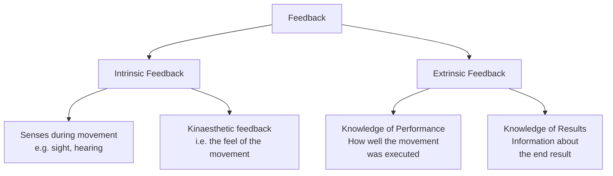
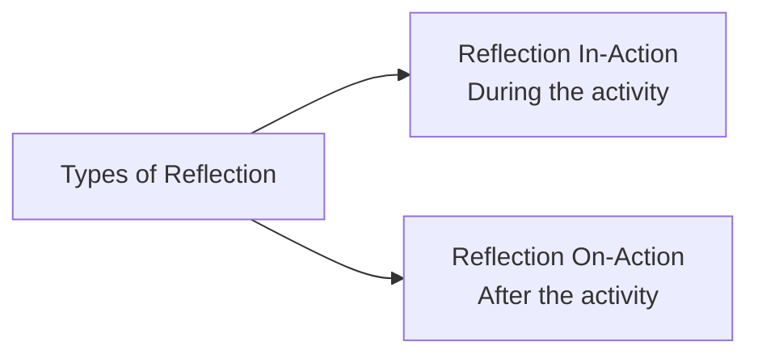
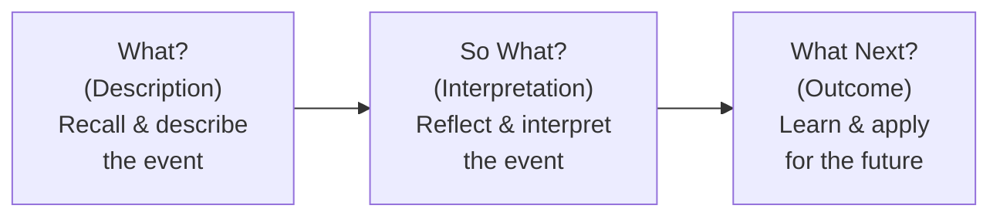
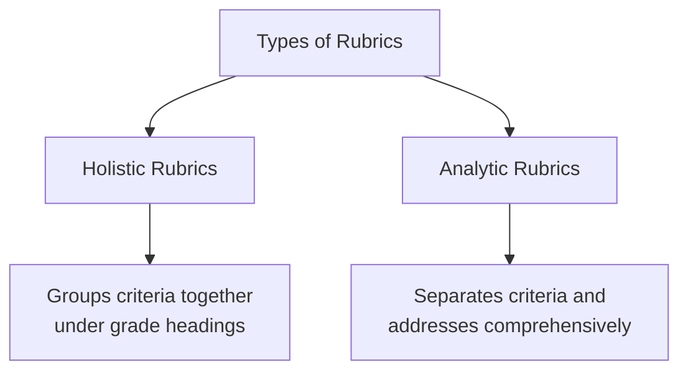

# 5. ASSESSMENT IN PEDAGOGY OF COMPUTER SCIENCE (Part 2)
## Topics: 5.5 - 5.8 — Feedback, Portfolio Assessment, Rubrics & Competency-based Evaluation

---

## 5.5 Feedback Devices

### 5.5.1 Meaning

!!! note "Definition"
    **Feedback** involves using the information that is available to the performer either **during** or **after** performing a skill to **alter future performance**. Feedback is **essential** for learning to take place.

Feedback can take many forms, but most simply it can be categorised as **intrinsic** or **extrinsic**.

#### Major Divisions of Feedback

| Type | Description | Example |
|------|-------------|---------|
| **Intrinsic Feedback** | Comes from your **senses** during the movement; perceived by the performer | You hear when you hit a tennis ball with the frame of your racket |
| **Kinaesthetic Feedback** | A sub-type of intrinsic feedback — the **feel** of the movement | Feeling the correct body position during a swing |
| **Extrinsic Feedback** | Comes from **external sources**; an important part of coaching | A coach providing analysis after a performance |
| **Knowledge of Performance** | Information about **how well** the movement was executed (not the end result) | Coach explains the technique was correct |
| **Knowledge of Results** | A type of **terminal** (after completion) feedback about the **end result** | Seeing the final score or outcome |

!!! tip "Key Insight"
    **Knowledge of performance** is more beneficial than just seeing the result. With a coach or teacher providing actual knowledge of performance, a performer can change their **technique**, **movement pattern**, or even **tactics** within training or a match.

---

### 5.5.2 Criteria

Feedback serves **three key functions**:

| Criterion | Explanation |
|-----------|-------------|
| **Motivates** | Information concerning success or failure can be **motivational** |
| **Reinforces** | **Positive reinforcement** increases the chance of the performer repeating the performance |
| **Informs** | Feedback can provide information about **errors** and therefore can help in **error correction** |

---

### 5.5.3 Types of Feedback

#### Positive Feedback

- A coach provides positive feedback when a skill is performed **correctly** and there is a **successful outcome**
- The coach **highlights and reinforces** the correct aspects of skill
- The player then knows **what to repeat** for the next time they do that particular action
- Such positive feedback can often be **motivational** to the performer, encouraging further progression
- Particularly beneficial for **beginners** in the **cognitive stage** of learning

!!! example "Example"
    An athletics coach **positively reinforcing** the correct angle of release for a javelin thrower.

#### Negative Feedback

- Often **associated with punishment**, which is **not the case**
- It is about **identifying weaknesses** in the player's game
- It should also include **what the player should do to correct the fault**
- Must be used **carefully** because it can easily **demotivate** the player, particularly if the only form of feedback provided is negative
- For a player in the **autonomous stage** of learning, this type of feedback is **vital to refine** their performance

!!! example "Example"
    A tennis coach telling the player that the ball toss on the serve is **too low**.

#### Terminal Feedback

- Very **commonly used** by coaches and teachers
- Feedback that is provided **after** the player's performance

!!! example "Example"
    A golf coach **analysing** the player's putting action and giving feedback on it.

#### Concurrent Feedback

- Provided **during** the performance of the skill
- Can be **intrinsic** or **extrinsic** depending on the stage of learning of the performer
- **Extrinsic**: A coach shouting information to a performer during a match or training
- **Intrinsic**: The performer having a feel for the movement

!!! example "Example"
    A goal kicker in rugby often knows straight away if the kick will be successful by the **contact with the ball**.

#### Summary Table: Types of Feedback

| Type | When Given | Nature | Best For |
|------|-----------|--------|----------|
| **Positive** | After correct performance | Reinforces correct aspects | Beginners (cognitive stage) |
| **Negative** | After incorrect performance | Identifies weaknesses + correction | Autonomous stage learners |
| **Terminal** | After performance is complete | Analysis of completed action | All stages |
| **Concurrent** | During performance | Real-time information | Varies by learning stage |

---

#### Guidance

**Guidance** refers to any information we give learners to help them develop their skills. The type of guidance used is affected by several factors:

- The **stage of learning** of the individual — cognitive, associative, or autonomous
- The **nature of the activity** — complexity of the skill, safety, etc.
- **Individual preferences** — most people have preferred styles of learning (e.g., most people like to see what the skill they are learning looks like)

#### Three Basic Forms of Guidance

| Form | Description | Examples |
|------|-------------|---------|
| **1. Visual** | Used in **all stages** of learning, but particularly valuable in the **cognitive stage** | Physical demonstration by teacher/coach, visual aids (charts showing stages of a skill), video of 'ideal' performance, markers on the floor (e.g., teaching a layup shot for correct foot placement). **The demonstration must be accurate** so the learner builds up the correct picture. |
| **2. Verbal** | Used a lot by teachers/coaches to **explain the task** and describe the actions | Highlighting important performance cues (e.g., counting beat out loud in dance). Most often used **in conjunction with visual guidance**. |
| **3. Manual/Mechanical** | Involves **physical contact/support** | Often used when there is an element of **danger** (e.g., use of safety harness in trampolining). |

---

### 5.5.4 Advantages/Disadvantages

| Form of Guidance | Advantages | Disadvantages |
|------------------|------------|---------------|
| **Visual** | Learner can see accurate performance. Demonstrations can be repeated. With video 'slow motion', can help individual learn skill accurately. Useful in **all stages** of learning. Helps to form a **mental image** of correct performance. | Problems if **no accurate image** available. |
| **Verbal** | Effective questioning by coaches/teachers can **enhance learning and understanding**. Effectively combined with visual guidance to paint a more accurate picture for learner. It is **immediate**. | Some verbal instructions are **too long and complicated** — beginners often have **short attention spans** (limited capacity to process information). Some movements **cannot be accurately explained**. |
| **Manual/Mechanical** | In potentially **hazardous activities**, it can prevent learner making inaccurate movements. Helps a performer deal with **fear** by providing a safe environment. Helps individual develop **kinaesthetic awareness** (the feel) of the motion. Useful in **early stages** of learning when teacher/coach can position limbs/body parts (e.g., correct hand position on ball when shooting in netball). | Should **not be overused** as performers can become **dependent on support**. Can give learners an **unrealistic 'feeling'** of the motion (e.g., they do not take their full body weight and can therefore experience failure on removal of manual/mechanical guidance). |

#### Practical Application — How and When Different Types of Guidance Are Used

| Type of Guidance | When and How to Use |
|------------------|---------------------|
| **Visual** | Very effective in **cognitive stage** of learning but useful in all stages. When using video in associative and autonomous stages, demonstrations can be **slowed down** to highlight points of detail (e.g., looking at the different phases of a gymnastics vault). |
| **Verbal** | Explanations should be **brief and to the point**, especially during cognitive stage of learning due to limited capacity to process information. More useful in **later stages** of learning when attention capacity is greater. |
| **Manual/Mechanical** | Very useful in **cognitive stage** of learning, in helping learner to experience the 'feel' of the movement. Gymnastics uses a lot of manual guidance when learning more difficult moves (e.g., supporting a gymnast learning to perform a flic-flac). In some activities, used by more experienced performers because of **safety issues** (e.g., rock climbing). |

---

### 5.5.5 Other Forms of Feedback

During matches or training, there are various types of feedback provided by coaches or teachers regarding individual, team, and unit performance. These also provide **guidance to the students** for better learning and education.

The main types are:

- **Positive feedback**
- **Negative feedback**
- **Terminal feedback**
- **Concurrent feedback**

#### Summary of Feedback in Learning

!!! important "Key Points"
    - The methods of guidance, practice, and feedback will **vary** depending on the participant's **stage of learning**
    - Guidance is either **visual**, **verbal**, or **mechanical**
    - The type of practice will vary depending on the **classification of the skill**

**Types of Practice include:**

| Practice Type | Description |
|---------------|-------------|
| **Fixed (Closed)** and **Variable (Open)** | Based on environment predictability |
| **Massed (Continuous)** and **Distributed (Discrete)** | Based on rest intervals |
| **Whole** (high-organisation and simple) and **Part** (low-organisation, serial, and complex skills) | Based on skill complexity |

**Feedback is used to:**

- **Motivate** the performer
- **Reinforce** good habits
- **Inform** athlete of any errors

**The main types of feedback are:**

- Extrinsic feedback
- Intrinsic feedback
- Knowledge of performance
- Knowledge of results
- Positive feedback
- Negative feedback
- Terminal feedback
- Concurrent feedback

---

## 5.6 Assessment

### 5.6.1 Portfolio Assessment

!!! note "Definition"
    **Portfolio assessment** is a term with many meanings, and it is a process that can serve a variety of purposes. A **portfolio** is a collection of student work that can exhibit a student's **efforts**, **progress**, and **achievements** in various areas of the curriculum.

Portfolio assessment can be an examination of student-selected samples of work experiences and documents related to outcomes being assessed, and it can address and support progress toward achieving **academic goals**, including **student efficacy**.

---

#### The Development of Portfolio Assessment

!!! important "Historical Background"
    Portfolio assessments grew in popularity in the **United States in the 1990s** as part of a widespread interest in **alternative assessment**.

**Timeline of Development:**

| Period | Development |
|--------|-------------|
| **1980s** | Increase in **norm-referenced, multiple-choice tests** designed to measure academic achievement due to high-stakes accountability |
| **End of 1980s** | Increased **criticisms** over reliance on these tests — opponents believed they assessed only a very **limited range of knowledge** and encouraged a **"drill and kill"** multiple-choice curriculum |
| **1990s** | Portfolio assessments grew in popularity as part of **alternative assessment** movement |

**Arguments by Advocates of Alternative Assessment:**

- Teachers and schools modeled their curriculum to match the limited norm-referenced tests — **"teaching to the test"** rather than teaching content relevant to the subject matter
- It was important that assessments were **worth teaching to** and modeled the types of significant teaching and learning activities
- Assessments should be **worthwhile educational experiences** that would prepare students for future, real-world success
- Such assessments would enable teachers and researchers to examine the wide array of **complex thinking and problem-solving skills** required for subject-matter accomplishment
- More likely than traditional assessments to be **multidimensional** — could reveal various aspects of the learning process including the development of **cognitive skills**, **strategies**, and **decision-making processes**
- By providing feedback to students and districts about **strengths and weaknesses** of their performance, portfolio assessment could support the **goals of school reform**
- By engaging students more deeply in the instructional and assessment process, portfolios could also **benefit student learning**

---

#### Types of Portfolios

| Portfolio Type | Description | Purpose |
|----------------|-------------|---------|
| **Showcase Portfolio** | Exhibits the **best** of student performance | Display highest quality work |
| **Working Portfolio** | May contain **drafts** that students and teachers use to reflect on process | Reflect on learning process |
| **Progress Portfolio** | Contains **multiple examples** of the same type of work done **over time** | Assess progress over time |

!!! tip "Key Point"
    If **cognitive processes** are intended for assessment, content and rubrics must be designed to **capture those processes**. The contents and criteria used to assess portfolios must be designed to **serve the intended purposes**.

---

#### Uses of Portfolios

**Integrating Assessment and Instruction:**

- Much of the literature on portfolio assessment has focused on portfolios as a way to **integrate assessment and instruction** and to promote **meaningful classroom learning**
- A successful portfolio assessment program requires the **ongoing involvement of students** in the creation and assessment process
- Portfolio design should provide students with the opportunities to become **more reflective** about their own work, while demonstrating their abilities to learn and achieve in academics

**Collaborative Process:**

- Teachers and students **work together** to prioritize the criteria for assessing and evaluating student progress
- During the instructional process, students and teachers work together to identify **significant pieces of work** and the processes required for the portfolio
- Students are able to receive **feedback from peers and teachers** about their work
- Greater opportunity for **introspection and collaborative reflection**
- Students can reflect and report about their own **thinking processes** as they monitor their own comprehension and observe their emerging understanding of subjects and skills
- The portfolio process is **dynamic** and is affected by the interaction between students and teachers

---

#### Formative and Summative Uses

| Use | Description |
|-----|-------------|
| **Formative** | Monitoring **progress toward** reaching identified outcomes; providing a way of assessing progress **along the way** |
| **Summative** | Serving as the basis for **letter grades**; student conferences at key points during the year involving joint review of the completion of the portfolio |

Portfolio assessments can provide **both formative and summative** opportunities for monitoring progress toward reaching identified outcomes. By setting criteria for content and outcomes, portfolios can communicate **concrete information** about what is expected of students in terms of the content and quality of performance in specific curriculum areas.

!!! note "Summative Conferences"
    Conferences involve the **student and teacher** (and perhaps parent) in joint review of the completion of the portfolio, in querying the **cognitive processes** related to one's collection, and in dealing with other relevant issues such as students' **perceptions of individual progress** in reaching academic outcomes.

---

#### Measurement Challenges

!!! warning "Challenges in Large-Scale Portfolio Assessment"
    The use of portfolios for **large-scale assessment** and **accountability purposes** pose vexing **measurement challenges**.

| Challenge | Description |
|-----------|-------------|
| **Costly to score** | Portfolios typically require complex production and writing tasks that can be costly to score |
| **Reliability problems** | Reliability problems have occurred in scoring |
| **Generalizability** | Generalizability can be an issue as portfolio tasks are unique |
| **Comparability** | Portfolio tasks can vary in **topic and difficulty** from one classroom to the next |
| **Differences in help** | Differences in the help students may receive from their teachers, parents, and peers within and across classrooms |
| **Student choice** | To the extent student choice is involved, contents may even be different from one student to the next |
| **Varying conditions** | Conditions of, and opportunities for, performance vary from one student to another |

---

### 5.6.2 What is a Reflective Journal?

!!! note "Definition"
    A **reflective journal** is a place to write down your daily reflection entries. It can be something **good or bad** that has happened to you that you can **self-reflect on** and **learn from past experiences**.

A reflective journal can help you to identify important learning events that had happened in your life. The events include your **relationships**, **careers**, and **personal life**. By writing a reflective diary, you can find the **source of your inspiration** that defines you today. A reflective journal also provides a better understanding of your **thought process**.

---

#### Reasons to Write a Reflective Journal

1. To **understand** the things that have happened
2. To **reflect** on why it happened this way
3. To **align future actions** with your values and lessons learned from your past experiences
4. To **share** and get your thoughts and ideas out of your head

---

#### How to Reflect Effectively

There are **two types of reflection** — one during and one after an activity or event.

##### Reflection In-Action

When you are thinking about or reflecting **while you are in an activity**, you are using reflection in-action.

Reflection in-action includes:

- **Experiencing**
- **Thinking on your feet**
- **Thinking about what to do next**
- **Acting straight away**

##### Reflection On-Action

You can do reflect-on-action **once the activity has finished** based on what you can remember about it. Step back into the experience, explore your memory and retrieve what you can recall. Reflect and understand what has happened and **draw lessons** from the experience.

Reflection on-action includes:

- **Thinking about something that has happened**
- **Thinking what you would do differently next time**
- **Taking your time**

---

#### Examples to Reflect Effectively

| Stage | Reflection Prompts |
|-------|-------------------|
| **Before the Experience** | • Think about the things that could have happened |
| | • What are the things that you feel might be a **challenge**? |
| | • The things that you can do to **prepare** for these experiences |
| **During the Experience** | • Observe what is happening **at the moment**, as you make a particular decision |
| | • Is it working out as **expected**? Are you dealing with the challenges well? |
| | • Is there anything you should **do, say, or think** to make the experience successful? |
| **After the Experience** | • Describe your thoughts **immediately after**, and/or later when you have more emotional distance from the event |
| | • Is there anything you would **do differently** before or during a similar event? |
| | • What are the **takeaways** from this experience/lesson? |

---

#### How to Write Reflectively — The Three "W"s

!!! tip "The 3 W's Framework"
    Use the three **"W"s** to write reflectively: **What**, **So What**, and **What Next**.

##### What (Description)

Recall an event and write it down **descriptively**.

- What happened?
- Who was involved?

##### So What? (Interpretation)

Take a few minutes to **reflect and interpret** the event.

- What is most **important / interesting / relevant / useful** aspect of the event, idea, or situation?
- How can it be **explained**?
- How is it **similar to / different from** others?

##### What's Next? (Outcome)

Conclude what you can **learn** from the event and how you can **apply** it next time.

- What have I **learned**?
- How can it be **applied** in the future?

---

#### 10 Reflective Journal Prompts

| No. | Prompt |
|-----|--------|
| 1 | What makes you **unique**? |
| 2 | Name someone that means a lot to you and **why**? |
| 3 | Write a letter to your **younger self** |
| 4 | What is something you can do to focus more on your **health and well-being**? |
| 5 | What makes you feel at **peace**? |
| 6 | List **10 things** that make you smile |
| 7 | What does it mean to live **authentically**? |
| 8 | What is your **favourite animal**, and why? |
| 9 | How do you maintain your **physical/mental health**? What can you do to improve the methods of recovery? |
| 10 | List the things that you want to **achieve this week** |

---

## 5.7 Field Engagement using Rubrics

### When to Use Rubrics

You might consider developing and using rubrics if:

- You are **re-writing the same comments** on several different students' assignments
- Your **marking load is high**, and writing out comments takes up a lot of your time
- Students **repeatedly question** you about the assignment requirements, even after you have handed back the marked assignment
- You want to address the **specific components** of your marking scheme for student and instructor use both **prior to** and **following** the assignment submission
- You find yourself wondering if you are **grading/commenting equitably** at the beginning, middle, and end of a grading session
- You have a **team of graders** and wish to ensure **validity** and **inter-rater reliability**

---

### What is a Rubric?

!!! note "Definition"
    A **rubric** is an assessment tool that clearly indicates **achievement criteria** across all the components of any kind of student work, from **written** to **oral** to **visual**. It can be used for marking assignments, class participation, or overall grades.

A rubric is a **multi-purpose scoring guide** for assessing students. This tool works in a number of different ways and has great potential in particular for **non-traditional, first-generation students**. In addition, rubrics **improve teaching** and contribute as an important source of information for **program improvement**.

---

### Types of Rubrics

| Type | Description |
|------|-------------|
| **Holistic Rubrics** | Group several different assessment criteria and **classify them together** under grade headings or achievement levels |
| **Analytic Rubrics** | **Separate** different assessment criteria and address them **comprehensively**. In a horizontal assessment rubric, the top axis includes values that can be expressed either numerically or by letter grade, or a scale from Exceptional to Poor (or Professional to Amateur, and so on) |

---

### How to Make a Rubric

1. **Decide criteria** — Decide what criteria or essential elements must be present in the student's work to ensure that it is high in quality. At this stage, you might even consider selecting samples of **exemplary student work** that can be shown to students when setting assignments.
2. **Decide achievement levels** — Decide how many levels of achievement you will include on the rubric and how they will relate to your institution's definition of grades as well as your own grading scheme.
3. **Describe performance** — For each criterion, component, or essential element of quality, describe in detail what the **performance at each achievement level** looks like.
4. **Leave space** — Leave space for additional, tailored comments or overall impressions and a final grade.

---

### Developing Rubrics Interactively with Students

- You can enhance students' learning experience by **involving them** in the rubric development process
- Either as a class or in small groups, students **decide upon criteria** for grading the assignment
- It would be helpful to provide students with **samples of exemplary work** so they could identify the criteria with greater ease
- The instructor functions as **facilitator**, guiding the students toward the final goal of a rubric
- This activity results in a **greater learning experience** and enables students to feel a greater sense of **ownership and inclusion** in the decision-making process

---

### How to Use Rubrics Effectively

| Principle | Description |
|-----------|-------------|
| **Develop a different rubric for each assignment** | Although this takes time in the beginning, rubrics can be changed slightly or re-used later. Whether you develop your own or use an existing rubric, **practice with other graders** in your course to achieve **inter-rater reliability**. |
| **Be transparent** | Give students a copy of the rubric when you **assign the performance task**. These are not meant to be surprise criteria. |
| **Integrate rubrics into assignments** | Require students to **attach the rubric** to the assignment when they hand it in. Some instructors ask students to **self-assess** or give **peer feedback** using the rubric prior to handing in the work. |
| **Leverage rubrics to manage your time** | When you mark the assignment, **circle or highlight** the achieved level of performance for each criterion on the rubric. |
| **Be prepared to revise your rubrics** | Decide upon a final grade based on the rubric. If presented work meets criteria but nevertheless seems to have exceeded or not met the overall qualities you're seeking, **revise the rubric accordingly** for the next time you teach the course. |

---

## 5.8 Competency-based Evaluation

### Meaning of Competency

!!! note "Definition"
    According to **Webster's Third New International Dictionary**, the word **competency** means the quality or state of being **functionally adequate** or of having sufficient **knowledge**, **judgement**, **skills**, or **strength** — i.e., the range of ability or capability.

If a person can do some assigned work successfully, we consider him to be **competent** for that work. Therefore, **competence or competency** refers to a person's capability to accomplish successfully the given task.

The task may be further defined clearly either in terms of certain **process** or **products** which may require:

- Knowledge and understanding of certain **facts/principles**
- **Skills**
- **Application of knowledge**
- **Habits**
- **Attitudes**

!!! important "Two Components of Every Competency Statement"
    Every statement of competency comprises two things:

    1. **(a)** The **nature of the task or content**
    2. **(b)** A **statement of the expected performance**

    **Example:** "The learner recognizes numerals for numbers 1 to 9"

    - Nature of the task/content → numerals for numbers 1 to 9
    - Statement of performance → the learner recognises

---

### Nature of Evaluation in Education

**Educational evaluation** is a process of passing judgements on the achievement of pupils in various fields of activity. It provides answers to two questions:

- **How much?**
- **What value?**

It therefore presents a **qualitative measure** along with the necessary **quantification**.

Educational evaluation conducted at the primary stage is of **two kinds**:

| Type | Description |
|------|-------------|
| **Formative Evaluation** | Goes on with the process of teaching-learning as it moves ahead. Provides assessment **from time to time** of the learners' progress. This information is generally used to **diagnose learning difficulties** experienced by the children and arranging for **remedial teaching**. |
| **Summative Evaluation** | Conducted at the **end of a course** for taking certain decisions such as **assigning of grades**, **promotion** of learners to the next class, **comparison** of the performance of learners/schools, etc. |

---

### Competency-Based Evaluation

!!! note "Definition"
    In competency-based evaluation, **statements of competencies** are given greater significance. All activities pertaining to evaluation are **guided by them**. The criterion for judging the appropriateness of a test item is whether or not it successfully provides a means to **evaluate the given competency**.

**Key Points:**

- The aim of competency-based teaching-learning is to help children acquire the stated competencies at the **level of mastery**
- The desired level of performance in the mastery learning approach is **80 per cent** (ideally it should be 100 per cent)
- Competency-based evaluation aims at ascertaining the **extent of mastery** acquired by children with regard to a given competency
- Ideally, it calls for generating an infinite number of items (test questions), but in practice **3 to 5 questions per competency** are considered sufficient

---

#### Components of a Sound Competency-Based Evaluation Programme

| Component | Description |
|-----------|-------------|
| **(a) Continuous Informal Evaluation** | Integrated with the **teaching-learning process** |
| **(b) Periodical Evaluation** | In terms of **unit testing** with a view to improving performance until it reaches the **mastery level** |
| **(c) Summative Evaluation** | For comparing the achievements of children against the **laid down standards** of performance in the proposed competencies |
| **(d) Pre-testing and Post-testing** | Provision for testing performance in the **beginning** and at the **end** of the year |

---

### Main Features of Competency-Based Evaluation

- **Competency occupies a central place** — the nature/type of activities and process of evaluation is planned keeping in view the competency under reference
- If the competency comprises learning outcomes related to **oral**, **written**, or **both types**, the evaluation will follow the **same pattern**
- **All aspects** of the competency are evaluated through a reasonable number of test items/questions
- Children are provided with the **needed time** to respond to the questions
- Results can be interpreted to highlight the **performance of individual pupils** in various competencies
- Provides **meaningful information** helpful in planning and execution of **diagnostic and remedial teaching**

#### Merits of Competency-Based Evaluation

| No. | Merit |
|-----|-------|
| i | Helpful in determining which of the **specific competencies** a particular child has attained |
| ii | Identifies the competencies which **were or were not attained** by pupils |
| iii | Classifies children in terms of **masters**, **partial masters**, and **non-masters** with regard to the stated competencies |
| iv | Evaluates all aspects of a competency through a **reasonably large number** of items/test questions |
| v | Accounts for **chance errors** which are likely to influence the results |
| vi | Helps in devising **proper strategies** for teaching-learning |
| vii | Ensures a **systematic procedure** for the instructional process and evaluation |
| viii | Provides sufficient guidance for planning **diagnostic and remedial teaching** for individuals or groups |

---

### Preparation of Competency-Based Test Items: Some Considerations

| Point | Consideration |
|-------|---------------|
| **(a)** | The specifications of the competency must be stated in **very clear and precise terms** |
| **(b)** | **Four to five questions** are to be prepared for each competency |
| **(c)** | Competency-based test items may be of **three types**: (i) Oral, (ii) Activity-based, (iii) Written |
| **(d)** | The language of the test items must be **very clear and simple** |
| **(e)** | Activities chosen for evaluation must be drawn from the **immediate environment** of the learners |
| **(f)** | **All competencies** must be covered |

---

### Achievability of Competency

!!! important "Mastery Levels"
    | Level | Criteria |
    |-------|----------|
    | **Achieved (Mastery)** | All learners respond correctly to **at least 3 out of 4** questions related to a particular competency |
    | **Partially Achieved** | Learners respond correctly to **2 out of 4** questions |
    | **Not Achieved** | Learners respond correctly to **less than 2** questions |

---

### Developing Items for Competency-Based Evaluation

Developing test items for a competency-based evaluation is an important task which requires a lot of thinking around the competency to decide about the **type of evaluation** and then developing the **test item** itself.

!!! example "Example"
    **Competency:** The learner recognizes and classifies solid objects in the environment with their geometrical names (cuboid, sphere, cube, cone, cylinder).

    **Type of Evaluation:** Activity-based

    **Material Required:** Book, notebook, pipe, match-box, chalk box, ball, top, wire, pencil, joker's cap, ice cream cone, etc.

    **Test Item:** Show the above-mentioned solids one by one and write their names at the appropriate place under the following headings:

    | Sphere | Cuboid | Cube | Cone | Cylinder |
    |--------|--------|------|------|----------|
    | Ball | | | | |

---

!!! tip "Let Us Sum Up"
    - Development of **competencies** is the focus of the teaching-learning process
    - Evaluation also has to be **based on competencies**
    - The meaning, concept, and process of **competency-based evaluation** has been discussed
    - Examples from different content areas illustrate the development of **test items** for competency-based evaluation
    - Practice preparing competency-based test items by taking up various competencies prescribed for different classes
