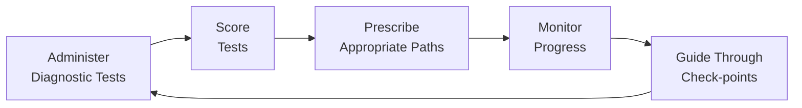
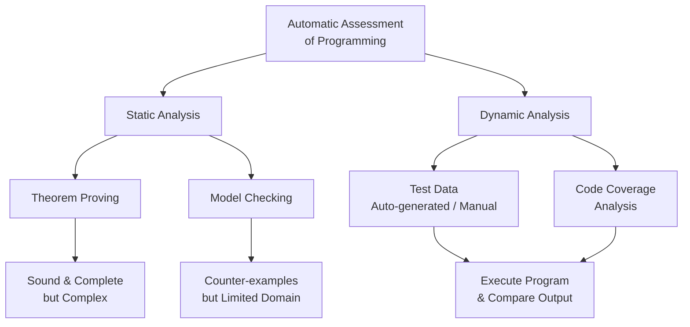
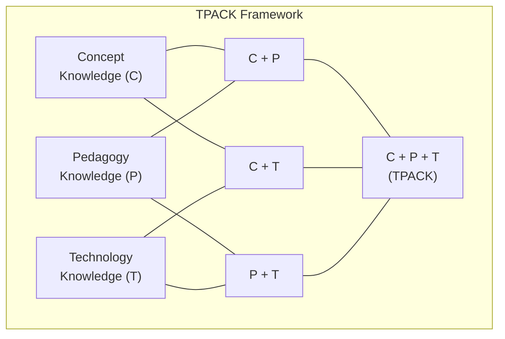
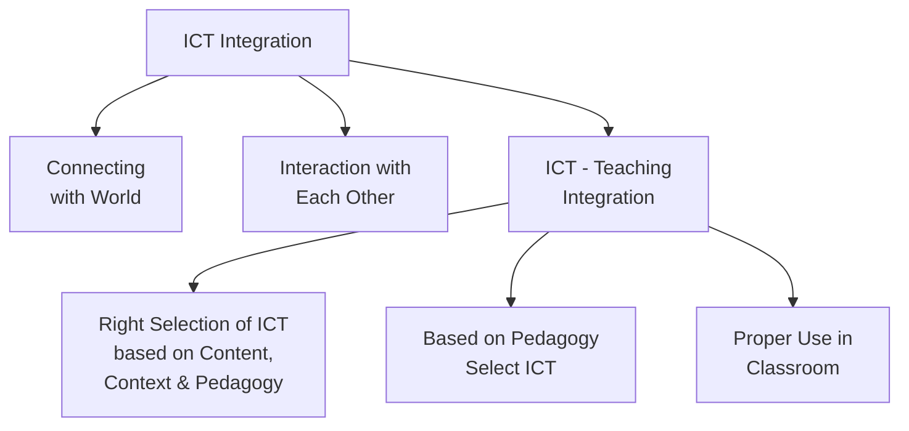
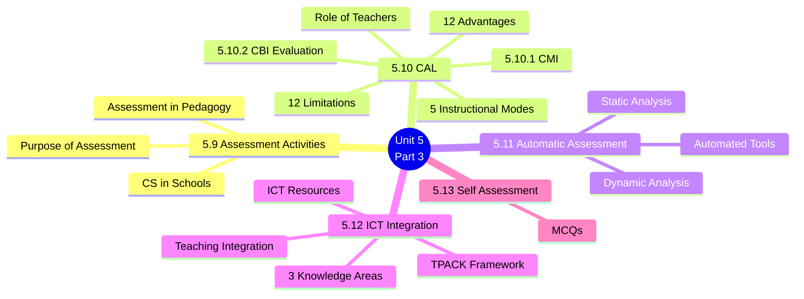

# 5. ASSESSMENT IN PEDAGOGY OF COMPUTER SCIENCE (Part 3)
## Topics: 5.9 - 5.13 — Assessment Activities, CAL, Automatic Assessment, ICT Integration

---

## 5.9 Assessment Activities

### 5.9.1 Assessment in Pedagogy

!!! note "Definition"
    **Educational assessment** is the systematic process of **documenting and using empirical data** on the knowledge, skill, attitudes, and beliefs to **refine programs** and **improve student learning**.

- Assessment data can be obtained from:
    - **Directly examining** student work to assess the achievement of learning outcomes
    - **Data-based inferences** about learning
- Assessment is often used interchangeably with **test**, but is **not limited to tests**

#### Focus Levels of Assessment (Granularity)

Assessment can focus on different levels:

| Level | Description |
|:------|:------------|
| **Individual learner** | Single student performance |
| **Learning community** | Class, workshop, or organized group of learners |
| **Course** | Specific course-level assessment |
| **Academic program** | Program-wide assessment |
| **Institution** | Institutional-level assessment |
| **Educational system** | System-wide assessment (also known as **granularity**) |

#### Assessment as a Continuous Process

As a continuous process, assessment involves:

1. Establishing **measurable and clear student learning outcomes**
2. Providing a **sufficient amount of learning opportunities** to achieve these outcomes
3. Implementing a **systematic way of gathering, analyzing and interpreting evidence** to determine how well student learning matches expectations
4. Using the **collected information to inform improvement** in student learning

!!! important
    **Pedagogy becomes meaningful only on using Assessment.** It shows or proves the effect of our efforts in teaching (pedagogy).

#### Types of Assessment

The term assessment is generally used to refer to **all activities teachers use** to help students learn and to gauge student progress. Assessment can be categorized as:

| # | Category | Examples |
|:-:|:---------|:---------|
| 1 | **Placement, Formative, Summative and Diagnostic** | Based on purpose and timing |
| 2 | **Objective and Subjective** | Based on scoring method |
| 3 | **Referencing** | Criterion-referenced, Norm-referenced |
| 4 | **Informal and Formal** | Based on structure |
| 5 | **Internal and External** | Based on administration |

> Each type has its own purpose as indicated by the title.

---

### 5.9.2 Purpose of Assessment

!!! tip "Key Insight"
    **Teaching and Assessments are twins** — teaching has no meaning without Assessment. Assessment is the technique of **ascertaining the understanding** of the learners regarding matter taught. That is the very purpose of education.

- The purpose of Assessment is to **find out the understanding level of the learner**
- This could be done in several ways (as indicated in the types above)
- Assessment could be in **oral**, **written**, or **interview** forms

#### Benefits of Assessment

| # | Benefit |
|:-:|:--------|
| 1 | It **reflects the effectiveness** of our teaching |
| 2 | Identifies what **modifications or corrective measures** should be taken by teachers to make teaching more effective |
| 3 | Assessment could be **formative** — it helps us to find the problems of learners and to adapt our teaching |
| 4 | Enables us to understand whether our **objectives of teaching** have been achieved |

---

### 5.9.3 Teaching of Computer Science in Schools

!!! note "Current State of CS Education"
    The Computer Science field is one of the **fastest growing** and **highest paying** career paths in the world. However, there is a **diminishing supply** of teachers and students interested in Computer Science.

#### Key Observations

- **Students, parents, teachers and administrators** continue to value CS learning; parents too wish it
- While support for CS learning continues to be strong, **all students do not yet have access** to CS learning opportunities in school classes. However, many get exposure to CS through school
- While CS learning opportunities are **not universally accessible**, they are **increasing**
- Although the majority of parents value CS, **few have approached school officials** to specifically express support for CS in the classroom
- Schools report a **lack of qualified teachers and funds** as barriers to offering CS; additionally, schools continue to report that they have **too many other classes**

#### Why CS Education Matters

| Aspect | Details |
|:-------|:--------|
| **Exposure gap** | The diminishing supply of CS teachers/students is largely based on how exposed students are to technology and resources, and whether they are being encouraged to explore CS |
| **Beyond CS careers** | Educating students in CS is also beneficial to those **not interested** in the CS field |
| **Digital age skills** | There is a need to develop **logical thinking** and **problem-solving** — all part of the CS curriculum |
| **Universal computer use** | Students, regardless of field, must be proficient in using computers — creating files, writing reports, researching subjects |
| **Job growth** | Job openings with knowledge of CS are growing in **every industry and every state**; projected to grow at **twice the rate** of any other job |
| **Social mobility** | CS has become a crucial tool to not only innovate the world but also a way to pull students of **low-income families and communities** out of poverty |

---

## 5.10 Computer Assisted Learning (CAL)

!!! note "Definition"
    **Computer Assisted Learning (CAL)** is also denoted as **Computer Assisted Instruction (CAI)**. It enables computer-assisted learning through various instructional modes.

### Instructional Models of CAL

In order to carry out the teaching/learning function, the computer utilises various instructional modes:

| # | Mode | Description |
|:-:|:-----|:------------|
| i | **Drill and Practice** | The computer presents a series of exercises which the student attempts by giving responses. It provides feedback — a **congratulatory message** if correct, or a **corrective comment** if wrong. Provides endless drill and practice with repetition at a pace controlled by the student. The computer allows students to proceed further **only when mastery has been achieved**. |
| ii | **Tutorial Mode** | As in programmed instruction, information is presented in **small steps** followed by a question. The student's response is analysed by the computer and **appropriate feedback** is given. |
| iii | **Simulation Mode** | Learning experiences related to **real life phenomena** are provided. For example: study of genetics, experiments in town planning, operation of a system, etc., can be shown through computer simulation. |
| iv | **Discovery Mode** | Uses **inductive approach** to learning where problems are presented and the student solves them through **trial and error**. |
| v | **Gaming Mode** | Teaching is imparted through a **playway mode**. |

### Benefits of CAL

Key benefit areas:

- **Multisensory presentation**
- **Self-pacing**
- **Motivation and reward**
- **Simulations**
- **Knowledge through games**
- **Reteaching and Reinforcing**

### 12 Advantages of CAL

| # | Advantage |
|:-:|:----------|
| 1 | CAL is **individualized** — each learner is free to work at her/his own pace, totally unaffected by the performance of other learners. Since it provides a method of instruction designed for self-directive study, it helps in **improving skills or achieving objectives at all difficulty levels**. |
| 2 | Information is presented in a **structured form**. It proves useful in the study of a subject where there is a **hierarchy of facts and rules**. |
| 3 | CAL forces **active participation** on the part of the learner, which contrasts with the more passive role in reading a book or attending a lecture. |
| 4 | As a result of interactive learner participation, it provides **immediate feedback**. The feedback may be **remedial** in nature or it may direct the learner to a certain path depending on the response. |
| 5 | CAL utilizes a **reporting system** that provides learners with a clear picture of their progress. Learners can identify subject areas in which they have improved and in which they need improvement. |
| 6 | By enabling learners to **manipulate concepts directly** and explore the results of such manipulation, it **reduces the time** taken to comprehend difficult concepts. |
| 7 | CAL saves the **unauthentic labour** of teachers as well as learners. Teachers need not waste time and labour in arranging the same instructional experiences, forming questions for every learner, evaluating them at every learning stage — all these are carried out by the computer program. |
| 8 | CAL offers a **wide range of experiences** otherwise not available to learners. It works as **multimedia** providing audio as well as visual inputs. It enables the learner to understand concepts clearly with the use of simulating techniques such as **animation, blinking, graphical displays**, etc. |
| 9 | Learners can be provided **any number of options** in multiple choice questions. Also a series of responses may be provided where some are better than others, with each response providing **feedback on each option**. |
| 10 | CAL provides a lot of **drill** which can be useful for **low-aptitude learners** and through which **high-aptitude learners** can escape (skip ahead). |
| 11 | CAL can enhance **reasoning and decision-making abilities**. |
| 12 | Learners who use CAL become increasingly **self-directed** in their learning style. They become more **responsible for learning** and less dependent on teachers. They are considered capable learners. |

### Limitations of CAL (12 Points)

| # | Limitation |
|:-:|:-----------|
| 1 | **Restricted text displays** |
| 2 | **Lack of human qualities** |
| 3 | **Software/hardware limitations** |
| 4 | **Limited sensitivity to needs** |
| 5 | **No actual experience** — CAL does not provide mobility during interaction with computer; only provides eye-hand coordination |
| 6 | **Harmful to eyes** — too much use of computer can be harmful to the eyes |
| 7 | **No hands-on experience** — though simulation permits execution of chemical and biological experiments, hands-on experience is missing. CAL packages cannot develop **manual skills** such as handling an apparatus, working with a machine, dissecting an animal, etc. |
| 8 | **Restricts social interaction** — in case of individual self-work, it restricts social interaction with others |
| 9 | **Vocabulary development limited** — preschool children develop vocabulary through social interaction. Computers cannot be much effective for this purpose. Computer programs dealing with **voice synchronization** capabilities are very costly. |
| 10 | **Limited creativity development** — there is not much scope for development of creativity and imaginative thinking |
| 11 | **No peer learning** — in the classroom, learners not only learn from interaction with teachers but also from their peers. This is not possible in the case of computer-assisted learning |
| 12 | **Limited to 2D objects** — it limits the learner's activity to two-dimensional objects |

!!! warning "Additional Limitations"
    - Computers **cannot replace** human teacher-managed classrooms that can have **nonverbal reinforcement**, use of **humour**, and exchange of **personal feelings** between teachers and students
    - Computer assisted learning takes learners away from the habit of learning from **books and other printed/handwritten materials**, which affects the development of **language skills**
    - Computer assisted evaluation is **not possible** in the case of short answer and long answer tests
    - It also cannot effectively evaluate **essays, précis, abstracts**, etc.

### Role of Teachers in CAL

| Role | Description |
|:-----|:------------|
| **Guide** | Teacher plays the role of a **guide** rather than lecturing |
| **Human element** | Human element **cannot be substituted** by computer. So teacher still has an important role |
| **Quality improvement** | CAL could improve the **scope and quality of teaching** contribution by the teacher |
| **Multiple roles** | Teacher has to play many roles like **Computer engineer** (Basics), **Lesson writer**, **Systems operator** |

---

### 5.10.1 Computer Managed Instruction (CMI)

!!! note "Definition"
    **Computer Managed Instruction (CMI)** is another contribution of the computer to the domain of instruction. In CMI, the computer **gathers, stores and manages information** to guide the student through **individualised learning experiences**.

#### CMI Process

- The computer helps the student move through **check-points** (in the form of definite activities) in the education process at **different times** via **different paths** matching individual capabilities
- CMI achieves this individualised instructional process by a series of activities:
    1. **Administering** diagnostic tests
    2. **Scoring** them
    3. **Prescribing** the appropriate paths
    4. **Monitoring** the progress of individuals all along the route

---

### 5.10.2 Evaluation of Computer-Based Instruction (CBI)

!!! important "Key Research Finding"
    A **meta-analysis of findings from 254 controlled evaluation studies** showed that **Computer-Based Instruction (CBI)** usually produces **positive effects** on students.

#### Key Findings from the Meta-Analysis

| Aspect | Finding |
|:-------|:--------|
| **Coverage** | Learners of **all age levels** — from kindergarten pupils to adult students |
| **Student attitudes** | CBI produced small but **positive changes** in student attitudes toward teaching and computers |
| **Time efficiency** | CBI **reduced substantially** the amount of time needed for instruction |
| **Positive impact** | Evaluators compared experimental (CBI) and control (conventional) groups on common examinations and course evaluation forms — found **positive impact** of CBI |

#### Thomas (1970) Review

A more recent traditional review by **Thomas (1970)** reported even more positive findings:

- **Achievement gains** over other methods are the norm
- **Improved attitudes** toward computers and subject matter were generally reported
- Many CBI students gained **mastery status** in a **shortened period of time**

> The positive effects of CBI have been studied from all angles — size of the class, level of students, etc.

#### Historical Context

- Since the **early 1960s**, educational technologists have been developing programs of CBI to **drill, tutor, and test** students and to **manage instructional programs**
- In recent years, CBI programs have been used increasingly in schools to **supplement or replace** more conventional teaching methods
- Many educational technologists believe CBI will not only **reduce educational costs** in the long run but will also **enhance educational effects**
- Some envision a day when computers will serve all children as **personal tutors**: *"a Socrates or Plato for every child of the 21st century"*

#### Recent Changes in Computers

The omission from most reviews of results from recent CBI applications is a serious problem for at least **two reasons**:

| # | Reason |
|:-:|:-------|
| 1 | **Computers have changed greatly** — they have become smaller, less expensive, more reliable, and quicker in their operations. Communication with them has become easier, and their output has become more readable and attractive. |
| 2 | **Conceptions of the computer's role have broadened** — the role that the computer can play in instruction has expanded significantly. |

!!! tip "Conclusion"
    Despite all shortcomings, the results showed that **CBI teaching was more effective** than teaching without a computer, and teachers could teach **more details** with **better understanding** of the subject by students.

---

## 5.11 Automatic Assessment of Programming Assignment

### Introduction

!!! note "Context"
    In today's world, study of computer languages is more important. **Effective and good programming skills** are needed for all computer science students. They can master programming only through **intensive exercise practices**.

- Due to the day-by-day **increasing number of students** in the class, the assessment of programming exercises leads to **extensive workload** for teachers/instructors, particularly when it has to be carried out manually
- When faced with grading hundreds of programs manually, even the help of teaching assistants is not easy
- In large classes, **error detection** and **manual evaluation** for every program is **difficult and time consuming**

### Automatic Assessment System

- The automatic assessment system for programming assignments uses a **verification program with random inputs**
- One of the most important properties of a program is that it carries out its **intended function**
- The intended function of a program or part of a program can be verified by using **inverse function's verification program**
- This assessment system has been tested on **basic C programming courses**, and results show that it can work well in basic programming exercises

#### Web-Based Tutoring Systems

With the recent advancement of **internet technologies** and **advanced program analysis techniques**, web-based tutoring systems that can play the role of teacher for teaching and training programming (partially or completely) are increasingly considered.

!!! note "Traditional vs. Automated"
    In traditional education, the problem of assessment is countered by **manual review and inspection** offered by class tutors. However, it is **not efficiently practical** when dealing with large numbers of students and practice exercises.

#### Popular Inspection Method

- One popular method suggested is generating a **suite of test cases** based on **coverage analysis** and executing the programs with all test cases
- Even though applied widely in industry, this method is **not theoretically complete** since test cases are impossible to secure the absence of possible flaws in programs
- It is not always encouraged to run a piece of **potentially erroneous code** due to system safety

### Automated Tools

!!! important "Core Aims"
    The core aims of automated tools are:

    1. To promote an automated tool to **reduce the workload** of human teachers
    2. To **improve consistency** of marking assessment items
    3. To include **thorough testing** of students' programming exercises

#### Measurement Values

- The basic requirement for automated assessment of programming exercises are the **measurement values** that can be extracted from the program
- The values can be compared to the **given requirements** or to a **model solution**
- For educational purposes, the measurement values typically need to be justified by the **teaching goals** of the course or specifically by **objectives** to be achieved for each topic of the course syllabus

#### Approaches to Automatic Programming Assessment

Several approaches can be found from various resources (journals, conference articles, online resources). The approaches are typically based on either:

- **Static analysis** — program is NOT executed during assessment
- **Dynamic testing** — program IS executed during assessment

---

### A. Static Program Analysis

!!! note "Definition"
    **Static program analysis** has recently emerged as an efficient means for **program verification**. The program is analyzed **without being executed**.

Two popular approaches:

| Approach | Description | Strengths | Limitations |
|:---------|:------------|:----------|:------------|
| **Theorem Proving** | Supported by the logic of **axiomatic semantic theory** | **Sound and complete** for correctness verification | Due to computational complexity, fails to produce **counter-examples** of errors encountered; limited in terms of education |
| **Model Checking** | Can tackle the counter-example problem | Can produce **counter-examples** | Cannot work on a **virtually infinite domain** |

---

### B. Dynamic Program Analysis

!!! note "Definition"
    **Dynamic program analysis** is the analysis of computer software that is performed by **executing programs** built from that software system on a **real or virtual processor**.

- For manual assessment, it is difficult to figure out the results of a program because the program may have **many different executive paths** and output results, even if it is simple
- Dynamic analysis assesses a program by **executing it** based on **test data** which are automatically generated or manually provided

#### Requirements for Effective Dynamic Analysis

| Requirement | Description |
|:------------|:------------|
| **Sufficient test inputs** | The target program must be executed with sufficient test inputs to produce interesting behavior |
| **Code coverage** | Use of software testing techniques such as **code coverage** helps ensure that an adequate slice of the program's set of possible behaviors has been observed |
| **Minimal instrumentation effect** | Care must be taken to minimize the effect that instrumentation has on the execution (including **temporal properties**) of the target program |

---

## 5.12 Integration of ICT in Teaching, Learning

### 1. Teaching-Learning Process

- It is a well-known fact that **no two individuals are alike**
- As every child is different, they tend to learn in a **unique way**
- Learners learn better if they are taught using **more than one sense organ**

### 2. What is ICT

!!! note "Definition"
    **ICT** stands for **Information Communication Technology**. It is the study, design, development, application, implementation, support, or the management of **computer-based information systems**, mostly computers and computer networks and other information distribution technologies.

- ICT refers to **Digital Information Analysis (DIA)**
- This is done by using different types of aids and equipment (**Resources**), especially:
    - **Audio**
    - **Visual**
    - **Models**
- Creating **sensation**, **perception**, and **conception**

### Use of ICT

!!! tip "Key Benefit"
    Use of ICT makes **abstract concept teaching** into **concrete, understandable subject matter**.

- In order to make every child a **self-learner**, **independent**, **critical and creative thinker**, and **problem solver**, proper understanding of the concepts is essential by concretising the concepts in its proper perspectives

### 3 Areas of Knowledge

ICT helps to integrate **3 major areas of knowledge** in order to make learning the best, effective and efficient:

| # | Knowledge Area | Description |
|:-:|:---------------|:------------|
| 1 | **Concept Knowledge (C)** | Subject matter / content knowledge |
| 2 | **Pedagogical Knowledge (P)** | Teaching methods and strategies |
| 3 | **Technological Knowledge (T)** | Use of technology tools and resources |

!!! important
    Until electronic/technological aids and equipment were found, there were only the **first two knowledge systems** used. The invention of the third (technology) makes teaching-learning **interesting, meaningful, active and understandable**.

Using the above three knowledge areas, it is possible to adopt **several combinations** of the 3 knowledge. Thus teaching becomes **varied and valuable**.

#### TPACK Diagram

> **Teachers should be experts in all the 3 knowledge areas and their application in teaching.**

### Preparation of Teaching

While preparing for teaching a lesson, a teacher should follow these steps:

| Step | Action |
|:-----|:-------|
| **Step 1** | Prepare, collect details of contents and plan **which aspects should be explained** |
| **Step 2** | Decide **what kind of method or pedagogical skill** could be applied |
| **Step 3** | Plan **what type and special technology** would be more suitable in making the lesson interesting and understandable |

> So first of all, plan **whether ICT is to be used** in teaching a specific topic.

### ICT Resources

Some of the possibilities of resources which could be used are:

| Resource Type | Description |
|:--------------|:------------|
| **Text** | Written content and materials |
| **Image** | Visual representations and pictures |
| **Audio** | Sound-based learning materials |
| **Video** | Moving visual content |
| **Interactive** | Engaging, participatory content |
| **Animation** | Animated visual explanations |
| **Simulation** | Virtual replications of real-world processes |

### ICT and Teaching Integration

!!! tip "ICT-Teaching Integration Framework"
    The integration of ICT in teaching involves:

    - **Connecting with the world** — using ICT to access global resources
    - **Interaction with each other** — enabling collaborative learning
    - **Right selection of ICT** — based on content, context, and pedagogy
    - **Pedagogy-driven selection** — choosing ICT based on pedagogical needs
    - **Proper classroom use** — effective implementation in the classroom

---

## 5.13 Test Items for Self Assessment

### I. Choose the Correct Answer (MCQs)

**1.** Assessment is

- (a) same as evaluation
- (b) useful than evaluation
- (c) giving key answers
- **(d) the prerequisite for evaluation** ✓

**2.** Feedback device is essential

- (a) to give happiness to the performer
- **(b) to make perfect future performance** ✓

!!! note
    *The self-assessment section in the source text is truncated. Only the available questions have been included above.*

---

## Summary of Key Topics

---
