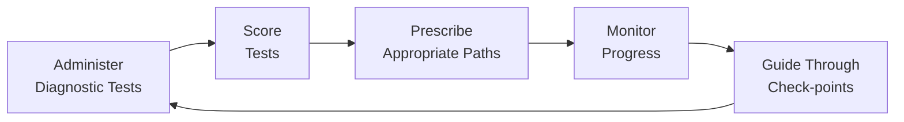
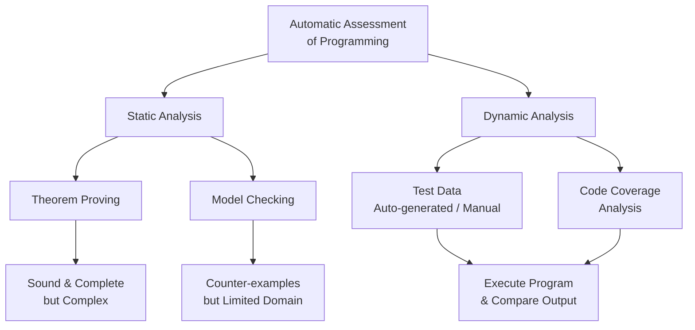
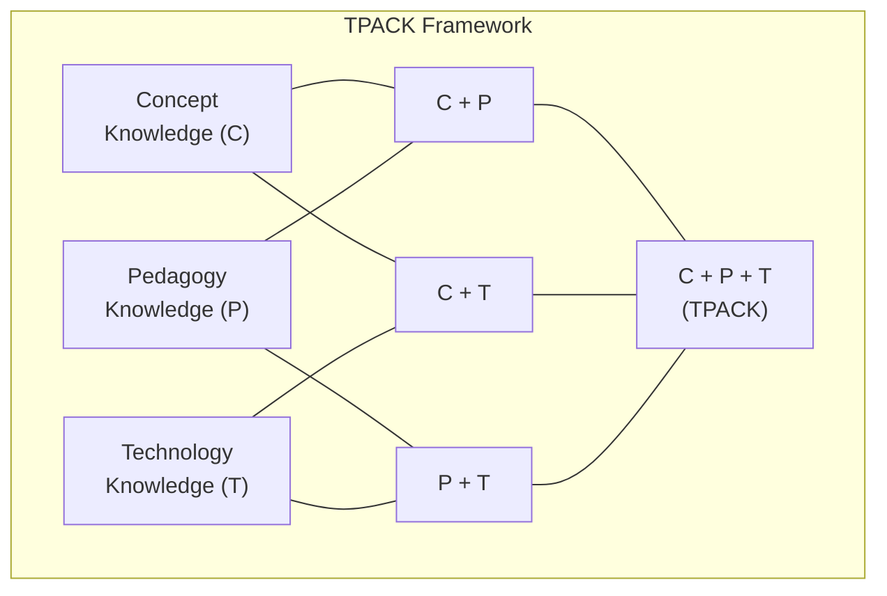
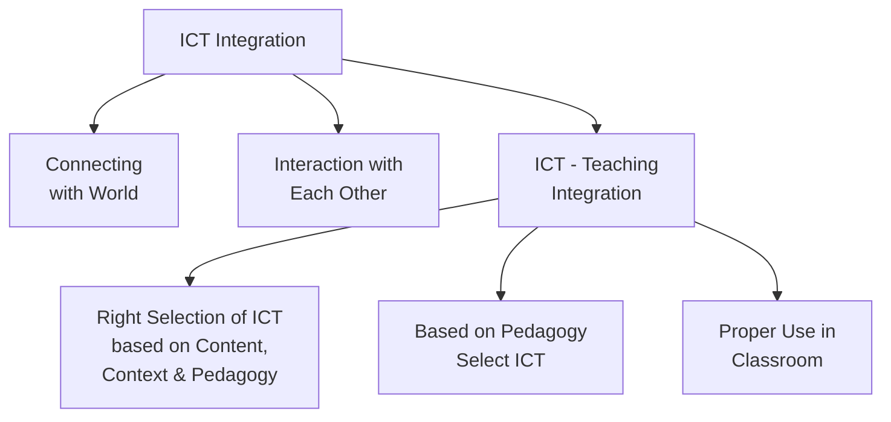
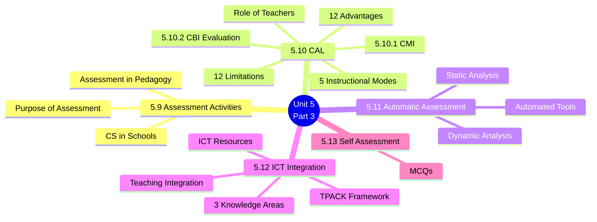

# 5. ASSESSMENT IN PEDAGOGY OF COMPUTER SCIENCE (Part 3)
## Topics: 5.9 - 5.13 — Assessment Activities, CAL, Automatic Assessment, ICT Integration

---

## 5.9 Assessment Activities

### 5.9.1 Assessment in Pedagogy

!!! note "Definition"
    **Educational assessment** is a step-by-step process. Teachers collect real data about students' knowledge, skills, attitudes, and beliefs. They use this data to **improve programs** and **help students learn better**.

- We can get assessment data in two ways:
    - **Looking at student work directly** to check if they met the learning goals
    - **Drawing conclusions from data** about what students have learned
- People often use "assessment" and "test" to mean the same thing. But assessment is **much more than just tests**.

#### Focus Levels of Assessment (Granularity)

Assessment can focus on different levels:

| Level | Description |
|:------|:------------|
| **Individual learner** | One student's performance |
| **Learning community** | A class, workshop, or study group |
| **Course** | One specific course |
| **Academic program** | A whole program of study |
| **Institution** | The entire school or college |
| **Educational system** | The whole education system (also called **granularity**) |

#### Assessment as a Continuous Process

Assessment is an ongoing process. It involves these steps:

1. Setting **clear and measurable learning goals** for students
2. Giving students **enough chances to learn** so they can reach those goals
3. Using a **planned method to collect, study, and understand evidence**. This shows how well students are learning.
4. Using the **results to improve** how students learn

!!! important
    **Pedagogy becomes meaningful only on using Assessment.** It shows the effect of our teaching efforts.

#### Types of Assessment

Teachers use assessment for **all activities** that help students learn. It also helps teachers track student progress. We can group assessment into these types:

| # | Category | Examples |
|:-:|:---------|:---------|
| 1 | **Placement, Formative, Summative and Diagnostic** | Based on purpose and timing |
| 2 | **Objective and Subjective** | Based on how we score |
| 3 | **Referencing** | Criterion-referenced, Norm-referenced |
| 4 | **Informal and Formal** | Based on structure |
| 5 | **Internal and External** | Based on who runs it |

> Each type has its own purpose, as its name suggests.

---

### 5.9.2 Purpose of Assessment

!!! tip "Key Insight"
    **Teaching and Assessment are twins.** Teaching has no meaning without assessment. Assessment helps us **find out how well students understand** what we taught. That is the main goal of education.

- The purpose of assessment is to **find out how well the learner understands**
- We can do this in many ways (see the types above)
- Assessment can be **oral**, **written**, or through an **interview**

#### Benefits of Assessment

| # | Benefit |
|:-:|:--------|
| 1 | It **shows how effective** our teaching is |
| 2 | It helps teachers find **what changes or extra help** are needed to teach better |
| 3 | **Formative assessment** helps us find student problems. We can then change our teaching to help them. |
| 4 | It helps us check if we have **reached our teaching goals** |

---

### 5.9.3 Teaching of Computer Science in Schools

!!! note "Current State of CS Education"
    Computer Science is one of the **fastest growing** and **highest paying** career fields in the world. But there are **fewer and fewer** teachers and students choosing Computer Science.

#### Key Observations

- **Students, parents, teachers, and school leaders** all see value in CS learning. Parents want it too.
- Support for CS learning is strong. But **not all students can access** CS classes in school. Still, many students get some CS experience through school.
- CS learning chances are **not available everywhere**. But they are **growing**.
- Most parents value CS. Yet **few have asked school leaders** to add CS to the classroom.
- Schools say they **lack trained teachers and money** to offer CS. They also say they have **too many other classes** already.

#### Why CS Education Matters

| Aspect | Details |
|:-------|:--------|
| **Exposure gap** | The shortage of CS teachers and students depends on how much students see technology. It also depends on whether someone encourages them to try CS. |
| **Beyond CS careers** | Learning CS also helps students who do **not plan** a CS career |
| **Digital age skills** | Students need **logical thinking** and **problem-solving skills**. These are part of the CS curriculum. |
| **Universal computer use** | All students must know how to use computers. They need to create files, write reports, and research topics. |
| **Job growth** | CS-related jobs are growing in **every industry and every state**. They are expected to grow at **twice the rate** of other jobs. |
| **Social mobility** | CS helps people create new things. It also helps students from **low-income families** find a way out of poverty. |

---

## 5.10 Computer Assisted Learning (CAL)

!!! note "Definition"
    **Computer Assisted Learning (CAL)** is also called **Computer Assisted Instruction (CAI)**. It uses computers to help students learn through different teaching methods.

### Instructional Models of CAL

The computer uses different teaching methods to help students learn:

| # | Mode | Description |
|:-:|:-----|:------------|
| i | **Drill and Practice** | The computer gives exercises. The student tries to answer. If correct, the computer shows a **praise message**. If wrong, it gives a **helpful comment**. Students practice at their own speed. The computer lets them move ahead **only after they master the topic**. |
| ii | **Tutorial Mode** | The computer shows information in **small steps**. After each step, it asks a question. It checks the student's answer and gives **the right feedback**. |
| iii | **Simulation Mode** | The computer creates experiences that copy **real life**. For example: studying genetics, planning a town, or running a system. |
| iv | **Discovery Mode** | The computer gives problems. Students solve them by **trying different things** (trial and error). This is an **inductive approach** (learning by exploring examples). |
| v | **Gaming Mode** | Students learn through **games and play**. |

### Benefits of CAL

Key benefit areas:

- **Multisensory presentation**
- **Self-pacing**
- **Motivation and reward**
- **Simulations**
- **Knowledge through games**
- **Reteaching and Reinforcing**

### 12 Advantages of CAL

| # | Advantage |
|:-:|:----------|
| 1 | CAL is **individualized**. Each learner works at their own speed. Other students' performance does not affect them. It is designed for self-study. It helps students **improve skills at all levels**. |
| 2 | Information comes in a **structured form**. This is useful for subjects with a **clear order of facts and rules**. |
| 3 | CAL makes learners **actively take part**. This is different from just reading a book or sitting in a lecture. |
| 4 | Because learners interact with the computer, they get **instant feedback**. The feedback may give **extra help** (remedial) or guide the learner to a new path based on their answer. |
| 5 | CAL has a **reporting system**. It shows learners a clear picture of their progress. They can see where they improved and where they need more work. |
| 6 | Learners can **work with concepts directly** and see the results. This **saves time** when learning hard topics. |
| 7 | CAL saves **repeated work** for teachers and learners. Teachers do not need to set up the same lessons, write questions for each student, or grade at every step. The computer program does all this. |
| 8 | CAL gives a **wide range of experiences** that learners cannot get otherwise. It works as **multimedia** with sound and visuals. It uses **animation, blinking, and graphics** to make concepts clear. |
| 9 | The computer can give **many options** in multiple choice questions. Each option can have its own **feedback message**. Some answers are better than others. |
| 10 | CAL gives lots of **practice drills**. This helps **slower learners**. **Faster learners** can skip ahead. |
| 11 | CAL can improve **thinking and decision-making skills**. |
| 12 | Students who use CAL become more **self-directed**. They take more **responsibility for learning**. They depend less on teachers. |

### Limitations of CAL (12 Points)

| # | Limitation |
|:-:|:-----------|
| 1 | **Restricted text displays** |
| 2 | **Lack of human qualities** |
| 3 | **Software/hardware limitations** |
| 4 | **Limited sensitivity to needs** |
| 5 | **No actual experience** — CAL does not let students move around. It only gives eye-hand coordination. |
| 6 | **Harmful to eyes** — using the computer too much can hurt the eyes |
| 7 | **No hands-on experience** — simulations can show science experiments. But students miss real hands-on work. CAL cannot build **manual skills** like using lab tools, running machines, or doing dissections. |
| 8 | **Restricts social interaction** — when students work alone on a computer, they do not interact with others |
| 9 | **Vocabulary development limited** — young children learn words through talking with people. Computers are not very good for this. Programs with **voice features** are very expensive. |
| 10 | **Limited creativity development** — there is little room to grow creativity and imagination |
| 11 | **No peer learning** — in a classroom, students learn from each other too. This does not happen with computer-assisted learning. |
| 12 | **Limited to 2D objects** — it limits learners to flat, two-dimensional objects |

!!! warning "Additional Limitations"
    - Computers **cannot replace** a human teacher's classroom. Teachers use **body language**, **humour**, and share **personal feelings** with students.
    - CAL takes students away from **books and printed materials**. This can hurt their **language skills**.
    - Computers **cannot grade** short answer and long answer tests.
    - Computers also cannot properly evaluate **essays, summaries, or abstracts**.

### Role of Teachers in CAL

| Role | Description |
|:-----|:------------|
| **Guide** | The teacher acts as a **guide**, not just a lecturer |
| **Human element** | A computer **cannot replace** the human touch. The teacher is still very important. |
| **Quality improvement** | CAL can improve the **range and quality** of what the teacher teaches |
| **Multiple roles** | The teacher must play many roles: **Computer engineer** (basics), **Lesson writer**, **Systems operator** |

---

### 5.10.1 Computer Managed Instruction (CMI)

!!! note "Definition"
    **Computer Managed Instruction (CMI)** is another way computers help with teaching. In CMI, the computer **collects, stores, and manages information**. It uses this to guide each student through a **personal learning path**.

#### CMI Process

- The computer helps students move through **check-points** (specific activities) in the learning process. Each student moves at **different times** and on **different paths** based on their ability.
- CMI does this through a series of steps:
    1. **Giving** diagnostic tests
    2. **Scoring** the tests
    3. **Suggesting** the right learning path (prescribing)
    4. **Tracking** each student's progress along the way

---

### 5.10.2 Evaluation of Computer-Based Instruction (CBI)

!!! important "Key Research Finding"
    A **meta-analysis** (a study that combines results from many studies) **looked at 254 controlled studies**. It found that **Computer-Based Instruction (CBI)** usually has **positive effects** on students.

#### Key Findings from the Meta-Analysis

| Aspect | Finding |
|:-------|:--------|
| **Coverage** | Learners of **all ages** — from kindergarten children to adult students |
| **Student attitudes** | CBI created small but **positive changes** in how students feel about teaching and computers |
| **Time efficiency** | CBI **greatly reduced** the time needed for instruction |
| **Positive impact** | Researchers compared CBI groups with regular teaching groups. They used the same exams and forms. CBI had a **positive impact**. |

#### Thomas (1970) Review

A later review by **Thomas (1970)** found even more positive results:

- **Better scores** compared to other methods are the norm
- Students showed **better attitudes** toward computers and the subject
- Many CBI students reached **mastery level** in a **shorter time**

> Researchers have studied the positive effects of CBI from all angles — class size, student level, etc.

#### Historical Context

- Since the **early 1960s**, education experts have built CBI programs to **drill, tutor, and test** students. They also use CBI to **manage teaching programs**.
- In recent years, schools use CBI more and more. It can **add to or replace** traditional teaching methods.
- Many experts believe CBI will **lower education costs** over time. It will also **improve learning results**.
- Some imagine a future where computers serve as **personal tutors** for all children: *"a Socrates or Plato for every child of the 21st century"*

#### Recent Changes in Computers

Most reviews do not include results from recent CBI uses. This is a serious problem for **two reasons**:

| # | Reason |
|:-:|:-------|
| 1 | **Computers have changed a lot.** They are now smaller, cheaper, more reliable, and faster. They are easier to use. Their output looks better and is easier to read. |
| 2 | **People see more uses for computers.** The role computers can play in teaching has grown a lot. |

!!! tip "Conclusion"
    Even with some weaknesses, the results show that **CBI teaching works better** than teaching without a computer. Teachers can teach **more details**. Students **understand the subject better**.

---

## 5.11 Automatic Assessment of Programming Assignment

### Introduction

!!! note "Context"
    In today's world, learning computer languages is very important. All computer science students need **strong programming skills**. They can master programming only through **lots of practice**.

- The number of students in classes **keeps growing**. Checking programming exercises by hand creates a **huge workload** for teachers.
- Grading hundreds of programs by hand is very hard. Even teaching assistants struggle with this.
- In large classes, **finding errors** and **grading each program by hand** is **difficult and slow**.

### Automatic Assessment System

- The automatic assessment system checks programming assignments. It uses a **verification program with random inputs**.
- A program's most important feature is that it does what it is **supposed to do**.
- We can check a program's purpose by using an **inverse function's verification program**.
- This system has been tested on **basic C programming courses**. Results show it works well for basic exercises.

#### Web-Based Tutoring Systems

Thanks to better **internet technologies** and **program analysis methods**, web-based tutoring systems are growing. These systems can partly or fully act as a teacher for programming.

!!! note "Traditional vs. Automated"
    In traditional education, tutors check student work by **reading and reviewing it by hand**. But this **does not work well** when there are many students and many exercises.

#### Popular Inspection Method

- One popular method creates a **set of test cases** based on **coverage analysis**. It then runs the programs with all test cases.
- This method is used widely in industry. But it is **not perfect in theory**. Test cases cannot prove that a program has zero flaws.
- Running **possibly wrong (erroneous) code** can be risky for system safety.

### Automated Tools

!!! important "Core Aims"
    The core aims of automated tools are:

    1. To build tools that **reduce the workload** of human teachers
    2. To **improve fairness** in grading student work
    3. To **test student programs thoroughly**

#### Measurement Values

- To assess programs automatically, we need **measurement values** that we can pull from the program.
- We compare these values to the **given requirements** or to a **model answer**.
- For teaching purposes, these values should match the **course goals**. They should also match the **learning objectives** for each topic.

#### Approaches to Automatic Programming Assessment

There are several approaches in journals, articles, and online resources. They fall into two main types:

- **Static analysis** — the program is NOT run during assessment
- **Dynamic testing** — the program IS run during assessment

---

### A. Static Program Analysis

!!! note "Definition"
    **Static program analysis** is a newer and efficient way to **verify programs**. The program is checked **without running it**.

Two popular approaches:

| Approach | Description | Strengths | Limitations |
|:---------|:------------|:----------|:------------|
| **Theorem Proving** | Uses the logic of **axiomatic semantic theory** (a formal math-based method to prove code is correct) | **Sound and complete** — can fully verify correctness | Very complex to compute. Cannot easily show **examples of errors**. Limited use in education. |
| **Model Checking** | Solves the problem of showing error examples | Can produce **counter-examples** (shows what went wrong) | Cannot work on a **very large or infinite set of values** |

---

### B. Dynamic Program Analysis

!!! note "Definition"
    **Dynamic program analysis** checks software by **actually running the programs**. It runs them on a **real or virtual computer**.

- When grading by hand, it is hard to trace all results. Even a simple program may have **many different paths** and outputs.
- Dynamic analysis checks a program by **running it** with **test data**. The test data can be created automatically or by hand.

#### Requirements for Effective Dynamic Analysis

| Requirement | Description |
|:------------|:------------|
| **Sufficient test inputs** | We must run the program with enough test inputs to see how it behaves |
| **Code coverage** | Testing methods like **code coverage** help make sure we have tested enough of the program's possible actions |
| **Minimal instrumentation effect** | The tools used for testing (instrumentation) should not change how the program runs. This includes **timing behavior**. |

---

## 5.12 Integration of ICT in Teaching, Learning

### 1. Teaching-Learning Process

- Everyone knows that **no two people are the same**
- Every child is different. They each learn in a **unique way**.
- Students learn better when they use **more than one sense** (seeing, hearing, touching)

### 2. What is ICT

!!! note "Definition"
    **ICT** stands for **Information Communication Technology**. It covers the study, design, building, use, and management of **computer-based information systems**. This mostly means computers, networks, and other ways to share information.

- ICT refers to **Digital Information Analysis (DIA)**
- It uses different types of tools and equipment (**Resources**), such as:
    - **Audio**
    - **Visual**
    - **Models**
- These create **sensation** (feeling), **perception** (understanding), and **conception** (forming ideas)

### Use of ICT

!!! tip "Key Benefit"
    ICT turns **hard-to-understand abstract ideas** into **clear, concrete lessons**.

- To make every child a **self-learner**, **independent thinker**, **creative thinker**, and **problem solver**, they must truly understand the concepts. ICT helps make concepts real and clear.

### 3 Areas of Knowledge

ICT brings together **3 major areas of knowledge**. This makes learning better and more effective:

| # | Knowledge Area | Description |
|:-:|:---------------|:------------|
| 1 | **Concept Knowledge (C)** | The subject matter or content |
| 2 | **Pedagogical Knowledge (P)** | Teaching methods and strategies |
| 3 | **Technological Knowledge (T)** | How to use technology tools |

!!! important
    Before technology, teachers only used the **first two knowledge areas**. Adding the third (technology) makes teaching-learning **interesting, meaningful, active, and easy to understand**.

Teachers can mix these three areas in **many combinations**. This makes teaching **varied and valuable**.

#### TPACK Diagram

> **Teachers should be experts in all 3 knowledge areas and know how to use them in teaching.**

### Preparation of Teaching

When preparing a lesson, a teacher should follow these steps:

| Step | Action |
|:-----|:-------|
| **Step 1** | Gather the content details. Plan **which parts to explain**. |
| **Step 2** | Decide **which teaching method** to use. |
| **Step 3** | Choose **which technology** will make the lesson interesting and easy to understand. |

> First, decide **whether to use ICT** for that specific topic.

### ICT Resources

Here are some types of resources teachers can use:

| Resource Type | Description |
|:--------------|:------------|
| **Text** | Written content and materials |
| **Image** | Pictures and visual aids |
| **Audio** | Sound-based learning materials |
| **Video** | Moving visual content |
| **Interactive** | Content that students can interact with |
| **Animation** | Animated visual explanations |
| **Simulation** | Virtual copies of real-world processes |

### ICT and Teaching Integration

!!! tip "ICT-Teaching Integration Framework"
    Bringing ICT into teaching involves:

    - **Connecting with the world** — using ICT to reach global resources
    - **Interaction with each other** — helping students learn together
    - **Right selection of ICT** — based on content, context, and pedagogy
    - **Pedagogy-driven selection** — picking ICT based on teaching needs
    - **Proper classroom use** — using ICT well in the classroom

---

## 5.13 Test Items for Self Assessment

### I. Choose the Correct Answer (MCQs)

**1.** Assessment is

- (a) same as evaluation
- (b) useful than evaluation
- (c) giving key answers
- **(d) the prerequisite for evaluation** ✓

**2.** Feedback device is essential

- (a) to give happiness to the performer
- **(b) to make perfect future performance** ✓

!!! note
    *The self-assessment section in the source text is truncated. Only the available questions have been included above.*

---

## Summary of Key Topics

---
